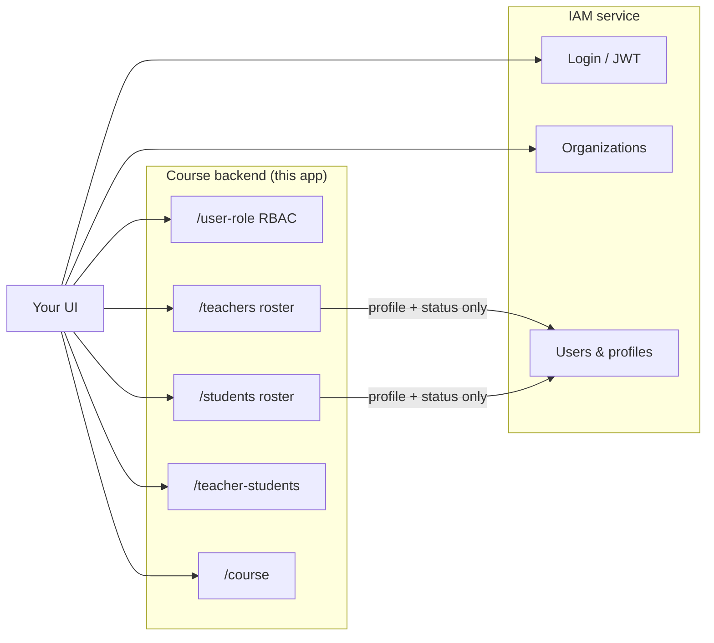
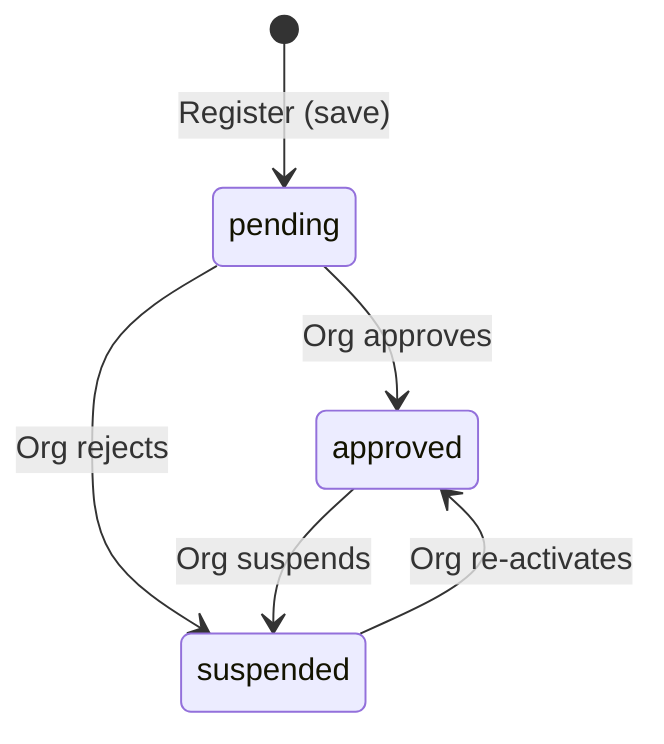
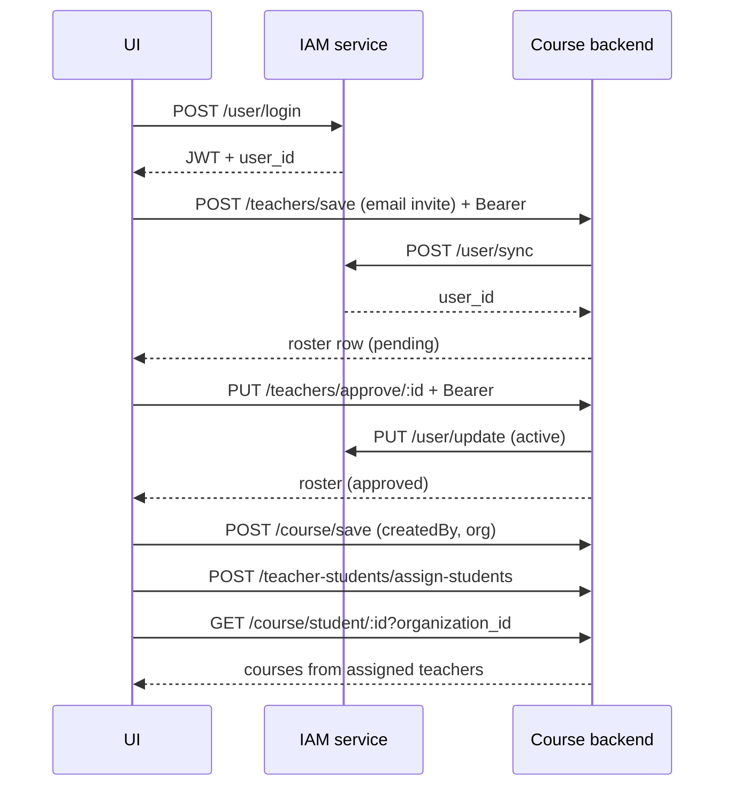
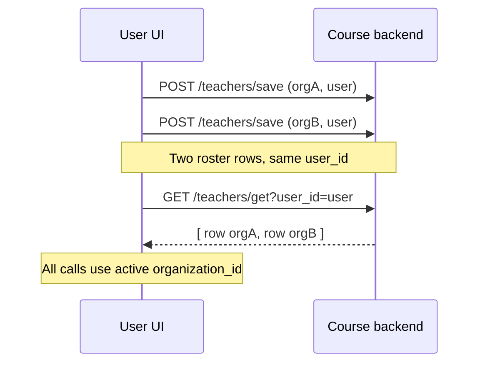

# UI Workflow Guide

**The single document for building screens** — flows, concepts, plain-English overview, and which API to call.

| Document | Use for |
|----------|---------|
| **[UI_WORKFLOW.md](./UI_WORKFLOW.md)** *(this file)* | Screens, flows, stakeholders, MVP scope, roadmap |
| **[USER_WORKFLOW.md](./USER_WORKFLOW.md)** | Non-technical / management presentation workflow |
| **[API_DOCUMENTATION.md](./API_DOCUMENTATION.md)** | Request/response details, architecture |
| **[IAM_DOCUMENTATION.md](./IAM_DOCUMENTATION.md)** | IAM login, users, orgs (external service) |
| **[TCM_DOCUMENTATION.md](./TCM_DOCUMENTATION.md)** | Reference — same IAM + local RBAC pattern |

---

## Product mission & gold vision

### Who we build for

End users over time include **communities, churches, schools**, and especially **Sunday schools**. The product moves their learning **online** while staying **friendly and self-serve**.

### Customizable / white-label end goal

Organizations should be able to make the product **their own**:

- Their **logo**, branding, and naming systems  
- Their **identity** across the UI  
- Their **own database** when they have one  
- **Our hosted database** when they do not  

**Principle:** It feels like their product; it runs on our software. That protects the platform while letting churches and similar groups own the experience.

### Gold vision (full product — beyond MVP)

The long-term product should help organizations and teachers:

- Understand **student engagement**, interests, and thinking patterns  
- See **where learners are strong** and **where they are lacking**  
- **Individually validate** progress  
- Suggest improvements (“this is where you need to improve”) to **students** and guidance to **teachers**  
- Support responsible **program insight / monetization** understanding over time  

MVP proves the school loop. Later versions add branding, data choice, and learner intelligence.

---

## MVP / Beta scope (what is implemented now)

**Implemented in the application (MVP / Beta):**

| Capability | Status |
|------------|--------|
| Organization + individual (teacher/student) **login / sign-up** (+ Google) | In app |
| **Approval system** — teachers & students wait; org Approvals screen | In app |
| Org **Directory** — Teachers / Students | In app |
| **Invite** teacher / student screens | In app |
| **Assign** students ↔ teachers (manage from directory) | In app |
| Teachers **add / list courses**; students **view** courses | In app — see [Course listing rules](#course-listing-rules-mvp) |
| Teachers add **questions**; students **submit answers** | In app |
| Teachers **review answers** and give **feedback** | In app |
| Pending / waiting screens after login | In app |

### Course listing rules (MVP)

| Role | Courses shown |
|------|----------------|
| **Organization** | `GET /course/get?organization_id={orgId}` — all org courses (**public + private**) |
| **Teacher** | `GET /course/get?organization_id={orgId}` — keep **`access ≠ private`** or **`createdBy = me`** |
| **Student** | `GET /course/student/:id?organization_id=` (**public + private** from assigned teachers) + `GET /course/get?organization_id={orgId}&access=public` |

Implementation: `src/app/pages/courses/courses.service.ts`.

**Not in MVP application yet:**

| Capability | Status |
|------------|--------|
| Plans / premium checkout | Later |
| Formal org **course-approval** queue | Later |
| Full white-label theming + customer-owned DB | Later (gold vision) |
| Deep analytics / “where to improve” engine | Later (gold vision) |

UI work for Beta should prioritize polishing and completing the flows above — not gold-vision features yet. Keep **[USER_WORKFLOW.md](./USER_WORKFLOW.md)** Section 0c / 8b aligned when the app changes.

### Roadmap after MVP (gradual)

| Stage | Direction |
|-------|-----------|
| **MVP / Beta** | Login, approval, directory, assign, courses, Q&A, feedback |
| **Version 1** | Stronger org experience, plans/premium basics, smoother invites in nav |
| **Version 2** | White-label (logo, naming), customer DB option or hosted DB |
| **Version 3** | Learner insights, gap detection, improvement suggestions |
| **Version 4** | Church / Sunday-school ready packaging, deeper analytics, self-serve branding |

Align screen priorities with the current stage. For Beta, stay inside MVP scope.

---

## How it works (plain English)

Think of the app like a **school** (or Sunday school / church class):

- **Login system (IAM)** — sign-in, passwords, who you are, which schools you belong to
- **School app (this backend)** — teacher/student lists, who teaches whom, lessons, permissions

**The 5 steps:** (1) School signs up → (2) adds teachers & students (waiting list) → (3) assigns students to teachers → (4) teachers create lessons → (5) students only see their assigned teachers' lessons.

**Good to know:**
- Newcomers wait for org approval before they can start
- Same person can be teacher **and** student in the same school (separate role approvals)
- Roles live in the school app, not the login system
- Everything stays separate per school

**Base URLs:** IAM `http://localhost:5000/auth/api` · Course backend `http://localhost:{PORT}`

---

## Table of contents

1. [Product mission & gold vision](#product-mission--gold-vision)
2. [MVP / Beta scope](#mvp--beta-scope-what-is-implemented-now)
3. [How it works (plain English)](#how-it-works-plain-english)
4. [Two-service model](#two-service-model)
5. [Headers every UI call should send](#headers-every-ui-call-should-send)
6. [Concepts the UI must know](#concepts-the-ui-must-know)
7. [Status lifecycle](#status-lifecycle)
8. [Screen map](#screen-map)
9. [Authentication flows (IAM)](#authentication-flows-iam)
10. [Organization admin flows](#organization-admin-flows)
11. [Teacher flows](#teacher-flows)
12. [Student flows](#student-flows)
13. [Shared patterns (pagination, ids, errors)](#shared-patterns-pagination-ids-errors)
14. [End-to-end sequence diagrams](#end-to-end-sequence-diagrams)
15. [Quick API index](#quick-api-index)

---

## Two-service model



| Responsibility | IAM | Course backend |
|----------------|-----|----------------|
| Sign up, login, JWT | ✓ | — |
| Organizations | ✓ | — |
| User profile (name, email, phone) | ✓ | — |
| App roles & permissions | — | `user_roles` + `/user-role` |
| Who is teacher/student **in an org** | — | `user_roles` (approval source of truth) |
| Teacher ↔ student links | — | `teacher_students` |
| Courses & lessons | — | `courses`, chapters, Q&A |

**Golden rule:** Always pass `organization_id` and IAM `user_id`. Forward JWT on register/approve for IAM identity sync — **never** for app roles.

---

## Headers every UI call should send

### IAM service

| Header | Value | When |
|--------|-------|------|
| `Content-Type` | `application/json` | POST/PUT with body |
| `x-app-id` | Your app id (`IAM_APP_ID`) | All IAM calls |
| `Authorization` | `Bearer <jwt>` | Protected routes (after login) |

### Course backend

| Header | Value | When |
|--------|-------|------|
| `Content-Type` | `application/json` | POST/PUT with body |
| `Authorization` | `Bearer <jwt>` | **Required for IAM sync** on `POST /teachers/save`, `POST /students/save`, and all approve endpoints when `IAM_SYNC_ENABLED=true` |

List/get endpoints on the course backend do not require auth today, but sending the JWT is safe and future-proofs the UI.

---

## Concepts the UI must know

| Concept | Where it lives | What the UI stores |
|--------|----------------|-------------------|
| **Organization** | IAM | `organization_id` — scope every roster/assignment/course call |
| **User (IAM)** | IAM | `user_id` — from JWT after login |
| **JWT** | IAM login response | Store in memory / secure storage; attach as `Authorization` |
| **Teacher roster row** | Course `/teachers` | Wrapper for `user_roles` where `role_code=teacher` |
| **Student roster row** | Course `/students` | Wrapper for `user_roles` where `role_code=student` |
| **App roles & permissions** | Course `/user-role` | Multi-role per org; use for permission gating |
| **Assignment** | Course `/teacher-students` | `teacher_id` ↔ `student_id` (**IAM user ids**) |
| **Course** | Course `/course` | `createdBy` = teacher IAM `user_id`; `organization_id` |

**ID cheat sheet**

| UI action | Use this id |
|-----------|-------------|
| Approve teacher/student | Roster row **`id`** from `GET /teachers/get` or `/students/get` |
| Assign, course feed, `createdBy` | IAM **`user_id`** |

A person can hold **multiple roles in one org** (teacher + student) or across orgs — use `GET /user-role/get-overview`.

**Permission gating:** `GET /user-role/permissions?organization_id=&user_id=`

**IAM sync:** Bearer token on register/approve syncs profile + account status to IAM only — **not app roles**.

---

## Status lifecycle

Roster status (course backend) maps to IAM user status on approve:

| Roster status | Meaning | IAM account status (synced) | Typical UI |
|---------------|---------|---------------------|------------|
| `pending` | Waiting for org approval | `pending` | Unapproved list |
| `approved` | Active member | `active` | Main lists; can assign & create courses |
| `suspended` | Blocked | `suspended` | Hidden or read-only |



**UI rules**
- After login → register on roster if not already (`POST /teachers/save` or `/students/save`) → usually `pending`.
- Unapproved lists: `GET ...?organization_id=X&status=pending`.
- Approve one: `PUT /teachers/approve/:rosterRowId` with Bearer token.
- Approve many: `PUT /teachers/approve` with `{ ids: [...] }`.
- Only enable assign / course-create when roster `status === 'approved'`.

---

## Screen map

| Screen | Actor | Service | Primary APIs |
|--------|-------|---------|--------------|
| Login | All | IAM | `POST /user/login` |
| Org picker / switcher | All | IAM | org list from IAM |
| Org dashboard | Organization | Both | IAM org; optional roster counts from course backend |
| Invite / add teacher | Organization | Course (+ IAM sync) | `POST /teachers/save` |
| Invite / add student | Organization | Course (+ IAM sync) | `POST /students/save` |
| Unapproved teachers | Organization | Course | `GET /teachers/get?organization_id&status=pending` |
| Unapproved students | Organization | Course | `GET /students/get?organization_id&status=pending` |
| Teachers list | Organization | Course | `GET /teachers/get?organization_id&status=approved` |
| Students list | Organization | Course | `GET /students/get?organization_id&status=approved` |
| Approve teacher/student | Organization | Course (+ IAM sync) | `PUT /teachers/approve/:id`, `PUT /students/approve/:id` |
| Assign students to teacher | Org **or** Teacher | Course | `POST /teacher-students/assign-students` |
| Teacher's students | Teacher | Course | `GET /teacher-students/teacher/:teacherId/students?organization_id` |
| Student's teachers | Student | Course | `GET /teacher-students/student/:studentId/teachers?organization_id` |
| Waiting for approval | Teacher / Student | Course | `GET /teachers/get` or `/students/get?user_id=` |
| Create / edit course | Teacher / Org | Course | `POST /course/save`, `PUT /course/update` |
| Course list (org) | Organization | Course | `GET /course/get?organization_id={orgId}` |
| Course list (teacher) | Teacher | Course | `GET /course/get?organization_id={orgId}` (client: public OR createdBy=me) |
| Course list (student) | Student | Course | `GET /course/student/:studentId?organization_id=` + `GET /course/get?organization_id={orgId}&access=public` |
| Course detail / Q&A / favorites | Student / Teacher / Org | Course | `/course`, `/question`, `/answer`, `/favorites` |

---

## Authentication flows (IAM)

### Flow 0 — User logs in (all roles)

1. Show login screen.
2. Call IAM (not course backend):
   ```
   POST {IAM_BASE_URL}/user/login
   Headers: x-app-id, Content-Type: application/json
   Body: { "email": "...", "password": "..." }
   ```
3. Store JWT + `user_id` from response.
4. Load user's organization(s) from IAM; user picks active org → store `organization_id`.
5. Route by role intent (teacher vs student UI) or show role picker.

> Full IAM login shapes: [IAM_DOCUMENTATION.md](./IAM_DOCUMENTATION.md#user-login)

### Flow 0b — After login, resolve roles

```
GET /user-role/get-overview?organization_id={orgId}&user_id={userId}
```

Or check a specific role: `GET /teachers/get?...` / `GET /students/get?...`

| Result | UI |
|--------|-----|
| No roles | Offer "Join as teacher/student" |
| Any role `pending` | "Waiting for approval" for that role |
| `approved` teacher and/or student | Show matching home screens |
| `suspended` | Blocked message |

**Permission gating:** `GET /user-role/permissions?organization_id=&user_id=`

---

## Organization admin flows

### Flow A — Invite teacher by email (IAM sync)

Use when admin adds someone who may not have an account yet.

1. Admin is logged in → has JWT + `organization_id`.
2. Open **Add teacher** form (email, first name, last name).
3. Submit:
   ```
   POST /teachers/save
   Headers: Authorization: Bearer {jwt}, Content-Type: application/json
   Body:
   {
     "organization_id": "{orgId}",
     "contact": { "email": "teacher@school.com" },
     "first_name": "Jane",
     "last_name": "Doe",
     "status": "pending"
   }
   ```
4. Backend creates/links IAM user, inserts roster row → show on **Unapproved teachers**.
5. Optional: IAM may send invite email (depends on IAM config).

### Flow A2 — Add teacher who already exists in IAM

```
POST /teachers/save
Headers: Authorization: Bearer {jwt}
Body: { "organization_id": "{orgId}", "user_id": "{existingIamUserId}" }
```

Same pattern for students → `POST /students/save`.

### Flow B — Review and approve pending teachers

1. Open **Unapproved teachers**.
2. Load:
   ```
   GET /teachers/get?organization_id={orgId}&status=pending&limit=50&offset=0
   ```
3. Render `data[]`; paginate with `pagination.total`.
4. **Approve one:**
   ```
   PUT /teachers/approve/{rosterRowId}
   Headers: Authorization: Bearer {jwt}
   Body: { "status": "approved" }
   ```
5. **Approve selected (bulk):**
   ```
   PUT /teachers/approve
   Headers: Authorization: Bearer {jwt}
   Body: { "ids": ["uuid-1", "uuid-2"], "status": "approved" }
   ```
6. Refresh list. IAM user status becomes `active`.

Repeat for students with `/students/*`.

### Flow C — Assign students to a teacher

**Preconditions:** Teacher and students are `approved`.

```
POST /teacher-students/assign-students
Body:
{
  "organization_id": "{orgId}",
  "assigned_by": "{adminUserId}",
  "assignments": [
    {
      "teacher_id": "{teacherIamUserId}",
      "student_ids": ["{studentIamUserId1}", "{studentIamUserId2}"]
    }
  ]
}
```

Verify: `GET /teacher-students/teacher/{teacherId}/students?organization_id={orgId}`.

### Flow D — Bulk import by user id (no IAM sync per row)

```
POST /teachers/save-bulk
Body: { "organization_id": "{orgId}", "user_ids": ["...", "..."] }
```

Users must already exist in IAM. They start as **`pending`** — show on unapproved screen.  
For email invites with IAM sync, use single `POST /teachers/save` per person instead.

---

## Teacher flows

### Flow E — Teacher self-joins organization

1. Teacher logged in (IAM) → `user_id`, `organization_id`.
2. Register on roster:
   ```
   POST /teachers/save
   Headers: Authorization: Bearer {jwt}
   Body: { "organization_id": "{orgId}", "user_id": "{userId}" }
   ```
3. If `data.status === 'pending'` → **Waiting for approval** (disable course create & assign).
4. Poll: `GET /teachers/get?organization_id={orgId}&user_id={userId}` until `approved`.

### Flow F — Teacher creates a course

**Precondition:** Roster `approved`.

```
POST /course/save
Body:
{
  "courseCoverImage": "https://...",
  "courseTitle": "...",
  "courseDescription": "...",
  "createdBy": "{teacherIamUserId}",
  "organization_id": "{orgId}",
  "chapterDetails": [ ... ]
}
```

### Flow G — Teacher assigns students to themselves

```
POST /teacher-students/assign-students
Body:
{
  "organization_id": "{orgId}",
  "assigned_by": "{teacherUserId}",
  "assignments": [
    { "teacher_id": "{teacherUserId}", "student_ids": ["..."] }
  ]
}
```

### Flow H — Teacher views their students

```
GET /teacher-students/teacher/{teacherIamUserId}/students?organization_id={orgId}
```

---

## Student flows

### Flow I — Student self-joins organization

```
POST /students/save
Headers: Authorization: Bearer {jwt}
Body: { "organization_id": "{orgId}", "user_id": "{userId}" }
```

If `pending` → waiting screen until org approves.

### Flow J — Student course feed (home)

**Preconditions:** Roster `approved`; preferably has assigned teachers (org public courses still show).

1. Load assigned teachers’ courses (**public + private**):
```
GET /course/student/{studentIamUserId}?organization_id={orgId}
```
2. Load organization **public** courses:
```
GET /course/get?organization_id={orgId}&access=public&populateChapters=true&populateFiles=true
```
3. Merge / de-dupe by course `id` in the UI.

Empty assigned-teacher feed = no assignments yet; org public courses may still appear.

### Flow J2 — Teacher course list

1. Load all org courses: `GET /course/get?organization_id={orgId}&populateChapters=true&populateFiles=true`
2. Client keep: `access ≠ private` **or** `createdBy = me` (own private courses).
3. Without `organization_id`: fallback `GET /course/get?createdBy={me}`.

### Flow J3 — Organization course list

1. Single call: `GET /course/get?organization_id={orgId}&populateChapters=true&populateFiles=true`
2. Returns all courses in the org (**public + private**), org-created and teacher-created.

### Flow K — Student sees their teachers

```
GET /teacher-students/student/{studentIamUserId}/teachers?organization_id={orgId}
```

### Flow L — Student works through a course

| Step | API |
|------|-----|
| Open course | `GET /course/get/:courseId` |
| Load questions | `GET /question/get?course_id=...` |
| Submit answers | `POST /answer/save` |
| Favorite | `POST /favorites/save` |

Use student's IAM `user_id` for `submitted_by` / `userId`.

### Flow M — Suspend or remove

- Suspend: `PUT /teachers/approve/:id { "status": "suspended" }` (same for students or `/user-role/approve/:id`)
- Remove from roster: `DELETE /teachers/delete/:id` or `DELETE /user-role/delete/:id`

---

## Screen → API cheat sheet

| UI screen | Primary API |
|-----------|-------------|
| Login | IAM `POST /user/login` |
| Resolve roles | `GET /user-role/get-overview` |
| Permissions | `GET /user-role/permissions` |
| Teacher sign-up | `POST /teachers/save` or `POST /user-role/save` + `role_code: teacher` |
| Student sign-up | `POST /students/save` or `POST /user-role/save` + `role_code: student` |
| Unapproved lists | `GET /teachers/get?status=pending` · `GET /students/get?status=pending` |
| Approve | `PUT /teachers/approve/:id` · `PUT /students/approve/:id` |
| Assign students | `POST /teacher-students/assign-students` |
| Student feed | `GET /course/student/:studentId?organization_id=` |
| Create course | `POST /course/save` |

---

## Shared patterns (pagination, ids, errors)

### Pagination

| Query | Default | Max |
|-------|---------|-----|
| `limit` | 50 | 500 |
| `offset` | 0 | — |

Response: `"pagination": { "limit": 50, "offset": 0, "total": 128 }`  
**Next page:** `offset = offset + limit` while `offset < total`.

### snake_case vs camelCase

Both accepted: `organization_id` / `organizationId`, `user_id` / `userId`, `assigned_by` / `assignedBy`.

### Error handling

| HTTP | UI action |
|------|-----------|
| `400` | Show `message` / `error` |
| `401` | Re-login (IAM JWT expired) |
| `404` | Refresh list |
| Empty `data[]` | Valid empty state |

---

## End-to-end sequence diagrams

### Full journey: login → invite → approve → assign → student sees course



### Multi-organization user



---

## Quick API index

### IAM (auth & identity)

| Action | Method | Path |
|--------|--------|------|
| User login | POST | `{IAM_BASE_URL}/user/login` |
| Org login | POST | `{IAM_BASE_URL}/organization/login` |

See [IAM_DOCUMENTATION.md](./IAM_DOCUMENTATION.md) for full IAM API.

### Course backend (rosters, assignments, courses)

| Action | Method | Path | Auth header |
|--------|--------|------|-------------|
| Register teacher | POST | `/teachers/save` | Bearer (IAM sync) |
| Register student | POST | `/students/save` | Bearer (IAM sync) |
| List pending teachers | GET | `/teachers/get?organization_id=&status=pending` | Optional |
| List pending students | GET | `/students/get?organization_id=&status=pending` | Optional |
| Approve teacher | PUT | `/teachers/approve/:rosterRowId` | Bearer (IAM sync) |
| Approve student | PUT | `/students/approve/:rosterRowId` | Bearer (IAM sync) |
| Bulk approve | PUT | `/teachers/approve` · `/students/approve` · `/user-role/approve` | Bearer (IAM sync) |
| User roles overview | GET | `/user-role/get-overview` | Optional |
| Permissions | GET | `/user-role/permissions` | Optional |
| Assign role | POST | `/user-role/save` | Bearer (IAM sync) |
| Assign students → teacher | POST | `/teacher-students/assign-students` | Optional |
| Teacher's students | GET | `/teacher-students/teacher/:teacherId/students` | Optional |
| Student's teachers | GET | `/teacher-students/student/:studentId/teachers` | Optional |
| Student course feed | GET | `/course/student/:studentId?organization_id=` | Optional |
| Create course | POST | `/course/save` | Optional |

Full request/response details: **[API_DOCUMENTATION.md](./API_DOCUMENTATION.md)**
