# 01 — Project Overview

**Document type:** Reverse-engineered project overview  
**Audience:** Successor engineering, product, DevOps, and security teams  
**Repository:** `majestic-warhorse` (Angular SPA)  
**Evidence date:** 2026-07-27  
**Cross-references:**
- [DOCUMENTATION-INDEX.md](./DOCUMENTATION-INDEX.md) — program charter
- [FRONTEND-ARCHITECTURE.md](./FRONTEND-ARCHITECTURE.md) — detailed frontend architecture
- [UI_WORKFLOW.md](../UI_WORKFLOW.md) — product flows and MVP scope (**Documented legacy / product intent**)
- [USER_WORKFLOW.md](../USER_WORKFLOW.md) — stakeholder journeys (**Documented legacy / product intent**)
- [API_DOCUMENTATION.md](../API_DOCUMENTATION.md) — Majestic course-backend contract
- [IAM_DOCUMENTATION.md](../IAM_DOCUMENTATION.md) — PetaxAI IAM contract
- [TCM_DOCUMENTATION.md](../TCM_DOCUMENTATION.md) — sister-product pattern (The Church Manager)

**Evidence tiers** used below: **Observed** (this repo’s code/config), **Documented (legacy)** (root product/API docs), **Assumption**, **Unknown**.

---

## Table of contents

1. [Application purpose](#1-application-purpose)
2. [Business goals](#2-business-goals)
3. [Target users](#3-target-users)
4. [Major capabilities](#4-major-capabilities)
5. [Core features](#5-core-features)
6. [High-level architecture](#6-high-level-architecture)
7. [Technology stack](#7-technology-stack)
8. [Third-party services](#8-third-party-services)
9. [Programming languages](#9-programming-languages)
10. [Frameworks and libraries](#10-frameworks-and-libraries)
11. [Design principles](#11-design-principles)
12. [Folder structure overview](#12-folder-structure-overview)
13. [Development workflow](#13-development-workflow)
14. [Build process](#14-build-process)
15. [Deployment overview](#15-deployment-overview)
16. [Document control and unknowns](#16-document-control-and-unknowns)

---

## 1. Application purpose

### 1.1 What this application is (**Observed** + **Documented legacy**)

**Majestic Warhorse** is a browser-based learning platform SPA. In product language it is an online school for organizations that want to run courses, teachers, and students under their own identity.

| Statement | Tier | Source |
|-----------|------|--------|
| Page title / PWA name “Majestic Warhorse” / “Majestic” | Observed | `src/index.html` L5, L13; `meta description` L8 |
| npm / Angular project name `majestic-warhorse` | Observed | `package.json` L2; `angular.json` project key |
| IAM application client id `majestic-warhorse` | Observed | `src/environments/environment.ts` L10; `environment.prod.ts` L6 |
| Product: customizable learning platform for orgs, teachers, students | Documented (legacy) | `USER_WORKFLOW.md` L5, L29–53 |
| MVP proves the “school loop”: signup → approve → assign → teach → learn | Documented (legacy) | `UI_WORKFLOW.md` L97–110 |

### 1.2 What this repository contains vs what it does not

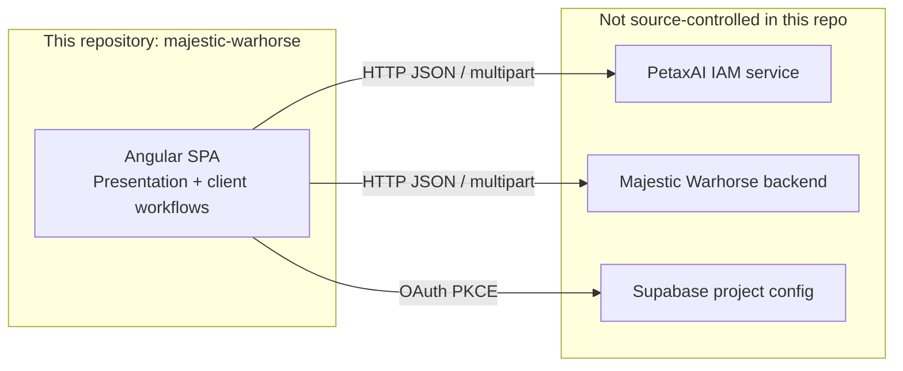

| In this repo | Outside this repo |
|--------------|-------------------|
| Angular UI, routing, forms, client-side session | IAM implementation (Node/Express — see `IAM_DOCUMENTATION.md`) |
| HTTP client services calling IAM + Majestic APIs | Majestic course/roster/file backend implementation (see `API_DOCUMENTATION.md`) |
| Environment URLs and Supabase anon key | Supabase dashboard / Google OAuth console settings |
| GitHub Actions deploy of static `dist/` | EC2/NGINX host configuration (described in README, not IaC here) |
| Committed root API/workflow docs for integrators | Live database schemas / migrations |

**Why it is split this way:** Product docs describe a shared PetaxAI pattern — IAM owns identity; each product app owns domain data and local RBAC (`UI_WORKFLOW.md` L101–110; sister pattern in `TCM_DOCUMENTATION.md`). The SPA is the thin client for both.

### 1.3 Runtime purpose statement (rebuild-oriented)

When running, the SPA:

1. Authenticates humans as **organization** accounts or **individual users** (teachers/students) via IAM and optionally Google via Supabase.
2. Scopes all subsequent work to an **organization** (school/community).
3. Lets organizations **approve** teachers/students, manage a **directory**, **invite**, and **assign** teachers ↔ students.
4. Lets teachers **create courses** (with file upload), set **questions**, and **review answers**.
5. Lets students **consume courses**, **submit answers**, and track progress-related status records via backend APIs.

Detailed route and service maps: [FRONTEND-ARCHITECTURE.md](./FRONTEND-ARCHITECTURE.md).

---

## 2. Business goals

### 2.1 Near-term (MVP / Beta) — **Documented (legacy)**, verified against routes/services

From `UI_WORKFLOW.md` L46–60 and `USER_WORKFLOW.md` §0c, the business goal of the current release is to prove a complete **online school loop** without white-label or deep analytics.

| Business goal | How the SPA supports it | Maturity (**Observed**) |
|---------------|-------------------------|-------------------------|
| Self-serve org + user onboarding | `/signup`, `/login`, Google OAuth, `/org-picker` | Working |
| Controlled membership (approval gate) | `/dashboard/approval`, `/dashboard/approval-pending` | Working |
| Org can see and manage people | `/dashboard/directory` (+ manage assignment pages) | Working |
| Teaching can start (courses) | `/dashboard/courses`, `/dashboard/course-upload`, `/dashboard/course-details` | Working |
| Learning can be assessed | Questionnaire + student assessment + feedback APIs | Working |
| Teacher–student linkage | `teacher-students/*` APIs; assign route exists | Working (sidenav Assign/Invite links commented — see FRONTEND-ARCHITECTURE) |

### 2.2 Medium / long-term (gold vision) — **Documented (legacy)** only

These goals appear in product docs; they are **not** fully implemented in the SPA.

| Stage | Direction | Source |
|-------|-----------|--------|
| Version 1 | Stronger org experience, plans/premium basics, smoother invites in nav | `UI_WORKFLOW.md` L85–91 |
| Version 2 | White-label (logo, naming), customer DB option or hosted DB | same |
| Version 3 | Learner insights, gap detection, improvement suggestions | same |
| Version 4 | Church / Sunday-school packaging, deeper analytics, self-serve branding | same |

Gold-vision themes (`USER_WORKFLOW.md` L57–87):

- Understand engagement, strengths, and gaps per learner
- Individually validate progress and suggest improvements
- Responsible monetization / program sustainability later
- Full white-label while remaining “our software”

**Assumption:** “Majestic Warhorse” is being positioned under PetaxAI (`environment.prod.ts` → `https://majestic.petaxai.com`) as a reusable learning front-end for communities, schools, and music/instruction contexts. Music-instruction positioning appears in prior architecture briefings; product workflow docs emphasize churches/Sunday schools/schools/communities. Treat music as an **Assumption** unless product marketing assets in-repo state it explicitly (none found under `src/` copy beyond generic learning).

### 2.3 Goals explicitly out of current MVP (**Documented legacy**)

| Not in MVP | Source |
|------------|--------|
| Plans / premium checkout | `UI_WORKFLOW.md` L72–79 |
| Formal org course-approval queue | same |
| Full white-label theming + customer-owned DB | same |
| Deep analytics / “where to improve” engine | same |

### 2.4 Adaptive Learning Intelligence strategy (**Product vision**)

Majestic Warhorse is also positioned as an **AI Tutor / Adaptive Learning
Intelligence Platform**. The canonical strategy brief (pitch, problem,
competitors, market gap, diagnostic journey, core AI features, stack,
~3-month AI MVP timeline, B2C/B2B revenue, GCSE Maths UK niche, 12-month
roadmap) lives in:

→ **[05_AI_Tutor_Adaptive_Learning_Strategy.md](./05_AI_Tutor_Adaptive_Learning_Strategy.md)**  
→ Also embedded in [MAJESTIC_WARHORSE_PRD.md](./MAJESTIC_WARHORSE_PRD.md) §35

| Strategy highlight | Status in this SPA (**Observed**) |
|--------------------|-----------------------------------|
| One-line pitch: AI discovers strengths/weaknesses and adapts paths | Vision — not implemented as an engine |
| AI Tutor Chat | `/dashboard/ai-mode` **stub** only |
| Diagnostic test + Skill Map + revision planner | **Not built** |
| GCSE Maths (UK) niche entry | **Not in repo** as content pack |
| Freemium + school licensing (£) | **Not built** (no checkout) |

School-loop MVP (§2.1) remains the shipped foundation; the AI Diagnostic
MVP (~3 months in the strategy) is the next product layer.

---

## 3. Target users

### 3.1 Market audiences (**Documented legacy** + **Product vision**)

| Audience | Example use | Source |
|----------|-------------|--------|
| Churches | Members, classes, discipleship | `USER_WORKFLOW.md` L36–40 |
| Sunday schools | Weekly lessons, teachers, youth | same |
| Schools & academies | Courses, teachers, students | same |
| Communities | Local learning groups | same |
| Colleges / universities | Adaptive pathways at cohort scale | [05_AI_Tutor…Strategy](./05_AI_Tutor_Adaptive_Learning_Strategy.md) §3 |
| Coaching centers | Exam-prep improvement | same |
| Online learning platforms | Personalization differentiation | same |
| Corporate training teams | Skill mastery / readiness | same |
| Parents (secondary) | Progress / weakness reports | same |
| Individual exam & certification learners (secondary) | Personal recovery plans | same |

### 3.2 System actors as encoded in the SPA (**Observed**)

There is **no** `admin` role string. Organization accounts are the admin-like actor.

| Actor | Role string / login type | How they enter | Primary UI surfaces |
|-------|--------------------------|----------------|---------------------|
| Organization (school admin) | `loginType === 'organization'`; privilege `organization` | Org login / org Google sync | Approvals, Directory (teachers), org dashboard metrics |
| Teacher | `role` / privilege `teacher` | User login → org picker / role intent → roster approval | Courses upload, questionnaire, directory (students), assignments |
| Student | `role` / privilege `student` | Same as teacher path with student intent | Courses, assessments, assigned-teachers checks |
| Unauthenticated visitor | — | Public auth routes only | `/login`, `/signup`, `/forgetpassword`, `/auth/callback` |

Role gating is primarily `*ngIf` / template checks (e.g. `dashboard-sidepanel.component.html`). Route guard is authentication-only (`auth.guard.ts`). See [FRONTEND-ARCHITECTURE.md §7](./FRONTEND-ARCHITECTURE.md#7-role-based-ui).

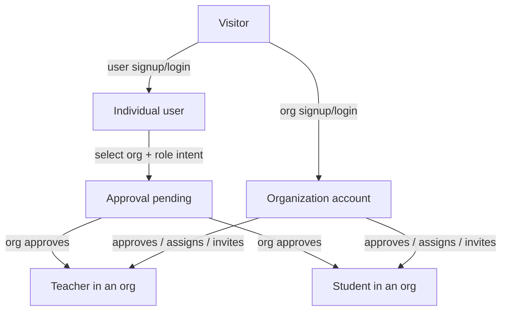

### 3.3 Multi-role note (**Documented legacy**)

`UI_WORKFLOW.md` L109: the same person can be teacher **and** student in the same school (separate role approvals). Roles live in the **school app** (Majestic backend RBAC/roster), not only in IAM.

---

## 4. Major capabilities

Capability groups at product level. Implementation maturity is refined in [§5](#5-core-features) and in [FRONTEND-ARCHITECTURE.md §1 / §17](./FRONTEND-ARCHITECTURE.md).

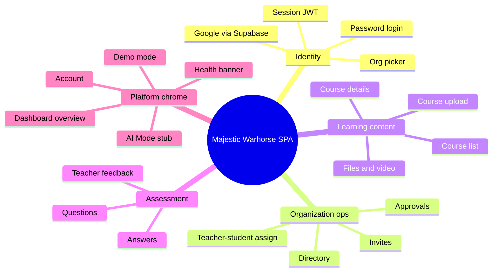

| Capability area | Business meaning | Primary code areas |
|-----------------|------------------|--------------------|
| Identity & session | Who is the user; which org | `src/app/core/auth/**`, `pages/login-page/**`, `pages/auth-callback/**`, `pages/org-picker/**` |
| Membership lifecycle | Join, wait, approve | `pages/approval-*`, `pages/invite-*`, roster APIs |
| Teaching graph | Who teaches whom | `assign-teachers/**`, directory manage pages |
| Curriculum | Courses, chapters, media | `pages/courses/**`, `course-upload/**`, `course-details/**` |
| Assessment | Q&A loop | `pages/questionnaire/**`, `components/student-assessment/**`, `assessment-answers/**` |
| Insights shell | Dashboard widgets / badges | `components/dashboard-overview/**` |
| Operability | Know if backends are up | `health-check.service.ts`, `app.component.*` |

---

## 5. Core features

### 5.1 Feature catalog with maturity

| Feature | Routes / entry | Status | Notes |
|---------|----------------|--------|-------|
| Manual login (user + org) | `/login` | **Working** | IAM `user/login`, `organization/login` |
| Google sign-in | `/login`, `/signup` → `/auth/callback` | **Working** | Supabase PKCE → IAM sync |
| Registration / signup | `/signup` | **Working** | IAM user/org save paths via registration services |
| Forgot password | `/forgetpassword` | **Working** | IAM forgot/confirm password |
| Org picker / switch org | `/org-picker` | **Working** | Post-login workflow |
| Dashboard overview | `/dashboard/overview` | **Working** | Live APIs + optional demo fixtures |
| AI Mode | `/dashboard/ai-mode` | **Stubbed** | UI only; `console.info` placeholder |
| Course listing | `/dashboard/courses` | **Working** | Role-based listing rules in `courses.service.ts` |
| Course overview (alternate) | `/dashboard/course-overview` | **Present** | Parallel catalog surface — canonical UX TBD (open in FRONTEND-ARCHITECTURE) |
| Course upload | `/dashboard/course-upload` | **Working** | `file/upload` + `course/save|update` |
| Course details | `/dashboard/course-details` | **Working** | Video, materials, discussions, status |
| Questionnaire (teacher) | `/dashboard/assessment` + course details tabs | **Working** | `question/*` |
| Student answers | Assessment components | **Working** | `answer/save` |
| Teacher feedback | Assessment answers UI | **Partial** | Feedback id mapping risk documented in FRONTEND-ARCHITECTURE |
| Approvals | `/dashboard/approval` | **Working** | Org-only in sidenav UI |
| Approval pending | `/dashboard/approval-pending` | **Working** | Waiting state after login |
| Directory | `/dashboard/directory` | **Working** | Teachers / students tabs |
| Manage assignments from directory | `directory/.../manage` | **Working** | View assigned students/teachers |
| Assign teachers (standalone page) | `/dashboard/assign-teacher` | **Working** but **nav partial** | Sidenav link commented out |
| Invite teacher / student | `/dashboard/invite-*` | **Working** but **nav partial** | Sidenav links commented out |
| Account / profile | `/dashboard/account` | **Working** | Edit account |
| Favorites | Overview wiring | **Working** (API-backed) | `favorites-api.service.ts` |
| Discussions | Course details | **Working** | `discussion/*` |
| Demo mode | Dashboard chrome | **Partial mock** | Fixture swap; not global HTTP mock |
| Health banner | App shell | **Working** | IAM + Majestic `/health` |
| Under-construction catch-all | `/dashboard/**` unknown | **Scaffold** | Placeholder component |
| Certification / graduation | — | **Not built** | Roadmap only |
| White-label per org | — | **Not built** | CSS tokens exist; logos hardcoded |
| `join-role` page folder | `src/app/pages/join-role` | **Scaffolded unused** | No route references found |

### 5.2 End-to-end school loop (product + code)

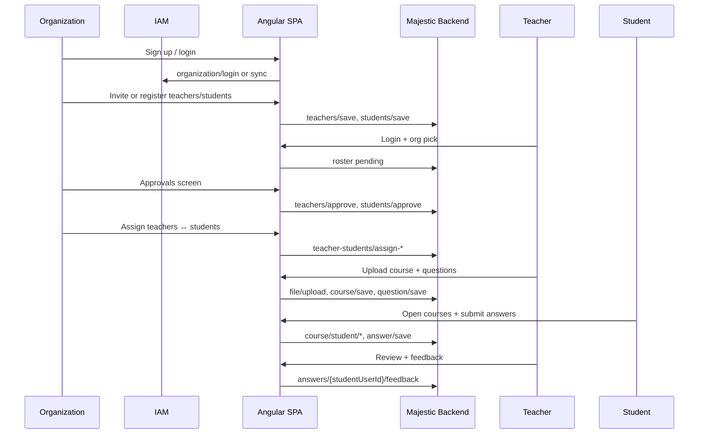

---

## 6. High-level architecture

### 6.1 Logical architecture

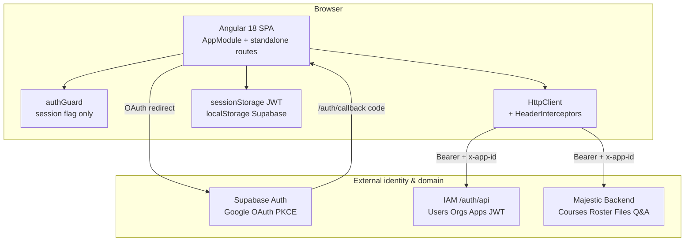

### 6.2 Application layering inside the SPA (**Observed**)

| Layer | Location | Responsibility |
|-------|----------|----------------|
| Bootstrap | `src/main.ts`, `src/app/app.module.ts` | Prod mode, SW cleanup, bootstrap `AppModule` |
| Shell | `app.component.*` | Router outlet, health banner, modal host |
| Routing | `app-routing.module.ts` | Eager standalone page components; `authGuard` on protected trees |
| Feature pages | `src/app/pages/**` | Screens |
| Feature components | `src/app/components/**` | Composed UI inside dashboard |
| Domain/HTTP services | `src/app/services/**`, `shared/api-service/**` | API calls |
| Core auth | `src/app/core/auth/**` | OAuth + post-login workflow |
| Cross-cutting UI/state | `src/app/shared/**` | `CommonService`, validators, toasters, dialogs |
| Config | `src/environments/**` | API bases, Supabase, `client_id` |

**Why hybrid NgModule + standalone:** Root still bootstraps classic `AppModule` (declares only `AppComponent`), while feature screens are `standalone: true` and imported by the router. This is a migration-era pattern: newer screens avoid feature NgModules; the shell retains module providers (interceptors, Toastr, Spinner module, Portal). See [FRONTEND-ARCHITECTURE.md §2](./FRONTEND-ARCHITECTURE.md#2-repository-map-and-angular-setup).

### 6.3 Trust and data boundaries

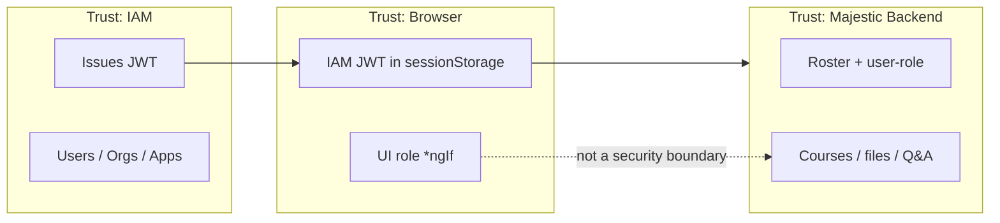

**Observed security-relevant fact:** Only `authGuard` protects `/dashboard/**`. Role authorization in the SPA is UI-level. Backend enforcement is required for real security ([FRONTEND-ARCHITECTURE.md §7](./FRONTEND-ARCHITECTURE.md#7-role-based-ui)).

### 6.4 Environment topology

| Environment | `appUrl` | `iamApi` | `majesticWarhorseApi` | Source |
|-------------|----------|----------|----------------------|--------|
| Development | `http://localhost:4200` | `http://localhost:5000/auth/api/` | `http://localhost:8081/` | `environment.ts` |
| Production | `https://majestic.petaxai.com` | Railway IAM host | Railway Majestic backend host | `environment.prod.ts` |

Both envs share the same Supabase project URL and anon key (**Observed**).

---

## 7. Technology stack

### 7.1 Stack summary diagram

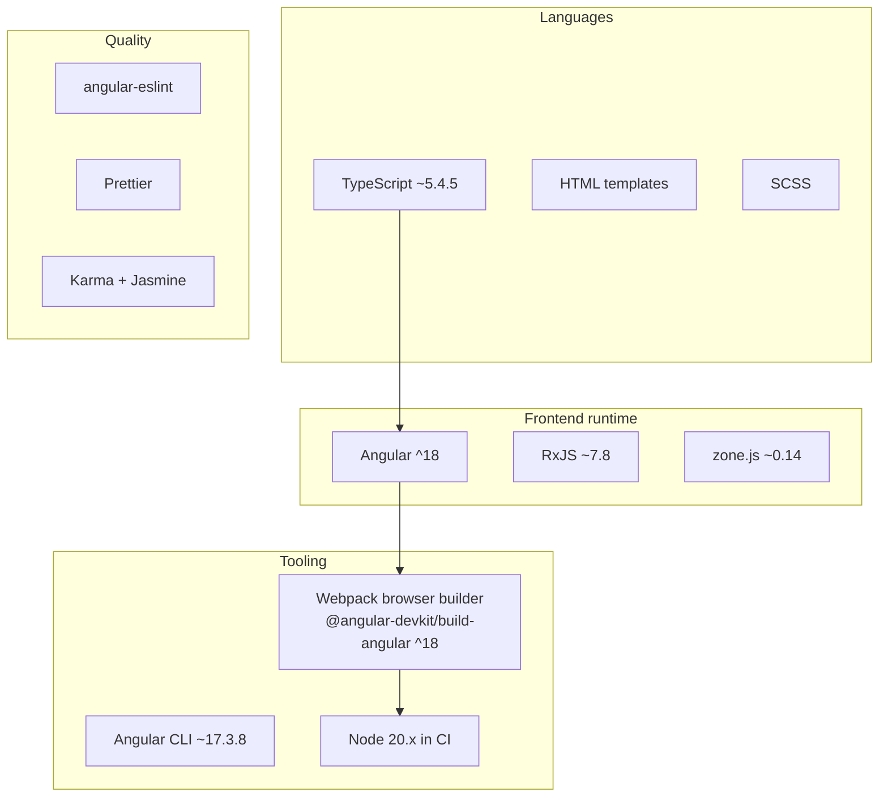

### 7.2 Version matrix (**Observed** from `package.json`)

| Concern | Package / tool | Version constraint |
|---------|----------------|--------------------|
| Framework | `@angular/*` | `^18.0.0` |
| CLI | `@angular/cli` | `~17.3.8` (**skew** vs framework 18) |
| Build | `@angular-devkit/build-angular` | `^18.2.6` |
| Language | `typescript` | `~5.4.5` |
| Reactive | `rxjs` | `~7.8.0` |
| Change detection runtime | `zone.js` | `~0.14.7` |
| Auth broker client | `@supabase/supabase-js` | `^2.110.0` |
| Toasts | `ngx-toastr` | `^19.0.0` |
| Spinner | `ngx-spinner` | `^17.0.0` |
| Rating UI | `angular-star-rating` + `css-star-rating` | `^7.0.0` / `^1.3.1` |
| Particles (login décor) | `particles.js` | `^2.0.0` (also loaded as global script in `angular.json`) |
| CDK | `@angular/cdk` | `^18.2.14` (Portal used) |
| Material | `@angular/material` | `^18.2.14` (**dependency present; Mat\* components not used as UI kit** — see FRONTEND-ARCHITECTURE) |

### 7.3 TypeScript / Angular compiler notes (**Observed**)

From `tsconfig.json`:

- `strict: true` and strict Angular template options enabled
- `target` / `module`: `ES2022`
- `"enableIvy": false` appears under `angularCompilerOptions` — **Unusual** on Angular 18 (Ivy is the only rendering engine). **Assumption:** leftover flag with no practical effect, or ignored by the current compiler. Treat as config debt until verified by build logs.

### 7.4 What is intentionally not in the stack (**Observed**)

| Absent | Implication |
|--------|-------------|
| NgRx / Akita / Elf | State via services + `BehaviorSubject` + sessionStorage |
| Server-side rendering (Angular Universal) | CSR-only SPA |
| Lazy `loadChildren` feature modules | All dashboard children eager in `AppRoutingModule` |
| Active Angular Service Worker | `angular.json` `serviceWorker: false`; `AppModule` SW `enabled: false`; bootstrap clears legacy SW |

---

## 8. Third-party services

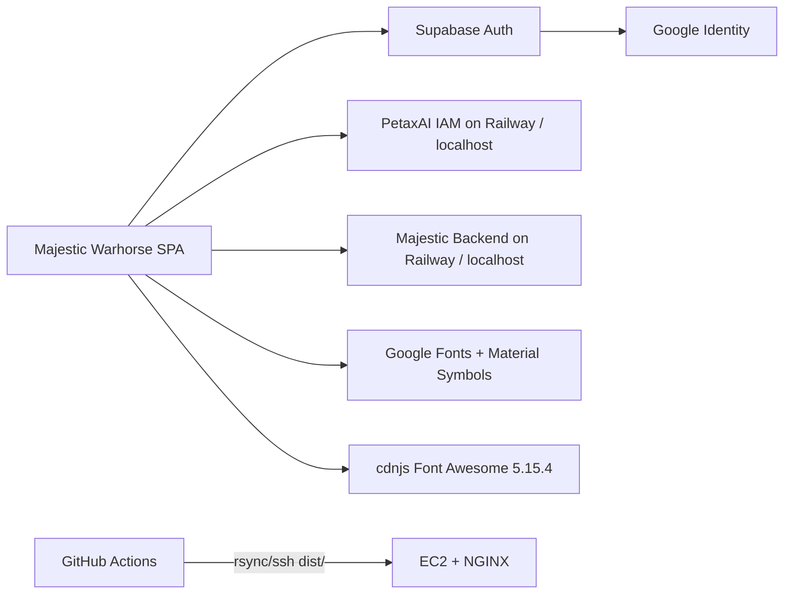

| Service | Role | Configuration in this repo | Docs |
|---------|------|----------------------------|------|
| **Supabase Auth** | Google OAuth PKCE; session in localStorage | `supabaseUrl`, `supabaseAnonKey` in environments | Client: `src/app/services/supabase.service.ts`, `core/auth/oauth.service.ts` |
| **Google** (via Supabase) | Identity provider | Not configured in-repo (Supabase dashboard) | **Unknown** client IDs beyond Supabase project |
| **PetaxAI IAM** | Users, orgs, applications, JWT | `iamApi` | [IAM_DOCUMENTATION.md](../IAM_DOCUMENTATION.md) |
| **Majestic Warhorse Backend** | Courses, roster, files, Q&A, dashboard aggregates | `majesticWarhorseApi` | [API_DOCUMENTATION.md](../API_DOCUMENTATION.md) |
| **Railway** | Hosts production IAM + Majestic API (URLs in prod env) | Hostnames in `environment.prod.ts` | Backend deploy **Unknown** in this repo |
| **GitHub Actions** | CI build + SSH deploy of `dist/` | `.github/workflows/main.yml` | Secrets: `DEPLOY_*` |
| **EC2 + NGINX** | Static SPA hosting (documented) | README NGINX/`try_files` notes | README; workflow transfers `dist/` |
| **Google Fonts / Material Symbols** | Typography & icons | `src/index.html` L19–20 | CDN |
| **cdnjs Font Awesome** | Icon CSS | `src/index.html` L18 | CDN |

**Assumption:** Production users hit `https://majestic.petaxai.com` (SPA) while APIs remain on Railway hostnames. Whether DNS/CDN sits in front of EC2 is **Unknown** (no Terraform/CloudFront config in this repo).

---

## 9. Programming languages

| Language | Where used | Notes |
|----------|------------|-------|
| **TypeScript** | Almost all `src/app/**/*.ts` | Primary application language |
| **HTML** | Angular component templates `*.html` | Including control flow `@if` in newer templates and classic `*ngIf` elsewhere |
| **SCSS** | `src/styles/**`, component `styleUrl` | Default schematic style in `angular.json` |
| **JSON** | `angular.json`, `tsconfig*`, `package.json`, `manifest.webmanifest`, `ngsw-config.json` | Config |
| **YAML** | `.github/workflows/main.yml` | CI |
| **Markdown** | Root docs + `/docs` | Product and reverse-engineering docs |
| **JavaScript (inline)** | `src/index.html` SW cleanup IIFE; `particles.js` global | Minimal |

No Java, Python, Go, or SQL application source lives in this repository (backends are external).

---

## 10. Frameworks and libraries

### 10.1 Application frameworks

| Framework | Usage |
|-----------|-------|
| **Angular 18** | SPA framework: components, DI, router, HttpClient, forms |
| **RxJS 7** | HTTP streams, `BehaviorSubject` state, `takeUntil` cleanup |
| **Zone.js** | Default change detection triggering |

### 10.2 UI / UX libraries actually wired

| Library | Wiring evidence |
|---------|-----------------|
| `ngx-toastr` | `AppModule` `ToastrModule.forRoot()`; global CSS in `angular.json` |
| `ngx-spinner` | Module imported; **interceptor provider commented out** in `app.module.ts` |
| `angular-star-rating` | `StarRatingModule.forRoot()` |
| `@angular/cdk/portal` | `PortalModule` for dynamic dialog content |
| `particles.js` | Global script + particle components on auth screens |

### 10.3 Present but unused / lightly used

| Library | Observation |
|---------|-------------|
| `@angular/material` | Installed; Mat component imports not used as design system |
| `@angular/service-worker` | Module registered with `enabled: false`; build `serviceWorker: false` |

### 10.4 Forms strategy (**Observed**)

- **Reactive forms:** login, registration, forgot password, account, invites
- **Template-driven (`ngModel`):** course upload, questionnaire, assessments, search

Shared validators: `src/app/shared/form-validators.ts`.

---

## 11. Design principles

Principles below are reconstructed from product docs, design tokens, and code structure. Each is labelled.

### 11.1 Product principles (**Documented legacy**)

| Principle | Meaning | Source |
|-----------|---------|--------|
| Feels like *their* product | White-label end state: logo, naming, identity | `USER_WORKFLOW.md`, `UI_WORKFLOW.md` |
| Runs on *our* software | Platform remains PetaxAI-operated | same |
| Friendly self-serve | Org can onboard teachers/students without heavy ops | MVP scope |
| Approval before access | Newcomers wait until org approves | `UI_WORKFLOW.md` L107–108 |
| Org isolation | Everything separate per school/`organization_id` | `UI_WORKFLOW.md` L110 |
| IAM vs school app split | Identity in IAM; roles/courses in Majestic backend | `UI_WORKFLOW.md` L101–110 |

### 11.2 Engineering principles (**Observed** in code)

| Principle | Evidence | Why it works this way |
|-----------|----------|----------------------|
| Shared IAM across PetaxAI apps | `client_id`, `x-app-id`, sister TCM docs | One login platform; many product UIs |
| Standalone feature screens | Most pages `standalone: true` | Faster feature addition without NgModule boilerplate |
| Central post-login orchestration | `PostLoginWorkflowService` | Org picker, roster, permissions are multi-step; one place to evolve |
| Bearer on every API call | `HeaderInterceptors` | Uniform auth attachment; 401 → hard logout (no refresh flow) |
| SessionStorage for IAM session | Auth services / workflow | Tab-scoped session; cleared on `logOutApplication` |
| CSS design tokens (`--mc-*`) | `_variables.scss` + `DESIGN.md` (“Majestic Cyber”) | Themeable surface prepared; runtime per-tenant theming not built |
| Demo mode as presentation fixtures | `DemoModeService` + dashboard demo data | Sales/demo without stubbing entire HTTP layer |
| Disable PWA for now | SW false + cleanup in `index.html`/`main.ts` | Avoid stale cached shells after earlier SW enablement |

### 11.3 Visual design language (**Observed**)

| Aspect | Choice | Source |
|--------|--------|--------|
| Theme name | “Majestic Cyber” | `src/assets/screens/DESIGN.md` |
| Surfaces | Dark charcoal (`#131316` family) | DESIGN.md / `--mc-surface` |
| Accent | Orange → magenta → purple brand gradient | `--mc-brand-gradient` |
| Display font | Space Grotesk (+ Geist body, JetBrains Mono labels) | `index.html` fonts + `_variables.scss` |
| Mobile | viewport-fit cover, PWA-capable meta, apple status bar | `index.html` L7–13 |

**Gap vs principle:** White-label is a stated business goal, but logos and product name remain hardcoded in templates; only CSS variables make recoloring tractable today ([FRONTEND-ARCHITECTURE.md §13](./FRONTEND-ARCHITECTURE.md#13-styling-and-white-labelling)).

---

## 12. Folder structure overview

### 12.1 Repository root

```
majestic-warhorse/
├── .github/workflows/main.yml    # CI: build + SSH deploy dist/ on master
├── docs/                         # Reverse-engineering documentation (this program)
│   ├── DOCUMENTATION-INDEX.md
│   ├── FRONTEND-ARCHITECTURE.md
│   └── 01_Project_Overview.md    # this file
├── src/                          # Application source
├── angular.json                  # Workspace / builders / budgets
├── package.json                  # Scripts & dependencies
├── package-lock.json
├── tsconfig.json                 # Strict TS + Angular compiler options
├── tsconfig.app.json
├── tsconfig.spec.json
├── ngsw-config.json              # SW asset config (SW currently disabled)
├── .eslintrc.json
├── .prettierrc
├── .editorconfig
├── README.md                     # CLI boilerplate + EC2/NGINX notes (partially stale)
├── API_DOCUMENTATION.md          # Majestic backend contract
├── IAM_DOCUMENTATION.md          # IAM contract
├── TCM_DOCUMENTATION.md          # Sister product reference
├── UI_WORKFLOW.md                # Screen/API flows
├── USER_WORKFLOW.md              # Stakeholder journeys
└── design.xml                    # Design artefact — runtime consumer Unknown
```

### 12.2 `src/` structure

```
src/
├── index.html                    # Shell HTML, CDN fonts, SW cleanup script
├── main.ts                       # Bootstrap + legacy SW cleanup
├── manifest.webmanifest          # PWA manifest (SW disabled)
├── favicon.ico
├── environments/
│   ├── environment.model.ts
│   ├── environment.ts            # local APIs
│   └── environment.prod.ts       # petaxai.com + Railway APIs
├── styles/                       # Global SCSS partials (_variables, _auth-layout, …)
├── assets/
│   ├── fonts/
│   ├── icons/
│   ├── images/
│   └── screens/                  # HTML design prototypes + DESIGN.md (not runtime routes)
└── app/
    ├── app.module.ts
    ├── app-routing.module.ts
    ├── app.component.*
    ├── auth.guard/
    ├── core/auth/                # OAuth, post-login, app context
    ├── interceptors/
    ├── services/api-service/
    ├── shared/
    ├── models/
    ├── constants/
    ├── pages/                    # Routed screens
    ├── components/               # Dashboard/feature widgets
    ├── particle(s)/
    ├── backups/                  # Unrouted legacy
    └── store/                    # Empty / unused
```

### 12.3 Folder roles (active vs legacy)

| Path | Role | Maintenance |
|------|------|-------------|
| `src/app/pages/**` | Routed features | **Active** |
| `src/app/components/**` | Composed UI | **Active** |
| `src/app/core/**` | Auth/session orchestration | **Active** |
| `src/app/services/**` | HTTP | **Active** |
| `src/app/shared/**` | Cross-cutting | **Active** |
| `src/styles/**` | Global theme | **Active** |
| `src/assets/screens/**` | Design prototypes | **Reference only** |
| `src/app/backups/**` | Old listing | **Legacy / unrouted** |
| `src/app/store/**` | Placeholder name | **Unused** |
| `src/app/pages/join-role/**` | Folder exists | **Unrouted / unused** |
| `docs/**` | Engineering docs | **Active (this program)** |

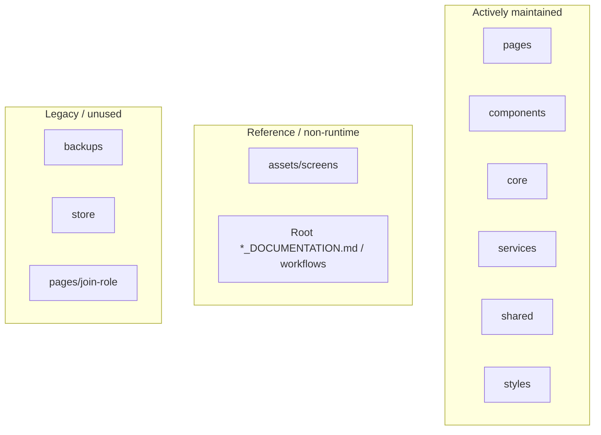

---

## 13. Development workflow

### 13.1 Prerequisites (**Observed** + **Documented legacy**)

| Requirement | Detail | Evidence |
|-------------|--------|----------|
| Node.js | CI uses **20.x**; local engines field absent | `.github/workflows/main.yml` L11–14; `package.json` has no `engines` |
| npm | Lockfile present → use `npm install` | `package-lock.json` |
| Running IAM | Default `http://localhost:5000/auth/api/` | `environment.ts` |
| Running Majestic API | Default `http://localhost:8081/` | `environment.ts` |
| Supabase project | Google OAuth must be configured for Google login | environments + OAuth services |
| Angular CLI | Invoked via `npm start` → `ng serve` | `package.json` scripts |

### 13.2 Day-to-day commands

| Command | Effect |
|---------|--------|
| `npm install` | Install dependencies |
| `npm start` | `ng serve` — default development configuration (`angular.json` serve default) → typically `http://localhost:4200/` |
| `npm run build` | `ng build` — **defaultConfiguration is production** (`angular.json` L77) |
| `npm run watch` | Development build in watch mode |
| `npm test` | Karma/Jasmine unit tests |
| `npm run lint` | ESLint via `@angular-eslint` |
| `npm run prettier` | Format `src/**/*.{ts,js,json,css,scss,html}` |

### 13.3 Recommended local loop

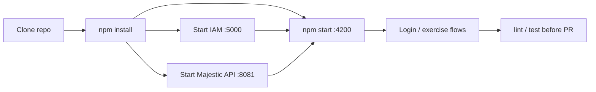

### 13.4 Code organization conventions (**Observed**)

| Convention | Practice |
|------------|----------|
| New screens | Standalone component under `pages/` + route entry in `app-routing.module.ts` |
| Nav paths | Prefer constants in `dashboard-routes.config.ts` |
| API access | Add/extend `*api.service.ts` under `services/api-service/` |
| Shared UI state | `CommonService` subjects — avoid introducing NgRx unless deliberately adopted |
| Auth changes | Extend `PostLoginWorkflowService` rather than duplicating session writes |
| Styles | Component SCSS + global tokens in `src/styles/_variables.scss` |

### 13.5 Product workflow docs during UI work

Engineers implementing screens are directed by root docs to use **UI_WORKFLOW.md** as the screen/API guide (`UI_WORKFLOW.md` L1–11). Reverse-engineering docs under `/docs` describe **what the code does today** when product docs drift.

---

## 14. Build process

### 14.1 Builder configuration (**Observed** — `angular.json`)

| Setting | Value |
|---------|-------|
| Builder | `@angular-devkit/build-angular:browser` |
| Main | `src/main.ts` |
| Index | `src/index.html` |
| Output | `dist/majestic-warhorse` |
| Polyfills | `zone.js` |
| Inline styles language | `scss` |
| Assets | `favicon.ico`, `src/assets`, `manifest.webmanifest` |
| Global styles | `src/styles/styles.scss`, toastr CSS, spinner animation CSS |
| Global scripts | `node_modules/particles.js/particles.js` |
| Service worker build flag | `false` |
| Default build configuration | **`production`** |

### 14.2 Production vs development configurations

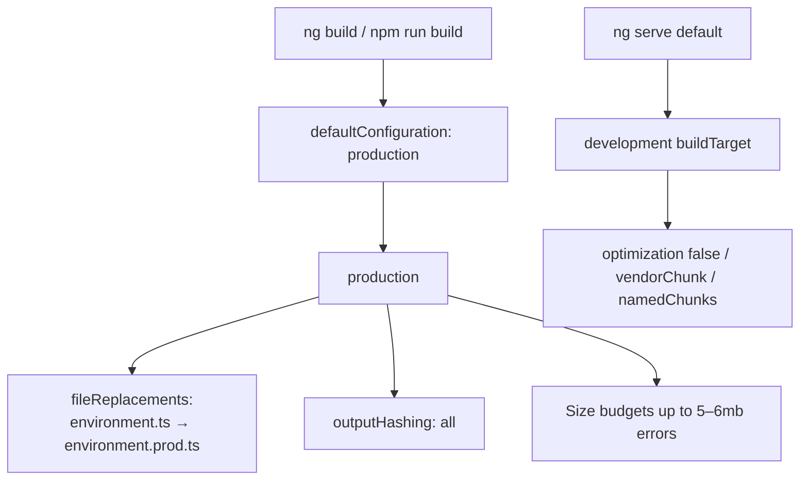

| | Development serve/build | Production build |
|--|-------------------------|------------------|
| Environment file | `environment.ts` | `environment.prod.ts` via fileReplacements |
| Optimization | Off (dev config) | On (prod defaults) |
| Output hashing | Not emphasized in dev config | `all` |
| Budgets | Not the focus of serve | Warnings/errors at multi‑MB thresholds (very large style budgets) |

### 14.3 CI build (**Observed**)

From `.github/workflows/main.yml`:

1. Trigger: `push` to branch **`master`**
2. Runner: `ubuntu-latest`
3. Node.js **20.x**
4. `npm install`
5. `CI=false npm run build`  
   - `CI=false` prevents treating warnings as failures in some tooling contexts
6. Deploy step uploads **`dist/`** via SSH

**Note:** README sample workflow still mentions `SOURCE: "build/"` and PM2 restart of `next-app` — that README sample is **stale / copy-pasted** relative to the real workflow (`SOURCE: "dist/"`, no PM2 step). Prefer `.github/workflows/main.yml` as **Observed** CI truth.

### 14.4 Build artefact

Successful production build emits hashed static assets under:

```
dist/majestic-warhorse/
```

This is a static site: HTML/JS/CSS/assets. No Node server is required to *serve* the SPA beyond any static file server (NGINX, S3+CDN, etc.).

---

## 15. Deployment overview

### 15.1 Documented production frontend URL (**Observed**)

`environment.prod.ts`:

- SPA: `https://majestic.petaxai.com`
- IAM: `https://iam-production-e81f.up.railway.app/auth/api/`
- Majestic API: `https://majestic-warhorse-backend-production.up.railway.app/`

### 15.2 Frontend deploy pipeline (**Observed**)

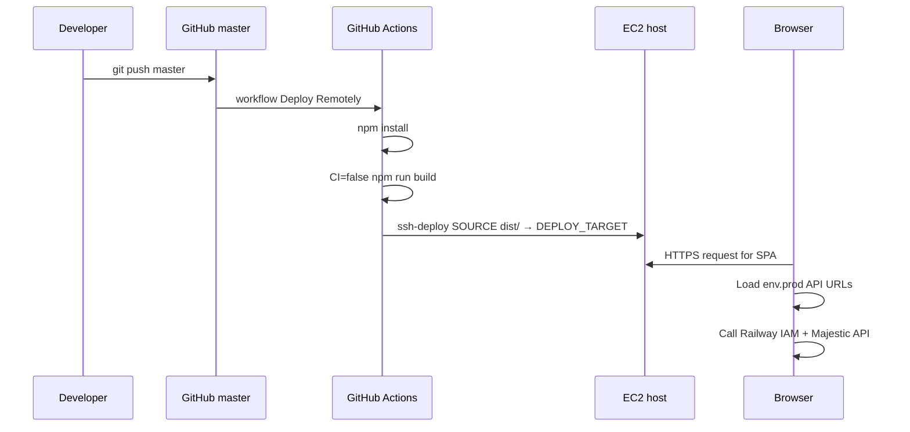

Required GitHub secrets (from workflow + README naming):

| Secret | Purpose |
|--------|---------|
| `DEPLOY_KEY` | SSH private key |
| `DEPLOY_HOST` | EC2 host |
| `DEPLOY_USER` | SSH user |
| `DEPLOY_PORT` | SSH port |
| `DEPLOY_TARGET` | Remote directory for `dist/` contents |

### 15.3 Static hosting expectations (**Documented legacy** in README)

README documents NGINX with SPA fallback:

```nginx
location / {
  try_files $uri /index.html;
}
```

Also documents Certbot SSL for a domain. Exact production NGINX root path and whether it matches `DEPLOY_TARGET` are **Unknown** without server access.

### 15.4 Dual hosting reality (important)

| Piece | Where it appears to run |
|-------|-------------------------|
| SPA static files | EC2 via GitHub Actions (**Observed** workflow) |
| IAM API | Railway hostname in prod env (**Observed** URL) |
| Majestic API | Railway hostname in prod env (**Observed** URL) |

**Assumption:** Frontend and APIs are deliberately split hosts; CORS and HTTPS must be configured on the API side for `https://majestic.petaxai.com`. CORS configuration is **not** in this repo (**Unknown** here; check backend repos / API docs).

### 15.5 Service worker / cache posture in production

Even though a web manifest exists, service worker registration is disabled and bootstrap clears legacy SW/caches (`main.ts`, `index.html`). **Why:** prevent users from being stuck on stale cached application shells after PWA was turned off.

---

## 16. Document control and unknowns

### 16.1 Cross-reference map

| Topic | Deep dive document |
|-------|--------------------|
| Routes, guards, interceptors, RxJS leaks | [FRONTEND-ARCHITECTURE.md](./FRONTEND-ARCHITECTURE.md) |
| Program rules / planned docs | [DOCUMENTATION-INDEX.md](./DOCUMENTATION-INDEX.md) |
| Screen-by-screen API usage | [UI_WORKFLOW.md](../UI_WORKFLOW.md) |
| Stakeholder narrative | [USER_WORKFLOW.md](../USER_WORKFLOW.md) |
| Backend endpoints | [API_DOCUMENTATION.md](../API_DOCUMENTATION.md) |
| IAM endpoints | [IAM_DOCUMENTATION.md](../IAM_DOCUMENTATION.md) |

### 16.2 Open unknowns affecting this overview

| ID | Unknown | Impact | Why unavailable |
|----|---------|--------|-----------------|
| O-1 | Whether production SPA is still on EC2 or has moved to another host while keeping petaxai.com | Ops runbooks | Only Actions→EC2 and env URLs exist; no DNS/IaC |
| O-2 | Backend framework versions as deployed on Railway | Full-stack rebuild | Backend source not in this repo |
| O-3 | Google OAuth client configuration details | Rebuild Google login in a new Supabase project | Only anon key + URL committed |
| O-4 | Whether music-instruction is an official market segment | Product positioning | Not evidenced in workflow docs (church/school/community are) |
| O-5 | Effect of `enableIvy: false` in tsconfig | Compiler behaviour | Needs Angular build/compiler verification |
| O-6 | Intended use of `design.xml` | Artefact hygiene | Not referenced by Angular build options beyond general assets unknown |

### 16.3 Revision history

| Date | Change |
|------|--------|
| 2026-07-27 | Initial reverse-engineered project overview (`01_Project_Overview.md`) |
