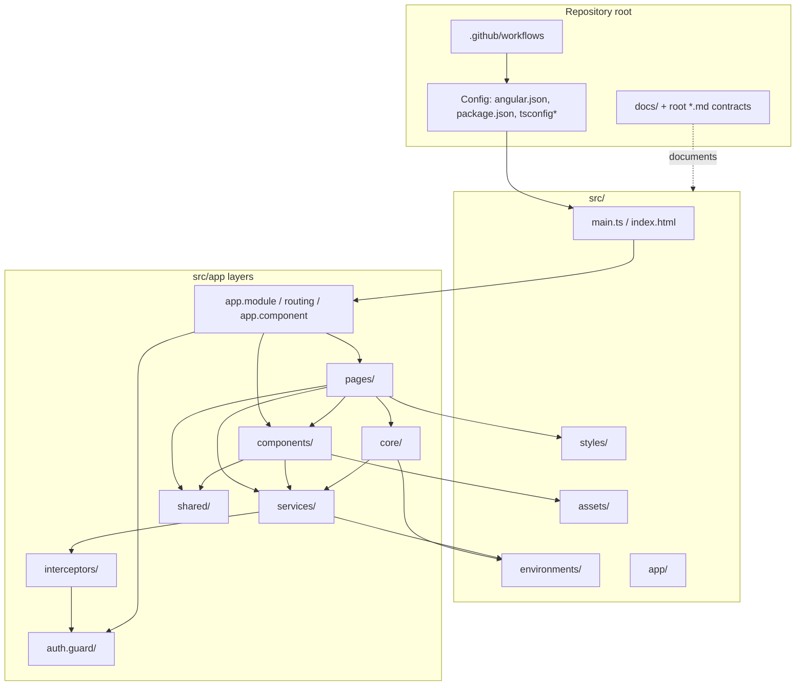
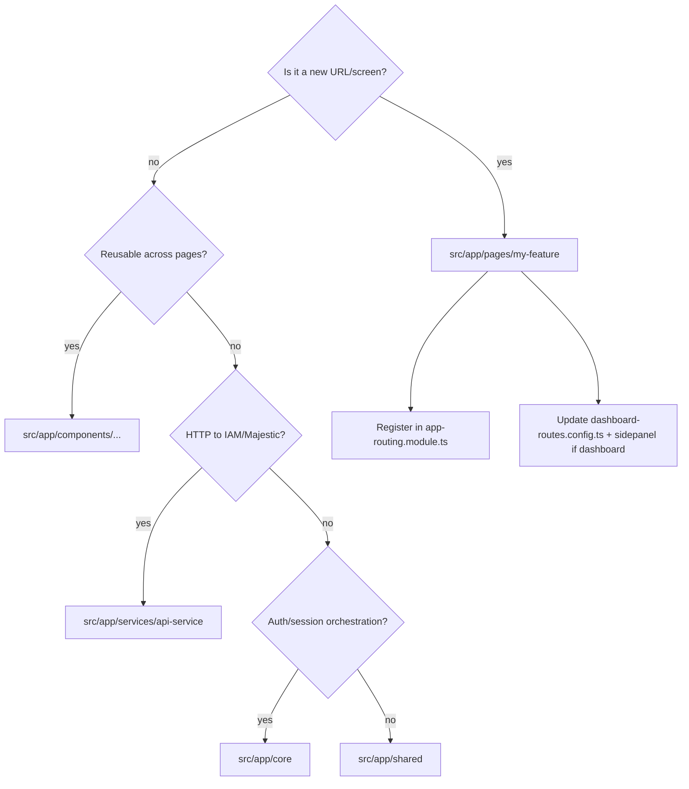

# 02 — Folder Structure

**Document type:** Reverse-engineered repository and source-tree reference  
**Audience:** Engineers rebuilding, navigating, or extending Majestic Warhorse  
**Repository:** `majestic-warhorse`  
**Evidence date:** 2026-07-27  
**Evidence tier:** **Observed** unless labelled otherwise  

**Cross-references:**
- [DOCUMENTATION-INDEX.md](./DOCUMENTATION-INDEX.md)
- [01_Project_Overview.md](./01_Project_Overview.md) — product/stack context
- [FRONTEND-ARCHITECTURE.md](./FRONTEND-ARCHITECTURE.md) — runtime behaviour of code in these folders

---

## Table of contents

1. [How to use this document](#1-how-to-use-this-document)
2. [Complete tree structure](#2-complete-tree-structure)
3. [Folder relationship map](#3-folder-relationship-map)
4. [Classification legend](#4-classification-legend)
5. [Repository root](#5-repository-root)
6. [Tooling and IDE folders](#6-tooling-and-ide-folders)
7. [docs/](#7-docs)
8. [src/ — application root](#8-src--application-root)
9. [src/app/ — Angular application](#9-srcapp--angular-application)
10. [src/app/pages/ — routed screens](#10-srcapppages--routed-screens)
11. [src/app/components/ — feature UI](#11-srcappcomponents--feature-ui)
12. [src/app/services/](#12-srcappservices)
13. [src/app/shared/](#13-srcappshared)
14. [src/app/core/](#14-srcappcore)
15. [Other src/app folders](#15-other-srcapp-folders)
16. [src/assets/](#16-srcassets)
17. [src/environments/](#17-srcenvironments)
18. [src/styles/](#18-srcstyles)
19. [Generated / excluded directories](#19-generated--excluded-directories)
20. [Accidental / empty directories](#20-accidental--empty-directories)
21. [Cross-cutting best practices](#21-cross-cutting-best-practices)
22. [Document control](#22-document-control)

---

## 1. How to use this document

For **each folder** this document records:

| Field | Meaning |
|-------|---------|
| **Purpose** | Why the folder exists |
| **Responsibilities** | What code/assets here are allowed to own |
| **Important files** | Entry points and must-know files |
| **Dependencies** | What this folder imports or relies on |
| **Relationships** | Who imports this folder / how it connects |
| **Best practices** | How successor teams should extend it |

Runtime behaviour of files is detailed in [FRONTEND-ARCHITECTURE.md](./FRONTEND-ARCHITECTURE.md); this document is the **map**.

---

## 2. Complete tree structure

Generated from the live repository on 2026-07-27. Excludes `node_modules/`, `.git/`, `.angular/`, and `dist/` (see [§19](#19-generated--excluded-directories)).

```text
majestic-warhorse/
├── .claude/
│   └── settings.local.json
├── .cursor/
├── .github/
│   └── workflows/
│       └── main.yml
├── .vscode/
│   ├── extensions.json
│   ├── launch.json
│   └── tasks.json
├── docs/
│   ├── 01_Project_Overview.md
│   ├── 02_Folder_Structure.md          ← this file
│   ├── DOCUMENTATION-INDEX.md
│   └── FRONTEND-ARCHITECTURE.md
├── New folder/                         ← ACCIDENTAL (empty scaffold; do not use)
│   └── src/
│       ├── app/
│       │   ├── pages/
│       │   │   └── login-page/         (empty)
│       │   └── store/                  (empty)
│       └── environments/               (empty)
├── src/
│   ├── app/
│   │   ├── auth.guard/
│   │   │   └── guards/
│   │   │       └── auth.guard.ts
│   │   ├── backups/
│   │   │   └── back-up-listing/
│   │   │       ├── back-up-listing.component.html
│   │   │       ├── back-up-listing.component.scss
│   │   │       ├── back-up-listing.component.spec.ts
│   │   │       └── back-up-listing.component.ts
│   │   ├── components/
│   │   │   ├── assessment-answers/
│   │   │   ├── assign-teachers/
│   │   │   ├── attachment-accordion/
│   │   │   ├── common-dialog/
│   │   │   │   └── model/
│   │   │   ├── common-search-profile/
│   │   │   ├── common-slider/
│   │   │   ├── dashboard-overview/
│   │   │   │   └── data/
│   │   │   ├── dashboard-sidepanel/
│   │   │   ├── file-viwer/             ← typo in folder name (viwer)
│   │   │   ├── modal/
│   │   │   ├── student-assessment/
│   │   │   ├── under-construction/     ← USED by router
│   │   │   ├── video-player/
│   │   │   ├── view-assigned-students/
│   │   │   └── view-assigned-teachers/
│   │   ├── constants/
│   │   │   ├── common-constant.ts
│   │   │   └── popup-constants.ts
│   │   ├── core/
│   │   │   ├── auth/
│   │   │   │   ├── auth-redirect.util.ts
│   │   │   │   ├── oauth.service.ts
│   │   │   │   ├── organization-oauth.service.ts
│   │   │   │   ├── post-login-workflow.service.ts
│   │   │   │   ├── supabase.service.ts
│   │   │   │   └── user-oauth.service.ts
│   │   │   └── app-context.service.ts
│   │   ├── interceptors/
│   │   │   ├── header.interceptor.ts
│   │   │   ├── header.interceptor.spec.ts
│   │   │   ├── spinner.interceptor.ts
│   │   │   └── spinner.interceptor.spec.ts
│   │   ├── models/
│   │   │   ├── organization.model.ts
│   │   │   ├── organization-picker.model.ts
│   │   │   ├── roster.model.ts
│   │   │   └── user-status.model.ts
│   │   ├── pages/
│   │   │   ├── account-settings/
│   │   │   ├── ai-mode/
│   │   │   │   └── data/
│   │   │   ├── approval-list/
│   │   │   ├── approval-page/
│   │   │   ├── approval-pending/
│   │   │   ├── auth-callback/
│   │   │   ├── course-details/
│   │   │   │   ├── data/
│   │   │   │   └── model/
│   │   │   ├── course-overview/
│   │   │   ├── courses/
│   │   │   │   └── modal/             ← models (spelled “modal”)
│   │   │   ├── course-upload/
│   │   │   │   └── model/
│   │   │   ├── dashboard/
│   │   │   │   └── modal/
│   │   │   ├── directory-page/
│   │   │   ├── edit-account/
│   │   │   ├── forgot-password/
│   │   │   ├── invite-student/
│   │   │   ├── invite-teacher/
│   │   │   ├── join-role/             ← EMPTY
│   │   │   ├── login-page/
│   │   │   │   └── model/
│   │   │   ├── org-picker/
│   │   │   ├── questionnaire/
│   │   │   │   └── model/
│   │   │   ├── registration-page/
│   │   │   │   └── model/
│   │   │   ├── student-approval-list/
│   │   │   ├── students-list/
│   │   │   ├── student-teacher-assign-list/
│   │   │   ├── teachers-list/
│   │   │   └── under-construction/    ← DUPLICATE; not routed
│   │   ├── particle/
│   │   ├── particles/
│   │   │   └── particles-json.ts
│   │   ├── services/
│   │   │   ├── api-service/
│   │   │   └── approval-notification.service.ts
│   │   ├── shared/
│   │   │   ├── api-service/
│   │   │   ├── banner/
│   │   │   ├── confirmation-popup/
│   │   │   ├── demo-mode-banner/      ← EMPTY
│   │   │   ├── document-viewer/
│   │   │   ├── loader/
│   │   │   ├── overlay/
│   │   │   ├── pipes/
│   │   │   ├── progress-bar/
│   │   │   ├── services/
│   │   │   ├── toaster/
│   │   │   ├── utils/
│   │   │   └── form-validators.ts
│   │   ├── store/                     ← EMPTY
│   │   ├── app.component.html
│   │   ├── app.component.scss
│   │   ├── app.component.spec.ts
│   │   ├── app.component.ts
│   │   ├── app.module.ts
│   │   └── app-routing.module.ts
│   ├── assets/
│   │   ├── fonts/                     ← Archivo, League Spartan, Poppins, Titillium
│   │   ├── icons/                     ← PWA / favicon PNGs
│   │   ├── images/                    ← logos, UI icons, placeholders
│   │   └── screens/                   ← HTML design prototypes + DESIGN.md
│   ├── environments/
│   │   ├── environment.model.ts
│   │   ├── environment.prod.ts
│   │   └── environment.ts
│   ├── styles/
│   │   ├── _account-profile.scss
│   │   ├── _approval-grid.scss
│   │   ├── _auth-layout.scss
│   │   ├── _component.scss
│   │   ├── _dashboard-scale.scss
│   │   ├── _index.scss
│   │   ├── _mixins.scss
│   │   ├── _reset.scss
│   │   ├── _variables.scss
│   │   └── styles.scss
│   ├── favicon.ico
│   ├── index.html
│   ├── main.ts
│   └── manifest.webmanifest
├── .editorconfig
├── .eslintrc.json
├── .gitignore
├── .prettierrc
├── angular.json
├── API_DOCUMENTATION.md
├── design.xml
├── IAM_DOCUMENTATION.md
├── ngsw-config.json
├── package.json
├── package-lock.json
├── README.md
├── TCM_DOCUMENTATION.md
├── tsconfig.app.json
├── tsconfig.json
├── tsconfig.spec.json
├── UI_WORKFLOW.md
└── USER_WORKFLOW.md
```

---

## 3. Folder relationship map



**Import direction rule (intended):**

`pages` / `components` → `services` / `core` / `shared` / `models` → `environments`

Pages should not be imported by services. Shared should not import pages.

---

## 4. Classification legend

| Tag | Meaning |
|-----|---------|
| **ACTIVE** | Used by routed or bootstrapped runtime |
| **SUPPORT** | Build/tooling/docs — not runtime UI |
| **LEGACY** | Present but unrouted or superseded |
| **EMPTY** | Directory exists with no files |
| **ACCIDENTAL** | Scratch / copy that should not ship as product code |
| **DUPLICATE** | Same concern exists in two places; one is canonical |

---

## 5. Repository root

### Purpose

Workspace root for the Angular CLI project `majestic-warhorse`, vendored API/product docs, and CI.

### Responsibilities

- Declare dependencies and npm scripts (`package.json`)
- Configure Angular build/serve/test/lint (`angular.json`)
- Hold TypeScript project configs
- Host integrator/product markdown contracts
- Hold GitHub Actions deploy workflow

### Important files

| File | Role |
|------|------|
| `package.json` | Scripts: `start`, `build`, `test`, `lint`, `prettier`; dependency versions |
| `package-lock.json` | Locked dependency tree |
| `angular.json` | Build output `dist/majestic-warhorse`, fileReplacements, assets, global styles/scripts |
| `tsconfig.json` | Strict TS + Angular compiler options |
| `tsconfig.app.json` | App compilation include set |
| `tsconfig.spec.json` | Unit test compilation |
| `ngsw-config.json` | Service-worker asset groups (SW currently disabled in build/module) |
| `.eslintrc.json` | ESLint |
| `.prettierrc` | Prettier |
| `.editorconfig` | Editor defaults |
| `.gitignore` | Ignores `node_modules`, `dist`, etc. |
| `README.md` | CLI boilerplate + EC2/NGINX notes (partially stale vs live CI) |
| `API_DOCUMENTATION.md` | Majestic backend HTTP contract |
| `IAM_DOCUMENTATION.md` | IAM HTTP contract |
| `TCM_DOCUMENTATION.md` | Sister product (The Church Manager) reference |
| `UI_WORKFLOW.md` | Screen/API flows for builders |
| `USER_WORKFLOW.md` | Stakeholder journeys |
| `design.xml` | Design artefact — **no Observed Angular consumer**; runtime role **Unknown** |

### Dependencies

- Node/npm toolchain
- Angular CLI packages from `node_modules` (not committed)

### Relationships

- Root configs drive everything under `src/`
- Root `*_DOCUMENTATION.md` / workflow docs are consumed by humans and by `/docs` reverse-engineering docs
- CI reads root + builds `src/` → `dist/`

### Best practices

- Treat `.github/workflows/main.yml` as deploy truth over README sample YAML
- Do not add application TypeScript at repo root
- Keep API contracts updated when Angular call sites change (or note drift in `/docs`)

---

## 6. Tooling and IDE folders

### 6.1 `.github/` — **SUPPORT**

| Field | Detail |
|-------|--------|
| **Purpose** | GitHub Actions automation |
| **Responsibilities** | Build and SSH-deploy on push to `master` |
| **Important files** | `workflows/main.yml` |
| **Dependencies** | GitHub secrets `DEPLOY_*`; Node 20.x |
| **Relationships** | Consumes `package.json` scripts; publishes `dist/` |
| **Best practices** | Keep `SOURCE: "dist/"` aligned with `angular.json` `outputPath` parent |

#### `.github/workflows/`

Holds workflow YAML only. Currently a single job: install → `CI=false npm run build` → `easingthemes/ssh-deploy` of `dist/`.

---

### 6.2 `.vscode/` — **SUPPORT**

| Field | Detail |
|-------|--------|
| **Purpose** | VS Code / Cursor workspace recommendations |
| **Responsibilities** | Suggested extensions, launch configs, tasks |
| **Important files** | `extensions.json`, `launch.json`, `tasks.json` |
| **Dependencies** | Local IDE |
| **Relationships** | Does not affect production build |
| **Best practices** | Keep launch configs pointing at `ng serve` / test if customized; do not store secrets |

---

### 6.3 `.cursor/` — **SUPPORT**

| Field | Detail |
|-------|--------|
| **Purpose** | Cursor IDE project metadata |
| **Responsibilities** | Editor/agent local settings (**Unknown** exact contents beyond presence) |
| **Best practices** | Do not commit secrets; treat as developer-local unless team standardizes |

---

### 6.4 `.claude/` — **SUPPORT**

| Field | Detail |
|-------|--------|
| **Purpose** | Claude/Cursor agent local settings |
| **Important files** | `settings.local.json` |
| **Best practices** | Local-only preferences; verify `.gitignore` policy for team |

---

## 7. `docs/`

| Field | Detail |
|-------|--------|
| **Purpose** | Reverse-engineering and architecture documentation for successor teams |
| **Responsibilities** | Code-truth operating manuals; program index |
| **Important files** | `DOCUMENTATION-INDEX.md`, `01_Project_Overview.md`, `02_Folder_Structure.md`, `FRONTEND-ARCHITECTURE.md` |
| **Dependencies** | Must be written from `src/` + root contracts |
| **Relationships** | Cross-links to root `UI_WORKFLOW.md`, `API_DOCUMENTATION.md`, etc. |
| **Best practices** | Follow evidence tiers in DOCUMENTATION-INDEX; register every new file in the index; never invent backend behaviour absent from this repo |

**Classification:** **SUPPORT** (not shipped inside the Angular bundle as app logic; may be omitted from deploy artefact depending on `DEPLOY_TARGET` contents — typically only `dist/` is deployed).

---

## 8. `src/` — application root

| Field | Detail |
|-------|--------|
| **Purpose** | Angular `sourceRoot` (`angular.json`) |
| **Responsibilities** | All application source, assets, environments, global styles, bootstrap HTML/TS |
| **Important files** | `main.ts`, `index.html`, `manifest.webmanifest`, `favicon.ico` |
| **Dependencies** | `environments/`, `app/`, `styles/`, `assets/` |
| **Relationships** | Compiled by `angular.json` browser builder into `dist/majestic-warhorse` |
| **Best practices** | Keep bootstrap thin; put features under `app/`; put static files under `assets/` |

### 8.1 `src/main.ts` (file)

Bootstraps `AppModule`, enables prod mode when `environment.production`, clears legacy service workers/caches (`mw-sw-cleanup-v1`).

### 8.2 `src/index.html` (file)

Document shell: title “Majestic Warhorse”, PWA meta, CDN fonts (Geist, Space Grotesk, JetBrains Mono, Material Symbols), Font Awesome CDN, inline SW cleanup script, `<app-root>`.

### 8.3 `src/manifest.webmanifest` (file)

Web app manifest referenced from `index.html` / assets list. Service worker registration is disabled at module/build level.

---

## 9. `src/app/` — Angular application

| Field | Detail |
|-------|--------|
| **Purpose** | Entire Angular application module tree |
| **Responsibilities** | Routing, features, HTTP, auth orchestration, shared UI |
| **Important files** | `app.module.ts`, `app-routing.module.ts`, `app.component.*` |
| **Dependencies** | Angular packages; `environments`; assets via templates |
| **Relationships** | Bootstrapped from `main.ts` |
| **Best practices** | New routed screens → `pages/`; reusable dashboard widgets → `components/`; HTTP → `services/api-service/`; auth multi-step → `core/auth/` |

### 9.1 Shell files in `src/app/`

| File | Purpose |
|------|---------|
| `app.module.ts` | Root NgModule: declares `AppComponent`; imports standalone login/particle/dialog; registers `HeaderInterceptors`; SW `enabled: false` |
| `app-routing.module.ts` | Sole route table (eager standalone components) |
| `app.component.ts` | Shell: health banner, dialog portal host, router events, application bootstrap via `application/get` |
| `app.component.html` | Health UI + `<router-outlet>` + dialog host |
| `app.component.scss` | Health banner styles |
| `app.component.spec.ts` | Unit test scaffold |

---

## 10. `src/app/pages/` — routed screens

| Field | Detail |
|-------|--------|
| **Purpose** | Feature screens, typically one folder per route target |
| **Responsibilities** | Page-level composition, page services, page-local models |
| **Dependencies** | `components/`, `services/`, `core/`, `shared/`, `models/` |
| **Relationships** | Wired exclusively (for active pages) through `app-routing.module.ts` |
| **Best practices** | Keep page folders standalone; put shared widgets in `components/`; register routes + `dashboard-routes.config.ts` nav constants together |

### Per-page folders

#### `pages/login-page/` — **ACTIVE**

| | |
|--|--|
| **Purpose** | Email/password + Google login for user and organization |
| **Responsibilities** | Login form UI; delegates to `login.service.ts` |
| **Important files** | `login-page.component.*`, `login.service.ts`, `model/user-model.ts` |
| **Dependencies** | `AuthService`, `OrganizationApiService`, `OAuthService`, `PostLoginWorkflowService`, shared validators |
| **Relationships** | Route `/login`; linked from signup/forgot-password |
| **Best practices** | Keep IAM calls in services; do not write session keys ad hoc — use post-login workflow |

#### `pages/registration-page/` — **ACTIVE**

| | |
|--|--|
| **Purpose** | Sign-up for users/orgs (+ Google) |
| **Important files** | `registration-page.component.*`, `registration-page.service.ts`, `model/registration-model.ts` |
| **Dependencies** | Registration/IAM APIs, OAuth, form validators |
| **Relationships** | Route `/signup` |
| **Best practices** | Align password rules with `shared/form-validators.ts` |

#### `pages/forgot-password/` — **ACTIVE**

| | |
|--|--|
| **Purpose** | Password reset / OTP confirm flows against IAM |
| **Important files** | `forgot-password.component.*`, `forgot-password.service.ts`, `model.ts` |
| **Relationships** | Route `/forgetpassword` (note spelling) |

#### `pages/auth-callback/` — **ACTIVE**

| | |
|--|--|
| **Purpose** | OAuth redirect landing (`/auth/callback`); exchanges Supabase code and completes IAM sync |
| **Important files** | `auth-callback.component.*` |
| **Dependencies** | `core/auth/oauth.service.ts`, post-login workflow |
| **Best practices** | Keep spinner-skip behaviour coordinated with health/spinner headers if re-enabled |

#### `pages/org-picker/` — **ACTIVE**

| | |
|--|--|
| **Purpose** | Choose organization / role intent after user login |
| **Dependencies** | Post-login workflow, organization APIs, user-role APIs |
| **Relationships** | Route `/org-picker` + `authGuard` |

#### `pages/dashboard/` — **ACTIVE**

| | |
|--|--|
| **Purpose** | Authenticated shell: sidepanel + child `router-outlet` |
| **Important files** | `dashboard.component.*`, `dashboard.service.ts`, `dashboard-routes.config.ts`, `modal/` |
| **Dependencies** | `dashboard-sidepanel`, `common-search-profile`, assign-teacher service, courses service |
| **Relationships** | Parent of all `/dashboard/**` children |
| **Best practices** | Add nav paths to `dashboard-routes.config.ts` and sidepanel together |

#### `pages/ai-mode/` — **ACTIVE route / STUB feature**

| | |
|--|--|
| **Purpose** | AI chat-style UI placeholder |
| **Important files** | `ai-mode.component.*`, `data/ai-mode.data.ts` |
| **Best practices** | Do not pretend backend exists; wire API in service layer when available |

#### `pages/course-overview/` — **ACTIVE**

| | |
|--|--|
| **Purpose** | Alternate course catalog surface |
| **Relationships** | Route `/dashboard/course-overview` |
| **Best practices** | Clarify with product whether this or `courses/` is canonical (open question in FRONTEND-ARCHITECTURE) |

#### `pages/courses/` — **ACTIVE**

| | |
|--|--|
| **Purpose** | Primary course listing with role-based fetch rules |
| **Important files** | `courses.component.*`, `courses.service.ts`, `modal/course-list.ts` |
| **Dependencies** | `CoursesApiService`, `CommonService` |
| **Best practices** | Keep listing rules in `courses.service.ts` aligned with `UI_WORKFLOW.md` |

#### `pages/course-upload/` — **ACTIVE**

| | |
|--|--|
| **Purpose** | Create/update course with cover, chapters, attachments, video |
| **Important files** | `course-upload.component.*`, `course-upload.service.ts`, `model/*` |
| **Dependencies** | `CommonApiService` (`file/upload`), `CoursesApiService` |
| **Best practices** | Keep MIME/size validation and bucket names in the upload service |

#### `pages/course-details/` — **ACTIVE**

| | |
|--|--|
| **Purpose** | Course player/detail: video, materials, discussions, assessments entry |
| **Important files** | `course-details.component.*`, `course-details.service.ts`, `data/course-details-demo.data.ts`, `model/` |
| **Dependencies** | Video player, attachment accordion, questionnaire pieces, discussions API, status APIs |
| **Best practices** | Keep demo fixtures under `data/` gated by `DemoModeService` |

#### `pages/edit-account/` — **ACTIVE**

| | |
|--|--|
| **Purpose** | Routed wrapper for account settings |
| **Important files** | `edit-account.component.*` (thin host) |
| **Relationships** | Route `/dashboard/account` → embeds `account-settings` |
| **Best practices** | Prefer putting form logic in `account-settings`; keep route component thin |

#### `pages/account-settings/` — **ACTIVE** (embedded, not directly routed)

| | |
|--|--|
| **Purpose** | Profile/account edit form UI |
| **Relationships** | Used by `edit-account` |
| **Best practices** | Treat as the real account feature module even though nested under `pages/` |

#### `pages/directory-page/` — **ACTIVE**

| | |
|--|--|
| **Purpose** | Tabbed teachers/students directory |
| **Dependencies** | `teachers-list`, `students-list` |
| **Relationships** | `/dashboard/directory`, `/directory/:tab` |

#### `pages/teachers-list/` — **ACTIVE**

| | |
|--|--|
| **Purpose** | Teachers roster table/cards inside directory |
| **Dependencies** | `TeachersApiService`, roster display helpers |

#### `pages/students-list/` — **ACTIVE**

| | |
|--|--|
| **Purpose** | Students roster inside directory |
| **Dependencies** | `StudentsApiService` |

#### `pages/approval-page/` — **ACTIVE**

| | |
|--|--|
| **Purpose** | Org approvals shell with tabs |
| **Relationships** | `/dashboard/approval`, `/approval/:tab` |

#### `pages/approval-list/` — **ACTIVE**

| | |
|--|--|
| **Purpose** | Approval list UI + `approve-teacher.service.ts` orchestration |
| **Dependencies** | Teachers/students approve APIs |

#### `pages/student-approval-list/` — **ACTIVE**

| | |
|--|--|
| **Purpose** | Student-specific approval list presentation |
| **Relationships** | Used within approval flows |

#### `pages/approval-pending/` — **ACTIVE**

| | |
|--|--|
| **Purpose** | Waiting screen when roster status is pending |
| **Relationships** | `/dashboard/approval-pending`; post-login may navigate here |

#### `pages/student-teacher-assign-list/` — **ACTIVE**

| | |
|--|--|
| **Purpose** | Standalone assign-teachers page |
| **Relationships** | `/dashboard/assign-teacher` (sidenav link commented out) |

#### `pages/invite-teacher/` / `pages/invite-student/` — **ACTIVE**

| | |
|--|--|
| **Purpose** | Invite forms for teachers/students |
| **Relationships** | Routes exist; sidenav entries commented |
| **Dependencies** | Mail API / roster save paths as implemented in components |

#### `pages/questionnaire/` — **ACTIVE**

| | |
|--|--|
| **Purpose** | Teacher question authoring / assessment route host |
| **Important files** | `questionnaire.component.*`, `model/` |
| **Relationships** | `/dashboard/assessment` |

#### `pages/join-role/` — **EMPTY**

| | |
|--|--|
| **Purpose** | **Unknown** — folder exists with no files |
| **Best practices** | Do not assume a feature; delete or implement intentionally |

#### `pages/under-construction/` — **DUPLICATE / LEGACY**

| | |
|--|--|
| **Purpose** | Placeholder page component |
| **Relationships** | **Not** imported by `app-routing.module.ts` (router uses `components/under-construction`) |
| **Best practices** | Remove after confirming no dynamic import; keep single canonical placeholder |

---

## 11. `src/app/components/` — feature UI

| Field | Detail |
|-------|--------|
| **Purpose** | Reusable or dashboard-embedded UI not always 1:1 with a top-level route |
| **Responsibilities** | Widgets composed into pages; some are themselves routed (manage views, under-construction) |
| **Dependencies** | `shared/`, `services/`, page services |
| **Relationships** | Imported by `pages/*` standalone `imports: []` arrays; some referenced in routing |
| **Best practices** | Prefer `components/` for multi-page reuse; keep selectors `app-*`; fix typo folders only with careful import updates |

### Per-component folders

| Folder | Classification | Purpose | Important files / notes |
|--------|----------------|---------|-------------------------|
| `dashboard-overview/` | **ACTIVE** | Home dashboard widgets, stats, recommendations, badges | `dashboard-overview.component.*`, `data/` demo fixtures, mobile/reference SCSS |
| `dashboard-sidepanel/` | **ACTIVE** | Left/bottom nav; role `*ngIf` gates | Role checks; commented Assign/Invite links |
| `common-search-profile/` | **ACTIVE** | Header search + profile/notifications | Activity feed via `CommonService` |
| `common-slider/` | **ACTIVE** | Carousel/slider for overview recommendations | |
| `common-dialog/` | **ACTIVE** | Dynamic dialog host content; **OnPush** | `model/` popup model types |
| `modal/` | **ACTIVE** | Modal presentation helper | |
| `assign-teachers/` | **ACTIVE** | Assign UI + **`assign-teacher.service.ts`** (HTTP for `teacher-students/*`) | Service is an important dependency of dashboard/manage pages |
| `view-assigned-students/` | **ACTIVE** | Routed manage page for a teacher’s students | Route `directory/teachers/:id/manage` |
| `view-assigned-teachers/` | **ACTIVE** | Routed manage page for a student’s teachers | Route `directory/students/:id/manage` |
| `student-assessment/` | **ACTIVE** | Student answer submission UI | Uses questionnaire APIs |
| `assessment-answers/` | **ACTIVE** | Teacher review / feedback UI | Feedback id risks documented in FRONTEND-ARCHITECTURE |
| `attachment-accordion/` | **ACTIVE** | Course materials accordion | Course details |
| `video-player/` | **ACTIVE** | Course video playback | Course details |
| `file-viwer/` | **ACTIVE** | File preview (**folder name typo**: viwer) | Prefer correcting via rename + import update in a dedicated PR |
| `under-construction/` | **ACTIVE** | Dashboard unknown-route placeholder | **Canonical** — used by router `**` |
| `assessment-answers/` etc. | | | See above |

**Dependencies (typical):** `CommonService`, ngx-toastr patterns, API services, `DemoModeService` for overview.

**Best practices:** When a “component” owns HTTP (e.g. `assign-teacher.service.ts`), document it as a domain service that happens to live beside UI — or migrate to `services/api-service/` in a future cleanup.

---

## 12. `src/app/services/`

### 12.1 `services/` (parent)

| Field | Detail |
|-------|--------|
| **Purpose** | Application services not placed under `shared/` or `core/` |
| **Important files** | `approval-notification.service.ts`; child `api-service/` |
| **Best practices** | Prefer `api-service/` for HTTP; keep notification helpers thin |

### 12.2 `services/api-service/` — **ACTIVE**

| Field | Detail |
|-------|--------|
| **Purpose** | HTTP clients for IAM and Majestic Warhorse APIs |
| **Responsibilities** | URL construction from `environment.*`, request/response typing (often loose), error piping via `CommonService.handleError` |
| **Dependencies** | `HttpClient`, `environment`, sometimes `AppContextService` / session keys |
| **Relationships** | Consumed by pages, components, core auth, dashboard services |
| **Best practices** | One domain per file; do not embed UI toasts here unless already established; mirror path names from `API_DOCUMENTATION.md` / `IAM_DOCUMENTATION.md` |

| File | External system | Domain |
|------|-----------------|--------|
| `auth.service.ts` | IAM | Login state, `user/*`, logout |
| `organization-api.service.ts` | IAM | Org login/CRUD, get-for-users |
| `registration-api.service.ts` | IAM | `user/save` |
| `application-api.service.ts` | IAM | `application/get` |
| `courses-api.service.ts` | Majestic | course + status |
| `teachers-api.service.ts` | Majestic | teachers roster |
| `students-api.service.ts` | Majestic | students roster |
| `user-role-api.service.ts` | Majestic | RBAC overview/permissions/save |
| `questionnaire-api.service.ts` | Majestic | questions/answers/feedback |
| `favorites-api.service.ts` | Majestic | favorites |
| `course-discussions-api.service.ts` | Majestic | discussions |
| `file-download-api.service.ts` | Majestic | `file/get-blob` |
| `mail-api.service.ts` | Majestic | `mail/send-gmail` |
| `health-check.service.ts` | IAM + Majestic | `/health` probes + banner state |
| `roster-registration.service.ts` | Majestic | Roster save orchestration |
| `roster-display.service.ts` | Majestic | Roster display helpers |

---

## 13. `src/app/shared/`

| Field | Detail |
|-------|--------|
| **Purpose** | Cross-cutting UI chrome, validators, utils, and a few HTTP helpers |
| **Responsibilities** | Code used by many features without owning a business screen |
| **Dependencies** | Angular common, RxJS, environments, CDK where needed |
| **Relationships** | Imported widely by pages/components/core |
| **Best practices** | No imports from `pages/`; keep `CommonService` API intentional (it is a magnet for global state) |

### Subfolders

| Folder / file | Classification | Purpose |
|---------------|----------------|---------|
| `shared/api-service/` | **ACTIVE** | `common-api.service.ts` — `file/upload`, IAM `user/delete` |
| `shared/services/` | **ACTIVE** | `common.service.ts` (users list, search text, activity feed, toasters, dialogs), `demo-mode.service.ts`, `file-download.service.ts`, `video-duration.service.ts`, `app.service.ts` (version) |
| `shared/banner/` | **ACTIVE** | Banner component |
| `shared/confirmation-popup/` | **ACTIVE** | Confirm dialog component + service |
| `shared/document-viewer/` | **ACTIVE** | Document viewing |
| `shared/loader/` | **ACTIVE** | Loading indicator UI |
| `shared/overlay/` | **ACTIVE** | Overlay chrome |
| `shared/pipes/` | **ACTIVE** | `search-filter.pipe.ts` |
| `shared/progress-bar/` | **ACTIVE** | Upload/progress UI |
| `shared/toaster/` | **ACTIVE** | Toaster model/constants (works with ngx-toastr) |
| `shared/utils/` | **ACTIVE** | `utils.ts`, `user-mapper.util.ts` (IAM profile → legacy user shape) |
| `shared/form-validators.ts` | **ACTIVE** | Password validators |
| `shared/demo-mode-banner/` | **EMPTY** | Folder present; no files — **Unknown** intended contents |

---

## 14. `src/app/core/`

| Field | Detail |
|-------|--------|
| **Purpose** | Application-critical orchestration that is not a screen |
| **Responsibilities** | App id resolution; OAuth; post-login session/role workflow |
| **Dependencies** | IAM/Majestic API services, Supabase, Router, `CommonService` |
| **Relationships** | Called from login, registration, auth-callback, org-picker |
| **Best practices** | Keep sessionStorage key writes centralized in post-login workflow; do not fork Google vs password completion paths |

### 14.1 `core/app-context.service.ts`

Resolves/caches application id for `x-app-id` / `app_id` headers (works with `application/get` and `client_id`).

### 14.2 `core/auth/` — **ACTIVE**

| File | Role |
|------|------|
| `supabase.service.ts` | Supabase JS client wrapper |
| `oauth.service.ts` | Google OAuth start + callback handling |
| `user-oauth.service.ts` | IAM `user/sync` / get for Google users |
| `organization-oauth.service.ts` | IAM `organization/sync` / get |
| `post-login-workflow.service.ts` | Persist JWT/profile; org picker; roster; navigate |
| `auth-redirect.util.ts` | Redirect URL helpers (contains debug `console.log` — see FRONTEND-ARCHITECTURE) |

---

## 15. Other `src/app` folders

### 15.1 `auth.guard/` — **ACTIVE**

| Field | Detail |
|-------|--------|
| **Purpose** | Functional `CanActivateFn` |
| **Important files** | `guards/auth.guard.ts` |
| **Responsibilities** | Allow if `AuthService.isLoggedIn()`; else `/login` |
| **Dependencies** | `AuthService`, `Router` |
| **Relationships** | Applied to `/org-picker` and `/dashboard` |
| **Best practices** | Do not add role checks here without also aligning backend; if adding role guards, place beside this folder |

### 15.2 `interceptors/` — **ACTIVE** (partial registration)

| File | Status |
|------|--------|
| `header.interceptor.ts` | **Registered** in `app.module.ts` — Bearer + app id; 401 logout |
| `spinner.interceptor.ts` | **Implemented but commented out** of providers |

| Best practices | Re-enable spinner only after confirming callback/health endpoints set skip headers |

### 15.3 `models/` — **ACTIVE**

| File | Domain |
|------|--------|
| `organization.model.ts` | Organization shapes |
| `organization-picker.model.ts` | Org picker entries |
| `roster.model.ts` | Roster / user-role overview types |
| `user-status.model.ts` | Status normalization helpers (`isActiveStatus`, etc.) |

**Best practices:** Prefer extending `models/` for cross-feature types; keep page-only DTOs in `pages/*/model`.

### 15.4 `constants/` — **ACTIVE**

| File | Role |
|------|------|
| `common-constant.ts` | e.g. `PARTICLE_ROUTES_LIST` for login/signup/forgot |
| `popup-constants.ts` | Dialog/popup constants |

### 15.5 `particle/` + `particles/` — **ACTIVE** (auth décor)

| Folder | Role |
|--------|------|
| `particle/` | Angular component wrapping particles.js |
| `particles/` | `particles-json.ts` configuration |

Used on auth routes listed in `PARTICLE_ROUTES_LIST`. Global `particles.js` script is loaded via `angular.json`.

### 15.6 `backups/back-up-listing/` — **LEGACY**

| Field | Detail |
|-------|--------|
| **Purpose** | Old listing UI retained in tree |
| **Relationships** | **Not** in `app-routing.module.ts` |
| **Best practices** | Do not revive without product decision; prefer delete in cleanup PR |

### 15.7 `store/` — **EMPTY**

| Field | Detail |
|-------|--------|
| **Purpose** | Name suggests NgRx/store — **no files** |
| **Best practices** | Do not assume state management library; current state is services + sessionStorage ([FRONTEND-ARCHITECTURE.md §8](./FRONTEND-ARCHITECTURE.md#8-state-management)) |

---

## 16. `src/assets/`

| Field | Detail |
|-------|--------|
| **Purpose** | Static files copied to output as-is (`angular.json` assets) |
| **Responsibilities** | Fonts, icons, images, design prototypes |
| **Dependencies** | None (consumed by CSS/HTML) |
| **Relationships** | Referenced from templates (`assets/images/...`) and `index.html` icons |
| **Best practices** | Optimize large PNGs; do not put TypeScript here; design HTML under `screens/` is not a runtime route |

### 16.1 `assets/fonts/` — **ACTIVE**

Self-hosted webfonts: Archivo, League Spartan, Poppins, Titillium Web (`.woff` / `.woff2`). Complements Google Fonts loaded in `index.html` for Geist / Space Grotesk / JetBrains Mono.

### 16.2 `assets/icons/` — **ACTIVE**

PWA/manifest icons: `favicon-196.png`, `apple-icon-180.png`, maskable 192/512.

### 16.3 `assets/images/` — **ACTIVE**

Logos (`logo-majestic-hourse.svg` — note spelling), UI SVG icons, placeholders, `under-construction.png`, `pending-approval.png`, sample images.

### 16.4 `assets/screens/` — **SUPPORT / design reference**

| Important files | Role |
|-----------------|------|
| `DESIGN.md` | “Majestic Cyber” token source |
| `*.html` | Static design comps (login, dashboard, courses, …) |
| `*.jpeg` | Design screenshots |

**Not** Angular routes. Use for visual QA and token alignment with `src/styles/_variables.scss`.

---

## 17. `src/environments/`

| Field | Detail |
|-------|--------|
| **Purpose** | Build-time configuration |
| **Important files** | `environment.model.ts`, `environment.ts`, `environment.prod.ts` |
| **Responsibilities** | `production`, `appVersion`, `client_id`, `appUrl`, `iamApi`, `majesticWarhorseApi`, Supabase URL/anon key |
| **Dependencies** | Replaced at prod build via `angular.json` fileReplacements |
| **Relationships** | Imported across services/core |
| **Best practices** | Never commit service-role keys; document that anon key is public-by-design but still environment-specific; do not read `environment.prod.ts` from dev code paths |

---

## 18. `src/styles/`

| Field | Detail |
|-------|--------|
| **Purpose** | Global SCSS entry and partials |
| **Important files** | `styles.scss` (entry in `angular.json`), `_index.scss`, `_variables.scss`, `_reset.scss`, `_mixins.scss`, `_auth-layout.scss`, `_account-profile.scss`, `_approval-grid.scss`, `_dashboard-scale.scss`, `_component.scss` |
| **Responsibilities** | Design tokens (`--mc-*`, legacy `--bg-*`), resets, shared layout systems |
| **Dependencies** | Consumed globally; component SCSS may use variables if imported/available |
| **Relationships** | Visual system paired with `assets/screens/DESIGN.md` |
| **Best practices** | Put cross-route layout rules here; keep component-specific rules in `*.component.scss`; extend white-label by driving `--mc-*` from a future theme service rather than hardcoding hex in components |

---

## 19. Generated / excluded directories

These exist on disk during development/CI but are **not** source-of-truth product folders:

| Directory | Purpose | Commit? |
|-----------|---------|---------|
| `node_modules/` | npm packages | No (`.gitignore`) |
| `dist/` | Build output (`dist/majestic-warhorse`) | No |
| `.angular/` | Angular CLI cache | No |
| `.git/` | Version control | N/A |

**Best practices:** Never edit files under `dist/` or `.angular/` as source. Deploy only fresh `ng build` output.

---

## 20. Accidental / empty directories

| Path | Classification | Action for successor team |
|------|----------------|---------------------------|
| `New folder/` | **ACCIDENTAL** | Empty nested `src/app/pages/login-page`, `store`, `environments` — **delete**; not part of Angular project |
| `src/app/store/` | **EMPTY** | Remove or adopt a real store deliberately |
| `src/app/pages/join-role/` | **EMPTY** | Remove or implement + route |
| `src/app/shared/demo-mode-banner/` | **EMPTY** | Remove or add the banner component referenced by name |
| `src/app/pages/under-construction/` | **DUPLICATE** | Prefer `components/under-construction`; delete pages copy after verification |

---

## 21. Cross-cutting best practices

### 21.1 Where to put new code



### 21.2 Naming inconsistencies to preserve carefully

| Quirk | Location | Guidance |
|-------|----------|----------|
| `file-viwer` typo | `components/file-viwer` | Rename only with project-wide import update |
| `forgetpassword` route spelling | routing | Keep unless coordinated redirect added |
| `modal/` meaning “models” | `courses/modal`, `dashboard/modal` | New code should use `model/` |
| Logo filename `hourse` | `assets/images/logo-majestic-hourse.svg` | Spelling is baked into templates |
| Duplicate `UnderConstructionComponent` | pages vs components | Router uses **components** |

### 21.3 Dependency rules (enforce in review)

1. `services/api-service` must not import from `pages/`.
2. `shared/` must not import from `pages/`.
3. Feature HTTP belongs in `api-service` (or migrate `assign-teacher.service.ts` there over time).
4. Session persistence belongs in `core/auth/post-login-workflow.service.ts` + `AuthService`, not scattered.
5. Design prototypes stay in `assets/screens/`; do not copy HTML into production templates without Angularizing.

### 21.4 Relationship to documentation set

| Concern | Folder | Doc |
|---------|--------|-----|
| Why product exists | — | [01_Project_Overview.md](./01_Project_Overview.md) |
| How folders map | this file | — |
| How runtime works | `src/app/**` | [FRONTEND-ARCHITECTURE.md](./FRONTEND-ARCHITECTURE.md) |
| Which API to call per screen | — | [UI_WORKFLOW.md](../UI_WORKFLOW.md) |

---

## 22. Document control

| Field | Value |
|-------|-------|
| Created | 2026-07-27 |
| Filename | `docs/02_Folder_Structure.md` |
| Supersedes planned index name | `02-REPOSITORY-STRUCTURE.md` (see DOCUMENTATION-INDEX) |
| Update trigger | Any folder add/rename/delete under `src/` or repo tooling dirs |

### Unknowns discovered while mapping

| ID | Item | Why unknown |
|----|------|-------------|
| FS-1 | Intended contents of empty `demo-mode-banner/` | No files; demo mode UI may live elsewhere |
| FS-2 | Intended feature for empty `join-role/` | No references |
| FS-3 | Consumer of `design.xml` | Not referenced by Angular build options observed |
| FS-4 | Whether `New folder/` was a local scratch copy | Empty trees only; safe to delete after team confirm |
| FS-5 | Full contents policy for `.cursor/` / `.claude/` | Tooling-local; not required for app rebuild |
