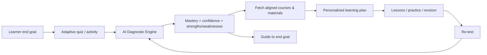
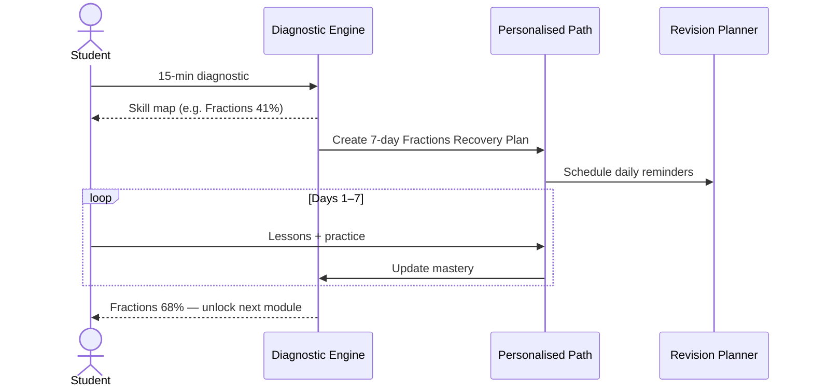
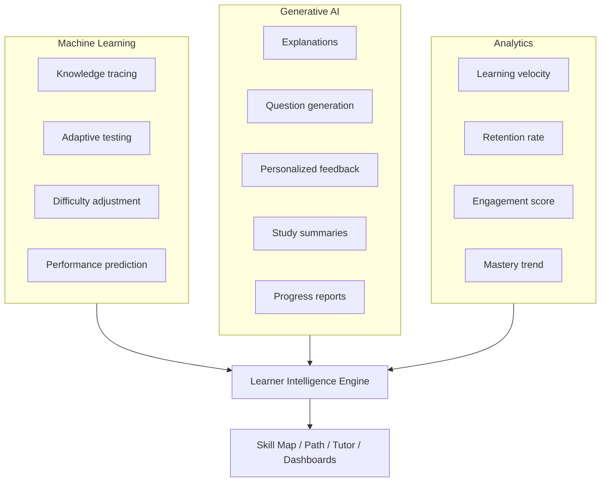
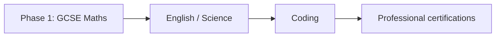
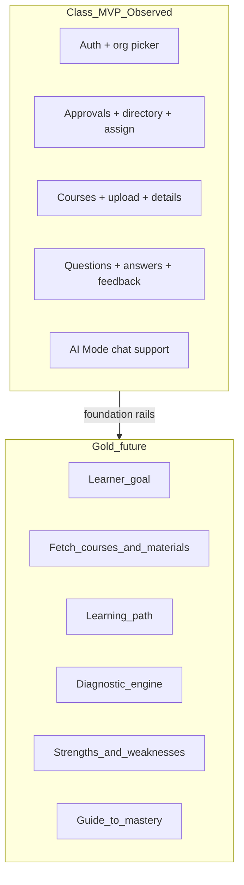

# 05 — AI Tutor / Adaptive Learning Intelligence Strategy

**Document type:** Product strategy brief (vision & go-to-market)  
**Product brand in this repository:** Majestic Warhorse (PetaxAI)  
**Working title in strategy sessions:** AI Tutor App – Adaptive Learning Intelligence Platform  
**Audience:** Product, founders, engineering, investors, AI coding agents  
**Status:** Product intent — **not** a description of current production code  
**Evidence date:** 2026-08-04  

**Cross-references:**
- [MAJESTIC_WARHORSE_PRD.md](./MAJESTIC_WARHORSE_PRD.md) — full PRD / requirements depth
- [01_Project_Overview.md](./01_Project_Overview.md) — Class MVP (SPA today) vs Gold destination
- [03_System_Architecture.md](./03_System_Architecture.md) — current technical topology
- [04_UI_Architecture.md](./04_UI_Architecture.md) — UI architecture (AI Mode chat exists; diagnostic engine does not)
- [FRONTEND-ARCHITECTURE.md](./FRONTEND-ARCHITECTURE.md) — code-truth frontend gaps
- [UI_WORKFLOW.md](../UI_WORKFLOW.md) / [USER_WORKFLOW.md](../USER_WORKFLOW.md) — Class MVP school-loop docs

> **Evidence labelling:** Everything in §§1–14 below is **Product strategy / vision** unless marked **Observed**. **Observed Class MVP:** organisation–teacher–student school loop + AI Mode chat as support. **Gold** (goal capture, diagnostic/path engine, auto course fetch, no org/teacher) is **not** shipped.

---

## Table of contents

1. [One-line pitch](#1-one-line-pitch)
   - [1.1 Product horizons (Class MVP vs Gold)](#11-product-horizons-class-mvp-vs-gold)
2. [Business problem](#2-business-problem)
3. [Target customers](#3-target-customers)
4. [Existing competitors](#4-existing-competitors)
5. [Current market gap](#5-current-market-gap)
6. [Proposed solution](#6-proposed-solution)
7. [Example user journey](#7-example-user-journey)
8. [Core features](#8-core-features)
9. [How AI improves or automates the solution](#9-how-ai-improves-or-automates-the-solution)
10. [Technical feasibility](#10-technical-feasibility)
11. [MVP timeline](#11-mvp-timeline)
12. [Revenue model](#12-revenue-model)
13. [Market potential](#13-market-potential)
14. [Competitive advantage](#14-competitive-advantage)
15. [Initial niche recommendation](#15-initial-niche-recommendation)
16. [12-month roadmap](#16-12-month-roadmap)
17. [Strategy meeting summary](#17-strategy-meeting-summary)
18. [Mapping strategy → Majestic Warhorse today](#18-mapping-strategy--majestic-warhorse-today)
19. [Relationship to the PRD](#19-relationship-to-the-prd)
20. [Document control](#20-document-control)

---

## 1. One-line pitch

**Class MVP (now):** Org + Teacher + Student prove the school rails (approve, assign, courses, assessments, teacher feedback; AI Mode as support).

**Gold (future):** Solo learner + AI — goal → courses/materials → path → assess → strengths/weaknesses → guide to end goal. **No org. No teacher.**

---

## 1.1 Product horizons (Class MVP vs Gold)

Document two explicit horizons. Do not conflate “shipping now” with Gold.

| Horizon | When | Dependency | What it is |
|---------|------|------------|------------|
| **Class MVP (Fast MVP)** | Now → near versions | Organization, Teacher, Student | School rails: signup, approve, assign, courses, questionnaire, teacher feedback, AI Mode chat as support |
| **Gold** | Future end state | Solo learner + AI only | No organization required, no teacher required. Goal-driven course/material fetch, learning path, assessment, strength/weakness map, guidance to mastery |

```text
Class MVP:  Org + Teacher + Student prove the school rails.
Gold:       Solo learner + AI — goal → courses/materials → path →
            assess → strengths/weaknesses → guide to end goal.
            No org. No teacher.
```

### Class MVP horizon (**Observed** / near-term)

Prove the online school loop. Versions 1–4 white-label / insights increments (see [01_Project_Overview.md](./01_Project_Overview.md) §2) sit **under Class MVP**, not as Gold.

### Gold horizon (future — strategy north star)

| Capability | What the AI does |
|------------|------------------|
| Goal | Captures the learner’s end goal (exam, skill, outcome) |
| Courses | Fetches / recommends courses aligned to that goal |
| Materials | Serves study material matched to level and gaps |
| Assessment | Continuously assesses the learning path |
| Diagnosis | Identifies strengths and weaknesses with evidence |
| Guidance | Prescribes the next best step until the goal is reached |

**Gold removes org and teacher as dependencies** for the core loop. Class MVP may keep them as scaffolding; Gold does not require them for solo progress.

**Today (Observed):** Class MVP school loop + AI Mode chat support. Gold diagnostic/path engine is **not** built.

---

## 2. Business problem

Students often receive the same lessons regardless of their actual understanding. Teachers and training providers struggle to:

- Identify learning gaps early
- Track individual progress
- Personalize learning plans
- Provide timely feedback
- Scale support for many students

As a result, students spend time studying topics they already know while hidden weaknesses remain unresolved.

---

## 3. Target customers

### Primary

| Segment | Why they buy |
|---------|--------------|
| Schools | Class-scale gap detection and teacher dashboards |
| Colleges and universities | Adaptive pathways at cohort scale |
| Coaching centers | Measurable improvement for exam prep |
| Online learning platforms | Differentiation via personalization |
| Corporate training teams | Role/skill mastery and readiness |

### Secondary

| Segment | Why they buy |
|---------|--------------|
| Parents of school students | Visibility into weaknesses and progress reports |
| Individual learners preparing for exams | Personal recovery plans without a private tutor |
| Professional certification candidates | Predictive readiness and targeted revision |

**Alignment with existing Majestic docs:** Schools, communities, churches/Sunday schools, and academies already appear in `USER_WORKFLOW.md` / `UI_WORKFLOW.md`. This strategy **adds** coaching centers, corporate training, parents, and certification candidates as explicit segments.

---

## 4. Existing competitors

| Competitor | Notes (strategy framing) |
|------------|--------------------------|
| Khan Academy | Strong content + practice; personalization depth limited vs continuous diagnosis |
| Duolingo | Adaptive engagement in language; different subject domain |
| Coursera | Course marketplace; **limited personalization** (strategy claim) |
| Quizlet | Flashcards / study tools; not full diagnostic tutor |
| Century Tech | AI adaptive learning (UK/education) — close competitor class |
| Squirrel AI | Adaptive tutoring (notably China / AI adaptive) — close competitor class |
| BYJU’S | Large edtech suite; personalization varies by product |

**Product strategy claim:** Compete on **diagnostic explanation + continuous adaptation**, not on content library size alone.

---

## 5. Current market gap

Most platforms provide content and quizzes but rely heavily on predefined learning paths. Few systems continuously:

1. Diagnose conceptual weaknesses automatically  
2. Explain **why** the learner is struggling  
3. Predict future performance  
4. Recommend the next best learning activity **without teacher approval**

This gap is the product’s strategic opening and matches the PRD thesis: *understand what learners know*, not only *record what they did* ([MAJESTIC_WARHORSE_PRD.md](./MAJESTIC_WARHORSE_PRD.md) §2).

---

## 6. Proposed solution

**Gold (future):** a **mobile and web** app with an **AI Diagnostic & Path Engine** that:

1. Captures the learner’s **end goal**
2. Assesses knowledge through adaptive quizzes and activities  
3. Detects weak concepts automatically  
4. Measures confidence and mastery levels  
5. **Fetches aligned courses and study material** for the goal and gaps  
6. Generates a personalized learning plan  
7. Recommends lessons, videos, exercises, and revision schedules  
8. Re-tests weak areas and **guides the learner to the end goal** until mastery  

**No org. No teacher** for the Gold core loop. Class MVP school rails (org / teacher / student) are the foundation Gold later drives.



**Platform note:** Current Majestic Warhorse SPA is **web (Angular)** Class MVP. Mobile (Flutter / React Native) is **proposed** in the feasibility stack — not Observed in this repository.

---

## 7. Example user journey

### Day 1

Student takes a **15-minute diagnostic test**.

**AI detects (example):**

| Topic | Mastery |
|-------|---------|
| Algebra | 82% |
| Fractions | 41% |
| Word problems | 35% |
| Geometry | 76% |

**AI action:**

- Assigns a **7-day “Fractions Recovery Plan”**
- Recommends short lessons and practice sets
- Schedules daily revision reminders

### Day 7

Student improves to **68%** on fractions; AI unlocks the next module.

**No teacher intervention required** for this path (product end goal). Teacher/parent dashboards remain available only when humans choose to oversee — they are not blockers for progress.



---

## 8. Core features

| Feature | Description |
|---------|-------------|
| **AI Skill Map** | Visual map of mastered, developing, and weak topics |
| **Personalized Learning Path** | Dynamic sequence of lessons and exercises |
| **Strength & Weakness Report** | PDF/email report for student, parent, or teacher |
| **AI Tutor Chat** | Learner asks questions in natural language |
| **Predictive Performance Score** | Forecasts exam readiness and risk areas |
| **Automatic Revision Planner** | Spaced-repetition schedule based on forgetting curves |
| **Parent/Teacher Dashboard** | High-level progress and intervention alerts |

### Feature → PRD module mapping

| Strategy feature | PRD anchor (approx.) |
|------------------|----------------------|
| AI Skill Map | Knowledge Graph + Evidence-Based Mastery (§8–9) |
| Personalized Learning Path | Personalised Learning Engine (§11) |
| Strength & Weakness Report | Teacher / Parent portals (§13, §16) |
| AI Tutor Chat | AI Tutor (§10) |
| Predictive Performance Score | Predictive Intelligence (§14) |
| Automatic Revision Planner | Intervention / Personalised engines (§11, §15) |
| Parent/Teacher Dashboard | Teacher Intelligence + Parent Portal (§13, §16) |

---

## 9. How AI improves or automates the solution

### Machine Learning

- Knowledge tracing  
- Adaptive testing  
- Difficulty adjustment  
- Performance prediction  

### Generative AI

- Explain concepts in simpler language  
- Generate practice questions  
- Create personalized feedback  
- Produce study summaries  
- Generate progress reports  

### Analytics

- Learning velocity  
- Retention rate  
- Engagement score  
- Mastery trend  



---

## 10. Technical feasibility

**Feasibility:** High  

### Suggested stack (strategy)

| Layer | Technology |
|-------|------------|
| Mobile | Flutter / React Native |
| Web | Angular / React |
| Backend | FastAPI |
| Database | PostgreSQL |
| AI Models | OpenAI / open-source LLMs |
| Analytics | Python, XGBoost |
| Hosting | AWS |

### Alignment with **Observed** Majestic stack (this repo + contracts)

| Strategy layer | Today (Observed / Documented) | Gap |
|----------------|-------------------------------|-----|
| Web | **Angular 18** SPA (`majestic-warhorse`) | Aligns with “Angular / React” option |
| Mobile | **Not in this repo** | Flutter/RN still to build |
| Backend | Majestic API (Railway) + IAM; API docs describe course/roster domain | FastAPI AI services not in this frontend repo |
| Database | PostgreSQL via Supabase (**Documented** for backends) | Aligns |
| AI Models | **Partial** — AI Mode chat live; **Gold** diagnostic/path engine not built | Class MVP support ≠ Gold coach |
| Analytics / XGBoost | **Not Observed** | New intelligence services |
| Hosting | SPA→EC2; APIs→Railway; Supabase | Strategy says AWS — may converge or coexist (**Assumption**) |

---

## 11. MVP timeline

| Workstream | Duration |
|------------|----------|
| Diagnostic test engine | 4 weeks |
| Personalized recommendations | 3 weeks |
| AI chat tutor | 2 weeks |
| Dashboard & reports | 3 weeks |
| **Total MVP** | **~3 months** with a small team |

**Note:** This timeline is for the **AI Diagnostic MVP**, distinct from the already-shipped **school-loop MVP** (login, approvals, courses, Q&A) documented in `UI_WORKFLOW.md`.

---

## 12. Revenue model

### B2C

| Offer | Price (strategy) |
|-------|------------------|
| Free basic plan | £0 |
| Premium student plan | £5–£15 / month |

### B2B

| Offer | Price (strategy) |
|-------|------------------|
| School license | £500–£5,000 / year |
| Coaching center license | (tiered; strategy lists as license line) |
| Corporate training license | (tiered; strategy lists as license line) |

### Additional revenue

- Exam preparation packs  
- AI tutoring credits  
- Parent premium reports  

**Product strategy summary:** Freemium B2C + school / coaching / corporate licensing.

---

## 13. Market potential

The global edtech market is worth hundreds of billions of dollars, and personalized AI learning is one of the fastest-growing segments. **UK schools**, tutoring centers, and professional training providers are actively adopting AI-assisted learning tools.

This supports the **GCSE Maths (UK)** niche entry (§15).

---

## 14. Competitive advantage

| Traditional LMS | AI Tutor App (Majestic direction) |
|-----------------|-----------------------------------|
| “Score: 62%.” | “You struggle with **fraction-to-decimal conversion**, especially when denominators are not multiples of 10. Spend **18 minutes on Lesson 3** and complete **Practice Set B** before moving to percentages.” |

**Differentiator:** Diagnostic explanation + adaptive recommendations + automated progress reporting — not a bare score.

---

## 15. Initial niche recommendation

**Start with GCSE Maths (UK)** because:

1. Clear curriculum  
2. Large student base  
3. Objective assessment  
4. Easy to measure improvement  

**Expand later to:** English, science, coding, and professional certifications.



---

## 16. 12-month roadmap

| Phase | Focus |
|-------|--------|
| **Phase 1** | GCSE Maths diagnostic + recommendations |
| **Phase 2** | AI tutor chat + predictive scoring |
| **Phase 3** | Parent and teacher analytics |
| **Phase 4** | Multi-subject adaptive learning |
| **Phase 5** | Corporate and professional training version |

### Relationship to PRD scalability roadmap

| This strategy (12 months) | PRD §32 (broader) |
|---------------------------|-------------------|
| Phases 1–2 ≈ Learning Intelligence MVP | Phase 1 — Learning Intelligence MVP |
| Phase 3 ≈ Educator / parent analytics | Phase 2 — Educator Intelligence |
| Phase 4–5 ≈ multi-subject + corporate | Phases 3–4 — Institution / Ecosystem |

Use **this document** for go-to-market sequencing (GCSE-first); use the **PRD** for platform module depth.

---

## 17. Strategy meeting summary

| Item | Statement |
|------|-----------|
| **Problem** | Students receive generic learning; weaknesses remain hidden. |
| **Solution** | AI automatically diagnoses weaknesses, creates personalized learning plans, and continuously tracks mastery. |
| **Differentiator** | Diagnostic intelligence + adaptive recommendations + automated progress reporting. |
| **Business model** | Freemium B2C + school licensing (plus coaching/corporate). |
| **MVP feasibility** | High (≈3 months for AI diagnostic MVP). |
| Long-term vision (**Gold**) | Solo AI coach: goal → courses/materials → assess → strengths/weaknesses → mastery; **no org, no teacher** |
| Near-term (**Class MVP**) | Org + Teacher + Student school loop; AI Mode chat as support |

---

## 18. Mapping strategy → Majestic Warhorse today

Map **Observed SPA → Class MVP**. Map **missing diagnostic / path / goal engine → Gold**.

| Strategy capability | Horizon | Current SPA / platform status | Evidence |
|---------------------|---------|-------------------------------|----------|
| Org / teacher / student school loop | **Class MVP** | **Working** | Courses, approvals, directory, Q&A — [01_Project_Overview.md](./01_Project_Overview.md) |
| AI Mode chat (study support) | **Class MVP** | **Partial / live** | `/dashboard/ai-mode` chat wired; not the Gold diagnostic engine |
| Learner goal capture (solo, no org) | **Gold** | **Not built** | Org-scoped student flow only |
| Auto fetch courses & materials from goal | **Gold** | **Not built** | Teacher/org course upload & assignment |
| AI Skill Map | **Gold** | **Not built** | No skill-map domain in frontend |
| Diagnostic test engine | **Gold** | **Not built** as adaptive diagnostic | Questionnaire/answers = teacher/student assessment, not adaptive diagnosis |
| Personalized learning path | **Gold** | **Not built** | Course assignment ≠ AI path |
| Predictive performance score | **Gold** | **Not built** | — |
| Automatic revision planner | **Gold** | **Not built** | — |
| Strength & weakness PDF/email | **Gold** | **Not built** | Mail API for invites — not diagnostic reports |
| Parent dashboard | **Gold** / later | **Not built** | No parent role in SPA role strings |
| Teacher dashboard | **Class MVP** | **Partial** | Org/teacher overview + approvals; not intervention intelligence |
| Mobile app | Later | **Not in repo** | Web SPA only |
| GCSE Maths content pack | Niche / later | **Unknown / not in repo** | Content would live in backend/CMS |



---

## 19. Relationship to the PRD

| Concern | Authoritative doc |
|---------|-------------------|
| Pitch, market, competitors, pricing, GCSE niche, 12-month GTM | **This file** |
| Deep product modules, privacy, AI safety, event model, metrics, moat | [MAJESTIC_WARHORSE_PRD.md](./MAJESTIC_WARHORSE_PRD.md) |
| What code does today | [FRONTEND-ARCHITECTURE.md](./FRONTEND-ARCHITECTURE.md), [01](./01_Project_Overview.md)–[04](./04_UI_Architecture.md) |

If strategy and PRD disagree on sequencing, **update both** and record the decision in this file’s revision history.

---

## 20. Document control

| Field | Value |
|-------|-------|
| Created | 2026-08-04 |
| Filename | `docs/05_AI_Tutor_Adaptive_Learning_Strategy.md` |
| Source | Strategy meeting / AI Tutor App adaptive learning brief |
| Update triggers | Pricing change, niche change, MVP scope change, competitor landscape update |

### Revision history

| Date | Change |
|------|--------|
| 2026-08-04 | Initial capture of Adaptive Learning Intelligence strategy brief; mapped to current Majestic codebase |
| 2026-08-09 | §1.1 / §18: explicit Class MVP vs Gold horizons; Observed SPA = Class MVP; diagnostic/path = Gold |
