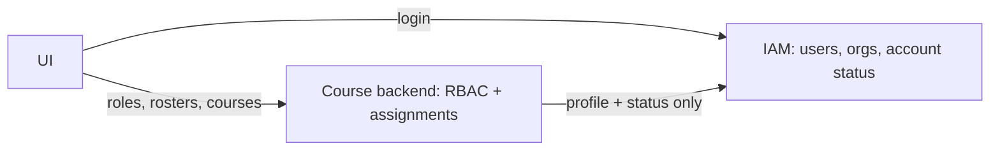

# Majestic Warhorse Backend — API Documentation

Complete reference for the **Majestic Logic** HTTP API (rosters, RBAC, courses, files, library, chat).

- **Base URL (local):** `http://localhost:{PORT}` (default `8080` / `8081` from `.env`)
- **IAM service (external):** see [service_architecture/IAM-ARCHITECTURE.md](./service_architecture/IAM-ARCHITECTURE.md) — FE uses `environment.iamApi`
- **Interactive docs:** `GET /api-docs` (Swagger UI)
- **Content type:** `application/json` unless noted (`multipart/form-data` for file uploads)
- **Doc map:** [DOCUMENTATION-INDEX.md](./DOCUMENTATION-INDEX.md)

---

## Documentation set

| Document | Audience | Contents |
|----------|----------|----------|
| **[API_DOCUMENTATION.md](./API_DOCUMENTATION.md)** *(this file)* | Backend + FE integrators | Endpoints, payloads, **FE usage map**, **AI MVP API diffs** |
| **[FRONTEND-MVP.md](./FRONTEND-MVP.md)** | Frontend | Library + AI Mode checklist (pointers only) |
| **[ai-architecture/AI-MVP-SHARED-CONTRACT.md](./ai-architecture/AI-MVP-SHARED-CONTRACT.md)** | FE + Logic + Shared AI | Normative Library/Chat MVP contract |
| **[workflow/UI_WORKFLOW.md](./workflow/UI_WORKFLOW.md)** | Frontend / UI | Screens, flows, which API when |
| **[service_architecture/LEARNING_ARCHITECTURE.md](./service_architecture/LEARNING_ARCHITECTURE.md)** | Architects | Majestic Logic / learning domain |
| **[service_architecture/](./service_architecture/)** | Architects | IAM / Learning / Shared AI ownership |

> Do not copy full architecture into this file — link to `service_architecture/` and the shared AI contract.

---

## Table of contents

| Section | Path prefix |
|---------|-------------|
| [Frontend API usage map](#frontend-api-usage-map) | FE ↔ Logic / IAM |
| [AI MVP API changes](#ai-mvp-api-changes) | Library + Chat diffs |
| [Authentication & IAM](#authentication--iam) | — |
| [Architecture & data model](#architecture--data-model) | — |
| [IAM sync (identity only)](#iam-sync-identity-only) | — |
| [User roles (RBAC)](#user-roles-rbac--user-role) | `/user-role` |
| [General](#general) | — |
| [Health Check](#health-check) | `/health-check` |
| [Courses](#courses--course) | `/course` |
| [Chapters](#chapters--chapter) | `/chapter` |
| [Files](#files--file) | `/file` |
| [Status](#status--status) | `/status` |
| [Dashboard](#dashboard--dashboard) | `/dashboard` |
| [Questions](#questions--question) | `/question` |
| [Answers](#answers--answer) | `/answer` |
| [Publish teacher feedback](#publish-teacher-feedback--answers) | `/answers` |
| [Chat (AI Mode)](#chat-ai-mode--chat) | `/chat` |
| [Favorites](#favorites--favorites) | `/favorites` |
| [Teachers roster](#teachers-roster--teachers) | `/teachers` |
| [Students roster](#students-roster--students) | `/students` |
| [Course discussions](#course-discussions--discussion) | `/discussion` |
| [Organization branding](#organization-branding--branding) | `/branding` |
| [Teacher–Students assignments](#teacherstudents--teacher-students) | `/teacher-students` |
| [HTTP status codes](#http-status-codes) | — |

---

## Frontend API usage map

Observed from Angular `src/` (`environment.majesticWarhorseApi` = **Logic**, `environment.iamApi` = **IAM**).  
Bearer JWT attached via `header.interceptor` for authenticated calls. Prefer this table over guessing unused backend routes.

### IAM (`environment.iamApi`)

| FE source | Method | Path | Notes |
|-----------|--------|------|-------|
| `auth.service.ts` | GET | `user/get` | Profile |
| `auth.service.ts` | POST | `user/login` | |
| `auth.service.ts` | POST | `user/forgot-password` | |
| `auth.service.ts` | POST | `user/confirm-password` | |
| `auth.service.ts` | PUT | `user/update` | |
| `registration-api.service.ts` | POST | `user/save` | |
| `user-oauth.service.ts` | GET | `user/get?email=` | OAuth sync |
| `user-oauth.service.ts` | POST | `user/sync` | |
| `organization-api.service.ts` | GET/POST/PUT | `organization/get`, `save`, `update`, `login`, `forgot-password`, `confirm-password`, `get-for-users` | |
| `organization-oauth.service.ts` | GET/POST | `organization/get?email=`, `organization/sync` | |
| `application-api.service.ts` | GET | `application/get` | |
| `common-api.service.ts` | DELETE | `user/delete` | |
| `health-check.service.ts` | GET | `health` / `application/get` | Probes |

### Logic (`environment.majesticWarhorseApi`)

| FE source | Method | Path | Notes |
|-----------|--------|------|-------|
| `common-api.service.ts` | POST | `file/upload` | Course / general uploads |
| `library.service.ts` | POST | `file/upload` | Library: `library_files=true`, `bucket_name=library`, `visibility` |
| `library.service.ts` | GET | `file/library` | List + **poll ingest status** |
| `library.service.ts` | DELETE | `file/library/:id` | |
| `file-download-api.service.ts` | POST | `file/get-blob` | |
| `chat-api.service.ts` | POST | `chat` | AI ask (`question`, optional `conversation_id`) |
| `chat-api.service.ts` | GET | `chat/conversations` | |
| `chat-api.service.ts` | GET | `chat/conversations/:id` | |
| `chat-api.service.ts` | DELETE | `chat/conversations/:id` | |
| `courses-api.service.ts` | GET/POST/PUT/DELETE | `course/*`, `status/*` | |
| `course-discussions-api.service.ts` | GET/POST | `discussion/get`, `discussion/save` | |
| `questionnaire-api.service.ts` | * | `question/*`, `answer/*`, `answers/*/feedback*` | |
| `students-api.service.ts` / `teachers-api.service.ts` | * | `students/*`, `teachers/*` | Roster |
| `user-role-api.service.ts` | GET/POST | `user-role/*` | |
| `favorites-api.service.ts` | * | `favorites/*` | |
| `branding-api.service.ts` | * | `branding/*` | |
| `dashboard.service.ts` | GET | `dashboard/get` | |
| `mail-api.service.ts` | POST | `mail/send-gmail` | |
| `assign-teacher.service.ts` | * | `teacher-students/*` | |
| `health-check.service.ts` | GET | `health` | Probe |

**Not called by FE (AI MVP):** `POST /file/ingest-status` (Shared AI → Logic only). Shared AI `/ingest` and `/ask` are Logic→AI only.

---

## AI MVP API changes

Normative detail: [AI-MVP-SHARED-CONTRACT.md](./ai-architecture/AI-MVP-SHARED-CONTRACT.md). Architecture: [AI-ARCHITECTURE.md](./service_architecture/AI-ARCHITECTURE.md). FE checklist: [FRONTEND-MVP.md](./FRONTEND-MVP.md).

| Area | Before (legacy / course-media style) | After (AI MVP — Phase 1) |
|------|--------------------------------------|---------------------------|
| Library list | Often `GET /file/get?bucket_name=library` or generic file lists | **`GET /file/library`** (preferred for Library UI) |
| Library delete | Generic `DELETE /file/delete/:id` | **`DELETE /file/library/:fileId`** |
| Library upload | `POST /file/upload` file only | Same path + **`library_files=true`** and/or **`bucket_name=library`** + **`visibility`** (+ optional `description`); JWT required |
| File model for AI | Docs historically mentioned `parentId` / `parentType` / file `role` / `r2Key` on library payloads | **Do not send** those on library/AI flows. Course media uses **`course_files` / `chapter_files`** junctions. Object path = **`storageKey`** |
| Ingest progress | N/A or direct AI polling | Logic sets `status`: `pending` → `processing` → `ready` \| `failed`. FE **re-lists** `/file/library`. **Never** call `/file/ingest-status` from browser |
| RAG corpus | — | Only `library_files=true` **and** `status=ready` (Phase 1). Course attachments = Phase 2 |
| Chat | — / stubs | **`POST /chat`** `{ question, conversation_id? }` + conversations CRUD. No chat file uploads for RAG |
| Auth body fields | Clients sometimes sent `organization_id` / `created_by` / uploader role | Logic resolves org/user/role from **JWT** |

Phase 2 (course files in RAG): [PHASE-2-COURSE-RAG.md](./ai-architecture/PHASE-2-COURSE-RAG.md) — **do not change** Phase 1 library rules until scheduled.

### UI quick reference (most-used)

**IAM service** (`{IAM_BASE_URL}` / `environment.iamApi`)

| UI screen | Method | Path | Headers |
|-----------|--------|------|---------|
| User login | `POST` | `/user/login` | `x-app-id`, `Content-Type` |
| Org login | `POST` | `/organization/login` | `x-app-id`, `Content-Type` |

**Logic** (`environment.majesticWarhorseApi`)

| UI screen | Method | Path | Headers |
|-----------|--------|------|---------|
| Library list / poll | `GET` | `/file/library` | `Authorization: Bearer` |
| Library upload | `POST` | `/file/upload` | Bearer + multipart (`library_files` / `bucket_name=library`, `visibility`) |
| Library delete | `DELETE` | `/file/library/:fileId` | Bearer |
| AI Mode ask | `POST` | `/chat` | Bearer |
| AI Mode history | `GET`/`DELETE` | `/chat/conversations[/:id]` | Bearer |
| Register / invite teacher | `POST` | `/teachers/save` | Bearer (IAM sync) |
| Register / invite student | `POST` | `/students/save` | Bearer (IAM sync) |
| Unapproved teachers | `GET` | `/teachers/get?organization_id=&status=pending&limit=&offset=` | — |
| Unapproved students | `GET` | `/students/get?organization_id=&status=pending&limit=&offset=` | — |
| Approve teacher | `PUT` | `/teachers/approve/:rosterRowId` | Bearer (IAM sync) |
| Approve student | `PUT` | `/students/approve/:rosterRowId` | Bearer (IAM sync) |
| User roles overview | `GET` | `/user-role/get-overview?organization_id=&user_id=` | — |
| Effective permissions | `GET` | `/user-role/permissions?organization_id=&user_id=` | — |
| Assign role (generic) | `POST` | `/user-role/save` | Bearer (IAM sync) |
| Assign students to teacher | `POST` | `/teacher-students/assign-students` | — |
| Student course feed | `GET` | `/course/student/:studentUserId?organization_id=` | — |
| Course discussions (list) | `GET` | `/discussion/get?course_id=&organization_id=` | — |
| Course discussions (post) | `POST` | `/discussion/save` | — |
| Create course | `POST` | `/course/save` | — |
| Get org branding | `GET` | `/branding/get?organization_id=` | — |
| Save org branding | `POST` | `/branding/save` | `organization_id` required |

See [workflow/UI_WORKFLOW.md](./workflow/UI_WORKFLOW.md) for step-by-step flows per role.

**ID convention:** `teacher_id`, `student_id`, and `createdBy` are **IAM user UUIDs**.  
Roster approve URLs use the roster row **`id`** from `GET /teachers/get` or `/students/get`.

When `IAM_SYNC_ENABLED=true`, register/approve syncs **account status and profile** to IAM only — **not app roles**. Roles live in `/user-role`. See [IAM sync (identity only)](#iam-sync-identity-only) and [User roles (RBAC)](#user-roles-rbac--user-role).

---

## Authentication & IAM

IAM platform detail: [service_architecture/IAM-ARCHITECTURE.md](./service_architecture/IAM-ARCHITECTURE.md).

| Service | Responsibility |
|---------|----------------|
| **IAM** | Login, JWT, users, organizations, account status, `applications` / `IAM_APP_ID` |
| **This backend (Logic)** | App roles, permissions, rosters, assignments, courses, library, chat proxy |

| Header | IAM | Logic |
|--------|-----|-------|
| `x-app-id` | Required on IAM calls | — |
| `Authorization: Bearer <jwt>` | IAM protected routes | Library / chat (+ forward on register/approve when `IAM_SYNC_ENABLED=true`) |
| `Content-Type: application/json` | POST/PUT bodies | POST/PUT bodies |

Org scoping: pass `organization_id` in query or body on course-backend calls.  
This backend does not enforce JWT today — protect via gateway in production.

**IAM endpoints used by this app** (full list in IAM doc):

| Method | Path | Purpose |
|--------|------|---------|
| POST | `/user/login` | User login → JWT |
| POST | `/organization/login` | Org login |
| POST | `/user/sync` | Find-or-create user (invite by email) |
| PUT | `/user/update` | Sync account status on approve |
| GET | `/user/get` | Verify user exists |

---

## Architecture & data model

### Ownership split

| Layer | IAM | This backend |
|-------|-----|--------------|
| Login, JWT | ✓ | — |
| Users & organizations | ✓ | — |
| Account status | ✓ (synced on approve) | `user_roles.status` |
| App roles (`teacher`, `student`, `org_admin`) | never | `app_roles` + `user_roles` |
| Permissions | — | `permissions` + `role_permissions` |
| Teacher ↔ student links | — | `teacher_students` |
| Courses | — | `courses`, chapters, Q&A |

A user can hold **multiple roles per organization** (`UNIQUE(organization_id, user_id, role_id)`).

### Migrations

| Script | Purpose |
|--------|---------|
| `scripts/add_organization_scoping.sql` | Org scoping, legacy roster tables |
| `scripts/add_rbac_tables.sql` | RBAC tables + migrate to `user_roles` |

### Core rules

1. Register via `/teachers/save`, `/students/save`, or `/user-role/save` → `status = pending`.
2. Org approves → `approved`; IAM account status → `active` when sync enabled.
3. Assignments link **IAM user ids** within the same `organization_id`.
4. Student course feed = courses where `created_by` ∈ assigned teachers AND same org.

### ID convention

| Field | Value |
|-------|--------|
| `teacher_id`, `student_id`, `createdBy`, `assigned_by` | IAM **user** uuid |
| Approve URLs (`/teachers/approve/:id`, etc.) | `user_roles` row **id** |

### Seeded RBAC

**Roles:** `org_admin`, `teacher`, `student`  
**Permissions:** `roster.approve`, `assignment.manage`, `course.create`, `course.view_assigned`, …

---

## IAM sync (identity only)

Identity and authentication live in the **IAM service**. **Roles and permissions live in this backend** (`user_roles`, `app_roles`, `permissions`) — same split as TCM.



| Env variable | Purpose |
|--------------|---------|
| `IAM_BASE_URL` | IAM API root |
| `IAM_APP_ID` | `x-app-id` header |
| `IAM_SYNC_ENABLED` | Sync identity on register/approve |
| `IAM_SYNC_STRICT` | Fail local op if IAM fails |

**IAM receives:** user profile, organization id, account `status`  
**IAM does NOT receive:** `teacher`, `student`, or any app role

### Register / approve

Same as before for `/teachers/save` and `/students/save` (wrappers around `user_roles`).
Also available generically via `POST /user-role/save` with `role_code`.

On approve, only IAM **account** status is updated (`approved` → `active`). App roles (`teacher`, `student`) are stored only in `user_roles` on this backend.

**Headers:** forward `Authorization: Bearer <jwt>` on register/approve when sync is enabled.

| Roster status (`user_roles`) | IAM account status |
|---------------|-------------------|
| `pending` | `pending` |
| `approved` | `active` |
| `suspended` | `suspended` |

---

## User roles (RBAC) — `/user-role`

Org-scoped role assignments (TCM-style). A user can hold **multiple roles per org**
(e.g. teacher and student in the same school).

**User role object:**
```json
{
  "id": "uuid",
  "organization_id": "org-uuid",
  "user_id": "iam-user-uuid",
  "role_id": "uuid",
  "role_code": "teacher",
  "status": "pending",
  "created_at": "...",
  "updated_at": "..."
}
```

### List roles catalog
`GET /user-role/roles`

Returns seeded `org_admin`, `teacher`, `student`.

### List permissions catalog
`GET /user-role/permission-catalog`

### List user role assignments
`GET /user-role/get`

| Param | Description |
|-------|-------------|
| `organization_id` | Filter by org |
| `user_id` | Filter by IAM user |
| `role_code` | `teacher` \| `student` \| `org_admin` |
| `status` | `pending` \| `approved` \| `suspended` |
| `limit`, `offset` | Pagination |

### Role overview (multi-role user)
`GET /user-role/get-overview?organization_id=&user_id=`

```json
{
  "success": true,
  "data": [{
    "organization_id": "org-uuid",
    "user_id": "user-uuid",
    "roles": [
      { "id": "...", "role_code": "teacher", "status": "approved" },
      { "id": "...", "role_code": "student", "status": "pending" }
    ]
  }]
}
```

### Effective permissions for UI gating
`GET /user-role/permissions?organization_id=&user_id=`

Returns merged permissions from all **approved** roles (e.g. `course.create`, `roster.approve`).

### Assign a role
`POST /user-role/save`

```json
{
  "organization_id": "org-uuid",
  "user_id": "iam-user-uuid",
  "role_code": "teacher",
  "status": "pending"
}
```

Or invite by email (IAM sync): include `contact.email`, `first_name`, `last_name`.

### Approve user role
`PUT /user-role/approve/:id`

**Path:** `id` = user role row uuid.

**Headers:** `Authorization: Bearer <jwt>` when IAM sync is enabled.

**Body:** (optional; defaults to `approved`)
```json
{ "status": "approved" }
```

Syncs IAM account status only — not app role.

### Approve user roles (bulk)
`PUT /user-role/approve`

**Body:**
```json
{ "ids": ["user-role-uuid-1", "user-role-uuid-2"], "status": "approved" }
```

### Bulk assign roles
`POST /user-role/bulk-save`

**Body:**
```json
{ "organization_id": "org-uuid", "role_code": "student", "user_ids": ["u1", "u2"], "status": "pending" }
```

Does not sync to IAM per user — users must already exist in IAM, or use single `POST /user-role/save` with email.

### Remove user role
`DELETE /user-role/delete/:id`

> `/teachers/*` and `/students/*` are convenience wrappers — they read/write `user_roles` where `role_code` is `teacher` or `student`. Equivalent: `POST /user-role/save` with `"role_code": "teacher"`.

---

## General

### Standard response shapes

**Success (most endpoints):**
```json
{
  "success": true,
  "message": "Success",
  "data": {}
}
```

**Error:**
```json
{
  "success": false,
  "message": "Error description",
  "error": "Detailed error message"
}
```

**Notes:**
- Many endpoints accept both `snake_case` and `camelCase` field names where noted.
- Auth middleware is commented out in routes; user IDs are passed in body or query params.

---

## Health Check

| Method | Path | Description |
|--------|------|-------------|
| `ALL` | `/health-check` | Server health check |

**Response `200`:**
```json
{
  "timeZone": "2026-07-06T10:00:00.000Z",
  "code": 200,
  "message": "success"
}
```

---

## Root

| Method | Path | Description |
|--------|------|-------------|
| `GET` | `/` | App name (HTML) |
| `GET` | `/api-docs` | Swagger UI |

---

## Courses — `/course`

### Get all courses
`GET /course/get`

**Query params (optional):**
| Param | Type | Description |
|-------|------|-------------|
| `populateChapters` | boolean | Include chapter data |
| `populateFiles` | boolean | Include file data |

**Response `200`:** Array of course objects.
| `access` | enum | Filter by visibility: `public` or `private` |
| `organization_id` | uuid | Filter by organization |
| `createdBy` | uuid | Filter by creator user ID |

**Examples:**
- `GET /course/get?access=public`
- `GET /course/get?organization_id={org-uuid}&access=private`

**Response `200`:** Array of course objects.
**Response `200`:** Array of course objects (each includes `access`: `public` | `private`).
---

### Get course by ID
`GET /course/get/:id`

**Response `200`:** Single course object.

---

### Get courses for a student (assigned teachers' courses)
`GET /course/student/:studentId`

Returns the courses created by the teachers the student is assigned to. When
`organization_id` is supplied, results are limited to that organization.

**Query params (optional):**
| Param | Type | Description |
|-------|------|-------------|
| `organization_id` | uuid | Restrict to a single organization |

**Response `200`:** Array of course objects (empty array if the student has no assigned teachers).

---

### Create course (with chapters & files)
`POST /course/save`

**Body:** (`organization_id` is optional; stored on the course so it can be shown in a student's org-scoped feed)
```json
{
  "courseCoverImage": "https://...",
  "courseTitle": "Course title",
  "courseDescription": "Description",
  "createdBy": "user-uuid",
  "organization_id": "org-uuid",
  "chapterDetails": [
    {
      "chapterTitle": "Chapter 1",
      "attachments": [],
      "createdBy": "user-uuid",
      "files": [],
      "fileDetails": [
        {
          "description": "File description",
          "fileURL": "https://...",
          "fileName": "document.pdf"
        }
      ]
    }
  ]
}
```

**Response `200`:**
```json
{
  "success": true,
  "message": "Successfully added",
  "data": { }
}
```

---

### Update course
`PUT /course/update`

**Body:** (`organization_id` optional)
```json
{
  "id": "course-uuid",
  "courseCoverImage": "https://...",
  "courseTitle": "Updated title",
  "courseDescription": "Updated description",
  "createdBy": "user-uuid",
  "organization_id": "org-uuid",
  "chapterDetails": [
    {
      "id": "chapter-uuid",
      "chapterTitle": "Chapter title",
      "attachments": [],
      "createdBy": "user-uuid",
      "files": [],
      "fileDetails": [
        {
          "id": "file-uuid",
          "description": "...",
          "fileURL": "https://...",
          "fileName": "file.pdf",
          "createdBy": "user-uuid"
        }
      ]
    }
  ]
}
```

**Response `200`:**
```json
{
  "success": true,
  "message": "Course, chapters, and files updated successfully"
}
```

---

### Delete course
`DELETE /course/delete/:courseid`

**Response `200`:**
```json
{
  "success": true,
  "message": "Successfully deleted"
}
```

---

## Chapters — `/chapter`

### Get chapters
`GET /chapter/get`

**Response `200`:** Array of chapter objects (no `:id` route defined; returns all).

---

### Create chapter
`POST /chapter/save`

**Body:**
```json
{
  "chapterTitle": "Chapter title",
  "courseId": "course-uuid",
  "createdBy": "user-uuid",
  "attachments": [],
  "files": []
}
```

**Response `200`:**
```json
{
  "success": true,
  "message": "Successfully added",
  "data": { }
}
```

---

### Update chapter
`PUT /chapter/update`

**Body:** (must include `id`)
```json
{
  "id": "chapter-uuid",
  "chapterTitle": "Updated title",
  "courseId": "course-uuid",
  "createdBy": "user-uuid",
  "attachments": [],
  "files": ["file-uuid"]
}
```

**Response `200`:**
```json
{
  "success": true,
  "message": "Successfully updated"
}
```

---

### Delete chapter
`DELETE /chapter/delete/:chapterid`

**Response `200`:**
```json
{
  "success": true,
  "message": "Successfully deleted"
}
```

---

## Files — `/file`

Object storage (R2 / S3-compatible). Upload returns a public CDN URL (and library metadata when applicable).

**AI MVP:** Library UI must use `/file/library` + library upload fields. Do **not** send `parentId` / `parentType` / file `role` / `r2Key` on library flows. Full contract: [AI-MVP-SHARED-CONTRACT.md](./ai-architecture/AI-MVP-SHARED-CONTRACT.md). Diffs: [AI MVP API changes](#ai-mvp-api-changes).

### Library list (preferred for Library UI)
`GET /file/library` — **JWT required**

Returns library files filtered for the caller (`visibility` + org). Includes `status`, `storageKey`, `visibility`.

FE polls this while any file is `pending` / `processing` (never call `/file/ingest-status`).

---

### Library delete
`DELETE /file/library/:fileId` — **JWT required**

Deletes DB row + storage object. Chunks cascade when configured (`document_chunks.file_id` ON DELETE CASCADE).

---

### List files (storage bucket)
`GET /file/get`

**Response `200`:** Array of `{ key, lastModified, size, url }`.

> Prefer **`GET /file/library`** for the Library page.

---

### Get / stream file by ID
`GET /file/get/:fileId`

Streams file content. Videos are streamed inline; other files are downloaded.

---

### Fetch file blob by URL
`POST /file/get-blob`

**Body:**
```json
{
  "fileUrl": "https://..."
}
```

**Response:** Binary stream with appropriate `Content-Type`.

---

### Save file metadata (database record)
`POST /file/save`

Used for course/chapter media metadata (not the Library RAG path). Course links use junction tables `course_files` / `chapter_files` — **not** `parentId` / `parentType` on `files` for AI.

**Body (legacy shape may still appear in older clients):**
```json
{
  "description": "File description",
  "fileURL": "https://...",
  "fileName": "document.pdf",
  "createdBy": "user-uuid"
}
```

> **AI MVP:** Do not rely on `parentId` / `parentType` for library or RAG. Progress/`statuses` may still use parent fields for course completion — unrelated to AI.

**Response `200`:**
```json
{
  "success": true,
  "message": "Successfully added",
  "data": { }
}
```

---

### Upload file to storage
`POST /file/upload`

**Content-Type:** `multipart/form-data`

| Field | Type | Description |
|-------|------|-------------|
| `file` | file | Required |
| `bucket_name` | string | e.g. `course`, or `library` for Library RAG |
| `library_files` | string/bool | `true` for Library / RAG ingest |
| `visibility` | string | `organization` \| `teacher` \| `student` \| `private` (library; default `private`) |
| `description` | string | Optional (library) |

**JWT required** when uploading as a library file.

**Response `200` (library example):**
```json
{
  "message": "Library file uploaded successfully",
  "key": "library/....",
  "url": "https://...",
  "data": { }
}
```

Logic then calls Shared AI `/ingest` when AI is enabled. FE must not call Shared AI.

---

### Ingest status callback (Shared AI → Logic only)
`POST /file/ingest-status`

**Not for browsers.** Optional shared secret. Updates `files.status` to `ready` or `failed`.

---

### Update file in storage
`PUT /file/update/:fileId`

**Content-Type:** `multipart/form-data`

| Field | Type | Description |
|-------|------|-------------|
| `file` | file | Replacement file |

**Response `200`:**
```json
{
  "message": "File updated successfully"
}
```

---

### Delete file from storage
`DELETE /file/delete/:fileId`

Generic delete. Library UI should prefer **`DELETE /file/library/:fileId`**.

**Response `200`:**
```json
{
  "message": "File deleted successfully"
}
```

---

## Status — `/status`

### Get statuses
`GET /status/get`

**Response `200`:** Array of status objects.

---

### Get status overview
`GET /status/get-overview`

**Response `200`:** Status overview aggregate data.

---

### Create status
`POST /status/save`

**Body:**
```json
{
  "parentId": "course-or-chapter-uuid",
  "parentType": "Course",
  "percentage": "75",
  "comment": "Progress comment",
  "rating": 4,
  "reward": 10,
  "createdBy": "user-uuid"
}
```

`parentType`: `"Course"` | `"Chapter"` | `"File"`

**Response `200`:**
```json
{
  "success": true,
  "message": "Successfully added",
  "data": { }
}
```

---

### Update status
`PUT /status/update`

**Body:** Full status object including `id`.

**Response `200`:**
```json
{
  "success": true,
  "message": "Successfully updated"
}
```

---

### Delete status
`DELETE /status/delete/:statusid`

**Response `200`:**
```json
{
  "success": true,
  "message": "Successfully deleted"
}
```

---

## Dashboard — `/dashboard`

### Get dashboard overview
`GET /dashboard/get`

**Query params:**
| Param | Type | Description |
|-------|------|-------------|
| `isAdmin` | boolean | Admin dashboard stats |
| `isTeacher` | boolean | Teacher dashboard stats |
| `id` | string | User ID (required for teacher/student) |

**Admin response:**
```json
{
  "totalCourses": 10
}
```

**Teacher response:**
```json
{
  "uploadedCourses": 5,
  "assignedStudents": 20,
  "taskSubmitted": 15,
  "courseCompleted": 8
}
```

**Student response:**
```json
{
  "totalCourses": 10,
  "completedCourses": 3,
  "coursesVisited": 7,
  "taskSubmitted": 5
}
```

---

## Questions — `/question`

### Get questions
`GET /question/get`

**Response `200`:** Array of question objects.

---

### Create question
`POST /question/save`

**Body:**
```json
{
  "course_id": "course-uuid",
  "question": "What is HTML?",
  "type": "Textbox",
  "options": [
    { "label": "Option A", "value": "a" }
  ],
  "created_by": "user-uuid"
}
```

`type` examples: `"Textbox"`, `"SingleChoice"`, `"Checkbox"`

**Response `200`:**
```json
{
  "success": true,
  "message": "Successfully added",
  "data": { }
}
```

---

### Update question
`PUT /question/update/:questionId`

**Body:** Question fields to update.

**Response `200`:**
```json
{
  "success": true,
  "message": "Successfully updated"
}
```

---

### Delete question
`DELETE /question/delete/:questionid`

**Response `200`:**
```json
{
  "success": true,
  "message": "Successfully deleted"
}
```

---

## Answers — `/answer`

PostgreSQL-backed. Supports single-choice (string) and checkbox (JSON string) answers.

### Get answers
`GET /answer/get`  
`GET /answer/get/:id`

**Query params (optional filters):**
| Param | Aliases | Description |
|-------|---------|-------------|
| `submitted_by` | `submittedBy` | Filter by user |
| `course_id` | `courseId` | Filter by course |
| `question_id` | `questionId` | Filter by question |

Each answer row includes a `version` integer (starts at `1` on first save; increments on each successful update / retry).

**Response `200`:**
```json
{
  "success": true,
  "message": "Success",
  "data": [
    {
      "id": "answer-uuid",
      "course_id": "course-uuid",
      "question_id": "question-uuid",
      "answer": "\"Option A\"",
      "submitted_by": "user-uuid",
      "version": 1,
      "creation_date": "2026-08-09T20:00:00.000Z",
      "modification_date": "2026-08-09T20:00:00.000Z"
    }
  ]
}
```

---

### Get answer history
`GET /answer/history`

Returns prior answer versions for a student+course (same idea as feedback history). Prefer this for attempt rows after retries.

**Query params:**
| Param | Required | Description |
|-------|----------|-------------|
| `course_id` | Yes | Course id |
| `submitted_by` | Yes | Student IAM user id |

**Response `200`:**
```json
{
  "success": true,
  "message": "Success",
  "data": [
    {
      "id": "answer-uuid",
      "course_id": "course-uuid",
      "question_id": "question-uuid",
      "answer": "\"first attempt\"",
      "submitted_by": "user-uuid",
      "version": 1,
      "creation_date": "2026-08-09T20:00:00.000Z",
      "modification_date": "2026-08-09T20:00:00.000Z"
    },
    {
      "id": "answer-uuid",
      "course_id": "course-uuid",
      "question_id": "question-uuid",
      "answer": "\"retry attempt\"",
      "submitted_by": "user-uuid",
      "version": 2,
      "creation_date": "2026-08-09T20:00:00.000Z",
      "modification_date": "2026-08-09T21:30:00.000Z"
    }
  ]
}
```

Alternate grouped shape also accepted by the client:

```json
{
  "success": true,
  "data": {
    "attempts": [
      {
        "version": 1,
        "submitted_at": "2026-08-09T20:00:00.000Z",
        "answers": [{ "id": "…", "question_id": "…", "answer": "\"…\"" }]
      }
    ]
  }
}
```

---

### Save answer(s)
`POST /answer/save`

**Single answer body:**
```json
{
  "course_id": "course-uuid",
  "question_id": "question-uuid",
  "answer": "\"Option A\"",
  "submitted_by": "user-uuid",
  "version": 1
}
```

**Bulk save body** (array of answer objects):
```json
[
  {
    "course_id": "course-uuid",
    "question_id": "question-uuid",
    "answer": "\"Answer 1\"",
    "submitted_by": "user-uuid",
    "version": 1
  },
  {
    "course_id": "course-uuid",
    "question_id": "question-uuid-2",
    "answer": "[\"Option1\", \"Option2\"]",
    "submitted_by": "user-uuid",
    "version": 1
  }
]
```

**Answer format:**
- Single choice: JSON-encoded string, e.g. `"\"Option A\""`
- Checkbox: JSON array string, e.g. `"[\"Option1\", \"Option2\"]"`

`version` is optional on create; backend should default to `1` and snapshot history.

**Response `201` (single):**
```json
{
  "success": true,
  "message": "Successfully added",
  "data": { }
}
```

**Response `201` (bulk):**
```json
{
  "success": true,
  "message": "Saved 5 answer(s)",
  "data": {
    "saved": [],
    "failed": []
  }
}
```

---

### Update answer
`PUT /answer/update`

Used for student retry. Each successful update increments `version` and appends a history snapshot.

**Body:**
```json
{
  "id": "answer-uuid",
  "course_id": "course-uuid",
  "question_id": "question-uuid",
  "answer": "\"Updated answer\"",
  "submitted_by": "user-uuid",
  "version": 2,
  "expected_version": 1
}
```

| Field | Required | Description |
|-------|----------|-------------|
| `version` | No | Next version the client expects to write (typically `current + 1`) |
| `expected_version` | No | Optimistic lock; mismatch → `409` |

**Response `200`:**
```json
{
  "success": true,
  "message": "Successfully updated",
  "data": { }
}
```

---

### Delete answer
`DELETE /answer/delete/:answerid`

**Response `200`:**
```json
{
  "success": true,
  "message": "Successfully deleted"
}
```

---

## Publish teacher feedback — `/answers`

Corporate assessment feedback for a learner. Path `studentUserId` is the **IAM user id**. JWT required (`teacher` or `organization`). Prefer org/user from JWT; never trust body org alone.

Schema: `scripts/create_answer_feedback_table.sql` — one `answer_feedback` row with JSONB `review` / `item_feedback` (and optional `assessment`, `notifications`, `metadata`).

### Publish feedback
`PUT /answers/:studentUserId/feedback`

**Auth:** `Authorization: Bearer` — role must be `teacher` or `organization`.

**Request body:**
```json
{
  "organization_id": "org-uuid",
  "reviewed_by_user_id": "teacher-iam-uuid",
  "reviewed_by_role": "teacher",
  "reviewed_by_display_name": "Sara Khan",
  "course_id": "course-uuid",
  "submission_id": null,
  "assessment": {
    "attempt_number": 1,
    "submitted_at": "2026-08-08T14:22:10.000Z",
    "locale": "en-GB"
  },
  "review": {
    "outcome": "pass",
    "grade_code": "PASS",
    "score": { "earned": 18, "max": 20, "percent": 90, "scale": "points" },
    "summary": "Strong overall performance.",
    "private_notes": "Optional teacher-only note",
    "visibility": "student_visible",
    "requires_resubmission": false,
    "resubmission_due_at": null
  },
  "item_feedback": [
    {
      "question_id": "question-uuid",
      "answer_id": "answer-uuid",
      "status": "correct",
      "earned_score": 5,
      "max_score": 5,
      "teacher_comment": "Good work.",
      "corrected_answer": { "type": "single_choice", "value": "Option A" },
      "tags": []
    }
  ],
  "notifications": {
    "notify_student": true,
    "channels": ["in_app"]
  },
  "metadata": {
    "source": "web.teacher_review",
    "client_request_id": "req-abc123",
    "reviewed_at": "2026-08-08T15:49:56.781Z",
    "expected_version": 1
  }
}
```

| Field | Required | Notes |
|-------|----------|-------|
| `organization_id` | Yes | Org scope; must match JWT org |
| `reviewed_by_user_id` | Yes | Reviewer IAM user id (teacher / organization account) |
| `reviewed_by_role` | Yes | e.g. `teacher` \| `organization` |
| `reviewed_by_display_name` | Yes | Display name stored for audit / student-facing attribution |
| `course_id` | Yes | Course scope; must belong to JWT org |
| `submission_id` | No | Optional; omit/`null` until attempts exist — scopes one feedback stream per student+course |
| `review.outcome` | Yes | `pass` \| `fail` \| `distinction` \| `incomplete` \| `needs_resubmission` |
| `review.summary` | Yes | Student-facing overall comment |
| `review.visibility` | Yes | `student_visible` \| `internal_only` |
| `item_feedback[]` | Yes | Array (one entry per answered question when available) |
| `metadata.expected_version` | No | Optimistic lock; mismatch → `409` |

Reviewer fields are sent in the body and should align with the authenticated JWT user.

When `notifications.notify_student` is `true` and visibility is `student_visible`, Logic looks up the learner email in IAM and sends Gmail. Email failure is reported in `data.notification` but does **not** roll back publish.

**Response `200`:**
```json
{
  "success": true,
  "message": "Feedback published",
  "data": {
    "feedback_id": "uuid",
    "student_user_id": "uuid",
    "organization_id": "uuid",
    "course_id": "uuid",
    "submission_id": null,
    "status": "published",
    "review": {},
    "item_feedback_count": 3,
    "reviewed_by": {
      "user_id": "uuid",
      "role": "teacher",
      "display_name": "Sara Khan"
    },
    "published_at": "2026-08-08T15:50:01.120Z",
    "version": 1,
    "notification": { "emailed": true }
  }
}
```

**Errors:** `400` validation, `401` auth, `403` not allowed / org mismatch, `404` course or student answers missing, `409` version conflict.

---

## Chat (AI Mode) — `/chat`

JWT required on all routes. Org/user from JWT. Proxies questions to the Shared AI service when `AI_ENABLED=true`.

**Contract:** [AI-MVP-SHARED-CONTRACT.md](./ai-architecture/AI-MVP-SHARED-CONTRACT.md) §3  
**FE:** `chat-api.service.ts` — body is `question` + optional `conversation_id` only (no chat file uploads for RAG).

### Ask
`POST /chat`

**Body:**
```json
{
  "question": "What is covered in module 1?",
  "conversation_id": "optional-uuid"
}
```

**Response `200`:** `conversation_id`, `answer`, `citations[]`, optional persisted `message`.

### List conversations
`GET /chat/conversations`

### Get conversation (+ messages)
`GET /chat/conversations/:id`

### Delete conversation
`DELETE /chat/conversations/:id`

---

## Organization branding — `/branding`

Per-organization white-label theme (app name, logo, favicon, color tokens).  
`organization_id` is **always required** (IAM organization UUID). One row per organization.

**Table:** `organization_branding` (see `scripts/create_organization_branding_table.sql` in the backend repo).

### Get branding
`GET /branding/get?organization_id=`

| Param | Required | Notes |
|-------|----------|-------|
| `organization_id` | **Yes** | IAM org UUID |

**Response `200` (exists):**
```json
{
  "success": true,
  "message": "Branding found",
  "data": {
    "id": "uuid",
    "organization_id": "org-uuid",
    "app_name": "My Academy",
    "tagline": "Learn with us",
    "logo_url": "https://…/logo.png",
    "favicon_url": "https://…/favicon.png",
    "colors": {
      "surface": "#131316",
      "primaryContainer": "#ff6b2c"
    },
    "created_at": "…",
    "updated_at": "…"
  }
}
```

**Response `200` (none saved):**
```json
{
  "success": true,
  "data": null,
  "message": "No branding saved for this organization"
}
```

Frontend treats `data: null` as **use Majestic defaults**.

**Response `400`:** missing `organization_id`.

### Save branding
`POST /branding/save`

**Body** (`organization_id` and `app_name` required; camelCase aliases also accepted):

```json
{
  "organization_id": "org-uuid",
  "app_name": "My Academy",
  "tagline": "Learn with us",
  "logo_url": "…",
  "favicon_url": "…",
  "colors": {
    "surface": "#131316",
    "surfaceContainer": "#1f1f22",
    "primaryContainer": "#ff6b2c",
    "gradientStart": "#ff6b2c",
    "gradientMid": "#ab0063",
    "gradientEnd": "#4a0084"
  }
}
```

Upserts by `organization_id`. **Response `200`:** `{ success: true, message: "Branding saved", data: { … } }`.

### Delete branding
`DELETE /branding?organization_id=`

Removes the row so clients fall back to defaults. **Response `200`:** `{ success: true, data: { deleted: true|false } }`.

---

## Favorites — `/favorites`

### Get user favorites
`GET /favorites/get`  
`GET /favorites/`

**Query params:**
| Param | Aliases | Required |
|-------|---------|----------|
| `user_id` | `userId` | Yes |

**Response `200`:**
```json
{
  "success": true,
  "data": []
}
```

Includes course details when available.

---

### Check if course is favorited
`GET /favorites/check`

**Query params:**
| Param | Required |
|-------|----------|
| `course_id` | Yes |
| `user_id` / `userId` | Yes |

**Response `200`:**
```json
{
  "success": true,
  "data": { }
}
```

---

### Add favorite
`POST /favorites/save`

**Body:**
```json
{
  "userId": "user-uuid",
  "courseId": "course-uuid"
}
```

Also accepts `user_id` / `course_id`.

**Response `201`:**
```json
{
  "success": true,
  "data": { }
}
```

**Response `409`:** Course already in favorites.

---

### Remove favorite by course
`DELETE /favorites/course/:course_id`

**Query params:** `user_id` required (unless auth token present).

**Response `200`:**
```json
{
  "success": true,
  "message": "Removed from favorites"
}
```

---

### Remove favorite by ID
`DELETE /favorites/:id`

**Response `200`:**
```json
{
  "success": true,
  "message": "Removed from favorites"
}
```

### List discussions
`GET /discussion/get`

**Query params:**

| Param | Required | Description |
|-------|----------|-------------|
| `course_id` | Yes | Course UUID |
| `chapter_id` | No | Filter to one chapter |
| `organization_id` | No | Filter by organization |

**Response `200`:**
```json
{
  "success": true,
  "data": [
    {
      "id": "discussion-uuid",
      "course_id": "course-uuid",
      "chapter_id": "chapter-uuid",
      "organization_id": "org-uuid",
      "comment": "The lighting breakdown really helped.",
      "created_by": "user-uuid",
      "created_at": "2026-07-16T12:00:00.000Z",
      "updated_at": "2026-07-16T12:00:00.000Z"
    }
  ]
}
```

**Response `404`:** Course not found (Angular client treats as empty list).

---

### Create discussion
`POST /discussion/save`

**Body:**
```json
{
  "course_id": "course-uuid",
  "chapter_id": "chapter-uuid",
  "organization_id": "org-uuid",
  "comment": "My comment text",
  "created_by": "user-uuid"
}
```

| Field | Required | Notes |
|-------|----------|-------|
| `course_id` | Yes | Must reference an existing course |
| `comment` | Yes | Non-empty after trim |
| `created_by` | Yes | IAM user UUID |
| `chapter_id` | No | Must belong to `course_id` when provided |
| `organization_id` | No | From org login / session |

**Response `201`:**
```json
{
  "success": true,
  "data": {
    "id": "discussion-uuid",
    "course_id": "course-uuid",
    "chapter_id": "chapter-uuid",
    "organization_id": "org-uuid",
    "comment": "My comment text",
    "created_by": "user-uuid",
    "created_at": "2026-07-16T12:05:00.000Z",
    "updated_at": "2026-07-16T12:05:00.000Z"
  }
}
```

**Response `400`:** Missing/blank `comment`, invalid `chapter_id` for course.

**Response `404`:** Course not found.

---

### Delete discussion (soft)
`DELETE /discussion/delete/:id`

Sets `deleted_at = NOW()`. Optional for v1 UI; included for moderation.

**Response `200`:**
```json
{
  "success": true,
  "message": "Discussion deleted"
}
```

**Response `404`:** Discussion not found or already deleted.

---

---

## Teachers roster — `/teachers`

Convenience API for the **teacher** role. Backed by `user_roles` where
`app_roles.code = 'teacher'`. For multi-role users or generic assignment, prefer
[`/user-role`](#user-roles-rbac--user-role).

Org-scoped. A user can be a teacher in many organizations. `status`:
`pending` | `approved` | `suspended` (default `pending`).

**Teacher object:**
```json
{
  "id": "uuid",
  "organization_id": "org-uuid",
  "user_id": "iam-user-uuid",
  "status": "pending",
  "created_at": "2026-07-06T10:00:00.000Z",
  "updated_at": "2026-07-06T10:00:00.000Z"
}
```

### List teachers (paginated)
`GET /teachers/get`

**Query params (optional):**
| Param | Type | Description |
|-------|------|-------------|
| `organization_id` | uuid | Filter by organization |
| `user_id` | uuid | Filter by IAM user (across orgs) |
| `status` | enum | `pending` \| `approved` \| `suspended` (e.g. `status=pending` for the unapproved list) |
| `limit` | int | Page size (default 50, max 500) |
| `offset` | int | Rows to skip (default 0) |

**Response `200`:**
```json
{
  "success": true,
  "message": "Success",
  "data": [ /* Teacher[] */ ],
  "pagination": { "limit": 50, "offset": 0, "total": 128 }
}
```

### Get teacher by ID
`GET /teachers/get/:id`

### Register a teacher
`POST /teachers/save`

**Headers:** `Authorization: Bearer <jwt>` when `IAM_SYNC_ENABLED=true`.

**Body:** (`status` optional, defaults to `pending`)

Either an existing IAM user id **or** email (for IAM sync / invite):

```json
{
  "organization_id": "org-uuid",
  "user_id": "iam-user-uuid",
  "status": "pending",
  "first_name": "Jane",
  "last_name": "Doe",
  "contact": { "email": "jane@school.com", "phone": "+1..." }
}
```

When `IAM_SYNC_ENABLED=true`, send `Authorization: Bearer <jwt>` so the backend can call IAM.

**Response `201`:** `{ "success": true, "message": "Teacher registered successfully", "data": { /* Teacher */ } }`

### Register teachers (bulk)
`POST /teachers/save-bulk`

**Body:** (`user_ids` array; a bare array of user ids is also accepted)
```json
{ "organization_id": "org-uuid", "user_ids": ["u1", "u2"], "status": "pending" }
```
**Response `200`:**
```json
{
  "success": true,
  "message": "Teachers registered",
  "data": {
    "registered": [ /* newly inserted Teacher[] */ ],
    "summary": { "requested": 2, "inserted": 2, "skipped": 0 }
  }
}
```

### Approve a teacher
`PUT /teachers/approve/:id`

**Path:** `id` = roster row uuid (not IAM user id).

**Headers:** `Authorization: Bearer <jwt>` when IAM sync is enabled.

**Body:** (optional; defaults to `approved`)
```json
{ "status": "approved" }
```
**Response `200`:** `{ "success": true, "message": "Teacher status updated", "data": { /* Teacher */ } }`

### Approve teachers (bulk)
`PUT /teachers/approve`

**Headers:** `Authorization: Bearer <jwt>` when IAM sync is enabled.

**Body:** (`ids` array; a bare array is also accepted)
```json
{ "ids": ["teacher-row-uuid-1", "teacher-row-uuid-2"], "status": "approved" }
```
**Response `200`:**
```json
{
  "success": true,
  "message": "Teachers status updated",
  "data": { "updated": [ /* Teacher[] */ ], "summary": { "requested": 2, "updated": 2 } }
}
```

### Delete a teacher registry row
`DELETE /teachers/delete/:id`

---

## Students roster — `/students`

Convenience API for the **student** role. Backed by `user_roles` where
`app_roles.code = 'student'`. Same statuses and pagination as teachers. A user
can also hold the teacher role in the same org — see [`/user-role/get-overview`](#role-overview-multi-role-user).

**Student object:**
```json
{
  "id": "uuid",
  "organization_id": "org-uuid",
  "user_id": "iam-user-uuid",
  "status": "pending",
  "created_at": "2026-07-06T10:00:00.000Z",
  "updated_at": "2026-07-06T10:00:00.000Z"
}
```

**Status enum:** `pending` | `approved` | `suspended` (default `pending` on register).

### List students (paginated)
`GET /students/get`

**Query params (optional):**
| Param | Type | Description |
|-------|------|-------------|
| `organization_id` | uuid | Filter by organization |
| `user_id` | uuid | Filter by IAM user (across orgs) |
| `status` | enum | `pending` \| `approved` \| `suspended` |
| `limit` | int | Page size (default 50, max 500) |
| `offset` | int | Rows to skip (default 0) |

**Response `200`:**
```json
{
  "success": true,
  "message": "Success",
  "data": [ /* Student[] */ ],
  "pagination": { "limit": 50, "offset": 0, "total": 256 }
}
```

### Get student by ID
`GET /students/get/:id`

**Response `200`:** `{ "success": true, "message": "Success", "data": { /* Student */ } }`

### Register a student
`POST /students/save`

**Headers:** `Authorization: Bearer <jwt>` when `IAM_SYNC_ENABLED=true`.

**Body:** (`status` optional, defaults to `pending`)

Either `user_id` or `contact.email` (same shape as teachers):

```json
{
  "organization_id": "org-uuid",
  "user_id": "iam-user-uuid",
  "status": "pending",
  "first_name": "Alex",
  "last_name": "Smith",
  "contact": { "email": "alex@school.com" }
}
```

Also accepts `organizationId`, `userId`. Forward `Authorization: Bearer <jwt>` when IAM sync is enabled.

**Response `201`:**
```json
{
  "success": true,
  "message": "Student registered successfully",
  "data": { /* Student */ }
}
```

### Register students (bulk)
`POST /students/save-bulk`

**Body:**
```json
{ "organization_id": "org-uuid", "user_ids": ["u1", "u2"], "status": "pending" }
```

A bare array of user ids is also accepted when `organization_id` is passed separately.

**Response `200`:**
```json
{
  "success": true,
  "message": "Students registered",
  "data": {
    "registered": [ /* newly inserted Student[] */ ],
    "summary": { "requested": 2, "inserted": 2, "skipped": 0 }
  }
}
```

### Approve a student
`PUT /students/approve/:id`

**Path:** `id` = roster row uuid (not IAM user id).

**Headers:** `Authorization: Bearer <jwt>` when IAM sync is enabled.

**Body:** (optional; defaults to `approved`)
```json
{ "status": "approved" }
```

Use `"status": "suspended"` to suspend.

**Response `200`:**
```json
{
  "success": true,
  "message": "Student status updated",
  "data": { /* Student */ }
}
```

### Approve students (bulk)
`PUT /students/approve`

**Body:**
```json
{ "ids": ["roster-row-uuid-1", "roster-row-uuid-2"], "status": "approved" }
```

**Response `200`:**
```json
{
  "success": true,
  "message": "Students status updated",
  "data": {
    "updated": [ /* Student[] */ ],
    "summary": { "requested": 2, "updated": 2 }
  }
}
```

### Delete a student registry row
`DELETE /students/delete/:id`

**Response `200`:** `{ "success": true, "message": "Student removed successfully" }`

---

## Teacher–Students — `/teacher-students`

Links teachers to students within an organization. `teacher_id` and `student_id`
are **IAM user UUIDs** (not roster row ids). Optional `assigned_by` records who
performed the assignment (org admin or teacher user id). Assignments are
idempotent — existing pairs are skipped (`summary.skipped`).

**Relationship object:**
```json
{
  "id": "uuid",
  "teacher_id": "iam-teacher-user-uuid",
  "student_id": "iam-student-user-uuid",
  "organization_id": "org-uuid",
  "assigned_by": "iam-actor-user-uuid",
  "created_at": "2026-07-06T10:00:00.000Z",
  "updated_at": "2026-07-06T10:00:00.000Z"
}
```

### List relationships (paginated)
`GET /teacher-students/get`

**Query params (optional):** `organization_id`, `limit` (default 50, max 500), `offset`

**Response `200`:**
```json
{
  "success": true,
  "message": "Success",
  "data": [ /* relationships */ ],
  "pagination": { "limit": 50, "offset": 0, "total": 42 }
}
```

### Get relationship by ID
`GET /teacher-students/get/:id`

---

### Get students for a teacher
`GET /teacher-students/teacher/:teacherId/students`

**Query params (optional):** `organization_id`

---

### Get teachers for a student
`GET /teacher-students/student/:studentId/teachers`

**Query params (optional):** `organization_id`

---

### Get assigned teachers for a user
`GET /teacher-students/assigned-teachers/:user_id`

**Query params (optional):** `organization_id`

---

### Create relationship
`POST /teacher-students/save`

**Body:** (`organization_id`, `assigned_by` optional)
```json
{
  "teacher_id": "teacher-uuid",
  "student_id": "student-uuid",
  "organization_id": "org-uuid",
  "assigned_by": "actor-user-uuid"
}
```

**Response `201`:**
```json
{
  "success": true,
  "message": "Teacher-student relationship created successfully",
  "data": { }
}
```

---

### Assign teachers to students (bulk)
`POST /teacher-students/assign-teachers`

**Body:** (new shape; a bare array of assignments is still accepted for backward compatibility)
```json
{
  "organization_id": "org-uuid",
  "assigned_by": "actor-user-uuid",
  "assignments": [
    { "student_id": "student-uuid", "teacher_ids": ["teacher-uuid-1", "teacher-uuid-2"] }
  ]
}
```

**Response `200`:**
```json
{
  "success": true,
  "message": "Teachers assigned successfully",
  "data": {
    "assigned": [ /* newly created relationships */ ],
    "invalid": [],
    "summary": { "requested": 2, "inserted": 2, "skipped": 0 }
  }
}
```

---

### Unassign teachers from a student
`POST /teacher-students/unassign-teachers`

**Body:** (`organization_id` optional)
```json
{
  "student_id": "student-uuid",
  "unassign_teacher_ids": ["teacher-uuid-1"],
  "organization_id": "org-uuid"
}
```

**Response `200`:**
```json
{
  "success": true,
  "message": "Teachers unassigned successfully",
  "data": { "deletedCount": 1 }
}
```

---

### Assign students to teachers (bulk)
`POST /teacher-students/assign-students`

**Body:** (new shape; a bare array of assignments is still accepted)
```json
{
  "organization_id": "org-uuid",
  "assigned_by": "actor-user-uuid",
  "assignments": [
    { "teacher_id": "teacher-uuid", "student_ids": ["student-uuid-1", "student-uuid-2"] }
  ]
}
```

**Response `200`:**
```json
{
  "success": true,
  "message": "Students assigned successfully",
  "data": {
    "assigned": [ /* newly created relationships */ ],
    "invalid": [],
    "summary": { "requested": 2, "inserted": 2, "skipped": 0 }
  }
}
```

---

### Unassign students from a teacher
`POST /teacher-students/unassign-students`

**Body:** (`organization_id` optional)
```json
{
  "teacher_id": "teacher-uuid",
  "unassign_student_ids": ["student-uuid-1"],
  "organization_id": "org-uuid"
}
```

**Response `200`:**
```json
{
  "success": true,
  "message": "Students unassigned successfully",
  "data": { "deletedCount": 1 }
}
```

---

### Update relationship
`PUT /teacher-students/update/:id`

**Body:**
```json
{
  "teacher_id": "teacher-uuid",
  "student_id": "student-uuid"
}
```

---

### Delete relationship by ID
`DELETE /teacher-students/delete/:id`

---

### Delete all relationships for a teacher
`DELETE /teacher-students/teacher/:teacherId`

**Response `200`:**
```json
{
  "success": true,
  "message": "Deleted 3 teacher-student relationship(s)",
  "data": { "deletedCount": 3 }
}
```

---

### Delete all relationships for a student
`DELETE /teacher-students/student/:studentId`

---

### Delete specific teacher–student pair
`DELETE /teacher-students/teacher/:teacherId/student/:studentId`

---

## Endpoint summary (teacher–student module)

| Method | Path | Auth | Description |
|--------|------|------|-------------|
| GET | `/user-role/roles` | — | Role catalog |
| GET | `/user-role/permission-catalog` | — | Permission catalog |
| GET | `/user-role/get` | — | List user role assignments |
| GET | `/user-role/get-overview` | — | Multi-role overview per user |
| GET | `/user-role/permissions` | — | Effective permissions |
| POST | `/user-role/save` | Bearer* | Assign role |
| POST | `/user-role/bulk-save` | — | Bulk assign |
| PUT | `/user-role/approve/:id` | Bearer* | Approve role |
| PUT | `/user-role/approve` | Bearer* | Bulk approve |
| DELETE | `/user-role/delete/:id` | — | Remove role assignment |
| GET | `/teachers/get` | — | List teachers (wrapper) |
| POST | `/teachers/save` | Bearer* | Register teacher |
| PUT | `/teachers/approve/:id` | Bearer* | Approve teacher |
| GET | `/students/get` | — | List students (wrapper) |
| POST | `/students/save` | Bearer* | Register student |
| PUT | `/students/approve/:id` | Bearer* | Approve student |
| POST | `/teacher-students/assign-students` | — | Assign students to teachers |
| GET | `/course/student/:studentId` | — | Student course feed |

\*Bearer required when `IAM_SYNC_ENABLED=true` (forwarded to IAM).

---

## HTTP Status Codes

| Code | Meaning |
|------|---------|
| `200` | Success |
| `201` | Created |
| `400` | Bad request / validation error |
| `404` | Resource not found |
| `409` | Conflict (e.g. duplicate favorite) |
| `500` | Internal server error |

---

## Environment Variables (reference)

| Variable | Purpose |
|----------|---------|
| `PORT` | Server port |
| `IAM_BASE_URL` | IAM API root (default `http://localhost:5000/auth/api`) |
| `IAM_APP_ID` | `x-app-id` for IAM calls |
| `IAM_SYNC_ENABLED` | Sync identity on register/approve |
| `IAM_SYNC_STRICT` | Fail local op if IAM fails |
| `DATABASE_URL` | PostgreSQL (Supabase pooler) connection string |
| `DB_SSL` | Enable SSL for database (`true` for Supabase) |
| `SUPABASE_URL` | Supabase Storage S3 endpoint |
| `SUPABASE_ACCESS_ID` | Storage access key ID |
| `SUPABASE_ACCESS_KEY` | Storage secret access key |
| `SUPABASE_BUCKET_NAME` | Storage bucket name |
| `FILEUPLOADLIMIT` | Max upload size in GB |
