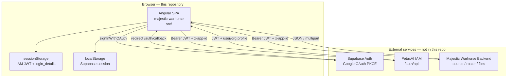
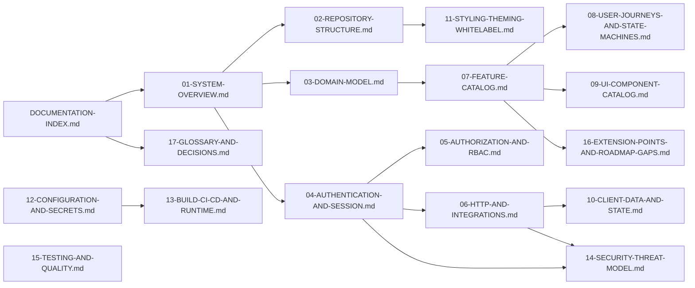
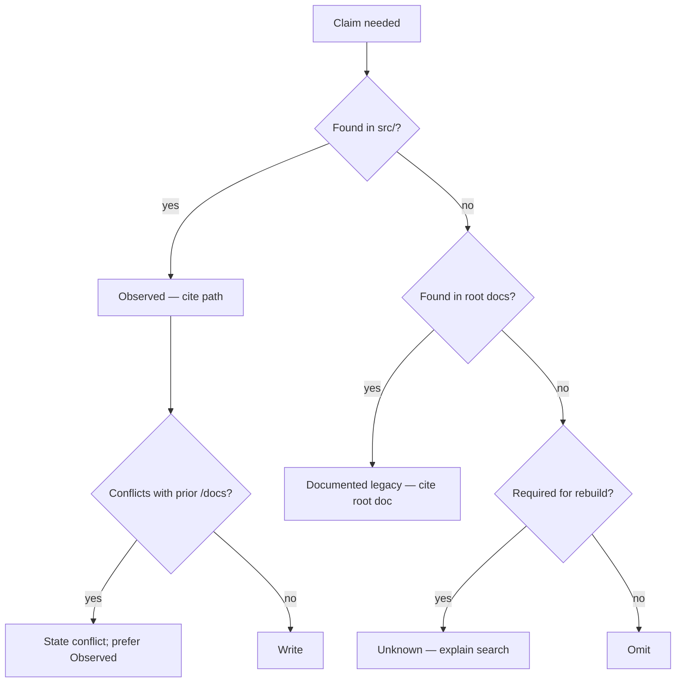

# Majestic Warhorse — Reverse-Engineering Documentation Program

**Document type:** Program charter and master index  
**Audience:** Successor engineering teams (frontend, backend integration, DevOps, security, product architecture)  
**Repository:** `majestic-warhorse` (Angular SPA frontend)  
**Status:** Active — documents are produced prompt-by-prompt into `/docs`  
**Cross-references:** [FRONTEND-ARCHITECTURE.md](./FRONTEND-ARCHITECTURE.md); root legacy set listed in [§4](#4-existing-documentation-inventory)

---

## 1. Purpose of this program

This program reconstructs **Majestic Warhorse** as if the original engineering team were writing the operating manuals for a successor team.

The goal is **not** a code review, a critique, or an executive summary. The goal is documentation that enables a new team to:

1. **Rebuild** the application (or a compatible replacement) from documented behaviour, contracts, and structure.
2. **Maintain** the running system without tribal knowledge.
3. **Extend** the product (certification, white-label, analytics, AI) without breaking undocumented invariants.

### What this repository is

| Fact | Evidence |
|------|----------|
| Product name in npm / Angular project | `package.json` → `"name": "majestic-warhorse"` |
| Runtime form | Browser SPA (Angular), built to `dist/` |
| Identity provider (shared) | External Node.js IAM under `{HOST}/auth/api` — see root [IAM_DOCUMENTATION.md](../IAM_DOCUMENTATION.md) |
| Domain API | External Majestic course backend — see root [API_DOCUMENTATION.md](../API_DOCUMENTATION.md) |
| Google OAuth broker | Supabase Auth (PKCE) — keys in `src/environments/` |
| Sister-product reference pattern | The Church Manager — see root [TCM_DOCUMENTATION.md](../TCM_DOCUMENTATION.md) |

**Assumption (labelled):** Majestic Warhorse is the learning-platform frontend in the PetaxAI family; IAM and the Python/Node course backend live in **other repositories**. This repo documents the **frontend** and **how it consumes** those services. Backend implementation details beyond what root API docs already contain are out of scope for code that is not present here.

### What this program will not do

- Invent backend behaviour that cannot be verified from this repo or from the committed root API documents.
- Treat design HTML under `src/assets/screens/` as runtime behaviour.
- Replace product vision docs (`USER_WORKFLOW.md`, `UI_WORKFLOW.md`) — those remain authoritative for intent; reverse-engineering docs remain authoritative for **what the code actually does**.

---

## 2. Governing rules (binding for all `/docs` reverse-engineering documents)

Every document produced under this program must obey:

| # | Rule | Implication |
|---|------|-------------|
| 1 | Never summarize | Prefer exhaustive tables, file inventories, sequence diagrams, and step lists over “high-level overviews” that omit behaviour. |
| 2 | Extremely detailed | Name files, folders, symbols, storage keys, HTTP paths, and branch conditions. |
| 3 | Read the codebase before writing | Claims about runtime behaviour cite paths under `src/` (or config at repo root). |
| 4 | Reference actual files and folders | Use repository-relative paths (e.g. `src/app/core/auth/post-login-workflow.service.ts`). |
| 5 | Explain WHY | Document design intent when evidence exists (comments, workflow docs, parallel patterns); otherwise label **Assumption**. |
| 6 | Label assumptions | Prefix with **Assumption:** or place under an “Assumptions” section. |
| 7 | Markdown | All deliverables are `.md` under `/docs`. |
| 8 | Mermaid whenever possible | Architecture, sequences, state machines, and dependency graphs. |
| 9 | Professional engineering tone | Operating manual, not blog post. |
| 10 | Filename from the prompt | Each generation prompt specifies the exact filename; do not invent alternate names without an index update. |
| 11 | Cross-reference prior docs | Link to previously generated `/docs` files and to root legacy docs when overlapping. |
| 12 | Unavailable → explain why | Do not guess; state what was searched and what was missing. |

### Evidence tiers (required labelling)

| Tier | Meaning | How to write |
|------|---------|--------------|
| **Observed** | Verified in this repo’s source or config | Cite path (and line range when practical) |
| **Documented (legacy)** | Stated in root `*_DOCUMENTATION.md` / workflow docs, not re-verified against a backend repo | Cite that document |
| **Assumption** | Reasonable inference needed for rebuildability | Mark explicitly; never present as fact |
| **Unknown** | Needed for rebuild but not findable | Explain search scope and gap |

---

## 3. System context — how the pieces fit



### Why the application is split this way

| Concern | Owner | Why (evidence + intent) |
|---------|-------|-------------------------|
| Login identity (email/password, Google sync) | IAM | Root [IAM_DOCUMENTATION.md](../IAM_DOCUMENTATION.md); frontend calls `user/login`, `organization/login`, `user/sync`, `organization/sync` |
| Multi-tenant app scoping | IAM `applications` + `x-app-id` / `client_id: majestic-warhorse` | `environment.ts`; `AppContextService`; `HeaderInterceptors` |
| Learning domain (courses, roster, Q&A) | Majestic backend | Root [API_DOCUMENTATION.md](../API_DOCUMENTATION.md); `src/app/services/api-service/*` |
| Google IdP | Supabase | `OAuthService` + `SupabaseService` — avoids embedding Google client secrets in the SPA |
| Presentation / UX | This Angular app | Entire `src/app/pages` and `src/app/components` |

**Assumption:** The Majestic backend trusts the IAM JWT (or performs its own validation). The frontend always attaches the same Bearer token via `HeaderInterceptors`. Exact server-side trust rules are **Documented (legacy)** in API docs, not re-implemented in this repo.

---

## 4. Existing documentation inventory

### 4.1 Generated under `/docs` (this program)

| File | Role | Status |
|------|------|--------|
| [DOCUMENTATION-INDEX.md](./DOCUMENTATION-INDEX.md) | Program charter + master index (this file) | **Current** |
| [FRONTEND-ARCHITECTURE.md](./FRONTEND-ARCHITECTURE.md) | Architect onboarding: Angular structure, auth, HTTP, gaps | **Current** (2026-07-24) |
| [01_Project_Overview.md](./01_Project_Overview.md) | Project purpose, users, stack, architecture, build/deploy | **Current** (2026-07-27) |
| [02_Folder_Structure.md](./02_Folder_Structure.md) | Every folder: purpose, files, deps, relationships, tree | **Current** (2026-07-27) |
| [03_System_Architecture.md](./03_System_Architecture.md) | End-to-end architecture: FE/BE/DB/auth/storage/infra + C4 diagrams | **Current** (2026-07-27) |
| [04_UI_Architecture.md](./04_UI_Architecture.md) | UI hierarchy, layouts, nav/routing, components, screens, patterns | **Current** (2026-07-27) |
| [05_AI_Tutor_Adaptive_Learning_Strategy.md](./05_AI_Tutor_Adaptive_Learning_Strategy.md) | AI Tutor pitch, market, competitors, diagnostic MVP, revenue, GCSE niche, roadmap | **Current** (2026-08-04) |
| [MAJESTIC_WARHORSE_PRD.md](./MAJESTIC_WARHORSE_PRD.md) | Full product requirements; §35 embeds strategy brief | **Current** |

**Naming note:** Prompt deliverable `01_Project_Overview.md` supersedes the planned placeholder name `01-SYSTEM-OVERVIEW.md` in §5 for reading-order item 01. Prompt deliverable `02_Folder_Structure.md` supersedes planned `02-REPOSITORY-STRUCTURE.md`. Prompt deliverable `03_System_Architecture.md` covers system/container architecture depth. Prompt deliverable `04_UI_Architecture.md` covers UI/component catalog depth (overlaps planned `09-UI-COMPONENT-CATALOG.md`). Strategy brief `05_AI_Tutor_Adaptive_Learning_Strategy.md` is product vision (not code-truth). Later docs should link to these delivered filenames.

### 4.2 Legacy / product documents at repository root

These were written for product and API consumers. They are **in scope as sources of intent and external contracts**, but they are **not** reverse-engineered from the Angular tree alone.

| File | Audience | Relationship to reverse-engineering |
|------|----------|-------------------------------------|
| [README.md](../README.md) | Developers | Stale Angular CLI version claim (says 16; `package.json` is Angular 18 / CLI 17). Contains EC2/NGINX deploy notes and a sample workflow that **differs** from `.github/workflows/main.yml` (e.g. README `SOURCE: "build/"` vs workflow `SOURCE: "dist/"`). |
| [UI_WORKFLOW.md](../UI_WORKFLOW.md) | Frontend builders | Authoritative **product flows** and which API to call per screen. Must be cross-checked against code when behaviour diverges. |
| [USER_WORKFLOW.md](../USER_WORKFLOW.md) | Non-technical / management | Product journey language; no API detail. |
| [API_DOCUMENTATION.md](../API_DOCUMENTATION.md) | Backend / integrators | Majestic course-backend contract. Frontend must conform; reverse-engineering docs map **which Angular services call which paths**. |
| [IAM_DOCUMENTATION.md](../IAM_DOCUMENTATION.md) | All | External IAM contract. |
| [TCM_DOCUMENTATION.md](../TCM_DOCUMENTATION.md) | Reference | Sister product (The Church Manager) — same IAM + local RBAC pattern. Useful for **why** Majestic looks similar; not Majestic runtime. |
| [src/assets/screens/DESIGN.md](../src/assets/screens/DESIGN.md) | Design | Visual token reference mirrored into `src/styles/_variables.scss` (`--mc-*`). |

### 4.3 Operational / build artefacts (not narrative docs)

| Path | Role |
|------|------|
| `angular.json` | Build targets, file replacements (`environment.ts` → `environment.prod.ts`), assets |
| `package.json` / `package-lock.json` | Dependencies and scripts |
| `tsconfig*.json` | TypeScript project references |
| `ngsw-config.json` | Service worker config (SW registration `enabled: false` in `AppModule`) |
| `.github/workflows/main.yml` | CI deploy to EC2 via SSH on `master` |
| `.eslintrc.json`, `.prettierrc`, `.editorconfig` | Lint/format |
| `design.xml` | Design system source artefact — mirrored into [`design_v1/`](./design_v1/README.md) (Batch 1 foundations); not imported by Angular build |

### 4.4 Design system — `/docs/design_v1` (Enterprise Bitcoin)

Product UI foundations. Prefer these over ad-hoc hex/spacing in new work. Root [`design.xml`](../design.xml) is the compact machine-readable twin.

Index: [`design_v1/README.md`](./design_v1/README.md)

**Batch 1 — Foundations (01–10)**

| File | Topic |
|------|-------|
| [01_COLOR_SYSTEM.md](./design_v1/01_COLOR_SYSTEM.md) | Palette, brand, semantics, gradients |
| [02_DESIGN_TOKENS.md](./design_v1/02_DESIGN_TOKENS.md) | Token catalog |
| [03_TYPOGRAPHY.md](./design_v1/03_TYPOGRAPHY.md) | Fonts and scale |
| [04_SPACING_SYSTEM.md](./design_v1/04_SPACING_SYSTEM.md) | 8pt grid |
| [05_GRID_SYSTEM.md](./design_v1/05_GRID_SYSTEM.md) | 12 / 8 / 4 columns |
| [06_BREAKPOINTS.md](./design_v1/06_BREAKPOINTS.md) | Responsive ranges |
| [07_RADIUS_SYSTEM.md](./design_v1/07_RADIUS_SYSTEM.md) | Corner radii |
| [08_SHADOWS_AND_GLOW.md](./design_v1/08_SHADOWS_AND_GLOW.md) | Orange / gold glow |
| [09_ELEVATION_SYSTEM.md](./design_v1/09_ELEVATION_SYSTEM.md) | Depth + glass |
| [10_ICONOGRAPHY.md](./design_v1/10_ICONOGRAPHY.md) | Lucide icons |

**Batch 2 — Layout System (11–17)**

| File | Topic |
|------|-------|
| [11_WEB_LAYOUT_SYSTEM.md](./design_v1/11_WEB_LAYOUT_SYSTEM.md) | Desktop shell |
| [12_MOBILE_LAYOUT_SYSTEM.md](./design_v1/12_MOBILE_LAYOUT_SYSTEM.md) | Mobile-first layouts |
| [13_DASHBOARD_LAYOUTS.md](./design_v1/13_DASHBOARD_LAYOUTS.md) | Dashboard grids |
| [14_ADMIN_LAYOUTS.md](./design_v1/14_ADMIN_LAYOUTS.md) | Admin shell |
| [15_AUTH_LAYOUTS.md](./design_v1/15_AUTH_LAYOUTS.md) | Auth pages |
| [16_SETTINGS_LAYOUTS.md](./design_v1/16_SETTINGS_LAYOUTS.md) | Settings |
| [17_DETAIL_PAGE_LAYOUTS.md](./design_v1/17_DETAIL_PAGE_LAYOUTS.md) | Detail pages |

**Batch 3 — Component System (18–37)**

| File | Topic |
|------|-------|
| [18_BUTTONS.md](./design_v1/18_BUTTONS.md) | Buttons |
| [19_CARDS.md](./design_v1/19_CARDS.md) | Cards |
| [20_INPUTS.md](./design_v1/20_INPUTS.md) | Inputs |
| [21_FORMS.md](./design_v1/21_FORMS.md) | Forms |
| [22_SELECTS_AND_DROPDOWNS.md](./design_v1/22_SELECTS_AND_DROPDOWNS.md) | Selects |
| [23_CHECKBOX_RADIO_SWITCH.md](./design_v1/23_CHECKBOX_RADIO_SWITCH.md) | Selection controls |
| [24_TABLES.md](./design_v1/24_TABLES.md) | Tables |
| [25_LISTS.md](./design_v1/25_LISTS.md) | Lists |
| [26_TABS.md](./design_v1/26_TABS.md) | Tabs |
| [27_BADGES_AND_TAGS.md](./design_v1/27_BADGES_AND_TAGS.md) | Badges |
| [28_MODAL_DIALOGS.md](./design_v1/28_MODAL_DIALOGS.md) | Modals |
| [29_DRAWERS_AND_SIDEPANELS.md](./design_v1/29_DRAWERS_AND_SIDEPANELS.md) | Drawers |
| [30_TOASTS_ALERTS.md](./design_v1/30_TOASTS_ALERTS.md) | Toasts |
| [31_SEARCH_FILTERS.md](./design_v1/31_SEARCH_FILTERS.md) | Search & filters |
| [32_DATE_TIME_COMPONENTS.md](./design_v1/32_DATE_TIME_COMPONENTS.md) | Date / time |
| [33_FILE_UPLOAD.md](./design_v1/33_FILE_UPLOAD.md) | File upload |
| [34_AVATARS.md](./design_v1/34_AVATARS.md) | Avatars |
| [35_EMPTY_STATES.md](./design_v1/35_EMPTY_STATES.md) | Empty states |
| [36_ERROR_STATES.md](./design_v1/36_ERROR_STATES.md) | Error states |
| [37_LOADING_SKELETONS.md](./design_v1/37_LOADING_SKELETONS.md) | Loading skeletons |

**Batch 4 — Navigation + Interaction (38–43)**

| File | Topic |
|------|-------|
| [38_HEADER_NAVIGATION.md](./design_v1/38_HEADER_NAVIGATION.md) | Header |
| [39_SIDEBAR_NAVIGATION.md](./design_v1/39_SIDEBAR_NAVIGATION.md) | Sidebar |
| [40_MOBILE_NAVIGATION.md](./design_v1/40_MOBILE_NAVIGATION.md) | Mobile nav |
| [41_MOTION_SYSTEM.md](./design_v1/41_MOTION_SYSTEM.md) | Motion |
| [42_MICRO_INTERACTIONS.md](./design_v1/42_MICRO_INTERACTIONS.md) | Micro-interactions |
| [43_HOVER_FOCUS_STATES.md](./design_v1/43_HOVER_FOCUS_STATES.md) | Interaction states |

**Batch 5 — Accessibility + Engineering + AI (44–50)**

| File | Topic |
|------|-------|
| [44_ACCESSIBILITY_WCAG.md](./design_v1/44_ACCESSIBILITY_WCAG.md) | WCAG 2.2 AA |
| [45_KEYBOARD_NAVIGATION.md](./design_v1/45_KEYBOARD_NAVIGATION.md) | Keyboard |
| [46_REACT_IMPLEMENTATION.md](./design_v1/46_REACT_IMPLEMENTATION.md) | React |
| [47_ANGULAR_IMPLEMENTATION.md](./design_v1/47_ANGULAR_IMPLEMENTATION.md) | Angular |
| [48_TAILWIND_IMPLEMENTATION.md](./design_v1/48_TAILWIND_IMPLEMENTATION.md) | Tailwind |
| [49_CSS_SCSS_ARCHITECTURE.md](./design_v1/49_CSS_SCSS_ARCHITECTURE.md) | SCSS architecture |
| [50_AI_GENERATION_RULES.md](./design_v1/50_AI_GENERATION_RULES.md) | AI rules |

**Assets:** [`design-tokens.json`](./design_v1/design-tokens.json) · [`variables.scss`](./design_v1/variables.scss) · [`tailwind.config.js`](./design_v1/tailwind.config.js) · root [`design.xml`](../design.xml)

**Enterprise Bitcoin Design System V1 complete (01–50).**

---

## 5. Planned reverse-engineering document suite

Subsequent prompts will specify filenames. The intended complete set for rebuildability is:



| Planned filename | Primary content | Primary code anchors | Cross-refs |
|------------------|-----------------|----------------------|------------|
| `01_Project_Overview.md` *(delivered; was planned as `01-SYSTEM-OVERVIEW.md`)* | Purpose, business goals, users, capabilities, stack, folders, build/deploy | `src/main.ts`, `environment*.ts`, `app.module.ts`, `angular.json`, `.github/workflows/main.yml` | FRONTEND-ARCHITECTURE §1; UI_WORKFLOW / USER_WORKFLOW |
| `02_Folder_Structure.md` *(delivered; was planned as `02-REPOSITORY-STRUCTURE.md`)* | Folder-by-folder map, active vs legacy vs design, trees | Entire `src/`, `docs/`, root docs | 01_Project_Overview; FRONTEND-ARCHITECTURE §2–3 |
| `03-DOMAIN-MODEL.md` | Entities as the SPA understands them (User, Org, Course, Roster, Question, …) | `src/app/models/**`, page `model/` folders | API_DOCUMENTATION architecture |
| `04-AUTHENTICATION-AND-SESSION.md` | Password + Google end-to-end; storage keys; logout; 401 | `core/auth/**`, `login-page/**`, `auth-callback/**`, `auth.guard/**` | IAM_DOCUMENTATION; FRONTEND-ARCHITECTURE §5 |
| `05-AUTHORIZATION-AND-RBAC.md` | Role strings, roster approval, permissions APIs, UI vs route enforcement | `post-login-workflow.service.ts`, sidepanel, `user-role-api.service.ts` | FRONTEND-ARCHITECTURE §7; UI_WORKFLOW |
| `06-HTTP-AND-INTEGRATIONS.md` | Interceptors, every API service method, payload shapes as coded | `interceptors/**`, `services/api-service/**` | API_DOCUMENTATION; IAM_DOCUMENTATION; FRONTEND-ARCHITECTURE §6, §18 |
| `07-FEATURE-CATALOG.md` | Feature-by-feature: screens, services, maturity (working/partial/stub) | `pages/**`, `components/**` | FRONTEND-ARCHITECTURE §1, §17 |
| `08-USER-JOURNEYS-AND-STATE-MACHINES.md` | Post-login, org picker, approval-pending, course progress | `PostLoginWorkflowService`, org-picker, approval-pending | UI_WORKFLOW; USER_WORKFLOW |
| `09-UI-COMPONENT-CATALOG.md` | Shared components, inputs/outputs, where used | `components/**`, `shared/**` | DESIGN.md |
| `10-CLIENT-DATA-AND-STATE.md` | BehaviorSubjects, sessionStorage schema, demo mode | `CommonService`, `DemoModeService`, session keys | FRONTEND-ARCHITECTURE §8–9 |
| `11-STYLING-THEMING-WHITELABEL.md` | SCSS architecture, tokens, white-label gap analysis | `src/styles/**`, logos in templates | FRONTEND-ARCHITECTURE §13; UI_WORKFLOW gold vision |
| `12-CONFIGURATION-AND-SECRETS.md` | Environment files, committed secrets, app id resolution | `src/environments/**`, `AppContextService` | FRONTEND-ARCHITECTURE §15 |
| `13-BUILD-CI-CD-AND-RUNTIME.md` | `ng build`, GitHub Actions, EC2/NGINX notes, SW disabled | `angular.json`, `.github/workflows/main.yml`, README | — |
| `14-SECURITY-THREAT-MODEL.md` | Trust boundaries, XSS/storage, frontend-only authz, secret exposure | Interceptors, guards, environments | FRONTEND-ARCHITECTURE §7, §15 |
| `15-TESTING-AND-QUALITY.md` | Spec files inventory, lint, what is / isn’t covered | `**/*.spec.ts`, karma config via Angular | — |
| `16-EXTENSION-POINTS-AND-ROADMAP-GAPS.md` | Certification, AI Mode, white-label — what code supports today | Stubs + roadmap sections in workflow docs | FRONTEND-ARCHITECTURE §14, §17 |
| `17-GLOSSARY-AND-DECISIONS.md` | Terms, ADR-style decisions reconstructed from code | Across codebase | All |

**Note:** Numbered prefixes establish reading order. Filenames may be adjusted only by updating this index.

### Already partially covered

[FRONTEND-ARCHITECTURE.md](./FRONTEND-ARCHITECTURE.md) overlaps heavily with planned docs `01`, `04`–`08`, `10`–`12`, `16`. Later documents must **deepen and supersede** overlapping sections for rebuild detail, and link back rather than silently contradict. If a contradiction appears between FRONTEND-ARCHITECTURE and newly observed code, the newer document must:

1. State the contradiction.
2. Cite both sources.
3. Prefer **Observed** code over older narrative.

---

## 6. Codebase map (inventory for reverse-engineering)

### 6.1 Top-level tree (this repository)

```
majestic-warhorse/
├── .github/workflows/main.yml     # Deploy on push to master
├── docs/                          # Reverse-engineering outputs (this program)
├── src/                           # Angular application source
├── angular.json                   # Workspace / build
├── package.json                   # Dependencies / scripts
├── ngsw-config.json               # Service worker asset groups
├── API_DOCUMENTATION.md           # Majestic backend contract (legacy)
├── IAM_DOCUMENTATION.md           # IAM contract (legacy)
├── TCM_DOCUMENTATION.md           # Sister product (reference)
├── UI_WORKFLOW.md                 # Screen/API flows (product)
├── USER_WORKFLOW.md               # Stakeholder journeys
├── README.md                      # CLI boilerplate + EC2 notes
└── design.xml                     # Design artefact (runtime use Unknown)
```

### 6.2 `src/` application layout

```
src/
├── index.html
├── main.ts                        # Bootstrap AppModule; clear legacy SW
├── styles/                        # Global SCSS partials
├── environments/                  # environment.ts / environment.prod.ts
├── assets/                        # Images, fonts, screens/*.html prototypes, DESIGN.md
└── app/
    ├── app.module.ts              # Root NgModule (declares AppComponent only)
    ├── app-routing.module.ts      # All routes (eager standalone components)
    ├── app.component.*            # Shell: health banner, dialog host, router outlet
    ├── auth.guard/                # Functional authGuard
    ├── core/                      # AppContext, OAuth, PostLoginWorkflow
    ├── interceptors/              # HeaderInterceptors (active); Spinner (disabled)
    ├── services/api-service/      # HTTP clients for IAM + Majestic
    ├── shared/                    # CommonService, validators, UI chrome
    ├── models/                    # Cross-cutting TypeScript models
    ├── pages/                     # Routed feature pages
    ├── components/                # Feature/shared UI used inside pages
    ├── constants/
    ├── particle(s)/               # Decorative login particles
    ├── backups/                   # Unrouted legacy listing
    └── store/                     # Empty / unused (no NgRx store files observed)
```

### 6.3 Routed feature surface (from `app-routing.module.ts`)

| Route | Component | Guard |
|-------|-----------|-------|
| `/` → `/login` | redirect | — |
| `/login` | `LoginPageComponent` | — |
| `/auth/callback` | `AuthCallbackComponent` | — |
| `/forgetpassword` | `ForgotPasswordComponent` | — |
| `/signup` | `RegistrationPageComponent` | — |
| `/org-picker` | `OrgPickerComponent` | `authGuard` |
| `/dashboard` | `DashboardComponent` | `authGuard` |
| `/dashboard/overview` | `DashboardOverviewComponent` | inherited |
| `/dashboard/ai-mode` | `AiModeComponent` | inherited |
| `/dashboard/course-overview` | `CourseOverviewComponent` | inherited |
| `/dashboard/courses` | `CoursesComponent` | inherited |
| `/dashboard/course-upload` | `CourseUploadComponent` | inherited |
| `/dashboard/course-details` | `CourseDetailsComponent` | inherited |
| `/dashboard/account` | `EditAccountComponent` | inherited |
| `/dashboard/directory` (+ `:tab`) | `DirectoryPageComponent` | inherited |
| `/dashboard/directory/teachers/:id/manage` | `ViewAssignedStudentsComponent` | inherited |
| `/dashboard/directory/students/:id/manage` | `ViewAssignedTeachersComponent` | inherited |
| `/dashboard/approval` (+ `:tab`) | `ApprovalPageComponent` | inherited |
| `/dashboard/approval-pending` | `ApprovalPendingComponent` | inherited |
| `/dashboard/assign-teacher` | `StudentTeacherAssignListComponent` | inherited |
| `/dashboard/invite-teacher` | `InviteTeacherComponent` | inherited |
| `/dashboard/invite-student` | `InviteStudentComponent` | inherited |
| `/dashboard/assessment` | `QuestionnaireComponent` | inherited |
| `/dashboard/**` | `UnderConstructionComponent` | inherited |
| `/**` | redirect `/login` | — |

Full citation: `src/app/app-routing.module.ts`.

### 6.4 API service inventory (`src/app/services/api-service/` + shared)

| Service file | External system | Domain |
|--------------|-----------------|--------|
| `auth.service.ts` | IAM | User login, get, update, password |
| `organization-api.service.ts` | IAM | Org login/CRUD, get-for-users |
| `registration-api.service.ts` | IAM | `user/save` |
| `application-api.service.ts` | IAM | `application/get` |
| `user-oauth.service.ts` / `organization-oauth.service.ts` (under `core/auth`) | IAM | sync |
| `courses-api.service.ts` | Majestic | course + status |
| `teachers-api.service.ts` / `students-api.service.ts` | Majestic | roster |
| `user-role-api.service.ts` | Majestic | RBAC overview/permissions |
| `questionnaire-api.service.ts` | Majestic | questions/answers/feedback |
| `favorites-api.service.ts` | Majestic | favorites |
| `course-discussions-api.service.ts` | Majestic | discussion |
| `file-download-api.service.ts` | Majestic | `file/get-blob` |
| `mail-api.service.ts` | Majestic | `mail/send-gmail` |
| `health-check.service.ts` | IAM + Majestic | `/health` |
| `roster-*.service.ts` | Majestic (via teachers/students APIs) | registration/display helpers |
| `shared/api-service/common-api.service.ts` | Majestic + IAM | `file/upload`, `user/delete` |
| `components/assign-teachers/assign-teacher.service.ts` | Majestic | `teacher-students/*` |

Detailed path tables already exist in [FRONTEND-ARCHITECTURE.md §18](./FRONTEND-ARCHITECTURE.md#18-external-contracts); `06-HTTP-AND-INTEGRATIONS.md` will expand with request/response shapes as coded.

---

## 7. Product actors and capabilities (code-aligned)

Aligned with [FRONTEND-ARCHITECTURE.md §1](./FRONTEND-ARCHITECTURE.md#1-overview) and [UI_WORKFLOW.md](../UI_WORKFLOW.md):

| Actor (role string) | How obtained | Primary capabilities in UI |
|---------------------|--------------|----------------------------|
| `organization` | Org password/Google login | Approvals, directory (teachers), org dashboard metrics |
| `teacher` | User login + org selection + roster/role | Courses (create/upload), questions, directory (students), assignments |
| `student` | User login + org selection + roster/role | Courses, assessments, assigned teachers |

There is **no** `admin` role string in the SPA. Organization accounts are the admin-like actor (`CommonService.adminRoleType = ['organization', 'teacher']`).

---

## 8. Why documentation is split across root and `/docs`

| Layer | Location | Why |
|-------|----------|-----|
| Product intent & stakeholder language | Root `USER_WORKFLOW.md`, `UI_WORKFLOW.md` | Written for builders and management before / alongside implementation |
| External service contracts | Root `API_DOCUMENTATION.md`, `IAM_DOCUMENTATION.md` | Those services are separate codebases; contracts are vendored into this repo for integrators |
| Sister-product pattern | Root `TCM_DOCUMENTATION.md` | Explains shared IAM/RBAC approach historically used at PetaxAI |
| Code-truth frontend operating manuals | `/docs/*` (this program) | Reconstruct **this** SPA so a team can maintain it when root docs drift |

**Assumption:** Root API/IAM docs may lag or lead the backends. Frontend reverse-engineering always prefers **Observed** Angular call sites; when Angular and root API docs disagree, both are recorded.

---

## 9. Methodology for each subsequent document

When a prompt names a filename under `/docs`:

1. **Read** all primary code anchors listed in [§5](#5-planned-reverse-engineering-document-suite) for that document.
2. **Read** overlapping sections of [FRONTEND-ARCHITECTURE.md](./FRONTEND-ARCHITECTURE.md) and relevant root docs.
3. **Write** the full document with Mermaid, tables, and file citations.
4. **Update** this index’s status table (§4.1) to mark the new file **Current**.
5. **Record** new Unknowns in that document and, if systemic, add a pointer under §11 of this index.

### Contradiction handling



---

## 10. Rebuild prerequisites (outside this repo)

A team rebuilding the **full product** needs more than this SPA:

| Dependency | Why required | Where specified |
|------------|--------------|-----------------|
| IAM service running | Login, JWT, users/orgs/applications | IAM_DOCUMENTATION.md; `environment.iamApi` |
| Majestic course backend | Courses, roster, files, Q&A | API_DOCUMENTATION.md; `environment.majesticWarhorseApi` |
| Supabase project | Google OAuth | `supabaseUrl` / `supabaseAnonKey` in environments |
| Node.js compatible with Angular 18 | Local `npm install` / `ng serve` | README suggests 20.x for CI; `package.json` engines field **not** declared (**Unknown** if other versions work) |
| CI secrets | `DEPLOY_KEY`, `DEPLOY_HOST`, `DEPLOY_USER`, `DEPLOY_PORT`, `DEPLOY_TARGET` | `.github/workflows/main.yml` |

**Unavailable in this repository:** backend source, database schemas as migrations, infrastructure-as-code for Railway, Supabase dashboard configuration beyond the committed anon key.

---

## 11. Open program-level unknowns

| ID | Unknown | Why it matters | Search already performed |
|----|---------|----------------|--------------------------|
| P-1 | Exact Majestic backend framework/version as deployed | Rebuild backend independently | Only root API_DOCUMENTATION.md in this repo; no backend source |
| P-2 | Whether production still uses EC2 (`main.yml`) vs Railway URLs in `environment.prod.ts` | Ops truth | Both artefacts exist; no single “source of truth” doc reconciles them |
| P-3 | Intended longevity of empty `src/app/store/` | Avoid wrong NgRx assumptions | Directory exists; no store implementation files found |
| P-4 | Whether `design.xml` is consumed by any tool | Clean artefact inventory | Not referenced in `angular.json` assets entry as XML consumer beyond generic assets (**needs confirmation in later repo scan**) |
| P-5 | Canonical branch name | CI triggers on `master`; local workflows may use `main` | `.github/workflows/main.yml` L3–4 |

These will be refined as numbered documents are written.

---

## 12. Reading order for a new engineering team

1. This index (`DOCUMENTATION-INDEX.md`)
2. [05_AI_Tutor_Adaptive_Learning_Strategy.md](./05_AI_Tutor_Adaptive_Learning_Strategy.md) — AI Tutor / adaptive learning GTM & vision
3. [MAJESTIC_WARHORSE_PRD.md](./MAJESTIC_WARHORSE_PRD.md) — full product requirements
4. [USER_WORKFLOW.md](../USER_WORKFLOW.md) — product language (school-loop MVP)
5. [UI_WORKFLOW.md](../UI_WORKFLOW.md) — intended screens and APIs
6. [01_Project_Overview.md](./01_Project_Overview.md) … [04_UI_Architecture.md](./04_UI_Architecture.md) — reverse-engineered system/UI
7. [FRONTEND-ARCHITECTURE.md](./FRONTEND-ARCHITECTURE.md) — current code-truth frontend overview
8. [IAM_DOCUMENTATION.md](../IAM_DOCUMENTATION.md) + [API_DOCUMENTATION.md](../API_DOCUMENTATION.md) — external contracts
9. [TCM_DOCUMENTATION.md](../TCM_DOCUMENTATION.md) — only when comparing PetaxAI sister patterns

---

## 13. Document control

| Field | Value |
|-------|-------|
| Created | 2026-07-27 |
| Last updated | 2026-08-04 (registered `05_AI_Tutor_Adaptive_Learning_Strategy.md` + PRD) |
| Owner | PetaxAI successor engineering (documentation program) |
| Change rule | Any new `/docs` deliverable must update §4.1; any rename must update §5 |

---

## 14. Next action

**This prompt did not specify a feature-document filename.** Per program rule 10, the deliverable for this turn is this charter.

To continue reverse engineering, issue the next prompt with an explicit filename, for example:

- `docs/01-SYSTEM-OVERVIEW.md`
- `docs/04-AUTHENTICATION-AND-SESSION.md`

…matching the suite in [§5](#5-planned-reverse-engineering-document-suite), or an alternate name (which will be registered here before writing).
