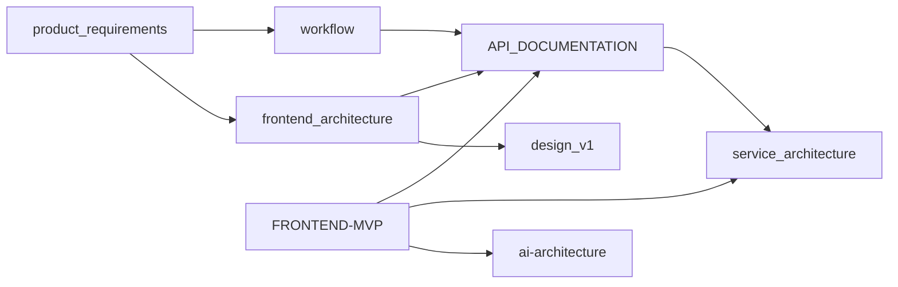
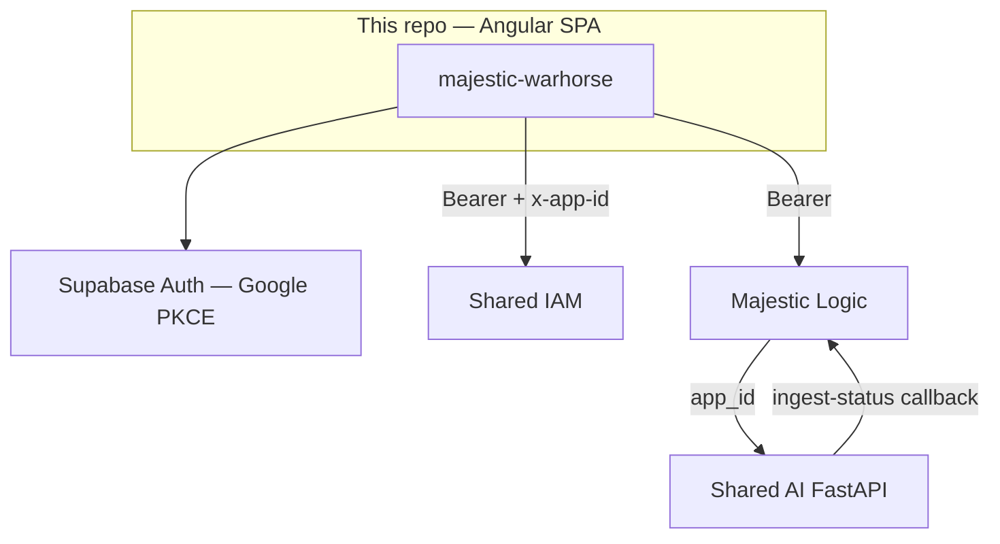

# Majestic Warhorse — Documentation Index

**Master map for `/docs`.** Prefer this file for navigation. Each folder owns one concern — do not duplicate full architecture or API contracts across docs; link here instead.

**Repository:** Angular SPA `majestic-warhorse`  
**Last reorganized:** 2026-08-10

---

## How to use this set

| If you need… | Open |
|--------------|------|
| Product vision / PRD / Class vs Gold | [`product_requirements/`](./product_requirements/) |
| How users move through the product | [`workflow/`](./workflow/) |
| How IAM / Logic / Shared AI are built | [`service_architecture/`](./service_architecture/) |
| HTTP endpoints (Logic) + what the FE calls | [`API_DOCUMENTATION.md`](./API_DOCUMENTATION.md) |
| Library + AI Mode FE MVP checklist | [`FRONTEND-MVP.md`](./FRONTEND-MVP.md) |
| Angular structure, auth, HTTP wiring | [`frontend_architecture/FRONTEND-ARCHITECTURE.md`](./frontend_architecture/FRONTEND-ARCHITECTURE.md) |
| AI MVP shared HTTP contract (FE ↔ Logic ↔ AI) | [`ai-architecture/AI-MVP-SHARED-CONTRACT.md`](./ai-architecture/AI-MVP-SHARED-CONTRACT.md) |
| Future course-file RAG (Phase 2) | [`ai-architecture/PHASE-2-COURSE-RAG.md`](./ai-architecture/PHASE-2-COURSE-RAG.md) |
| Design system / tokens / components | [`design_v1/`](./design_v1/) |

---

## Folder ownership (no overlap)

| Folder / file | Owns | Does **not** own |
|---------------|------|------------------|
| **`product_requirements/`** | Why the product exists, PRDs, Class MVP vs Gold, Library PRD | Live HTTP schemas, Angular file trees as source of truth |
| **`workflow/`** | Screen-by-screen user/UI journeys and which API to call | Backend implementation internals |
| **`service_architecture/`** | IAM / Logic / Shared AI responsibilities, data ownership, gaps | Pixel design tokens, Angular component catalogs |
| **`frontend_architecture/`** | Angular modules, auth, interceptors, how FE consumes APIs | Backend SQL / FastAPI internals |
| **`ai-architecture/`** | Shared AI MVP contract + Phase 2 course RAG plan | General course CRUD API catalog |
| **`design_v1/`** | Visual language, tokens, layout/component specs | Business rules, API contracts |
| **`API_DOCUMENTATION.md`** | Logic HTTP catalog + **FE usage map** + AI MVP API diffs | Full IAM endpoint cookbook (see IAM architecture) |
| **`FRONTEND-MVP.md`** | Short FE checklist for Library + AI Mode | Full endpoint payloads (→ API + shared contract) |

---

## 1. Product requirements

[`product_requirements/`](./product_requirements/)

| Document | Role |
|----------|------|
| [01_Project_Overview.md](./product_requirements/01_Project_Overview.md) | Purpose, users, stack, Class MVP vs Gold |
| [02_Folder_Structure.md](./product_requirements/02_Folder_Structure.md) | Repo folder intent (product view) |
| [03_System_Architecture.md](./product_requirements/03_System_Architecture.md) | End-to-end product architecture narrative |
| [04_UI_Architecture.md](./product_requirements/04_UI_Architecture.md) | UI hierarchy / screens (product) |
| [05_AI_Tutor_Adaptive_Learning_Strategy.md](./product_requirements/05_AI_Tutor_Adaptive_Learning_Strategy.md) | AI tutor strategy (vision — not runtime code truth) |
| [MAJESTIC_WARHORSE_PRD.md](./product_requirements/MAJESTIC_WARHORSE_PRD.md) | Full PRD |
| [LIBRARY_MODULE_PRD.md](./product_requirements/LIBRARY_MODULE_PRD.md) | Library / Drive PRD |

---

## 2. Workflows

[`workflow/`](./workflow/)

| Document | Role |
|----------|------|
| [USER_WORKFLOW.md](./workflow/USER_WORKFLOW.md) | Non-technical user journeys |
| [UI_WORKFLOW.md](./workflow/UI_WORKFLOW.md) | Screens, flows, which API when |

---

## 3. Service architectures

[`service_architecture/`](./service_architecture/)

| Document | Service |
|----------|---------|
| [IAM-ARCHITECTURE.md](./service_architecture/IAM-ARCHITECTURE.md) | Shared IAM (JWT, orgs, applications / `IAM_APP_ID`) |
| [LEARNING_ARCHITECTURE.md](./service_architecture/LEARNING_ARCHITECTURE.md) | Majestic Logic (courses, files, library, chat proxy) |
| [AI-ARCHITECTURE.md](./service_architecture/AI-ARCHITECTURE.md) | Shared AI + RAG data ownership (`document_chunks`) |

---

## 4. Frontend

| Document | Role |
|----------|------|
| [FRONTEND-MVP.md](./FRONTEND-MVP.md) | Library + AI Mode MVP checklist |
| [frontend_architecture/FRONTEND-ARCHITECTURE.md](./frontend_architecture/FRONTEND-ARCHITECTURE.md) | Angular architecture onboarding |

Env bases (Observed): `environment.majesticWarhorseApi` (Logic), `environment.iamApi` (IAM).

---

## 5. APIs

| Document | Role |
|----------|------|
| [API_DOCUMENTATION.md](./API_DOCUMENTATION.md) | Logic HTTP reference + **frontend usage inventory** + **AI MVP changes** |
| [ai-architecture/AI-MVP-SHARED-CONTRACT.md](./ai-architecture/AI-MVP-SHARED-CONTRACT.md) | Normative FE ↔ Logic ↔ Shared AI contract for Library/Chat MVP |
| [ai-architecture/PHASE-2-COURSE-RAG.md](./ai-architecture/PHASE-2-COURSE-RAG.md) | Planned: RAG from course attachments (library unchanged until then) |

**Rule:** FE talks only to Logic + IAM. Never call Shared AI or `POST /file/ingest-status` from the browser.

---

## 6. Design system

[`design_v1/`](./design_v1/) — start at [README.md](./design_v1/README.md)

Canonical visual source: repo root [`design.xml`](../design.xml) → runtime `src/styles/_variables.scss`.

| Batch | Docs |
|-------|------|
| Foundations | `01`–`10` |
| Layouts | `11`–`17` |
| Components | `18`–`37` |
| Navigation | `38`–`40` |
| Interaction | `41`–`43` |
| Accessibility | `44`–`45` |
| Engineering | `46`–`49` |
| AI generation rules | `50` |

---

## 7. System context (runtime)

Detail: [`service_architecture/`](./service_architecture/) and [`API_DOCUMENTATION.md`](./API_DOCUMENTATION.md).

---

## 8. Writing rules (keep docs non-repetitive)

1. **One owner per topic** — put deep content in the folder above; elsewhere use a short pointer.
2. **API shapes** live in `API_DOCUMENTATION.md` and/or `AI-MVP-SHARED-CONTRACT.md`, not in PRDs or design docs.
3. **Architecture internals** live in `service_architecture/`, not in `FRONTEND-MVP.md`.
4. **Vision vs code** — product strategy docs may lag runtime; label assumptions; prefer Observed paths under `src/` for behaviour.
5. **Update this index** when adding, renaming, or moving docs.

---

## 9. Quick links for common tasks

| Task | Start here |
|------|------------|
| Implement Library / AI Mode FE | [FRONTEND-MVP.md](./FRONTEND-MVP.md) → [AI-MVP-SHARED-CONTRACT.md](./ai-architecture/AI-MVP-SHARED-CONTRACT.md) §§1–6 |
| See which Angular service calls which path | [API_DOCUMENTATION.md § Frontend API usage](./API_DOCUMENTATION.md#frontend-api-usage-map) |
| Understand JWT / org / app scoping | [IAM-ARCHITECTURE.md](./service_architecture/IAM-ARCHITECTURE.md) |
| Plan course-file RAG later | [PHASE-2-COURSE-RAG.md](./ai-architecture/PHASE-2-COURSE-RAG.md) |
| Match UI to design tokens | [design_v1/README.md](./design_v1/README.md) |
