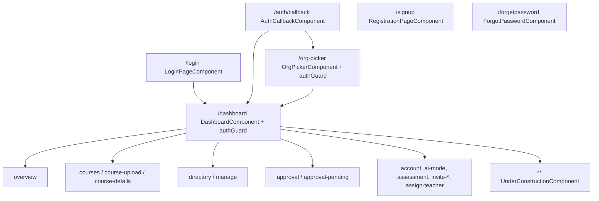
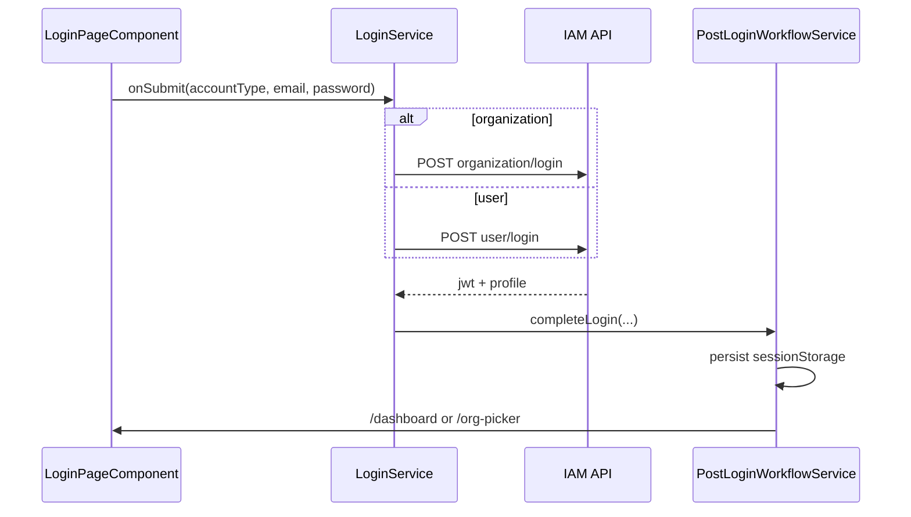
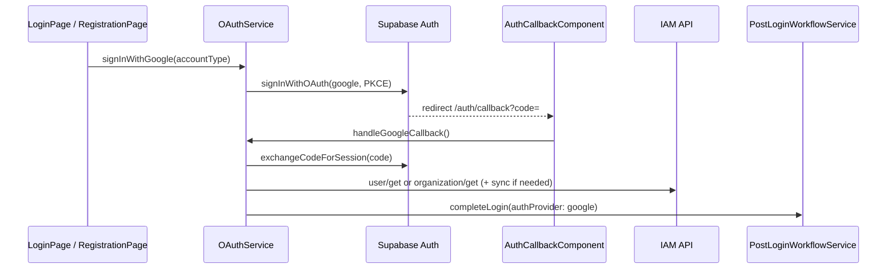
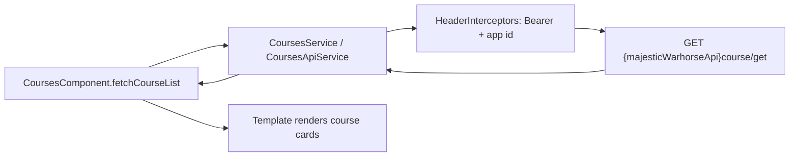
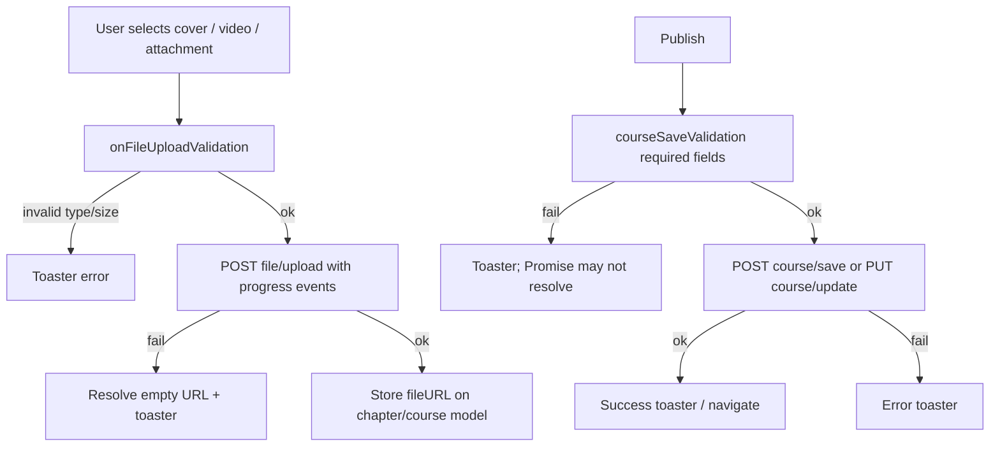

# Majestic Warhorse — Frontend Architecture

Onboarding document for a Technical Architect joining PetaxAI.  
**Scope:** Angular frontend only. Claims are based on code that was read; unclear items are listed under [§19 Open Questions](#19-open-questions).

**Repo root:** `majestic-warhorse`  
**Document date:** 2026-07-24

---

## 1. Overview

### What the app does

Majestic Warhorse is an Angular SPA for an online learning platform (courses, roster, assessments). It authenticates against a shared Node.js **IAM** API (`environment.iamApi`) and calls a separate **Majestic Warhorse** backend (`environment.majesticWarhorseApi`, Railway-hosted in production). Google sign-in uses **Supabase Auth** (PKCE) then syncs identity into IAM.

### User types (as encoded in the app)

| Role string | How it appears | Typical capabilities (UI-gated) |
|-------------|----------------|----------------------------------|
| `organization` | Org account login (`loginType === 'organization'`) | Approvals, full directory (teachers), dashboard org metrics |
| `teacher` | User after org + role selection / roster | Directory (students), course upload (with org), questionnaire as teacher |
| `student` | User after org + role selection / roster | Courses, assessments, assigned teachers check |

Role is taken from `commonService.loginedUserInfo.role` / session `login_details`, and from roster/`user-role` overview after org selection (`PostLoginWorkflowService`).

There is **no separate “admin” role string** in code. Organization accounts act as the admin-like actor. `CommonService.adminRoleType` is `['organization', 'teacher']` (`src/app/shared/services/common.service.ts`).

### Claimed features vs code (verification)

| Claimed capability | Status | Evidence |
|--------------------|--------|----------|
| Google sign-in | **Working** | `OAuthService` + `/auth/callback` + Supabase PKCE |
| Manual login (user + org) | **Working** | `LoginService` → IAM `user/login` / `organization/login` |
| Dashboard | **Working** (demo fixtures optional) | `DashboardOverviewComponent` + live APIs / `DASHBOARD_DEMO_DATA` |
| Course listing | **Working** | `CoursesComponent` + `CoursesApiService` |
| Course upload | **Working** (some Promise edge cases) | `CourseUploadComponent` + `CourseUploadService` |
| Instructors setting questions | **Working** | `QuestionnaireComponent` + `question/*` APIs |
| Students submitting answers | **Working** | `StudentAssessmentComponent` + `answer/save` |
| Approval of teachers/students | **Working** | `ApprovalPageComponent` + `teachers/approve`, `students/approve` |
| Teacher assignment | **Working** (route live; sidenav entry commented) | `AssignTeacherService` + `/dashboard/assign-teacher` |

**Substantial and built but not on the claim list:**

- Org picker / switch organization (`/org-picker`)
- Invite teacher / invite student (`/dashboard/invite-*`)
- Account / profile edit (`/dashboard/account`)
- Course details (video, materials, discussions, rating)
- Favorites API wiring on overview
- Demo mode toggle (fixture swap, not HTTP mock)
- Health-check banner (`AppComponent` + `HealthCheckService`)
- AI Mode route (UI only — stubbed)
- Registration / signup (`/signup`)
- Forgot password (`/forgetpassword`)

---

## 2. Repository map and Angular setup

### Stack

| Item | Value | Source |
|------|-------|--------|
| Angular packages | `^18.0.0` | `package.json` L15–25 |
| Angular CLI | `~17.3.8` (skew vs framework 18) | `package.json` L39 |
| TypeScript | `~5.4.5` | `package.json` L50 |
| RxJS | `~7.8.0` | `package.json` L32 |
| Build | `@angular-devkit/build-angular` browser builder | `angular.json` |
| README claim | CLI 16.1.8 — **stale** | `README.md` L3 |

### Standalone vs NgModules

**Hybrid. Newer feature UI is standalone; the root shell is still an NgModule.**

- Bootstrap: `platformBrowserDynamic().bootstrapModule(AppModule)` — `src/main.ts` L59–61.
- `AppModule` **declares only** `AppComponent` and **imports** standalone components (`LoginPageComponent`, `ParticleComponent`, `CommonDialogComponent`) — `src/app/app.module.ts` L21–39.
- Almost all pages/components use `standalone: true` and are routed via `AppRoutingModule`.
- Legacy / unused: `src/app/backups/back-up-listing/` (not in routes); empty `src/app/store/` folder (no store files found).

### Folder map (actively maintained vs legacy)

```
src/
  app/
    pages/           # Feature pages (login, dashboard children, org-picker…) — active
    components/      # Shared/feature UI (sidepanel, overview, assessments…) — active
    services/        # API + domain services — active
    core/            # AppContext, PostLoginWorkflow, OAuth — active
    shared/          # CommonService, pipes, validators, toasters — active
    interceptors/    # HTTP — active (one registered)
    auth.guard/      # Functional authGuard — active
    backups/         # Legacy listing mock — not routed
    particle(s)/     # Decorative particles on some routes — active niche
  assets/screens/    # Design HTML prototypes + DESIGN.md — not runtime
  environments/      # Dev/prod config — active
  styles/            # Global SCSS tokens/partials — active
```

### Build tooling

- `ng serve` / `ng build` / `ng test` / `ng lint` / Prettier — `package.json` L4–11.
- Production `fileReplacements`: `environment.ts` → `environment.prod.ts` — `angular.json`.
- Service worker module registered but `enabled: false` — `app.module.ts` L28–30. `main.ts` also clears leftover SWs/caches (`clearLegacyServiceWorker`, L13–41).

---

## 3. Module structure

There are **no Angular feature NgModules** for dashboard domains. Structure is:

- One `AppModule` + `AppRoutingModule`
- Standalone components loaded eagerly in the route table (no `loadChildren` / lazy `import()` found in `app-routing.module.ts`)

### Route → component map



Full child list: `src/app/app-routing.module.ts` L28–66.

Navigation path constants: `src/app/pages/dashboard/dashboard-routes.config.ts` L1–26.

---

## 4. Routing and guards

### Guards

Only one guard is registered:

```6:15:src/app/auth.guard/guards/auth.guard.ts
export const authGuard: CanActivateFn = () => {
  const authService = inject(AuthService);
  const router = inject(Router);

  if (authService.isLoggedIn()) {
    return true;
  } else {
    return router.parseUrl('/login');
  }
};
```

**What it checks:** in-memory `AuthService.isLoggedIn()` (hydrated from `sessionStorage.isAuthenticated` in the AuthService constructor).  
**What it does not check:** JWT validity/expiry, role, org membership, roster approval status.

Applied to: `/org-picker`, `/dashboard` (and thus all children) — `app-routing.module.ts` L34–38.

**Resolvers:** none found.  
**CanMatch:** none found.  
**Role guards:** none found.

---

## 5. Authentication

### Manual login (password)



Key files:

| Step | File |
|------|------|
| Form UI | `src/app/pages/login-page/login-page.component.ts`, `.html` |
| Orchestration | `src/app/pages/login-page/login.service.ts` |
| User IAM call | `AuthService.loginUser` → `POST {iamApi}user/login` (`auth.service.ts` L95–101) |
| Org IAM call | `OrganizationApiService.login` → `POST organization/login` |
| Post-login | `src/app/core/auth/post-login-workflow.service.ts` (`completeLogin` L40+) |

### Google OAuth



Key files: `src/app/core/auth/oauth.service.ts`, `src/app/pages/auth-callback/auth-callback.component.ts`, `src/app/services/supabase.service.ts`, `user-oauth.service.ts` / `organization-oauth.service.ts`.

### Token storage

| Key | Storage | Purpose |
|-----|---------|---------|
| `authToken` / `token` | sessionStorage | IAM JWT (Bearer) |
| `isAuthenticated` | sessionStorage | Guard flag |
| `login_details` | sessionStorage | Profile JSON |
| `loginType` | sessionStorage | `user` \| `organization` |
| `organization_id`, `userRoles`, `userPermissions`, `needsOrgPicker`, … | sessionStorage | Org/role workflow |
| Supabase session | localStorage | Via `persistSession: true` |

### Refresh / expiry / 401

- **No IAM refresh-token API** in the frontend.
- Supabase `autoRefreshToken: true` refreshes **Supabase** session only — not the IAM Bearer used by Majestic/IAM HTTP calls.
- On HTTP **401**, `HeaderInterceptors` calls `authService.logOutApplication()` (`header.interceptor.ts` L37–38), which clears sessionStorage + localStorage and navigates to `/login` (`auth.service.ts` L115–121).
- Incomplete helper: `AuthService.logout()` only flips the in-memory flag (`auth.service.ts` L109–111) — UI uses `logOutApplication()`.

### Org picker

After user login without an active teacher/student role path, `PostLoginWorkflowService.completeLogin` sets `needsOrgPicker` and routes to `/org-picker` (`post-login-workflow.service.ts` L40–91 area). Organization logins skip the picker and go to `/dashboard`.

---

## 6. HTTP layer

### Registered interceptors (execution order)

In `AppModule.providers` (`app.module.ts` L41–47):

1. **`SpinnerInterceptor` — commented out** (L42). Not active.
2. **`HeaderInterceptors` — active** (L43–47).

So the live chain is: **request → HeaderInterceptors → HttpClient backend**.

### HeaderInterceptors behaviour

```21:46:src/app/interceptors/header.interceptor.ts
  intercept(req: HttpRequest<unknown>, next: HttpHandler): Observable<HttpEvent<unknown>> {
    const token: string | null = sessionStorage.getItem('authToken');
    const appId: string | null = this.appContext.getAppIdSync();
    // ... sets Authorization Bearer + x-app-id / app_id
    return next.handle(clonedRequest).pipe(
      catchError((error: HttpErrorResponse) => {
        if (error.status === 401) {
          this.authService.logOutApplication();
        }
        return throwError(() => error);
      })
    );
  }
```

- Attaches auth token: **yes**
- Refresh on 401: **no** (logout)
- Global error UX: toaster on 401 is **commented out** (L39–42)

`SpinnerInterceptor` (if re-enabled) shows ngx-spinner except on `/auth/callback` or when `SKIP_SPINNER_HEADER` is set (`spinner.interceptor.ts` L16–27).

### Example: course list call through the chain



Concrete API: `CoursesApiService` `GET course/get` (and student-scoped variant). Component: `src/app/pages/courses/courses.component.ts` + HTML grid.

---

## 7. Role-based UI

### How the app knows the role

1. Session profile in `login_details` / `CommonService.loginedUserInfo.role`
2. After org selection: `UserRoleApiService` overview/permissions stored in session (`userRoles`, `userPermissions`)
3. Templates read `loginedUserPrivilege` (typically from `commonService.loginedUserInfo?.role`)

### How rendering is gated

Example — Directory / Approvals in sidenav:

```114:148:src/app/components/dashboard-sidepanel/dashboard-sidepanel.component.html
    <li *ngIf="['organization', 'teacher'].includes(loginedUserPrivilege)">
      <a
        [routerLink]="loginedUserPrivilege === 'organization' ? navRoutes.teachers : navRoutes.students"
        ...
      >
        <span>Directory</span>
      </a>
    </li>
    ...
    <li *ngIf="loginedUserPrivilege === 'organization'">
      <a
        [routerLink]="navRoutes.teacherApproval"
```

Similar `*ngIf` / `@if` gates appear in course details (questionnaire/answers tabs), courses upload button, directory teachers tab, etc.

### Security gap (frontend-only enforcement)

**Yes — permissions are enforced only in the frontend for routing.**  
Any authenticated user who knows a URL (e.g. `/dashboard/approval`, `/dashboard/course-upload`) can activate those routes because only `authGuard` runs. Backend must enforce authorization; this document cannot verify that.

Commented-out sidenav links for Assign / Invite (`dashboard-sidepanel.component.html` ~L160–201) hide entry points but **do not remove routes** (`app-routing.module.ts` L58–61).

---

## 8. State management

| Approach | Used? | Where |
|----------|-------|-------|
| NgRx | **No** | No `@ngrx` / `StoreModule` matches under `src/app` |
| Angular Signals | **Not as app state pattern** | No widespread signal store found for domain state |
| Services + `BehaviorSubject` | **Yes** | `CommonService` (users, search text, activity feed), `DemoModeService`, `HealthCheckService` |
| Component fields + sessionStorage | **Yes** | Auth/session, dashboard `viewModel`, upload draft state on services |

`src/app/store/` exists as a directory name but contained **no store implementation files** at exploration time.

---

## 9. RxJS conventions

### Patterns in use

- `takeUntil(this.destroy$)` + `ngOnDestroy` is the dominant cleanup pattern across list/dashboard components.
- `takeUntilDestroyed` — **0 usages**.
- `async` pipe — rare (e.g. banner).
- `lastValueFrom` / `firstValueFrom` for Promise-style orchestration (auth post-login, uploads).

### Leaks / high-risk subscriptions (no `takeUntil`)

| Location | Issue |
|----------|-------|
| `src/app/app.component.ts` (~L75) | `router.events.subscribe` without teardown |
| `src/app/pages/dashboard/dashboard.component.ts` (~L74) | `getAssignedTeachers(...).subscribe` without `takeUntil` despite `destroy$` existing |
| `src/app/pages/registration-page/registration-page.component.ts` (~L228) | `valueChanges.subscribe` without cleanup |
| `src/app/pages/courses/courses.service.ts` (~L140) | `getCourseList().subscribe` inside Promise wrapper — not cancellable |
| `src/app/shared/confirmation-popup/confirmation-popup.service.ts` (~L63) | `result.subscribe` without `take(1)` / `takeUntil` |

---

## 10. Change detection

- **`ChangeDetectionStrategy.OnPush`:** only `CommonDialogComponent` (`common-dialog.component.ts` L30).
- **Default change detection** elsewhere, including large trees:
  - Dashboard overview (stat widgets, recommendation carousel, subscribed course grid)
  - Courses grid
  - Questionnaire / assessment lists
  - Directory / approval roster lists

**Risk:** default CD on overview + course lists can re-check large templates on unrelated events (search keystrokes, timer, etc.). No OnPush/trackBy audit was fully exhaustive for every `@for`, but overview and courses are the primary hot paths.

---

## 11. Course upload flow

Primary files:

- UI: `src/app/pages/course-upload/course-upload.component.ts` / `.html`
- Domain: `src/app/pages/course-upload/course-upload.service.ts`
- HTTP: `CommonApiService` `POST file/upload`; `CoursesApiService` `POST course/save` / `PUT course/update`

### Flow



### Validation (client)

From `course-upload.service.ts`:

- Cover: PNG/JPEG/JPG, max **5 MB** (`MAX_FILE_SIZE` L40–41, `ALLOWED_FILE_TYPES` L41).
- Documents: PDF/Office/TXT MIME allow-list (L42–51).
- Videos: common video MIME allow-list (L52–61).
- Required course fields: cover, title, description, access (messages L34–39).

Buckets mapped by upload type (`UPLOAD_BUCKET_BY_TYPE` L62–68): `course`, `chapter`, `attachment`, `video-file`, `cover-image`.

### Progress / failure

- Progress via `HttpEventType.UploadProgress` in upload helper (~L128–161).
- Upload error resolves to empty string and surfaces toaster.
- **Partial:** `saveCourseDetails` Promise often only `resolve(true)` on success; validation failure path may leave the Promise pending (component `finally` mitigates UI lock unevenly).

**Not stubbed** — real network calls.

---

## 12. Forms and validation

| Style | Used for |
|-------|----------|
| Reactive (`FormBuilder` / `formGroup`) | Login, registration, forgot password, account settings, invite teacher/student |
| Template-driven (`ngModel`) | Course upload fields, questionnaire, assessments, search, discussions, AI mode prompt |

Custom validators: `src/app/shared/form-validators.ts`

- `customPasswordValidator` — upper/lower/number/special
- `passwordMatchValidator` / `passwordMatchValidatorOptional`

**Backend duplication:** frontend cannot confirm IAM/Majestic validation rules; password complexity is enforced in the Angular validators above. Treat server rules as an **open contract question**.

---

## 13. Styling and white-labelling

### SCSS structure

- Entry: `src/styles/styles.scss` imports index, star-rating, global scrollbar.
- Partials under `src/styles/`: `_variables`, `_mixins`, `_reset`, `_component`, `_auth-layout`, `_account-profile`, `_approval-grid`, `_dashboard-scale`.
- Components use `styleUrl` SCSS with default **Emulated** encapsulation (Angular default); no widespread `ViewEncapsulation.None` audit completed beyond normal patterns.
- Design reference: `src/assets/screens/DESIGN.md` (tokens mirrored into `--mc-*`).

### Tokens (themable surface)

```75:97:src/styles/_variables.scss
  // Majestic Cyber design tokens (src/assets/screens/DESIGN.md)
  --mc-surface: #131316;
  ...
  --mc-brand-gradient: linear-gradient(135deg, #ff6b2c 0%, #ab0063 50%, #4a0084 100%);
  --mc-font-display: 'Space Grotesk', 'Poppins-Bold', sans-serif;
```

Also older `--bg-*` variables coexist.

### Component library

- `@angular/material` is a dependency but **not used as a component library** (no `Mat*` imports found). CDK `PortalModule` is imported.
- Icons: Google Material Symbols font + inline SVGs.

### White-label assessment (concrete)

| Requirement | Current support |
|-------------|-----------------|
| Swap colors/fonts | Possible via `--mc-*` CSS variables |
| Per-tenant runtime theme | **Missing** — no org-id → theme loader |
| Logos | **Hardcoded** asset paths (`logo-majestic-hourse.svg`, etc.) |
| Product name copy | **Hardcoded** in templates |
| App identity | Fixed `client_id: 'majestic-warhorse'` in environments |

**To support school/community branding:** introduce a theme service (fetch org branding → set CSS variables + logo URLs), replace hardcoded logo/copy, and avoid baking a single `client_id`/brand into templates. That work does **not** exist today.

---

## 14. Certification readiness

### What exists that certification could build on

- Course completion percent / status resolution (`course-details` status model + `status/*` APIs)
- Chapter/lesson completion tracking via status records
- Questionnaire + student answer submission + teacher review UI
- Dashboard “Badge Awards” UI bound to `insights.badgeTitle` / `badgeStars` (currently set to **“Beginner badge”** in demo/live merge paths)

### What does not exist

- Certificate / diploma / accreditation domain models or APIs in `src/app`
- Issuance, PDF generation, verification codes, graduation workflows
- Design HTML mentions certificates in `assets/screens` only — not wired

**Do not invent a design here** — only note: progress + assessment plumbing exists; credential issuance does not.

---

## 15. Configuration

### Environment files

| File | `production` | `appUrl` | `iamApi` | `majesticWarhorseApi` |
|------|--------------|----------|----------|------------------------|
| `environment.ts` | false | `http://localhost:4200` | `http://localhost:5000/auth/api/` | `http://localhost:8081/` |
| `environment.prod.ts` | true | `https://majestic.petaxai.com` | Railway IAM URL | Railway backend URL |

Shared in both:

- `client_id: 'majestic-warhorse'`
- `supabaseUrl` + **committed** `supabaseAnonKey` (JWT-shaped anon key)

Commented historical URLs (`thechurchmanager.com`, etc.) remain in `environment.ts` comments (L12–15).

### Secrets / production URLs committed

- Supabase anon key in repo (expected for public anon keys, but committed in both envs identically).
- Production IAM and Majestic API hostnames committed in `environment.prod.ts`.
- No service-role Supabase key found in frontend (good).

---

## 16. Local setup

From a clean clone (commands present in repo; README is partially stale):

```bash
# Node 20.x recommended by README deploy snippet; use a current LTS compatible with Angular 18
npm install
npm start
# → ng serve → http://localhost:4200/
```

Other scripts: `npm run build`, `npm test`, `npm run lint`, `npm run prettier`.

**Runtime dependencies not started by this repo:**

- IAM at `environment.iamApi` (default `http://localhost:5000/auth/api/`)
- Majestic backend at `environment.majesticWarhorseApi` (default `http://localhost:8081/`)
- Supabase project for Google OAuth (keys in environment)

---

## 17. Current state and gaps

### Working

- Dual auth (password + Google → IAM JWT)
- Org picker / role intent / approval-pending routing
- Dashboard overview (live + demo fixtures)
- Courses CRUD listing/upload/details (core path)
- Teacher/student approvals and assignment APIs
- Questionnaire + student assessment submit
- Directory + manage enrollment pages
- Global Bearer + app-id interceptor; 401 logout

### Partial / stubbed / fragile

| Item | Classification | Notes |
|------|----------------|-------|
| AI Mode | **Stubbed** | `submitPrompt` logs only (`ai-mode.component.ts` L61–69). Target product: AI Tutor / Adaptive Learning Intelligence — see [05_AI_Tutor_Adaptive_Learning_Strategy.md](./05_AI_Tutor_Adaptive_Learning_Strategy.md) and [MAJESTIC_WARHORSE_PRD.md](./MAJESTIC_WARHORSE_PRD.md) §35 |
| UnderConstruction catch-all | **Scaffold** | Image placeholder for unknown dashboard paths |
| Spinner interceptor | **Scaffolded but unused** | Commented out in `app.module.ts` L42 |
| Assign/Invite sidenav | **Dead nav** | Routes exist; links commented at `dashboard-sidepanel.component.html` L160–201 |
| Teacher answer feedback IDs | **Working** | Corporate `PUT /answers/{studentUserId}/feedback` with structured review + item_feedback |
| Course upload Promise on validation fail | **Fragile** | May not resolve |
| Demo mode | **Partial mock** | Replaces view models; does not stub HTTP globally |
| Auth guard | **Partial** | Flag-only; no token expiry check |
| Role security | **Frontend-only** | See §7 |
| README / CLI versions | **Stale** | Docs vs package.json mismatch |
| `AuthService.logout()` | **Dead/incomplete** | Unused incomplete API |
| Backups / assets/screens | **Legacy** | Not routed |

### Surprises

- Interceptor order: spinner disabled; only header interceptor runs.
- Angular 18 app bootstrapped with CLI 17 pin.
- `store/` folder name without NgRx.
- Material installed but unused as components.
- Same Supabase anon key in dev and prod env files.

---

## 18. External contracts

Bases:

- IAM: `environment.iamApi`
- Majestic: `environment.majesticWarhorseApi`
- Supabase JS client: `environment.supabaseUrl` + anon key

### IAM (`environment.iamApi`) — paths called from code

| Method | Path | Caller |
|--------|------|--------|
| POST | `user/login` | `auth.service.ts` |
| POST | `user/save` | `registration-api.service.ts` |
| POST | `user/sync` | `user-oauth.service.ts` |
| POST | `user/forgot-password` | `auth.service.ts` |
| POST | `user/confirm-password` | `auth.service.ts` |
| GET | `user/get` | `auth.service.ts` (list / filtered) |
| PUT | `user/update` | `auth.service.ts` |
| DELETE | `user/delete` | `common-api.service.ts` |
| POST | `organization/login` | `organization-api.service.ts` |
| POST | `organization/save` | `organization-api.service.ts` |
| POST | `organization/sync` | `organization-oauth.service.ts` |
| POST | `organization/forgot-password` | `organization-api.service.ts` |
| POST | `organization/confirm-password` | `organization-api.service.ts` |
| GET | `organization/get` | `organization-api.service.ts` |
| GET | `organization/get-for-users` | `organization-api.service.ts` |
| PUT | `organization/update` | `organization-api.service.ts` |
| GET | `application/get` | `application-api.service.ts` |
| GET | `{iamBase}/health` | `health-check.service.ts` (base URL, not under `/auth/api/` prefix) |

### Majestic (`environment.majesticWarhorseApi`) — paths called from code

| Method | Path | Caller |
|--------|------|--------|
| GET | `course/get` | `courses-api.service.ts` |
| GET | `course/student/{studentId}` | `courses-api.service.ts` |
| POST | `course/save` | `courses-api.service.ts` |
| PUT | `course/update` | `courses-api.service.ts` |
| POST | `status/save` | `courses-api.service.ts` |
| PUT | `status/update` | `courses-api.service.ts` |
| GET | `status/get` | `courses-api.service.ts` |
| GET | `teachers/get` | `teachers-api.service.ts` |
| POST | `teachers/save` | `teachers-api.service.ts` |
| PUT | `teachers/approve/{rosterRowId}` | `teachers-api.service.ts` |
| PUT | `teachers/approve` (bulk) | `teachers-api.service.ts` |
| GET | `students/get` | `students-api.service.ts` |
| POST | `students/save` | `students-api.service.ts` |
| PUT | `students/approve/{rosterRowId}` | `students-api.service.ts` |
| PUT | `students/approve` (bulk) | `students-api.service.ts` |
| GET | `question/get` | `questionnaire-api.service.ts` |
| POST | `question/save` | `questionnaire-api.service.ts` |
| PUT | `question/update/{questionId}` | `questionnaire-api.service.ts` |
| DELETE | `question/delete/{questionId}` | `questionnaire-api.service.ts` |
| POST | `answer/save` | `questionnaire-api.service.ts` |
| GET | `answer/get` | `questionnaire-api.service.ts` |
| PUT | `answers/{studentUserId}/feedback` | `questionnaire-api.service.ts` |
| GET | `favorites/get?userId=` | `favorites-api.service.ts` |
| POST | `favorites/save` | `favorites-api.service.ts` |
| DELETE | `favorites/delete/{favoriteId}` | `favorites-api.service.ts` |
| DELETE | `favorites/delete?userId=&courseId=` | `favorites-api.service.ts` |
| GET | `discussion/get` | `course-discussions-api.service.ts` |
| POST | `discussion/save` | `course-discussions-api.service.ts` |
| POST | `file/upload` | `common-api.service.ts` |
| POST | `file/get-blob` | `file-download-api.service.ts` |
| GET | `user-role/get-overview` | `user-role-api.service.ts` |
| GET | `user-role/permissions` | `user-role-api.service.ts` |
| POST | `user-role/save` | `user-role-api.service.ts` |
| POST | `teacher-students/assign-teachers` | `assign-teacher.service.ts` |
| POST | `teacher-students/unassign-teachers` | `assign-teacher.service.ts` |
| POST | `teacher-students/assign-students` | `assign-teacher.service.ts` |
| POST | `teacher-students/unassign-students` | `assign-teacher.service.ts` |
| GET | `teacher-students/student/{id}/teachers` | `assign-teacher.service.ts` |
| GET | `teacher-students/teacher/{id}/students` | `assign-teacher.service.ts` |
| GET | `teacher-students/get` | `assign-teacher.service.ts` |
| GET | `dashboard/get?isTeacher=` / `isStudent=` | `dashboard.service.ts` |
| POST | `mail/send-gmail` | `mail-api.service.ts` |
| GET | `{majesticBase}/health` | `health-check.service.ts` |

### Assumptions **not** enforced by shared TypeScript packages

- Response envelopes often treated as `any` or `{ data: T }` with `res.data || res` fallbacks.
- JWT shape/claims not validated client-side beyond presence.
- Roster status strings normalized via local helpers (`user-status.model.ts`) — must stay aligned with backend.
- File upload bucket names are frontend constants; backend must accept them.
- Exact request/response field schemas for most endpoints live only as inline `any` / local interfaces — **no OpenAPI/shared DTO package** is imported.
- Payload shapes for login (`jwt` + profile), roster approve `{ status }`, and feedback body are **not** documented by a shared contract in this repo (see Open Questions).

---

## 19. Open Questions

1. Does the Majestic/IAM backend enforce role checks on every sensitive endpoint, given the frontend has no role guards?
2. What is the IAM JWT TTL, and is a refresh endpoint planned (none exists in this client)?
3. Is `SpinnerInterceptor` intentionally disabled, or an accidental leftover?
4. Should `/dashboard/assign-teacher` and invite routes be linked in the sidenav again, or removed?
5. Answer feedback: `PUT /answers/{studentUserId}/feedback` uses student IAM user id in the path; `course_id` + optional `submission_id` are in the corporate body.
6. Are password rules on IAM identical to `form-validators.ts`?
7. White-label: will branding be per `organization_id`, per `client_id`/application, or both?
8. Demo mode: should it short-circuit HTTP, or remain presentation-only?
9. `course-overview` vs `courses` — which is the canonical catalog UX going forward?
10. Certification: which backend service will own credentials (IAM vs Majestic vs new)?
11. Why is `@angular/cli` on 17 while the framework is on 18 — intentional pin?
12. Are the Railway production URLs in `environment.prod.ts` still the intended targets for PetaxAI?

---

## Appendix A — Hardcoded / mock / commented inventory (sampled from auth & shell)

| Item | Location | Notes |
|------|----------|-------|
| Supabase anon key | `environment.ts` L16–17, `environment.prod.ts` L10–11 | Committed |
| Production API hosts | `environment.prod.ts` L8–9 | Committed |
| `console.log('origin', origin)` | `auth-redirect.util.ts` | Debug leftover |
| 401 toaster commented | `header.interceptor.ts` L39–42 | |
| Spinner interceptor commented | `app.module.ts` L42 | |
| AI Mode placeholder | `ai-mode.component.ts` L68–69 | |
| Demo fixtures | `dashboard-demo.data.ts`, `course-details` demo | Not HTTP mocks |
| Assign/Invite nav commented | `dashboard-sidepanel.component.html` | |
| Beginner badge hardcoded in live merge | `dashboard-overview.component.ts` | Product placeholder |

**Grep note:** no `TODO` / `FIXME` markers were found under `src/app` at exploration time; stubs use comments like “Placeholder until AI backend is wired” instead.

---

## Appendix B — Feature maturity matrix

| Area | Rating |
|------|--------|
| Auth (password + Google) | Working |
| Org picker / roles | Working |
| Dashboard | Working (+ optional demo fixtures) |
| Courses / upload / details | Working |
| Questionnaire / student submit | Working |
| Approvals / assignment | Working |
| Invites | Working (nav partial) |
| AI Mode | Stubbed |
| Certification | Not built (progress/assessment only) |
| White-label | Not built (tokens only) |
| Route role guards | Missing |
| NgRx / OnPush at scale | Unused / almost unused |
