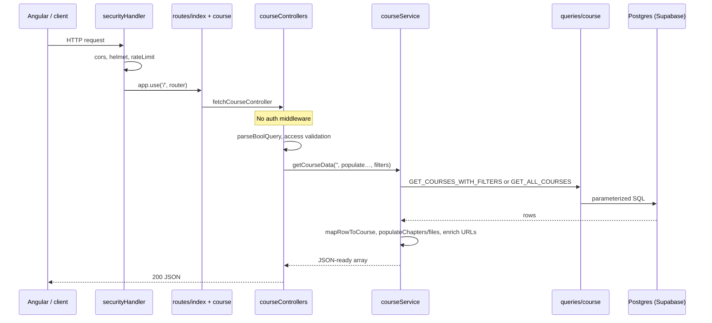
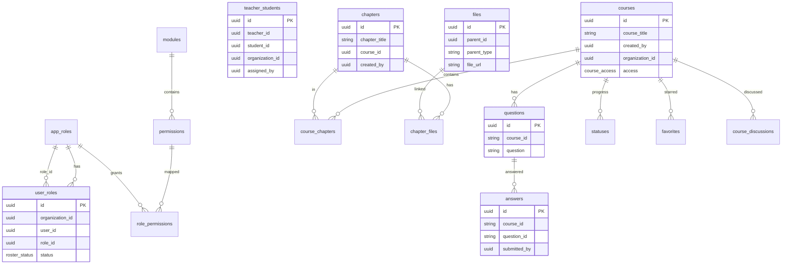
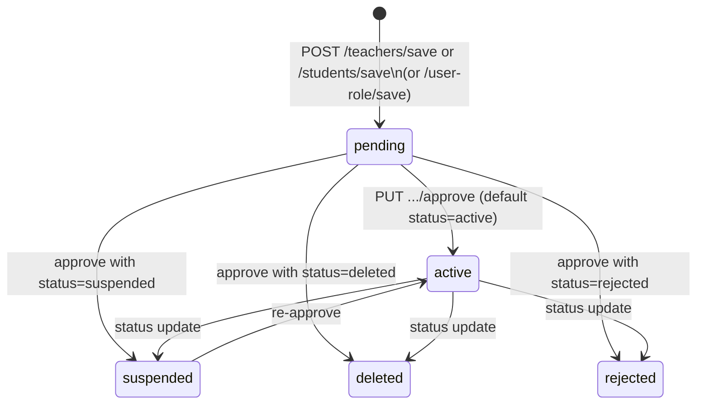
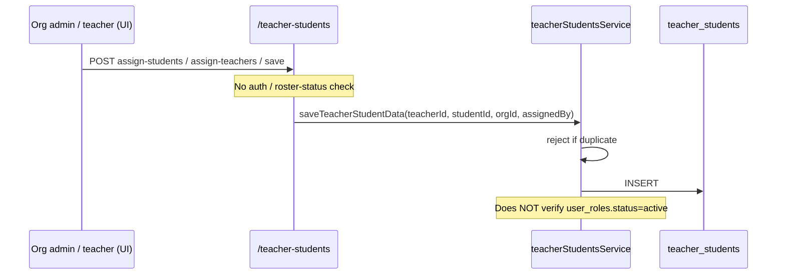

# Majestic Warhorse — Backend Architecture

**Audience:** Technical Architect joining PetaxAI  
**Repo:** `majestic-warhorse-backend`  
**Document date:** 2026-07-24  
**Method:** Code-first. Every claim cites a file path. Unverified items are in §20 Open Questions.

---

## Critical correction vs onboarding brief

| Brief said | Code shows |
|------------|------------|
| Python backend services | **Node.js / TypeScript Express** (`package.json`, `server.ts`) |
| Consumes IAM tokens for auth | Token is **forwarded to IAM on roster sync only**; route JWT middleware is **commented out** everywhere |
| File storage Cloudflare R2 | **Confirmed** (`utils/fileStorage.ts`, `config.ts` `r2Storage`) |
| PostgreSQL on Supabase | **Confirmed** (`dbhandler/postgres.ts` uses `DATABASE_URL`; pooler hostname handling) |

This document describes the **course domain backend** in this repository. It is not a Python service.

---

## 1. Overview and service boundaries

### What this service owns

| Domain | Evidence |
|--------|----------|
| Courses, chapters, files metadata | `routes/course.ts`, `routes/chapter.ts`, `routes/file.ts` |
| Questions & answers (course-scoped) | `routes/question.ts`, `routes/answer.ts` |
| Progress / ratings (`statuses`) | `routes/status.ts` |
| Favorites | `routes/favorites` via `routes/favorite.ts` |
| Course discussions | `routes/discussion.ts` |
| Org-scoped roster (teacher/student roles) | `routes/teachers`, `routes/students`, `routes/user-role` |
| Teacher ↔ student assignment | `routes/teacherStudents.ts` |
| Dashboard aggregates | `routes/dashboard.ts` |
| Object upload to R2 + public URL enrichment | `controllers/fileControllers.ts`, `utils/fileStorage.ts` |

### What this service delegates

| Concern | Owner | How |
|---------|--------|-----|
| Login, JWT issuance, user profile, organizations | Separate Node IAM | Documented in `IAM_DOCUMENTATION.md`; called via `services/iamClient.ts` |
| App UI | Angular frontend (separate repo) | Not in this tree |
| Email sending (OTP era) | Local Nodemailer in `services/emailService.ts` | OTP routes are **not mounted** (see §18) |

### Believed-built checklist (verified)

| Claim | Status |
|-------|--------|
| Dashboard data | **Working** (client-supplied role flags; see §8 / §18) |
| Course listing | **Working** |
| Course upload (create + R2 file upload) | **Working** |
| Instructor questions | **Working** |
| Student answers | **Working** |
| Approval of teachers and students | **Working** (data + IAM sync optional) |
| Teacher assignment | **Working** (no roster-status gate) |
| Certification / graduation / accreditation | **Absent** from schema and code |
| Learner profiles | **Absent** (IAM owns user profile) |
| Structured learning paths / competency mapping | **Absent** |
| White-label | **Working** (`/branding` + `organization_branding` table) |

---

## 2. Repository map

```
majestic-warhorse-backend/
├── server.ts                 # Express app entry; listens; exports serverless handler
├── env.ts / config.ts        # dotenv + typed config
├── securityHandler.ts        # cors, helmet, rate-limit, HTTP→HTTPS redirect in prod
├── routes/                   # Express routers (HTTP surface)
├── controllers/              # Request/response adapters
├── services/                 # Business logic
├── queries/                  # SQL strings
├── dbhandler/
│   ├── postgres.ts           # pg Pool, query helpers
│   ├── index.ts              # startup DB connect
│   ├── interfaces/           # TypeScript types
│   └── models/               # Legacy Mongoose schemas (unused at runtime)
├── middleware/
│   ├── auth.ts               # JWT verify (unused on routes)
│   └── schemavalidate.ts     # express-validator result check
├── utils/                    # fileStorage, extractAuthToken, queryParams
├── swagger/                  # OpenAPI annotations + UI at /api-docs
├── scripts/*.sql             # Manual Postgres migrations (source of schema truth)
├── migrations/               # migrate-mongo (legacy Mongo era)
└── docs/                     # This document and related notes
```

### How the app is served

| Aspect | Detail | Citation |
|--------|--------|----------|
| Framework | Express 4 | `package.json` L34; `server.ts` L3–14 |
| Language | TypeScript → `tsc` → `build/` | `package.json` `build` / `start` |
| Concurrency | Single Node process, sync request handlers (`async`/`await`), no worker pool in-repo | `server.ts` |
| Listen | `app.listen(port, '0.0.0.0')` after DB init attempt | `server.ts` L37–46 |
| Serverless | `module.exports.handler = serverless(app)` (Netlify-era) | `server.ts` L58 |
| Docker | `node:18.20.3`, `PORT=8080`, `npm run start` | `Dockerfile` |

There is **no** background worker process, queue consumer, or Celery/RQ equivalent in this repo.

---

## 3. Dependencies

| Item | Value | Citation |
|------|-------|----------|
| Package manager | npm (`package-lock.json` present; also listed oddly in `.gitignore`) | `package.json` |
| Runtime | Node (Docker pins **18.20.3**) | `Dockerfile` L2 |
| TypeScript | `5.4.3` (devDependency) | `package.json` L73 |
| Lint | Google TypeScript Style (`gts`) | `package.json` L13–15 |
| DB driver | `pg` ^8.18.0 | `package.json` L50 |
| Object storage | `@aws-sdk/client-s3`, `@aws-sdk/lib-storage` (R2 S3-compatible) | `package.json` L21–22 |
| HTTP client (IAM) | `axios` | `package.json` L27 |
| Legacy (still installed) | `mongoose`, `migrate-mongo`, `firebase` / `firebase-admin`, `cron`, `bcryptjs` | `package.json` |

**Python version required:** N/A — this is not a Python project.

**Pinning:** Semver ranges in `package.json` (`^`); lockfile exists as `package-lock.json`.

---

## 4. Request lifecycle

Example: `GET /course/get?organization_id={orgId}&populateChapters=true`



| Layer | File | Why it exists |
|-------|------|----------------|
| Security | `securityHandler.ts` L6–29 | CORS, Helmet (CSP off), IP rate limit 100/30s, prod HTTP redirect |
| Body parsers | `server.ts` L20–23 | Large upload limits via `FILEUPLOADLIMIT` |
| Router mount | `routes/index.ts` L28 | Mounts `/course` |
| Route | `routes/course.ts` L12 | Maps GET `/get` → controller (auth import commented L4–5) |
| Controller | `controllers/courseControllers.ts` | Parses query, validates `access`, returns HTTP status |
| Service | `services/courseService.ts` | Filtering, population of chapters/files, public URL enrichment |
| Queries | `queries/course.ts` | SQL only |
| DB | `dbhandler/postgres.ts` | Connection pool + `query()` |

**Why each layer:** Controllers stay thin HTTP adapters; services hold domain rules; queries isolate SQL; postgres module owns connectivity. There is **no** repository pattern beyond `queries/` + `query()`.

---

## 5. IAM integration

### What the code actually does

IAM is a **separate HTTP API**. This service does **not** validate IAM-issued JWTs on inbound requests in production paths.

| Mechanism | Behaviour | Citation |
|-----------|-----------|----------|
| Outbound sync | When `IAM_SYNC_ENABLED=true` and `IAM_BASE_URL` + `IAM_APP_ID` set, roster register/approve call IAM | `config.ts` L56–63; `services/iamClient.ts` |
| Headers | `x-app-id`, optional `Authorization: Bearer` | `iamClient.ts` L28–36 |
| Endpoints used | `POST /user/sync`, `PUT /user/update`, `GET /user/get` | `iamClient.ts` L50–133 |
| Timeout | 15_000 ms per call | `iamClient.ts` L75, L103, L122 |
| Failure | Logs `[IAM] …`; if `IAM_SYNC_STRICT=true` throws, else continues | `iamClient.ts` L39–48 |
| Caching | **None** | No cache layer in `iamClient.ts` |
| Per-request identity | Bearer extracted only to **forward** to IAM | `utils/extractAuthToken.ts` L3–14 |

### Local JWT middleware (unused)

`middleware/auth.ts` verifies tokens with **this service’s** `JWT_SECRET` via `jsonwebtoken.verify` — not by calling IAM, and not by validating an IAM public key.

```12:28:middleware/auth.ts
export default (req: IUserAuthInfoRequest, res: Response, next: NextFunction) => {
  const authToken = req.headers.authorization?.split(' ')[1] || '';
  // ...
  verify(authToken, JWT_SECRET, (err, decode) => {
    // ...
    req.user = decode as IValidatedUser
    next();
  })
}
```

That middleware is **commented out** on course/chapter/status/favorite/dashboard/question/answer routes (e.g. `routes/course.ts` L4–5). Teacher/student/file/user-role/teacher-students routes never import it.

### When IAM is slow or unreachable

- Sync calls wait up to 15s then fail the axios call.
- Default: local roster write **still succeeds**; IAM error is logged (`syncStrict` false).
- With `IAM_SYNC_STRICT=true`: error is thrown and can fail the local operation (`iamClient.ts` L45–47).
- Unreachable IAM does **not** block anonymous API access to courses/files — those routes do not call IAM.

---

## 6. Authorisation

### How roles are modelled

Roles live in **this** database, not IAM:

- Catalog: `app_roles` (`org_admin`, `teacher`, `student`) — `scripts/add_rbac_tables.sql` L111–115
- Assignments: `user_roles` (org + IAM `user_id` + role + `status`) — same file L55–64
- Permissions: seeded codes e.g. `roster.approve`, `course.create` — L92–109
- Effective permissions query requires `ur.status = 'active'` — `queries/userRoles.ts` L42–47

### Where checks happen

| Check | Location | Enforced on writes? |
|-------|----------|---------------------|
| Permission middleware | **Does not exist** | No |
| JWT middleware on routes | Commented out / absent | No |
| `getPermissionsForUser` | Exposed as `GET /user-role/permissions` for **UI gating** | Read-only API; not used as a gate in services |

### Endpoints reachable without a permission check

**All mounted HTTP endpoints** are reachable without server-side auth/RBAC, including:

| Risk | Path | Why it matters |
|------|------|----------------|
| Student (or anyone) can create/update/delete courses | `POST /course/save`, `PUT /course/update`, `DELETE /course/delete/:courseid` | `routes/course.ts` L20–27 |
| Anyone can approve teachers/students | `PUT /teachers/approve/:id`, `PUT /students/approve/:id` | `routes/teacher.ts` L25–29; `routes/student.ts` L25–29 |
| Anyone can assign teachers↔students | `POST /teacher-students/*` | `routes/teacherStudents.ts` |
| Anyone can upload/delete files | `POST /file/upload`, `DELETE /file/delete/:fileId` | `routes/file.ts` |
| Anyone can fetch any course by id | `GET /course/get/:id` | No enrollment check — `queries/course.ts` L92–97 |
| Dashboard role chosen by client | `GET /dashboard/…` with `isAdmin` / `isTeacher` query flags | `controllers/dashboardControllers.ts` (client-supplied) |

**Conclusion:** A student can reach instructor functionality at the HTTP layer. Any protection today must be at the gateway, Angular UI, or network ACL — **not** in this codebase’s route stack.

---

## 7. Data model

### Where schema is defined / how migrations run

| Mechanism | Status |
|-----------|--------|
| `scripts/*.sql` | **Source of truth** for Postgres schema; applied manually (no automated migrator wired in `package.json` for SQL) |
| `migrate-mongo` + `migrations/` | Legacy Mongo; still in scripts (`migrate-up`) but Mongo connect is commented out in `dbhandler/index.ts` |
| Supabase migrations UI | Not referenced in code |

### Tables (current intended model)

After `add_organization_scoping.sql` + `add_rbac_tables.sql` (+ access/discussions scripts):

| Table | Purpose | Key columns |
|-------|---------|-------------|
| `modules` | Permission modules | `code` |
| `permissions` | Permission catalog | `code`, `module_id` |
| `app_roles` | Role catalog | `code` (`org_admin`/`teacher`/`student`) |
| `role_permissions` | Role ↔ permission | `(role_id, permission_id)` |
| `user_roles` | Org roster + approval | `organization_id`, `user_id`, `role_id`, `status` |
| `teacher_students` | Assignment junction | `teacher_id`, `student_id`, `organization_id`, `assigned_by` |
| `courses` | Course | `course_title`, `created_by`, `organization_id`, `access` |
| `chapters` | Lesson/chapter | `chapter_title`, `course_id`, `created_by`, `attachments` |
| `course_chapters` | Course↔chapter M:N | `course_id`, `chapter_id` |
| `files` | File metadata | `parent_id`, `parent_type`, `file_url`, `file_name` |
| `chapter_files` | Chapter↔file | `chapter_id`, `file_id` |
| `questions` | Instructor questions | `course_id`, `question`, `type`, `options` |
| `answers` | Student answers | `course_id`, `question_id`, `answer`, `submitted_by` |
| `statuses` | Progress/rating | `parent_id`, `parent_type`, `percentage`, `rating`, `reward` |
| `favorites` | Saved courses | `user_id`, `course_id` |
| `course_discussions` | Comments | `course_id`, `comment`, `deleted_at` |

**Legacy:** `teachers` / `students` tables are created in org-scoping script then **migrated into `user_roles` and dropped** by `add_rbac_tables.sql`. Runtime code still exposes `/teachers` and `/students` as wrappers over `user_roles` filtered by role code.

**No Postgres RLS** policies appear in any `scripts/*.sql` file.

### ER diagram



Logical (non-FK) links: `user_roles.user_id`, `courses.created_by`, `teacher_students.teacher_id`/`student_id` are **IAM user UUIDs** with no FK to an IAM table in this DB.

---

## 8. The learning domain model

There is **no enrolment entity**. Learning access is implied by:

1. Org membership on roster (`user_roles`)
2. Teacher–student pairing (`teacher_students`)
3. Course `access` (`public` | `private`)
4. Soft feed filters on list endpoints

### Course structure

```
Course
  ├── access: public | private (default private) — scripts/add_course_access.sql
  ├── organization_id (nullable)
  ├── created_by (teacher IAM user id)
  ├── chapters[] via course_chapters
  │     └── files[] via chapter_files → files.file_url (R2 key)
  ├── questions (course_id string)
  │     └── answers (submitted_by)
  ├── statuses (parent_type Course|Chapter|File) — percentage, rating, comment, reward
  ├── favorites
  └── course_discussions
```

### How the pieces relate in product language

| Product idea | Implementation |
|--------------|----------------|
| Lesson | `chapters` row (naming is “chapter”, not “lesson”; swagger still has `swagger/lesson.ts` annotations historically) |
| Enrolment | **Missing** — closest is `teacher_students` + seeing that teacher’s courses |
| Grade | **Missing** as academic grade; `statuses.rating` / `reward` exist |
| Completion | Soft: `statuses.percentage` and/or presence of `answers` (dashboard treats answer count as “courseCompleted” for teachers — `queries/dashboard.ts` L44–49) |
| Programme / path | **Missing** |

### Student course discovery (intended frontend pattern)

Documented in `API_DOCUMENTATION.md` and implemented in SQL:

1. `GET /course/student/:studentId?organization_id=` → courses whose `created_by` ∈ assigned teachers (`courseService.getCoursesForStudent`, `GET_COURSES_BY_TEACHER_IDS`)
2. `GET /course/get?organization_id=&access=public` → org public catalog

Teacher feed: `organization_id` + `createdBy={me}` without `access` → public org courses **or** own courses (`queries/course.ts` L66–67).

---

## 9. Multi-tenancy

### Mechanism

**Application-level filtering** by `organization_id` (IAM org UUID). Not structural RLS.

Columns that carry org scope:

- `user_roles.organization_id` (NOT NULL)
- `courses.organization_id` (nullable)
- `teacher_students.organization_id` (nullable)
- `course_discussions.organization_id` (nullable)

### Queries / paths that omit or weaken org filter

| Location | Behaviour |
|----------|-----------|
| `GET_ALL_COURSES` | No org filter — returns all courses if list called with no filters (`queries/course.ts` L45–50; used when `hasListFilters` is false in `courseService.ts`) |
| `GET_COURSE_BY_ID` | Id only — cross-org fetch by UUID (`queries/course.ts` L92–97) |
| `GET_STUDENT_TOTAL_COURSES` | `SELECT COUNT(*) FROM courses` — **all** courses (`queries/dashboard.ts` L54–57) |
| Teacher dashboard counts | Filter by `created_by` / `teacher_id` only — no `organization_id` (`queries/dashboard.ts` L13–49) |
| File list/get | No org column on `files` — global by id |
| Questions/answers | No `organization_id` column; scoped only via `course_id` string |
| `listTeacherStudents` without org | Lists all relationships (`teacherStudentsService.ts` L59–61) |

Nullable `organization_id` on courses/assignments means rows can exist **outside** any tenant unless writers always set it.

---

## 10. Approval and assignment workflows

### Roster approval state machine

Statuses: `pending | active | suspended | deleted | rejected` — `dbhandler/interfaces/rosterstatus.ts` L2–8.



**Who can trigger (code):** anyone who can call the HTTP API — **no server-side role check**.

**Side effect:** if IAM sync enabled, `iamClient.syncUserStatusToIam` updates IAM account status (`teacherService.ts` L152–161; same pattern in `studentService.ts`).

**Register path:** `saveTeacherData` requires `organization_id`, defaults status `pending`, may `ensureUserInIam` (`teacherService.ts` L89–126).

### Assignment workflow



Assignment is a **separate junction** with no status column. Docs say both parties should be approved in the same org; **service code does not enforce that** (`teacherStudentsService.ts` L136–163).

---

## 11. Course content storage (Cloudflare R2)

### Upload path

1. Client `POST /file/upload` with multipart (`routes/file.ts` L22)
2. Multer memory storage → AWS SDK `Upload` to R2 using `config.r2Storage` credentials (`controllers/fileControllers.ts`)
3. Object key typically `{prefix}/{timestamp}_{filename}`
4. Optional `POST /file/save` persists metadata in `files` with `file_url` = object key (`services/fileService.ts` normalizes via `buildDbKey` / `normalizeStoredFileKey`)

### Public URL enrichment

```18:26:utils/fileStorage.ts
export function getFilePublicUrl(key: string): string {
  const cleanKey = stripBucketPrefix(normalizeStoredFileKey(key));
  const base = publicBaseUrl();
  if (!base) {
    return cleanKey;
  }
  return `${base}/${cleanKey}`;
}
```

Course responses rewrite keys to `{R2_PUBLIC_URL}/{key}` (`courseService` + `enrichFileRecord`).

### Access security

| Control | Present? |
|---------|----------|
| Signed/private R2 URLs | **No** — design assumes public bucket CDN |
| Auth on `/file/*` | **No** |
| Enrolment check before stream/download | **No** |
| Auth on `GET /course/get/:id` (which embeds chapter file URLs) | **No** |

### Can a student retrieve content for a course they are not enrolled in?

**Yes, by code path:**

1. Call `GET /course/get/{anyCourseId}` → populated `chapterDetails[].fileDetails[].fileURL` as public URLs (`GET_COURSE_BY_ID` has no assignment filter).
2. Or call `GET /file/get/:fileId` / `POST /file/get-blob`.
3. Or fetch the public CDN URL directly if the key is known or leaked.

Feed endpoints filter the **list**; they do not protect **direct access**.

---

## 12. Certification readiness (exists vs missing)

Report only — no design.

| Concept | Exists? | Evidence |
|---------|---------|----------|
| Course completion record | **Partial** | `statuses.percentage` on `parent_type='Course'`; no dedicated completion table |
| Pass threshold | **Missing** | No column or constant for pass mark |
| Programme / multi-course curriculum | **Missing** | No table |
| Certification / diploma / accreditation entity | **Missing** | Grep of codebase: no domain matches |
| Graduation | **Missing** | — |
| Competency mapping | **Missing** | — |
| Learner transcript | **Missing** | Answers + statuses could be raw inputs only |
| Enrolment with start/end dates | **Missing** | — |

Closest “completion” signal used today: dashboard counts answers as `courseCompleted` for teachers (`queries/dashboard.ts` L44–49) — not a formal completion workflow.

---

## 13. Validation and error handling

| Concern | Implementation |
|---------|----------------|
| Request schema | `express-validator` schemas under `routes/schemaValidations/`; middleware `middleware/schemavalidate.ts` returns `400 { errors: [...] }` |
| Where applied | Some routes (e.g. question/answer/teacher-students import validateSchema); **course/file/teacher/student auth schemas largely commented out** |
| Domain validation | Ad-hoc throws in services (`organization_id is required`, `assertValidStatus`, `parseCourseAccess`) |
| Exception hierarchy | **None** — plain `Error` / Promise reject objects |
| Client on failure | Typically `400`/`404`/`500` JSON with `{ success, message, error }` — inconsistent shapes across controllers |
| Unhandled | `server.ts` L48–54 logs `unhandledRejection` / `uncaughtException` |

---

## 14. Background work and integrations

| Integration | Role | Credentials |
|-------------|------|-------------|
| Supabase Postgres | Primary DB | `DATABASE_URL` / `POSTGRESQL_*` |
| Cloudflare R2 | Object storage | `R2_*` in env / `config.r2Storage` |
| IAM HTTP API | User sync on roster | `IAM_BASE_URL`, `IAM_APP_ID`, forwarded Bearer |
| Gmail SMTP | `emailService` / OTP (legacy) | `GMAIL_USERNAME`, `GMAIL_PASS` |
| Firebase | Dependency present; not on live request path for course APIs | historically used |
| `cron` package | Installed; **no in-repo job registration found** for course domain | — |
| Queues / webhooks | **None** in this repo | — |

---

## 15. Testing

| Item | Reality |
|------|---------|
| Test framework | **None** configured in `package.json` scripts |
| Test files | **None** found (`*test*` glob empty) |
| Fixtures / mocked DB | N/A |
| Coverage | **None** |

Honest assessment: there is no automated regression suite for this service.

---

## 16. Configuration

### Environment variables (from `config.ts` + `dbhandler/postgres.ts` + file controllers)

| Variable | Purpose |
|----------|---------|
| `PORT` | HTTP port (`config.ts` required list includes `PORT`) |
| `MONGO_URI` | **Still required at startup** by `config.ts` L9–14 even though Mongo is unused |
| `MONGO_PROD_URI`, `MONGO_DATABASE_NAME` | Legacy Mongo config |
| `DATABASE_URL` | Preferred Postgres URL (`postgres.ts` L15–18) |
| `DB_SSL`, `POSTGRESQL_SSL`, `POSTGRESQL_SSL_REJECT_UNAUTHORIZED` | SSL behaviour |
| `POSTGRESQL_DB_HOST/PORT/NAME/USER/PASSWORD` | Alternate Postgres config in `config.postgresql` |
| `JWT_SECRET`, `JWT_EXPIRY` | Local JWT middleware (unused on routes); **default secret hardcoded** |
| `IAM_BASE_URL`, `IAM_APP_ID`, `IAM_SYNC_ENABLED`, `IAM_SYNC_STRICT` | IAM client |
| `R2_ENDPOINT`, `R2_REGION`, `R2_ACCESS_KEY_ID`, `R2_SECRET_ACCESS_KEY`, `R2_BUCKET_NAME`, `R2_PUBLIC_URL` | R2 |
| `FILEUPLOADLIMIT` | Body size GB default 5 |
| `GMAIL_USERNAME`, `GMAIL_PASS` | Email |
| `NODE_ENV` | Production redirects / SSL heuristics |

### Hardcoded / committed-secret risks

| Item | Citation |
|------|----------|
| Default JWT secret `MajesticWarhorse_JWT@2024` | `config.ts` L51 |
| Default R2 endpoint URL (account id in host) | `config.ts` L34–36 |
| `.gitignore` line is malformed: `package-lock.json".env"` | `.gitignore` L13 — **may not ignore `.env`** |
| Startup git status historically showed untracked `.env` | Operational risk: secrets in local env files |

Do not commit `.env`. Rotate any keys that were ever committed or shared in chat/logs.

---

## 17. Local setup and deployment

### From a clean clone (as coded)

```bash
git clone <repo>
cd majestic-warhorse-backend
npm install
# Create .env with at least: PORT, MONGO_URI (required by config.ts), DATABASE_URL,
# R2_*, IAM_* as needed
# Apply scripts/*.sql manually against Supabase Postgres (order matters: base tables → org scoping → RBAC → access → discussions)
npm run start:dev    # nodemon + ts-node server.ts
# or
npm run build && npm start
```

Swagger UI: `http://localhost:{PORT}/api-docs`  
README also references `https://majesticapi.rehoboth.london/` and Docker on EC2 port 3000 (`README.md`).

### Ship path

| Path | Detail |
|------|--------|
| GitHub Actions | `.github/workflows/main.yml` — on push to `main`: build Docker image `majesticwarhorse/node-app`, push Docker Hub, deploy on self-hosted `aws-ec2` runner (docker pull/run `-p 3000:3000`) |
| Dockerfile | Node 18, `PORT=8080`, `npm run start` |
| Netlify | `netlify.toml` + `deploy-netlify` script + serverless export — legacy/alternate |

**Note:** CI container maps **3000**; Dockerfile exposes **8080** — confirm which port the running image actually binds (depends on env `PORT` at runtime).

---

## 18. Current state and gaps

### Working

- Course CRUD + chapter/file nesting create/update flow
- Course list filters (org / access / teacher feed rule)
- Student assigned-teacher feed
- R2 upload + public URL enrichment
- Questions / answers / favorites / discussions / statuses
- Roster register/approve (local DB) + optional IAM sync
- Teacher–student assign/unassign
- Dashboard aggregates (with caveats below)
- Swagger UI

### Partial / fragile

- **AuthZ:** RBAC data exists; **not enforced** on routes
- **Multi-tenancy:** filter-by-convention; many queries omit org
- **Dashboard:** client chooses admin/teacher/student mode; student “total courses” is global count
- **IAM:** optional soft-fail sync; no inbound token verification
- **`config.ts` still requires `MONGO_URI`** while runtime DB is Postgres
- Docs occasionally say roster status `approved`; code enum is **`active`**

### Scaffolded / unused / dead

| Artifact | Status |
|----------|--------|
| `middleware/auth.ts` | Defined, unused on routes |
| `dbhandler/models/*.ts` (Mongoose) | Legacy; Postgres path does not use them |
| `services/otpService.ts` | Exported from `services/index.ts` but **no route mounts OTP** |
| `swagger/lesson.ts` | Annotations for lesson routes; no `lesson` router in `routes/index.ts` |
| `migrate-mongo` migrations | Mongo-era |
| Commented `adminRouter` | `routes/index.ts` L4 |
| Firebase / cron deps | Present in package.json; not part of live course request path observed |

### Tech debt (high signal)

1. No server-side authentication/authorisation on write paths  
2. Public R2 content + unauthenticated course-by-id  
3. Manual SQL migrations, no ordered runner  
4. Zero automated tests  
5. Broken `.gitignore` for `.env`  
6. Dual Mongo/Postgres configuration surface  
7. Inconsistent ID types (`questions.course_id` VARCHAR vs `courses.id` UUID)

---

## 19. External contracts

### Inbound (this service exposes)

Mounted under `routes/index.ts`:

| Prefix | Consumers (assumed) |
|--------|---------------------|
| `/course`, `/chapter`, `/file` | Angular course UI |
| `/question`, `/answer`, `/status`, `/favorites`, `/discussion` | Angular learning UI |
| `/teachers`, `/students`, `/teacher-students`, `/user-role` | Org admin / teacher UI |
| `/dashboard` | Role home screens |
| `/api-docs`, `/health-check`, `/` | Operators / probes |

**No shared OpenAPI contract test** with the Angular repo or IAM was found in this repository.

### Outbound

| Target | When |
|--------|------|
| IAM `baseUrl` | Roster register/approve when sync enabled |
| R2 S3 API | File upload / get / delete |
| Public R2 HTTP URL | Blob fetch via axios in some paths |
| Gmail SMTP | Email service (if invoked) |

### Unenforced cross-service assumptions

1. `user_id` / `created_by` / `teacher_id` / `student_id` are valid IAM UUIDs — **not verified** on most writes (optional `getUserById` only in IAM ensure path).  
2. `organization_id` matches an IAM organization — **not verified**.  
3. Client will only call endpoints appropriate to role — **not enforced**.  
4. IAM JWT and this service’s `JWT_SECRET` relationship — **unclear**; local auth middleware uses local secret, not IAM JWKS.  
5. `statuses.created_by` FK to `users(id)` in SQL script may fail if `users` table does not exist in this database (`scripts/create_statuses_table.sql` L16).

---

## 20. Open questions

1. Is production traffic expected to be gated by an API gateway that validates IAM JWTs before this service? (Code does not.)  
2. Is the R2 bucket intentionally fully public, or should objects become private + signed URLs?  
3. Which migration scripts have been applied to the live Supabase project, and in what order?  
4. Should `/teachers` and `/students` be deprecated in favour of `/user-role` only?  
5. Is Netlify serverless still a supported deploy target, or only Docker/EC2?  
6. Why does `config.ts` still hard-require `MONGO_URI` if Mongo is unused?  
7. Are there other Python backends in PetaxAI for Majestic, or was the brief incorrect for this repo only?  
8. Does the Angular app rely on `GET /user-role/permissions` exclusively for gating, and is that accepted risk?  
9. Should assignment APIs refuse pairs where either party’s `user_roles.status ≠ active`? (Docs imply yes; code does not.)  
10. What is the intended meaning of dashboard `courseCompleted` (answers vs 100% status)?  
11. Is `chapter` the long-term product term for “lesson”, or will a lessons table return?  
12. Are `questions.course_id` / `answers.course_id` intentionally VARCHAR for legacy Mongo ids, or should they be UUID FKs?

---

## Appendix A — Commented-out auth imports (inventory)

| File | Line (approx.) |
|------|----------------|
| `routes/course.ts` | L4–5 |
| `routes/chapter.ts` | L4–5 |
| `routes/status.ts` | L4–5 |
| `routes/favorite.ts` | L3–4 |
| `routes/dashboard.ts` | L3 |
| `routes/question.ts` | L5 |
| `routes/answer.ts` | L4 |

## Appendix B — TODO / FIXME / mock inventory

No `TODO`, `FIXME`, `HACK`, or `mock` markers were found in `.ts`/`.js`/`.sql` sources via repo search.

Functional equivalents of “TODO” are **commented-out auth** and **unused Mongoose/OTP** modules listed in §18.

## Appendix C — Related docs in-repo

| Doc | Use |
|-----|-----|
| `API_DOCUMENTATION.md` | Endpoint reference |
| `UI_WORKFLOW.md` | Role flows |
| `IAM_DOCUMENTATION.md` | External IAM |
| `AI_IMPLEMENTATION.md` | Implementation notes (may lag code) |
| `POSTGRESQL_MIGRATION.md` | Migration narrative |

Prefer **this document + SQL scripts + route files** over narrative docs when they disagree (e.g. roster status `approved` vs `active`).
