# 03 — System Architecture

**Document type:** Reverse-engineered system architecture  
**Audience:** Architects, backend/frontend engineers, DevOps, security  
**Scope:** End-to-end system as consumed and implied by the `majestic-warhorse` SPA, plus contracts vendored in this repository  
**Evidence date:** 2026-07-27  

**Cross-references:**
- [DOCUMENTATION-INDEX.md](../DOCUMENTATION-INDEX.md)
- [01_Project_Overview.md](./01_Project_Overview.md)
- [02_Folder_Structure.md](./02_Folder_Structure.md)
- [FRONTEND-ARCHITECTURE.md](../frontend_architecture/FRONTEND-ARCHITECTURE.md)
- [05_AI_Tutor_Adaptive_Learning_Strategy.md](./05_AI_Tutor_Adaptive_Learning_Strategy.md) — future AI Diagnostic Engine / tutor (vision; not in current topology)
- [MAJESTIC_WARHORSE_PRD.md](./MAJESTIC_WARHORSE_PRD.md)
- [API_DOCUMENTATION.md](../API_DOCUMENTATION.md) — Logic HTTP + FE usage
- [IAM-ARCHITECTURE.md](../service_architecture/IAM-ARCHITECTURE.md) — Shared IAM
- [service_architecture/](../service_architecture/) — Logic / AI ownership

**Evidence tiers:** **Observed** (this repo’s code/config) · **Documented (legacy)** (root API/IAM docs) · **Assumption** · **Unknown**

> **Important boundary:** This repository contains the **Angular frontend only**. Backend, database, and infrastructure implementation details are reconstructed from environment URLs, HTTP clients, and the committed API/IAM documents. Where backend source is absent, that is stated explicitly.

---

## Table of contents

1. [Architecture summary](#1-architecture-summary)
2. [Frontend](#2-frontend)
3. [Backend](#3-backend)
4. [Database](#4-database)
5. [Microservices](#5-microservices)
6. [External APIs](#6-external-apis)
7. [Authentication](#7-authentication)
8. [Storage](#8-storage)
9. [Messaging](#9-messaging)
10. [Caching](#10-caching)
11. [Infrastructure](#11-infrastructure)
12. [Component diagram](#12-component-diagram)
13. [Container diagram](#13-container-diagram)
14. [Sequence diagrams](#14-sequence-diagrams)
15. [Deployment diagram](#15-deployment-diagram)
16. [Trust boundaries and cross-cutting concerns](#16-trust-boundaries-and-cross-cutting-concerns)
17. [Unknowns and rebuild gaps](#17-unknowns-and-rebuild-gaps)
18. [Document control](#18-document-control)

---

## 1. Architecture summary

Majestic Warhorse is a **browser SPA** that orchestrates three external platforms:

| System | Role | Evidence |
|--------|------|----------|
| Angular SPA (`majestic-warhorse`) | Presentation, client workflows, session UX | **Observed** — this repo |
| PetaxAI IAM (`/auth/api`) | Identity, JWT, users, organizations, applications | **Observed** clients + **Documented** `IAM_DOCUMENTATION.md` |
| Majestic Warhorse Backend | Courses, roster/RBAC, files metadata+upload proxy, Q&A | **Observed** clients + **Documented** `API_DOCUMENTATION.md` |
| Supabase | Google OAuth (Auth) + file object storage (via backend) | **Observed** Auth client; **Documented** Storage for Majestic files |

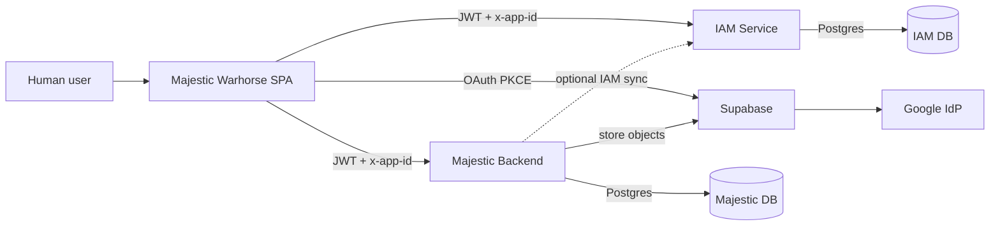

**Why this shape:** Product docs encode a deliberate PetaxAI pattern — **identity is shared** across products; **domain data and app roles are product-local** (`API_DOCUMENTATION.md` L89–96, L118–130; `UI_WORKFLOW.md` “IAM vs school app”). The SPA is a thin client over that split.

---

## 2. Frontend

### 2.1 What it is (**Observed**)

| Attribute | Value | Source |
|-----------|-------|--------|
| Form | Client-side rendered SPA | `src/main.ts` → `AppModule` |
| Framework | Angular ^18 | `package.json` |
| Delivery | Static files under `dist/majestic-warhorse` | `angular.json` |
| Hosting (CI) | SSH deploy of `dist/` to EC2 | `.github/workflows/main.yml` |
| Public URL (prod env) | `https://learning.petaxai.com` | `environment.prod.ts` |

### 2.2 Internal structure (**Observed**)

Detailed folder map: [02_Folder_Structure.md](./02_Folder_Structure.md). Runtime behaviour: [FRONTEND-ARCHITECTURE.md](./FRONTEND-ARCHITECTURE.md).

| Layer | Location | Responsibility |
|-------|----------|----------------|
| Bootstrap / shell | `main.ts`, `app.module.ts`, `app.component.*` | Boot, health banner, dialog host |
| Routing | `app-routing.module.ts` | Eager standalone pages; `authGuard` |
| Features | `pages/`, `components/` | Screens and widgets |
| Auth orchestration | `core/auth/` | OAuth + post-login workflow |
| HTTP | `services/api-service/`, `shared/api-service/`, `interceptors/` | API access |
| Client state | `shared/services/common.service.ts`, sessionStorage | No NgRx |

### 2.3 Frontend does **not** contain

| Concern | Status in this repo |
|---------|---------------------|
| Server-side rendering | Not present |
| Direct database drivers | Not present |
| Direct Supabase Storage uploads | Not present — SPA calls Majestic `POST file/upload` |
| Message queue clients | Not present |
| Redis / cache clients | Not present |
| WebSocket client | **Not Observed** in `src/` |

### 2.4 Frontend container responsibilities

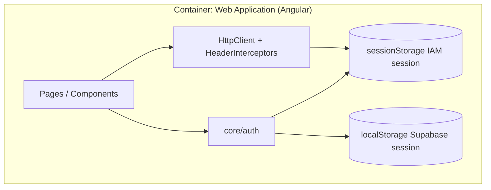

---

## 3. Backend

There are **two application backends** the SPA talks to, plus Supabase as a platform backend for Auth (and Storage via Majestic).

### 3.1 PetaxAI IAM — identity backend

| Field | Detail | Tier |
|-------|--------|------|
| Base path | `{HOST}/auth/api` | Documented + Observed (`environment.iamApi`) |
| Local default | `http://localhost:8080/auth/api/` | Observed |
| Production URL | `https://iam-production-e81f.up.railway.app/auth/api/` | Observed |
| Framework | Express (TypeScript), `serverless-http` | Documented (`IAM_DOCUMENTATION.md` L27–31) |
| Auth model | JWT Bearer + `x-app-id` application scoping | Documented + Observed interceptor |
| Owns | Users, organizations, applications, login, password reset, (IAM) file APIs on S3 | Documented |

**SPA call sites (Observed):** `auth.service.ts`, `organization-api.service.ts`, `registration-api.service.ts`, `application-api.service.ts`, `user-oauth.service.ts`, `organization-oauth.service.ts`, `common-api.service.ts` (`user/delete`), health probe.

### 3.2 Majestic Warhorse Backend — domain backend

| Field | Detail | Tier |
|-------|--------|------|
| Local default | `http://localhost:8081/` | Observed |
| Production URL | `https://majestic-warhorse-backend-production.up.railway.app/` | Observed |
| Interactive docs | `GET /api-docs` (Swagger) | Documented |
| Owns | Courses, chapters, status, teachers/students roster, user-role RBAC, teacher–student links, questions/answers, favorites, discussions, dashboard aggregates, file upload proxy, mail send | Documented + Observed clients |
| JWT enforcement | Doc states backend **does not enforce JWT today** — protect via gateway in production | Documented (`API_DOCUMENTATION.md` L104) — **security-critical** |
| IAM sync | Optional `IAM_SYNC_ENABLED` syncs profile/status to IAM on register/approve — **not** app roles | Documented |

**SPA call sites (Observed):** `courses-api`, `teachers-api`, `students-api`, `user-role-api`, `questionnaire-api`, `favorites-api`, `course-discussions-api`, `file-download-api`, `mail-api`, `common-api` (`file/upload`), `assign-teacher.service`, `dashboard.service`, health probe.

### 3.3 Backend ownership split (**Documented legacy**)

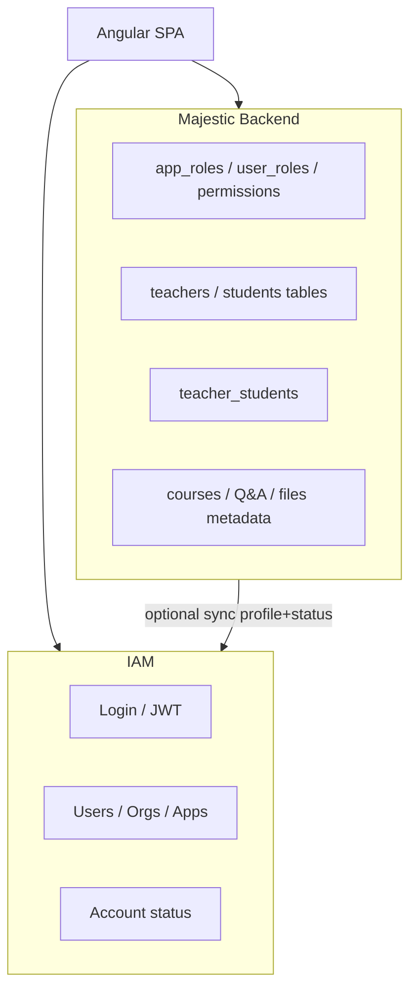

Source: `API_DOCUMENTATION.md` L118–130, L162–171.

### 3.4 What “backend” means for rebuild

Backend **source code is not in this repository**. To rebuild backends you need the separate IAM and Majestic backend repos (or regenerate from OpenAPI + SQL migrations referenced in API docs: `scripts/add_organization_scoping.sql`, `scripts/add_rbac_tables.sql` — those scripts are **referenced in docs**, not present as files in this frontend repo).

---

## 4. Database

### 4.1 Summary

| Store | Engine | Used by | Tier |
|-------|--------|---------|------|
| IAM primary data | **PostgreSQL** (via Supabase / `pg` pool) | IAM service | Documented (`IAM_DOCUMENTATION.md` L29) |
| Majestic primary data | **PostgreSQL** (Supabase pooler via `DATABASE_URL`) | Majestic backend | Documented (`API_DOCUMENTATION.md` L1738–1739) |
| SPA | **None** | — | Observed — browser storage only |

The SPA never opens a DB connection. All persistence is through HTTP APIs.

### 4.2 Logical data domains (**Documented legacy**)

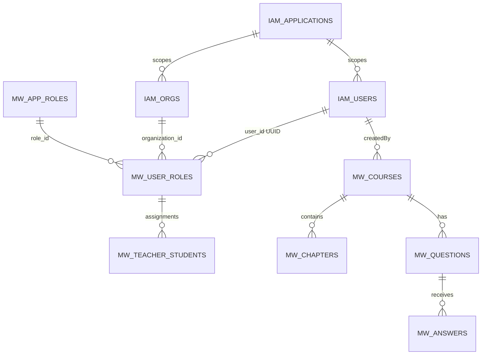

| Domain | Lives in | Notes |
|--------|----------|-------|
| Applications (`client_id: majestic-warhorse`) | IAM | SPA resolves `app_id` via `application/get` |
| User / organization accounts | IAM | Login + Google sync |
| `user_roles`, permissions, roster | Majestic | Pending → approved lifecycle |
| `teacher_students` | Majestic | Assignment graph |
| Courses / status / Q&A / favorites / discussions | Majestic | Learning domain |
| File **metadata** + public URL | Majestic DB + Supabase Storage | Upload via backend |

### 4.3 Unavailable in this repo

- Live schemas / migration SQL files
- Connection strings (only variable *names* documented for backends)
- Whether IAM and Majestic share one Supabase project or two

**Assumption:** Production IAM Railway service and Majestic Railway service each use their own `DATABASE_URL` pointing at Supabase Postgres (possibly same Supabase project, different schemas/databases). Not verifiable here.

---

## 5. Microservices

### 5.1 Service topology (as operated)

This is **not** a large microservice mesh from the SPA’s point of view. It is a **small set of independently deployed services**:

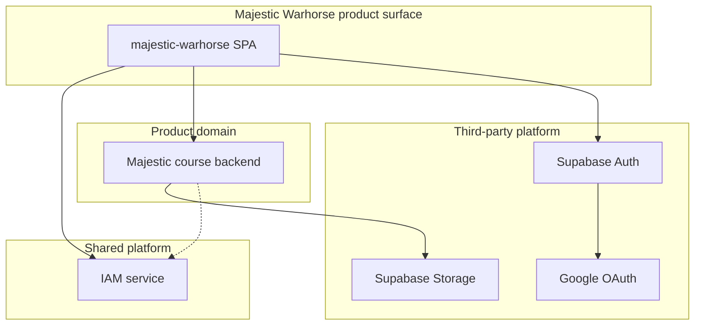

| Service | Deploy unit | Coupling |
|---------|-------------|----------|
| SPA | Static site | Depends on IAM + Majestic + Supabase Auth availability |
| IAM | Railway (prod URL) | Shared across PetaxAI apps (`client_id` / `x-app-id`) |
| Majestic backend | Railway (prod URL) | Product-specific; optional outbound IAM sync |
| Supabase | SaaS | Auth for SPA; Storage for Majestic uploads |

### 5.2 Microservice judgement

| Claim | Verdict |
|-------|---------|
| “Microservices architecture” in the Netflix sense | **Overstatement** for this product |
| “Distributed services with clear bounded contexts” | **Accurate** — Identity (IAM) vs Learning domain (Majestic) vs Auth broker (Supabase) |
| Synchronous HTTP between SPA and services | **Observed** |
| Async event bus between services | **Not Observed** in SPA; **Unknown** between backends |

IAM documentation mentions a **WebSocket server initialized alongside HTTP** (`IAM_DOCUMENTATION.md` L31). The SPA has **no Observed WebSocket usage**, so IAM WS is not part of the Majestic Warhorse client architecture today.

---

## 6. External APIs

### 6.1 APIs the SPA calls directly (**Observed**)

| API | Base config key | Protocol | Auth |
|-----|-----------------|----------|------|
| IAM HTTP | `environment.iamApi` | HTTPS/HTTP JSON | Bearer JWT + `x-app-id` / `app_id` |
| Majestic HTTP | `environment.majesticWarhorseApi` | HTTPS/HTTP JSON + multipart | Bearer JWT + app id headers (attached by interceptor for all HttpClient calls) |
| Supabase Auth | `environment.supabaseUrl` + anon key | Supabase JS SDK | PKCE session in localStorage |
| Google Identity | via Supabase OAuth | Browser redirect | Handled by Google + Supabase |
| Google Fonts / Material Symbols / cdnjs Font Awesome | CDN URLs in `index.html` | HTTPS static | None |

Header attachment: `src/app/interceptors/header.interceptor.ts`.

### 6.2 APIs used indirectly (**Documented legacy**)

| API | Caller | Purpose |
|-----|--------|---------|
| Supabase Storage (S3-compatible) | Majestic backend | `POST /file/upload` stores object; returns public URL |
| IAM from Majestic | Majestic backend when `IAM_SYNC_ENABLED` | Sync user profile/status on register/approve |
| AWS S3 | IAM file module | IAM’s own `/auth/api/file` APIs (not the primary Majestic upload path used by course upload) |

### 6.3 Health endpoints (**Observed**)

`HealthCheckService` probes:

- IAM: `{iamBase}/health`, fallback `{iamBase}/application/get`
- Majestic: `{majesticBase}/health`, fallback base URL

Source: `health-check.service.ts` L118–130.

### 6.4 Endpoint catalogue

Full SPA→backend path inventory: [FRONTEND-ARCHITECTURE.md §18](./FRONTEND-ARCHITECTURE.md#18-external-contracts).  
Payload contracts: [API_DOCUMENTATION.md](../API_DOCUMENTATION.md), [IAM_DOCUMENTATION.md](../IAM_DOCUMENTATION.md).

---

## 7. Authentication

### 7.1 Mechanisms in play

| Mechanism | Purpose | Where |
|-----------|---------|-------|
| IAM email/password login | Primary credential auth | `POST user/login`, `POST organization/login` |
| Supabase Google OAuth (PKCE) | Federated login | `OAuthService` + `SupabaseService` |
| IAM `user/sync` / `organization/sync` | Find-or-create after Google | `user-oauth.service.ts`, `organization-oauth.service.ts` |
| IAM JWT in `sessionStorage` | API authorization credential for SPA→IAM/Majestic | `authToken` / `token` |
| Supabase session in `localStorage` | Refresh Google/Supabase session only | `persistSession: true`, `autoRefreshToken: true` |
| `x-app-id` | Tenant application scoping on IAM | `AppContextService` + interceptor |
| `authGuard` | Route gate on login flag | `auth.guard.ts` — **not** JWT validation |

### 7.2 Password login flow

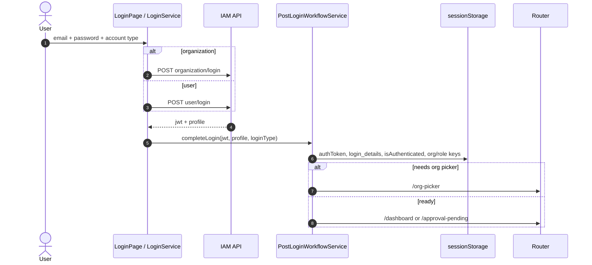

### 7.3 Google login flow

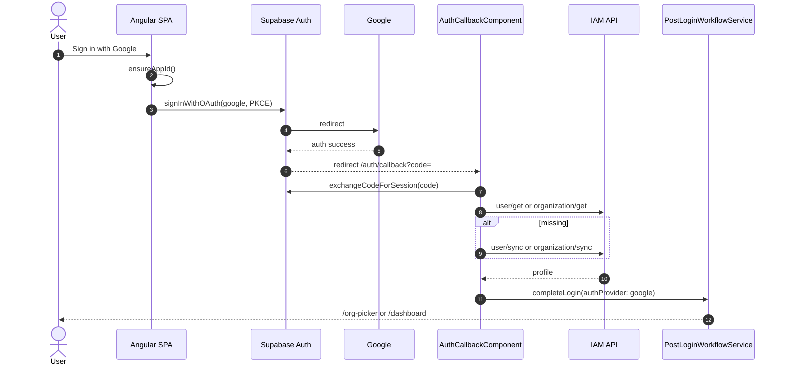

### 7.4 Session and 401 behaviour (**Observed**)

| Event | Behaviour |
|-------|-----------|
| Successful login | JWT + profile in sessionStorage; `AuthService` marks authenticated |
| HTTP 401 | `HeaderInterceptors` → `logOutApplication()` clears session+local storage → `/login` |
| IAM token refresh | **None** in SPA |
| Supabase token refresh | Automatic for Supabase session only — does **not** refresh IAM JWT |
| Logout | `logOutApplication()` |

### 7.5 Authorization vs authentication

| Layer | What it checks | Security strength |
|-------|----------------|-------------------|
| `authGuard` | In-memory/session “logged in” flag | Weak — no JWT parse/expiry |
| UI `*ngIf` by role | `organization` / `teacher` / `student` | UX only |
| IAM middleware | JWT validity + `x-app-id` | Documented for IAM routes |
| Majestic backend | Doc: JWT **not** enforced today | **Gap** — Documented |

---

## 8. Storage

Storage is multi-layered. Do not conflate browser storage with object storage.

### 8.1 Browser storage (**Observed**)

| Store | Contents | Lifecycle |
|-------|----------|-----------|
| `sessionStorage` | `authToken`, `token`, `isAuthenticated`, `login_details`, `loginType`, `organization_id`, `userRoles`, `userPermissions`, `app_id`, `application`, `client_id`, org-picker pending keys, etc. | Tab session; cleared on full logout |
| `localStorage` | Supabase Auth session; `mw-sw-cleanup-v1` flag | Persists across tabs; cleared on `logOutApplication` (full clear) |

### 8.2 Object / file storage (**Documented** + **Observed** upload path)

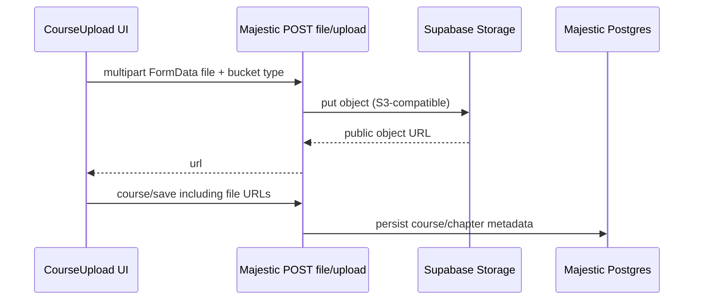

| Concern | Detail | Tier |
|---------|--------|------|
| SPA upload API | `POST {majesticWarhorseApi}file/upload` | Observed (`common-api.service.ts`) |
| Bucket names (client) | `course`, `chapter`, `attachment`, `video-file`, `cover-image` | Observed (`course-upload.service.ts`) |
| Physical store | Supabase Storage; public URL pattern in API docs | Documented |
| Blob download | `POST file/get-blob` | Observed + Documented |
| IAM file APIs | Separate AWS S3 (`betrack-uploads/` prefix in IAM doc) | Documented — **not** the course-upload path |

### 8.3 Static asset storage (**Observed**)

SPA images/fonts ship inside the static build (`src/assets/` → `dist/`). Not related to user course media.

---

## 9. Messaging

### 9.1 What exists

| Mechanism | Present? | Evidence |
|-----------|----------|----------|
| SPA → backend synchronous HTTP | **Yes** | All API services |
| Email send API | **Yes** (backend endpoint) | `mail-api.service.ts` → `POST mail/send-gmail` |
| In-app activity feed | **Yes** (client state) | `CommonService` `activityFeed$` — **not** a message bus |
| WebSocket (IAM) | Server initialized per IAM doc | Documented; **SPA does not consume** |
| Kafka / RabbitMQ / SQS | **Not Observed** in SPA; **Unknown** in backends | No clients in `src/` |
| Server-Sent Events | **Not Observed** | — |

### 9.2 Messaging architecture conclusion

For Majestic Warhorse **as implemented in this SPA**, messaging is **request/response HTTP** plus optional **email** via Majestic `mail/send-gmail`. There is **no** client-side event-driven messaging fabric.

**Assumption:** Invites may trigger email through `mail/send-gmail` or IAM mail templates; exact template pipeline is backend-side (**Documented** IAM has mail template APIs; SPA usage depends on invite implementation details).

---

## 10. Caching

### 10.1 Observed caching / memoization

| Layer | What | Where |
|-------|------|-------|
| App id cache | `sessionStorage.app_id` / `application` | `AppContextService` |
| Org picker cache | `pendingUserOrganizations` | Post-login / org-picker |
| Health check | In-flight + once-per-load guard | `HealthCheckService` |
| Supabase session | Persisted + auto-refresh | `SupabaseService` |
| Angular CLI cache | `.angular/` on disk | Build tooling |
| HTTP response cache | No custom Angular `HttpInterceptor` cache | **Not Observed** |
| Service Worker cache | **Disabled**; legacy SW cleared on boot | `app.module.ts`, `main.ts`, `index.html` |
| Demo mode fixtures | In-memory/module demo data | Replaces some view models — not HTTP cache |

### 10.2 Not present (SPA)

| Technology | Status |
|------------|--------|
| Redis | Not used by SPA; **Unknown** if backends use it |
| CDN edge cache for API | **Unknown** |
| NgRx store cache | No NgRx |

### 10.3 Why SW caching was removed

Bootstrap explicitly unregisters service workers and clears Cache Storage (`main.ts`, `index.html`) so users are not stuck on stale shells after PWA was turned off. This is an intentional **anti-cache** posture for the SPA shell.

---

## 11. Infrastructure

### 11.1 Runtime topology (prod as configured in-repo)

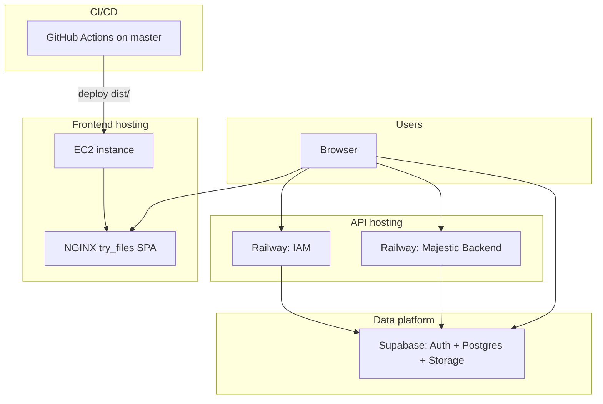

| Piece | Evidence | Tier |
|-------|----------|------|
| SPA URL | `https://learning.petaxai.com` | Observed env |
| SPA deploy | GitHub Actions → SSH → `DEPLOY_TARGET` with `SOURCE: dist/` | Observed workflow |
| NGINX SPA fallback | README `try_files $uri /index.html` | Documented legacy (README) |
| IAM host | Railway hostname in `environment.prod.ts` | Observed |
| Majestic host | Railway hostname in `environment.prod.ts` | Observed |
| Supabase project | `umskkgoddrmdqvvaiezu.supabase.co` | Observed |
| Local SPA | `ng serve` :4200 | Observed |
| Local IAM / Majestic | :8080 / :8081 | Observed env defaults |

### 11.2 CI/CD pipeline (**Observed**)

1. Push to `master`
2. `ubuntu-latest` + Node 20.x
3. `npm install`
4. `CI=false npm run build` (production fileReplacements)
5. `easingthemes/ssh-deploy` uploads `dist/` to EC2

Secrets: `DEPLOY_KEY`, `DEPLOY_HOST`, `DEPLOY_USER`, `DEPLOY_PORT`, `DEPLOY_TARGET`.

### 11.3 What is missing from this repo

| Missing | Impact |
|---------|--------|
| Terraform / CloudFormation / Pulumi | Infra not reproducible from this repo alone |
| NGINX site config as code | Only README instructions |
| Railway service definitions | Only public URLs |
| DNS / TLS certificates as code | Certbot steps in README only |
| CORS configuration | Must live on API servers — **Unknown** here |

---

## 12. Component diagram

C4-style **component** view of the SPA and its immediate collaborators (logical components, not Angular `@Component` widgets).

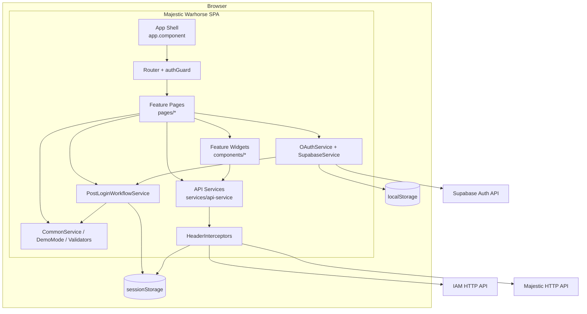

### Component responsibilities (SPA)

| Component | Responsibility |
|-----------|----------------|
| App Shell | Health banner, global dialogs, bootstrap app id |
| Router + authGuard | Navigation; login gate only |
| Feature Pages | User journeys (login, courses, approvals, …) |
| Feature Widgets | Sidepanel, overview, assessments, players |
| OAuth + Supabase | Google PKCE |
| PostLoginWorkflow | Session persistence, org/role routing |
| API Services | Typed/untyped HTTP façades |
| HeaderInterceptors | Attach credentials; logout on 401 |
| CommonService | Cross-cutting client state and toasts |

---

## 13. Container diagram

C4-style **container** diagram for the runnable system.

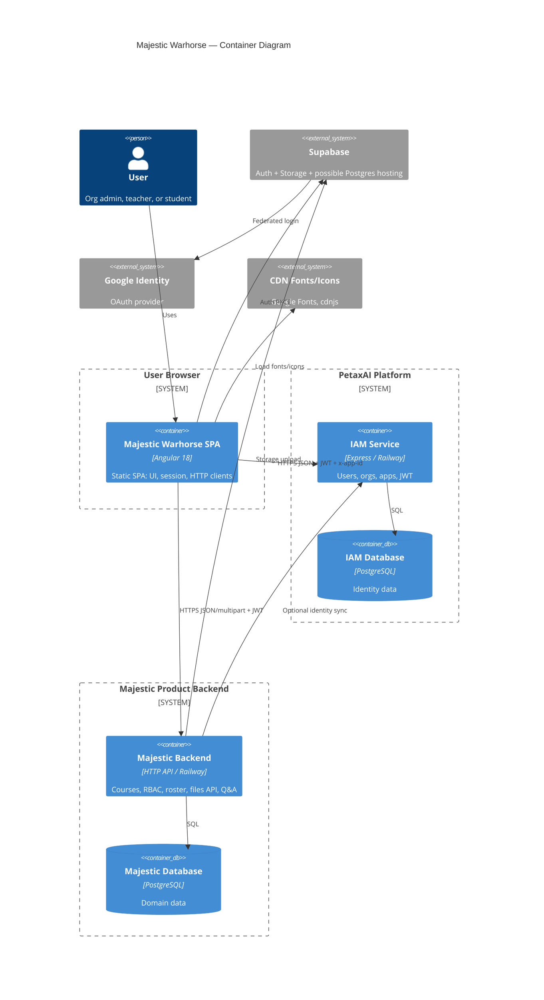

If Mermaid C4 rendering is unavailable in a viewer, use this equivalent flowchart:

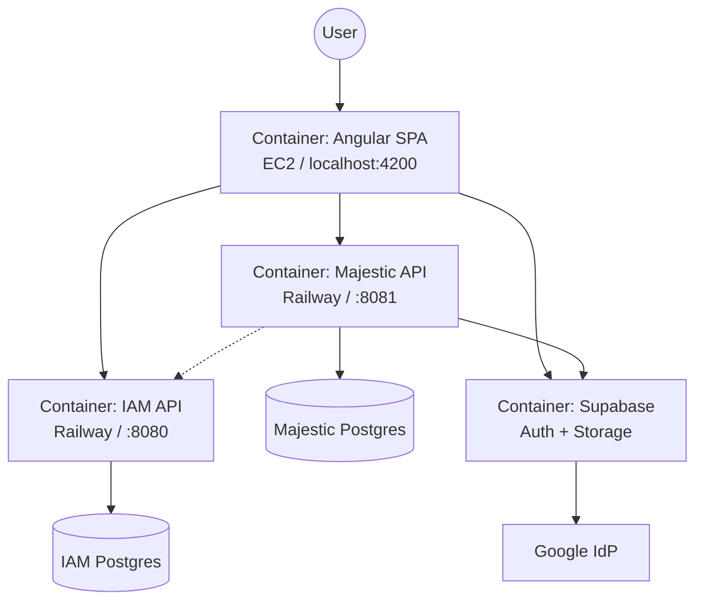

---

## 14. Sequence diagrams

### 14.1 Authenticated API call (course list)

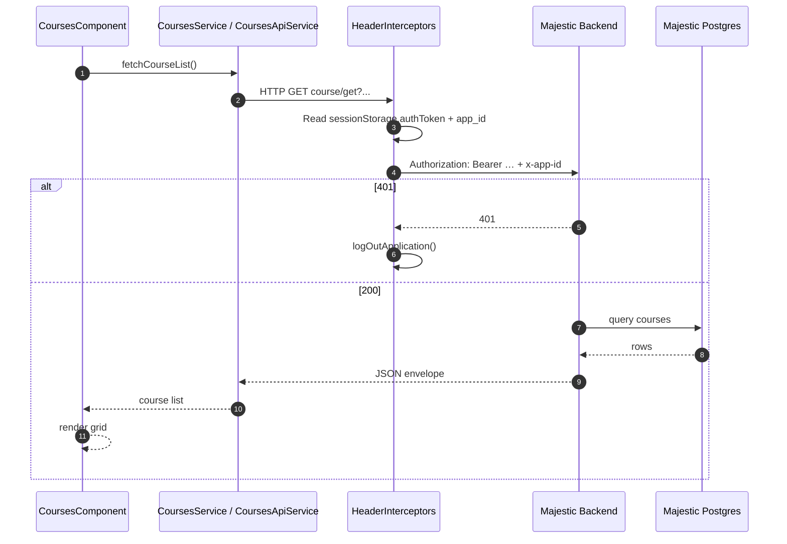

### 14.2 Course file upload + save

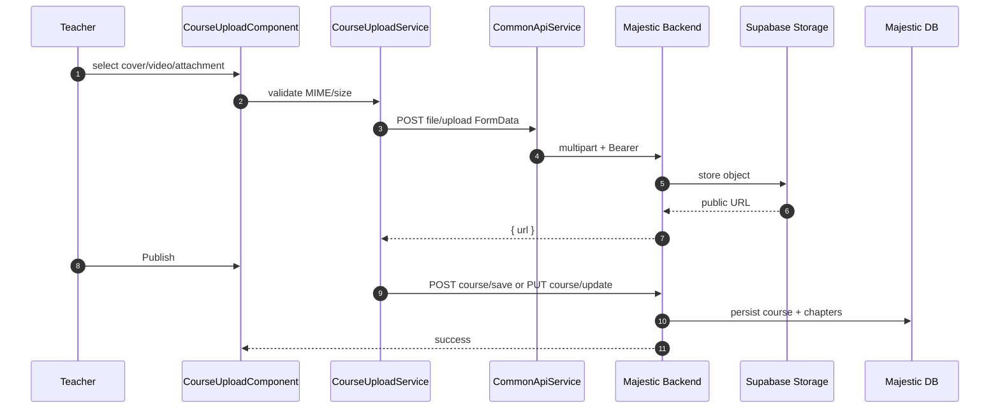

### 14.3 Approval with optional IAM sync (**Documented** backend behaviour)

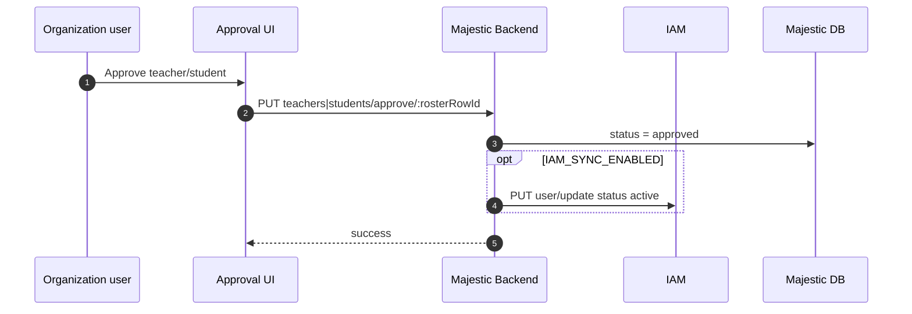

Note: The SPA always sends Bearer via interceptor; whether Majestic validates it depends on backend/gateway configuration (**Documented gap**).

---

## 15. Deployment diagram

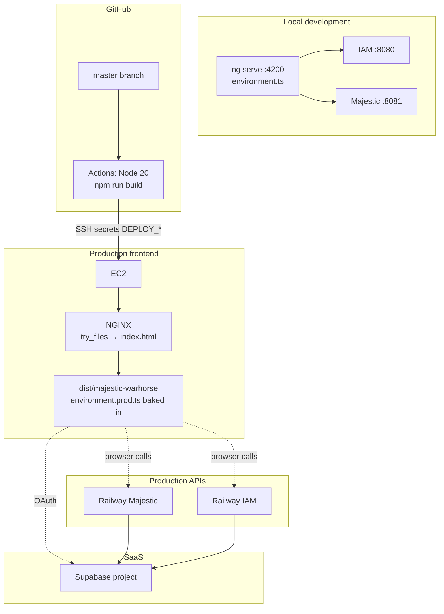

### Deployment notes

| Topic | Detail |
|-------|--------|
| Build-time config | Production API URLs are **compiled into** the JS bundle via fileReplacements — changing APIs requires rebuild/redeploy of SPA |
| Separate deploys | SPA (EC2) and APIs (Railway) deploy independently |
| Branch | CI triggers on `master` only |
| README drift | README still shows sample `build/` + PM2; live workflow uses `dist/` and no PM2 |

---

## 16. Trust boundaries and cross-cutting concerns

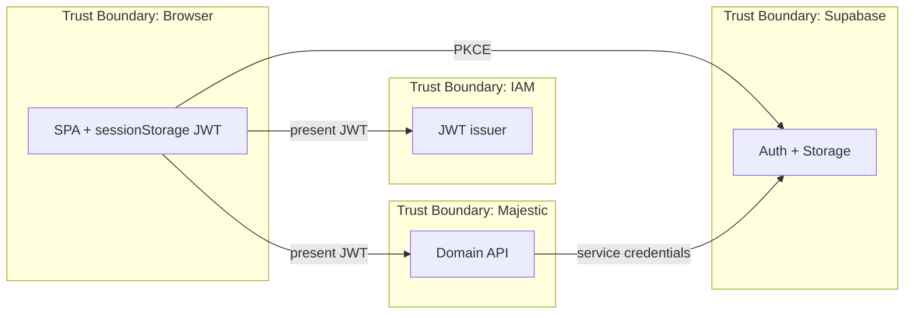

| Concern | Architecture stance |
|---------|---------------------|
| Confidentiality of JWT | Stored in sessionStorage (XSS-sensitive); no HttpOnly cookie session in SPA |
| App tenancy | `client_id` / `x-app-id` |
| Org tenancy | `organization_id` on Majestic calls |
| Role enforcement | Must be server-side; UI gates are insufficient |
| PII | Profiles in IAM; learning data in Majestic — dual store |
| Availability | SPA health banner surfaces IAM/Majestic outages |

---

## 17. Unknowns and rebuild gaps

| ID | Topic | Why unknown | Needed to rebuild |
|----|-------|-------------|-------------------|
| SA-1 | Majestic backend language/framework version as deployed | Only API docs + Railway URL in this repo | Backend repository |
| SA-2 | Whether IAM and Majestic share one Supabase Postgres | Not stated | Infra/backend env |
| SA-3 | Production API gateway / JWT enforcement in front of Majestic | API doc says JWT not enforced in backend | Security architecture |
| SA-4 | CORS allowlist for `learning.petaxai.com` | Not in this repo | Backend/gateway config |
| SA-5 | IAM WebSocket purpose for this product | IAM has WS; SPA unused | Product decision |
| SA-6 | Message queues between IAM and Majestic | No evidence | Backend repos |
| SA-7 | Redis/CDN caching on APIs | No evidence | Infra |
| SA-8 | Exact EC2 NGINX root vs `DEPLOY_TARGET` | README generic paths | Server access / secrets |
| SA-9 | DNS/CDN in front of EC2 | Only hostname in env | DNS provider |

---

## 18. Document control

| Field | Value |
|-------|-------|
| Created | 2026-07-27 |
| Filename | `docs/03_System_Architecture.md` |
| Related planned index name | Aligns with system overview + integrations depth from DOCUMENTATION-INDEX |
| Update triggers | New external service; env URL change; auth flow change; deploy topology change |

### Revision history

| Date | Change |
|------|--------|
| 2026-07-27 | Initial reverse-engineered system architecture |
