# 04 — UI Architecture

**Document type:** Reverse-engineered UI architecture  
**Audience:** Frontend engineers, designers implementing against the SPA, architects  
**Repository:** `majestic-warhorse` (Angular SPA)  
**Evidence date:** 2026-07-27  
**Evidence tier:** **Observed** unless labelled otherwise  

**Cross-references:**
- [DOCUMENTATION-INDEX.md](../DOCUMENTATION-INDEX.md)
- [01_Project_Overview.md](./01_Project_Overview.md)
- [02_Folder_Structure.md](./02_Folder_Structure.md)
- [03_System_Architecture.md](./03_System_Architecture.md)
- [FRONTEND-ARCHITECTURE.md](../frontend_architecture/FRONTEND-ARCHITECTURE.md)
- [UI_WORKFLOW.md](../workflow/UI_WORKFLOW.md) — product screen/API intent
- [design_v1/README.md](../design_v1/README.md) — design system
- [src/assets/screens/DESIGN.md](../../src/assets/screens/DESIGN.md) — “Majestic Cyber” design tokens

---

## Table of contents

1. [UI hierarchy](#1-ui-hierarchy)
2. [Component structure](#2-component-structure)
3. [Layouts](#3-layouts)
4. [Reusable components](#4-reusable-components)
5. [Navigation](#5-navigation)
6. [Routing](#6-routing)
7. [Lazy loading](#7-lazy-loading)
8. [Performance optimization](#8-performance-optimization)
9. [Design patterns](#9-design-patterns)
10. [Screens catalog](#10-screens-catalog)
11. [Component diagrams](#11-component-diagrams)
12. [Design system notes](#12-design-system-notes)
13. [Unknowns](#13-unknowns)
14. [Document control](#14-document-control)

---

## 1. UI hierarchy

The application UI is a **three-level shell** with two major visual modes: **auth** and **dashboard**.

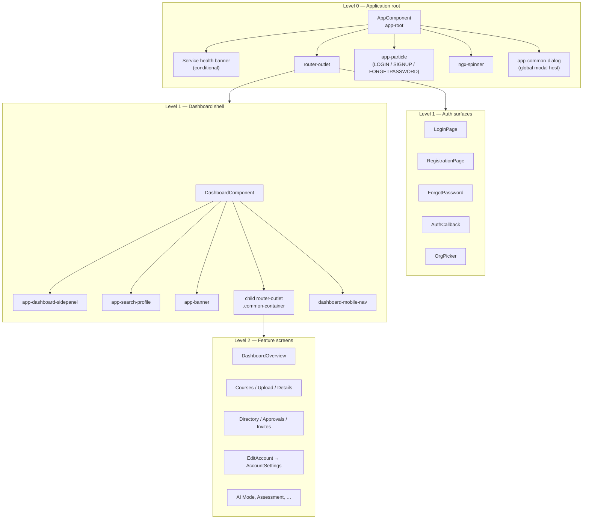

### Hierarchy rules (**Observed**)

| Level | Host | What mounts here |
|-------|------|------------------|
| 0 | `AppComponent` (`src/app/app.component.html`) | Global chrome only — health, particles, spinner, dialog, root outlet |
| 1 Auth | Standalone page components | Full-viewport auth layouts (`_auth-layout.scss`) — **no** dashboard chrome |
| 1 Dashboard | `DashboardComponent` | Sidepanel + header + banner + child outlet + mobile bottom nav |
| 2 | Dashboard children | Feature screens; may compose Level-3 widgets |
| 3 | Feature widgets | e.g. `VideoPlayer`, `StudentAssessment` inside course details |

**Why:** Auth screens must feel branded and uncluttered; logged-in work happens inside a persistent dashboard chrome so navigation does not remount on every child route.

---

## 2. Component structure

### 2.1 Taxonomy

| Kind | Location | Role | Example |
|------|----------|------|---------|
| **Shell** | `app.component`, `pages/dashboard` | Persistent layout chrome | Dashboard sidepanel + header |
| **Page (routed)** | `pages/*`, some `components/*` | One URL → one primary screen | `CoursesComponent`, `OrgPickerComponent` |
| **Feature widget** | `components/*` | Composed into pages | `VideoPlayerComponent` |
| **Shared chrome** | `shared/*` | Cross-cutting UI | `BannerComponent`, `LoaderComponent` |
| **Decorative** | `particle/` | Auth ambience | `ParticleComponent` |
| **Host wrapper** | Thin page | Route target that only embeds another component | `EditAccountComponent` → `AccountSettingsComponent` |

### 2.2 Standalone vs NgModule (**Observed**)

| Pattern | Where |
|---------|-------|
| Root `AppModule` | Declares only `AppComponent`; imports some standalones; provides interceptors |
| Feature UI | Almost all pages/components are `standalone: true` with explicit `imports: []` |
| Routing module | `AppRoutingModule` still classic `RouterModule.forRoot(routes)` |

**Why:** Migration-era Angular — new screens avoid feature NgModules; the shell retains module-level providers (`HTTP_INTERCEPTORS`, Toastr, Spinner, Portal).

### 2.3 Page → widget composition examples

**Course details** (`course-details.component.ts` imports):

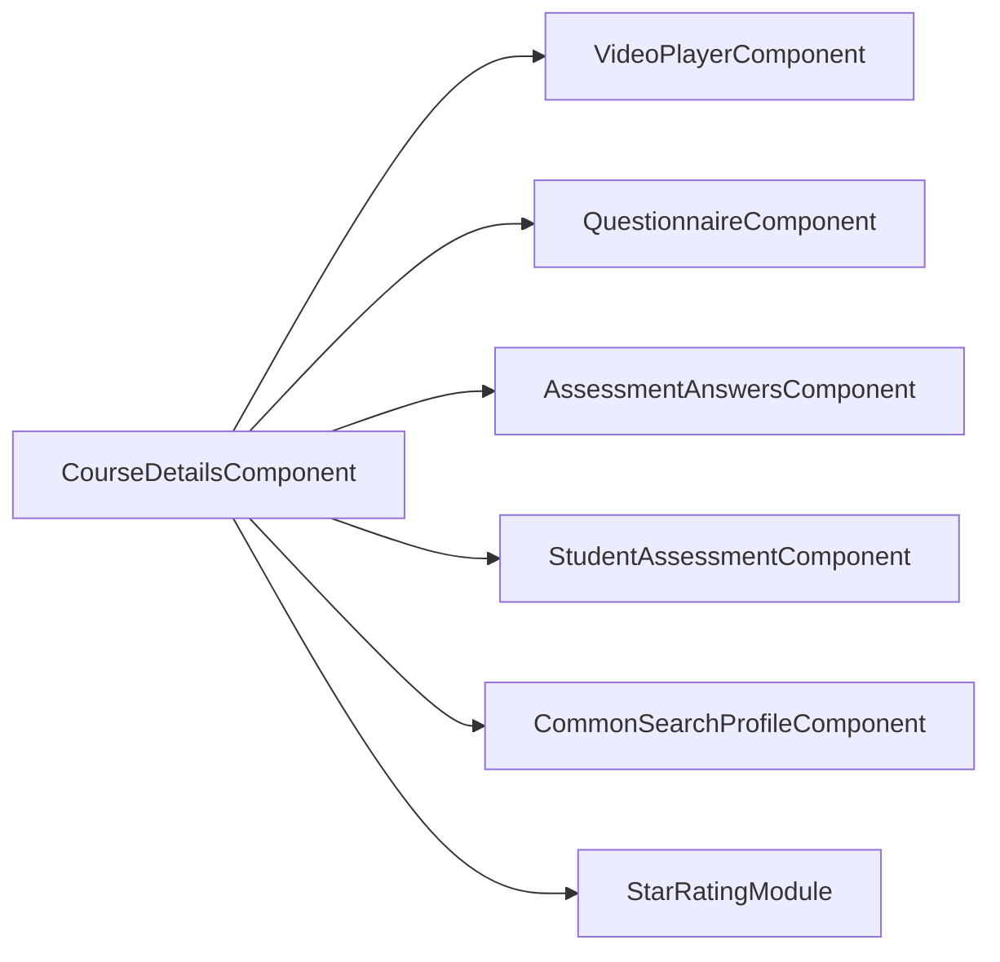

**Directory** (`directory-page.component.ts`):

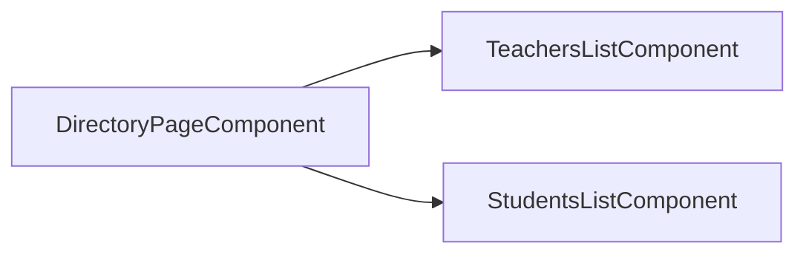

**Approvals** (`approval-page.component.ts`):

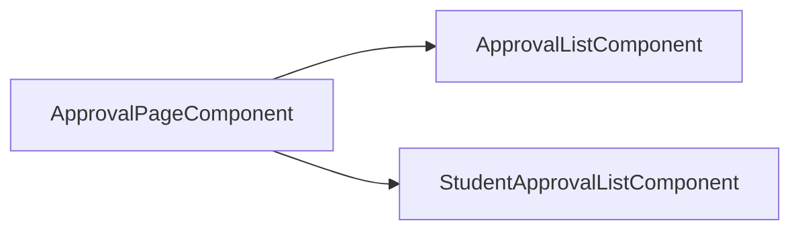

### 2.4 Naming conventions (**Observed**)

| Convention | Example |
|------------|---------|
| Selector prefix | `app-*` |
| Folder ≈ feature | `pages/course-upload/` |
| Template/style co-location | `*.component.html` + `*.component.scss` |
| Typos preserved in code | `app-course-detils` selector; `file-viwer` folder |
| “modal” folders often mean models | `courses/modal/course-list.ts` |

---

## 3. Layouts

### 3.1 Layout inventory

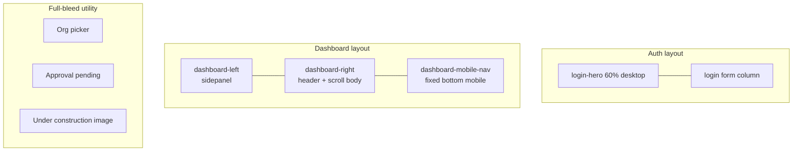

### 3.2 Application shell layout (`AppComponent`)

**File:** `src/app/app.component.html`

| Region | Content |
|--------|---------|
| Top (conditional) | Service health banner when IAM/Majestic health is down |
| Main | `<router-outlet>` |
| Overlay (auth routes) | `<app-particle>` when `activeRouteName` ∈ `PARTICLE_ROUTES_LIST` (`LOGIN`, `FORGETPASSWORD`, `SIGNUP`) — `constants/common-constant.ts` |
| Overlay (global) | `ngx-spinner`, `app-common-dialog` |

### 3.3 Auth layout

**Styles:** `src/styles/_auth-layout.scss`  
**Used by:** login, registration, forgot-password (and related auth SCSS)

| Trait | Detail |
|-------|--------|
| Structure | Flex full viewport; desktop split hero (60%) + form |
| Visual | Dark “Majestic Cyber” tokens; remote hero background images (Googleusercontent URLs in SCSS) |
| Motion | Hero parallax/scale via component `heroTransform` on login |
| Chrome | No sidepanel; particles behind via AppComponent |

### 3.4 Dashboard layout

**Files:** `pages/dashboard/dashboard.component.html` + `.scss`

| Region | Selector / class | Responsibility |
|--------|------------------|----------------|
| Shell | `.dashboard-container` | CSS grid/flex shell |
| Left nav | `.dashboard-left` + `app-dashboard-sidepanel` | Desktop sidenav; slides in on mobile when `isMobileNav` |
| Right column | `.dashboard-right` | Main column |
| Technical backdrop | `.dashboard-right__backdrop*` | Grid + scanline on selected routes (`DASHBOARD_TECHNICAL_BACKDROP_SEGMENTS`) |
| Demo/info banner | `app-banner` | Shared banner slot |
| Header | `app-search-profile` | Search, profile, notifications, mobile menu toggle |
| Scroll body | `.common-container` > `router-outlet` | Feature screens scroll here |
| Mobile nav | `.dashboard-mobile-nav` | Bottom tab bar: Home, Courses, AI FAB, Network, Profile |

**Approval-pending special case:** `[navDisabled]="isApprovalPendingRoute"` disables sidenav navigation while waiting for approval.

### 3.5 Tabbed sub-layouts

| Screen | Pattern |
|--------|---------|
| Directory | Route param `:tab` → teachers/students; role hides teachers tab for non-org |
| Approval | Route param `:tab` → teachers/students |
| Course details | In-page tabs for materials / questions / answers / discussions (**Observed** in component composition) |

### 3.6 Responsive behaviour (**Observed**)

| Breakpoint intent | Behaviour |
|-------------------|-----------|
| Desktop | Sidepanel visible; auth hero visible ≥1024px |
| Mobile | Sidepanel toggled; bottom nav visible; header simplified; safe-area / `viewport-fit=cover` in `index.html` |

---

## 4. Reusable components

### 4.1 Shared chrome (`src/app/shared/`)

| Component / module | Selector / API | Reuse |
|--------------------|----------------|-------|
| `BannerComponent` | `app-banner` | Dashboard shell |
| `LoaderComponent` | loader UI | Async waits |
| `OverlayComponent` | overlay chrome | Modals/layers |
| `ProgressBarComponent` | upload progress | Course upload |
| `DocumentViewerComponent` | document display | Materials |
| `ConfirmationPopupComponent` + service | confirm flows | Destructive actions |
| `SearchFilterPipe` | template filter | Lists/search |
| Form validators | `form-validators.ts` | Auth/account/invite forms |

### 4.2 Feature widgets (`src/app/components/`)

| Component | Purpose | Typical parent |
|-----------|---------|----------------|
| `DashboardSidepanelComponent` | Primary nav + logout/profile | Dashboard shell |
| `CommonSearchProfileComponent` | Header search, activity feed, profile | Dashboard; also imported by course-details |
| `DashboardOverviewComponent` | Home metrics/widgets | Routed `/dashboard/overview` |
| `CommonSliderComponent` | Carousel; can host course upload edit | Overview / upload flows |
| `CommonDialogComponent` | Dynamic component portal (**OnPush**) | App shell |
| `ModalComponent` | Modal presentation | Dialogs |
| `VideoPlayerComponent` | Course video | Course details |
| `AttachmentAccordionComponent` | Chapter materials | Course details |
| `FileViwerComponent` | File preview (typo folder) | Dialogs / details |
| `StudentAssessmentComponent` | Student submits answers | Course details / assessment |
| `AssessmentAnswersComponent` | Teacher reviews answers | Course details |
| `AssignTeachersComponent` + service | Assignment UI + HTTP | Assign flows / dialogs |
| `ViewAssignedStudentsComponent` | Manage teacher→students | Routed manage page |
| `ViewAssignedTeachersComponent` | Manage student→teachers | Routed manage page |
| `UnderConstructionComponent` | Placeholder image | Dashboard `**` route |

### 4.3 Global dialog system

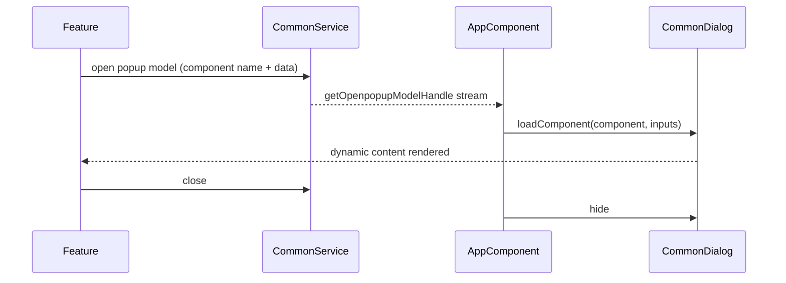

Popup component name constants: `src/app/constants/popup-constants.ts` (`FILE_VIEWER`, `ASSIGN_TEACHER`, `VIEW_ASSIGNED_*`).

### 4.4 What is **not** a shared component library

| Expectation | Reality |
|-------------|---------|
| Angular Material component kit | Package installed; **Mat\* widgets not used** as design system |
| Storybook / design-system package | **Not present** |
| White-label theme service | **Not present** — CSS variables only |

Design tokens live in `src/styles/_variables.scss` (`--mc-*`) mirrored from `assets/screens/DESIGN.md`.

---

## 5. Navigation

### 5.1 Navigation sources

| Source | Mechanism | File |
|--------|-----------|------|
| Desktop sidenav | `routerLink` + active segment helpers | `dashboard-sidepanel.component.html` |
| Path constants | `DASHBOARD_NAV_ROUTES` | `dashboard-routes.config.ts` |
| Active highlighting | `DASHBOARD_NAV_ACTIVE_SEGMENTS` + `isDashboardNavActive()` | same |
| Mobile bottom nav | `navigateMobile()` programmatic | `dashboard.component.ts` |
| Header | Search/profile/notifications; hamburger → sidepanel | `common-search-profile` |
| In-flow | e.g. course card → details via `DashboardService` state + navigate | `dashboard.component.ts` `handleCourseDetailsView` |
| Post-login | `PostLoginWorkflowService` navigates org-picker / dashboard / pending | `core/auth/` |

### 5.2 Role-gated sidenav (**Observed**)

| Nav item | Visible when |
|----------|----------------|
| Directory | `organization` or `teacher` |
| Approvals | `organization` only |
| Switch Organization | not `organization` |
| Assign Teachers / Invite Teacher / Invite Student | **Commented out** in template (routes still exist) |
| Courses / Overview / AI Mode / Account | Generally available inside dashboard (exact `*ngIf` per item in sidepanel HTML) |

**Security note:** Hiding nav is **not** authorization. Routes remain reachable if the URL is known ([FRONTEND-ARCHITECTURE.md §7](./FRONTEND-ARCHITECTURE.md#7-role-based-ui)).

### 5.3 Mobile bottom nav mapping

| Tab | Navigates to (role-aware for Network) |
|-----|----------------------------------------|
| Home | `/dashboard/overview` |
| Courses | `/dashboard/courses` |
| AI (FAB) | `/dashboard/ai-mode` |
| Network | Directory for org/teacher; otherwise role-specific target in `navigateMobile` |
| Profile | `/dashboard/account` |

### 5.4 Navigation configuration diagram

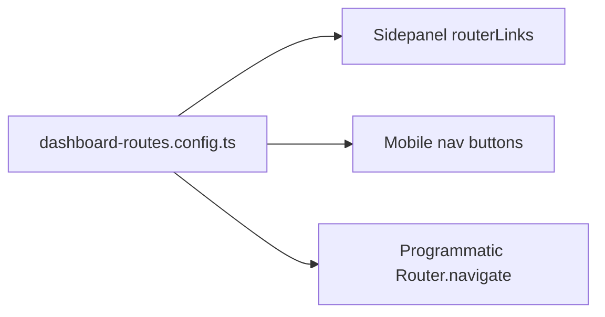

**Best practice (Observed intent):** Keep `DASHBOARD_NAV_ROUTES` as the single source of truth; avoid hardcoding `/dashboard/...` strings in new code.

---

## 6. Routing

### 6.1 Router setup (**Observed**)

- `RouterModule.forRoot(routes)` in `AppRoutingModule`
- **No** `loadChildren` / **No** `loadComponent` lazy routes
- Functional `authGuard` on `/org-picker` and `/dashboard`
- Unknown dashboard paths → `UnderConstructionComponent`
- Unknown top-level paths → redirect `/login`

### 6.2 Route map

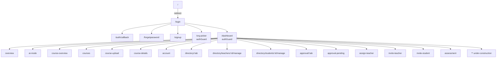

Full table: `src/app/app-routing.module.ts` L28–66.

### 6.3 Redirect aliases

| From | To |
|------|----|
| `/dashboard/teachers` | `directory/teachers` |
| `/dashboard/students` | `directory/students` |
| `/dashboard/student-approval` | `approval/students` |
| `` `/` `` | `/login` |
| unmatched top-level | `/login` |

### 6.4 State passing

Course details often receives `selectedCourse` via **Router state** (`navigate(..., { state: { selectedCourse } })`), not only query params — `dashboard.component.ts` L101–104.

### 6.5 Guards / resolvers

| Feature | Present? |
|---------|----------|
| `CanActivate` auth | Yes — `authGuard` |
| Role `CanActivate` | **No** |
| `CanMatch` | **No** |
| Resolvers | **No** |

---

## 7. Lazy loading

### 7.1 Current state (**Observed**)

**There is no route-level lazy loading.**

All dashboard child components are **statically imported** at the top of `app-routing.module.ts` and referenced with `component: SomeComponent`. That means they participate in the **main/eager bundle** graph for routing (subject to general webpack splitting, but not Angular lazy route chunks).

```ts
// Pattern in use (eager):
{ path: 'courses', component: CoursesComponent }

// Pattern NOT used:
// { path: 'courses', loadComponent: () => import('...').then(m => m.CoursesComponent) }
// { path: 'courses', loadChildren: () => import('./courses.routes') }
```

### 7.2 Implications

| Topic | Implication |
|-------|-------------|
| Initial load | Larger initial JS than a lazy route tree |
| Navigation | Instant component availability after first load; no per-route import spinner from the router |
| Code splitting opportunity | High-value candidates: `course-details`, `course-upload`, `questionnaire`, directory/approval trees, `ai-mode` |

### 7.3 Related “deferred UI” that is **not** lazy routing

| Mechanism | What it does |
|-----------|--------------|
| `CommonDialogComponent.loadComponent` | Dynamically creates dialog content components at runtime |
| `*ngIf` / `@if` | Conditionally creates DOM |
| Demo mode fixtures | Swaps data, not bundles |

---

## 8. Performance optimization

### 8.1 What exists (**Observed**)

| Technique | Where | Notes |
|-----------|-------|-------|
| `ChangeDetectionStrategy.OnPush` | `CommonDialogComponent` only | Almost all screens use default CD |
| `trackBy` | `courses.component.ts`, `dashboard-overview.component.ts` | `trackByIndex` — weak (index-based) |
| `takeUntil(destroy$)` | Many components | Subscription cleanup |
| Service worker **disabled** | `angular.json`, `AppModule` | Avoids stale shell; no offline asset cache |
| Legacy SW cleanup | `main.ts`, `index.html` | Clears Cache Storage once |
| Image assets | local `assets/images` + remote auth heroes | Remote heroes add network dependency on auth |
| Production `outputHashing: all` | `angular.json` | Cache-busting static assets |
| Spinner interceptor | **Commented out** | Reduces global overlay work; loading UX inconsistent |

### 8.2 What is missing / risk areas

| Risk | Why it matters |
|------|----------------|
| Default CD on overview + course lists + assessments | Large templates rechecked often |
| Eager route imports | Larger first paint JS |
| Index `trackBy` | Re-renders more than id-based trackBy |
| No virtual scroll | Long directory/approval lists |
| Duplicate search header import on course-details | Extra instance possible inside dashboard that already has header |
| Large SCSS budgets | `angular.json` allows multi‑MB component styles before error |

### 8.3 Recommended successor optimizations (labelled **Assumption** / guidance, not present code)

1. Convert heavy routes to `loadComponent`.
2. Adopt OnPush + async pipe on list pages.
3. Replace `trackByIndex` with stable entity ids.
4. Consider CDK virtual scroll for roster tables.
5. Re-enable spinner selectively with skip headers (already defined in health service).

---

## 9. Design patterns

| Pattern | How it appears | Why |
|---------|----------------|-----|
| **Standalone components** | Most UI | Modern Angular composition without feature modules |
| **Shell + nested router-outlet** | Dashboard | Persistent chrome across features |
| **Facade page services** | `login.service`, `courses.service`, `course-upload.service` | Keep components thinner |
| **API service layer** | `*api.service.ts` | Isolate HTTP |
| **Post-login workflow orchestrator** | `PostLoginWorkflowService` | Multi-step auth/org/role |
| **Config object for nav** | `dashboard-routes.config.ts` | Single source of path strings |
| **Role-based view composition** | `*ngIf` on privilege | Fast UX gating (not security) |
| **Tab-via-route-param** | directory/approval `:tab` | Deep-linkable tabs |
| **Router state for entity handoff** | course details `state.selectedCourse` | Avoid large query strings |
| **Global dialog portal** | `CommonDialog` + `CommonService` streams | One modal host |
| **Demo mode strategy** | `DemoModeService` + `data/*-demo.data.ts` | Sales fixtures without full HTTP mocks |
| **Smart/dumb partial split** | Thin `EditAccount` host vs rich `AccountSettings` | Route stability |
| **Interceptor cross-cutting** | `HeaderInterceptors` | Auth headers / 401 |
| **Template-driven + reactive forms mix** | Auth reactive; upload/`ngModel` elsewhere | Historical mixed style |

### Anti-patterns / debt (**Observed**)

| Debt | Location |
|------|----------|
| HTTP service living under `components/assign-teachers/` | Prefer `services/api-service` |
| Commented nav vs live routes | Discoverability gap |
| Duplicate under-construction components | pages vs components |
| Empty folders (`join-role`, `demo-mode-banner`, `store`) | Noise in tree |
| Selector typo `app-course-detils` | Consistency |

---

## 10. Screens catalog

### 10.1 Auth & onboarding

| Screen | Route | Primary component | Layout |
|--------|-------|-------------------|--------|
| Login | `/login` | `LoginPageComponent` | Auth |
| Sign up | `/signup` | `RegistrationPageComponent` | Auth |
| Forgot password | `/forgetpassword` | `ForgotPasswordComponent` | Auth |
| OAuth callback | `/auth/callback` | `AuthCallbackComponent` | Minimal |
| Org picker | `/org-picker` | `OrgPickerComponent` | Full-bleed picker |
| Approval pending | `/dashboard/approval-pending` | `ApprovalPendingComponent` | Dashboard (nav disabled) |

### 10.2 Dashboard home & account

| Screen | Route | Primary component |
|--------|-------|-------------------|
| Overview | `/dashboard/overview` | `DashboardOverviewComponent` |
| AI Mode | `/dashboard/ai-mode` | `AiModeComponent` (**stub** prompt submit) — target product is full AI Tutor / diagnostic chat per [05_AI_Tutor_Adaptive_Learning_Strategy.md](./05_AI_Tutor_Adaptive_Learning_Strategy.md) |
| Account | `/dashboard/account` | `EditAccountComponent` → `AccountSettingsComponent` |

### 10.3 Learning

| Screen | Route | Primary component | Notable children |
|--------|-------|-------------------|------------------|
| Course overview | `/dashboard/course-overview` | `CourseOverviewComponent` | Alternate catalog |
| Courses | `/dashboard/courses` | `CoursesComponent` | Cards grid |
| Course upload | `/dashboard/course-upload` | `CourseUploadComponent` | Progress bar, file inputs |
| Course details | `/dashboard/course-details` | `CourseDetailsComponent` | Video, accordion, Q&A widgets |
| Assessment | `/dashboard/assessment` | `QuestionnaireComponent` | Question authoring |

### 10.4 Organization / roster

| Screen | Route | Primary component |
|--------|-------|-------------------|
| Directory | `/dashboard/directory/:tab` | `DirectoryPageComponent` |
| Manage teacher’s students | `/dashboard/directory/teachers/:id/manage` | `ViewAssignedStudentsComponent` |
| Manage student’s teachers | `/dashboard/directory/students/:id/manage` | `ViewAssignedTeachersComponent` |
| Approvals | `/dashboard/approval/:tab` | `ApprovalPageComponent` |
| Assign teachers | `/dashboard/assign-teacher` | `StudentTeacherAssignListComponent` |
| Invite teacher | `/dashboard/invite-teacher` | `InviteTeacherComponent` |
| Invite student | `/dashboard/invite-student` | `InviteStudentComponent` |

### 10.5 Fallback

| Screen | Route | Component |
|--------|-------|-----------|
| Under construction | `/dashboard/**` unknown | `components/under-construction` |
| Catch-all | `/**` | redirect login |

### 10.6 Design prototypes (not runtime screens)

`src/assets/screens/*.html` — static comps for login, dashboard, courses, etc. Used as design reference alongside `DESIGN.md`, **not** routed.

---

## 11. Component diagrams

### 11.1 Application UI component diagram

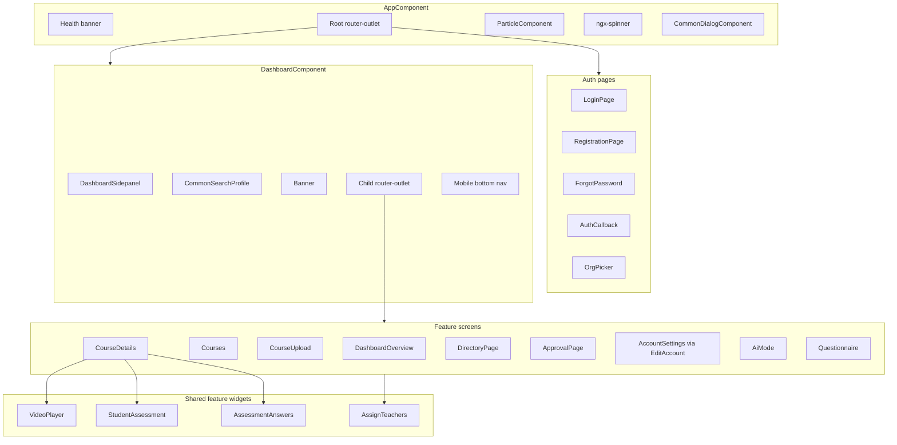

### 11.2 Dashboard shell composition

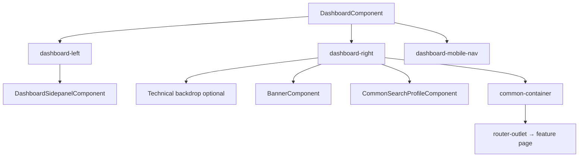

### 11.3 Course details internal UI

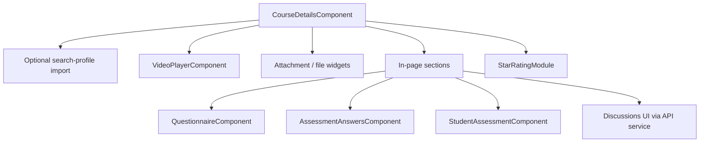

### 11.4 Navigation component relationships

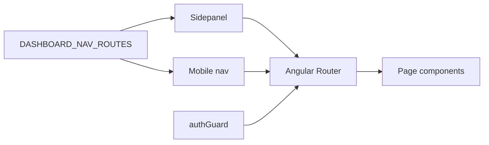

---

## 12. Design system notes

| Topic | Implementation |
|-------|----------------|
| Theme name | Majestic Cyber (`DESIGN.md`) |
| Tokens | `--mc-surface`, `--mc-primary-container`, `--mc-brand-gradient`, fonts |
| Typography | Space Grotesk / Geist / JetBrains Mono (CDN) + self-hosted Archivo/Poppins/etc. |
| Icons | Material Symbols Outlined + inline SVG assets + Font Awesome CDN |
| Motion | Auth hero transform; dashboard backdrop scanline; particles on auth |
| Encapsulation | Default Emulated on components; global partials in `src/styles/` |

White-label readiness: tokens enable recoloring; logos/copy remain hardcoded — see [01_Project_Overview.md](./01_Project_Overview.md) and [FRONTEND-ARCHITECTURE.md §13](./FRONTEND-ARCHITECTURE.md#13-styling-and-white-labelling).

---

## 13. Unknowns

| ID | Unknown | Why |
|----|---------|-----|
| UI-1 | Whether `course-overview` or `courses` is the long-term catalog | Both routed; product docs emphasize courses listing rules |
| UI-2 | Final mobile “Network” destination matrix for students | Implemented in `navigateMobile`; confirm against product intent |
| UI-3 | Planned contents of empty `demo-mode-banner/` | Folder empty; demo UX may be elsewhere |
| UI-4 | Whether remote auth hero images are permanent brand assets | URLs hardcoded in `_auth-layout.scss` to Googleusercontent |
| UI-5 | Accessibility audit status | Some `aria-label`s exist; no full a11y doc in repo |

---

## 14. Document control

| Field | Value |
|-------|-------|
| Created | 2026-07-27 |
| Filename | `docs/04_UI_Architecture.md` |
| Update triggers | New routes, shell layout changes, new shared components, introduction of lazy routes |

### Revision history

| Date | Change |
|------|--------|
| 2026-07-27 | Initial reverse-engineered UI architecture |
