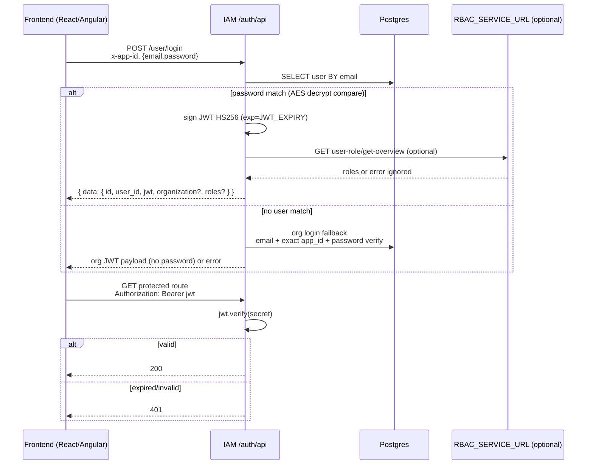
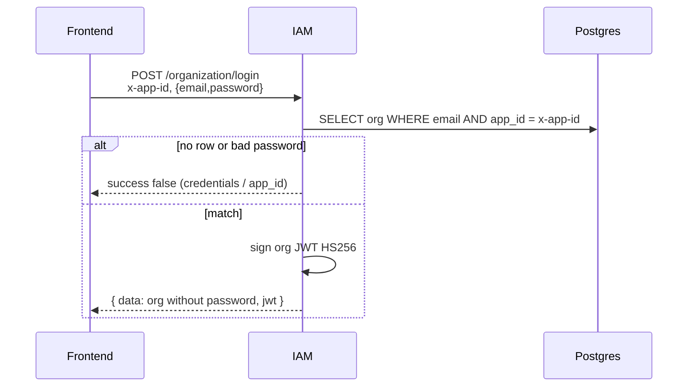
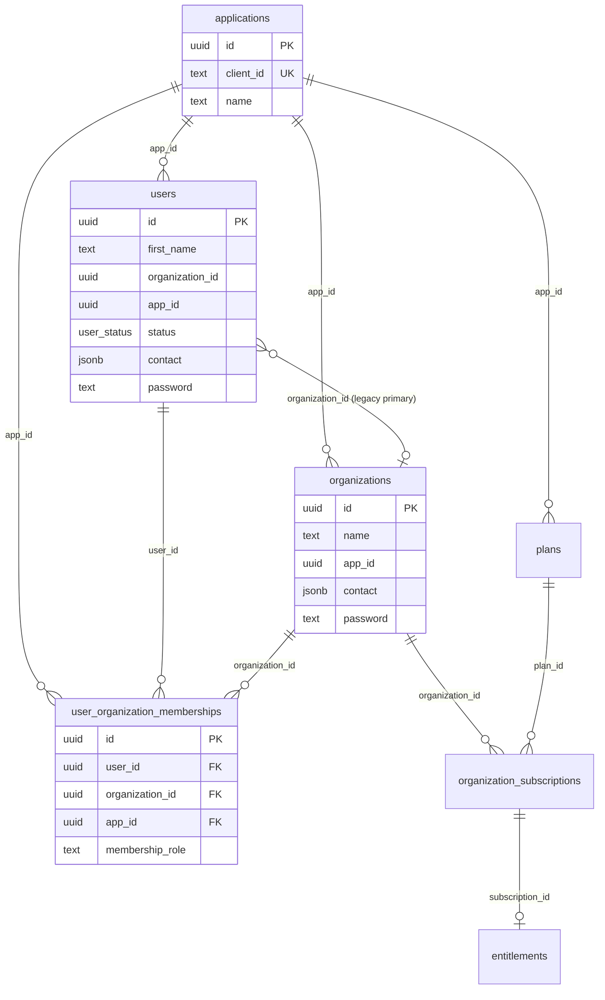

# PetaxAI IAM — Platform Architecture

> Audience: Technical Architect joining PetaxAI who has never seen this repo.  
> Scope: the Node.js IAM service as **shared platform infrastructure** consumed by Church Manager and Majestic Warhorse.  
> Rule for this document: claims are grounded in code that was read. Unclear items are in [§15 Open Questions](#15-open-questions).  
> **Last updated:** 2026-08-10 — org login now scopes by exact `app_id`, verifies password, and omits password from the response.

**Related (API cookbook historically separate):** prefer this architecture doc + [../API_DOCUMENTATION.md](../API_DOCUMENTATION.md) for FE-used IAM paths.  
**Service architectures (same folder):** [`LEARNING_ARCHITECTURE.md`](./LEARNING_ARCHITECTURE.md) · [`AI-ARCHITECTURE.md`](./AI-ARCHITECTURE.md)  
**Frontend MVP checklist:** [`FRONTEND-MVP.md`](../FRONTEND-MVP.md)  
**Docs index:** [`DOCUMENTATION-INDEX.md`](../DOCUMENTATION-INDEX.md)

---

## 1. Overview

### What this service is responsible for

IAM is a multi-tenant identity and membership service. It:

- Stores **user identity** (profile, contact, password ciphertext, account status).
- Stores **organizations** and **user ↔ organization memberships**.
- Issues and verifies **JWTs** for users and organizations.
- Scopes many operations by **application** via the `x-app-id` header (`applications.id` UUID).
- Hosts optional **billing / subscription / entitlement** APIs used primarily by Church Manager.
- Hosts CRUD for a separate **IAM RBAC** model (`roles` / `permissions` / `modules`) that documentation states is **not** used by Majestic Warhorse or Church Manager course flows ([`IAM_DOCUMENTATION.md`](../IAM_DOCUMENTATION.md) L52, L291–299).
- Sends transactional email (OTP, new-member notify, access-approved) when `GMAIL_ENABLED` is set.

### What this service is not

| Not responsible for | Where it actually lives |
|---|---|
| Teacher / student (or other product roster roles) | Course backends’ `user_roles` ([`services/userService.ts`](../services/userService.ts) L255–256; [`scripts/migrate_user_organization_memberships.sql`](../scripts/migrate_user_organization_memberships.sql) L1–2) |
| Google OAuth as an IdP | **Not implemented in this repo.** Frontends authenticate with Google elsewhere, then call IAM sync/login APIs. `firebase` / `firebase-admin` are in `package.json` but have **zero imports** in TypeScript. |
| Refresh tokens / session revocation | Absent — tokens expire only via JWT `exp` |
| Being the sole auth gate for course APIs | Course backends validate JWTs independently (or fail open — see §11; not proven from this repo alone) |

### Consumers (as documented + seeded)

| Product | Frontend | Backend | `applications.client_id` |
|---|---|---|---|
| The Church Manager | React (`localhost:5173` / `thechurchmanager.com`) | Python course backend | `thechurchmanager` |
| Majestic Warhorse | Angular (`localhost:4200` / `learning.petaxai.com`) | Python course backend | `majestic-warhorse` |

Seeds: [`scripts/applications.sql`](../scripts/applications.sql) L28–30; [`scripts/migrate_majestic_warhorse_application.sql`](../scripts/migrate_majestic_warhorse_application.sql).

**Verdict (reusability):** Tenancy is mostly data-driven (`x-app-id` UUID). Product-specific coupling is concentrated in CORS allowlists, SQL seeds, billing copy, and docs — not in runtime `if (client_id === 'majestic')` branches. See [§9](#9-consumer-specific-coupling).

---

## 2. Repository map

```
IAM/
├── server.ts                 # Entry: Express app, health, listen, serverless export
├── securityHandler.ts        # CORS, helmet, rate limit
├── config.ts                 # Env-backed config (JWT, Gmail, port)
├── routes/                   # HTTP routers mounted under /auth/api
├── controllers/              # Request handlers
├── services/                 # Business logic (Postgres via pg)
├── queries/                  # SQL strings
├── middleware/               # auth, appId, requireAccess, schema validate
├── dbhandler/                # Postgres pool + legacy Mongoose models/interfaces
├── external/                 # HTTP client to RBAC_SERVICE_URL
├── scripts/                  # SQL DDL / migrations (manual)
├── swagger/                  # OpenAPI comments (UI mount commented out)
├── Dockerfile / railway.toml # Primary deploy path
└── netlify.toml              # Legacy / partial (no functions/ dir observed)
```

| Concern | Choice | Evidence |
|---|---|---|
| Runtime | Node.js `>=22` | [`package.json`](../package.json) L8–10 |
| Framework | Express 4 | [`server.ts`](../server.ts) |
| Mount prefix | `/auth/api` | [`server.ts`](../server.ts) L42 |
| Primary DB | PostgreSQL via `pg` Pool | [`dbhandler/postgresPool.ts`](../dbhandler/postgresPool.ts) |
| Legacy DB | Mongoose still used by file + mail-template services | `services/fileService.ts`, `services/mailTemplateService.ts` |
| Serve | Long-running HTTP (`server.listen`) + `serverless-http` export | [`server.ts`](../server.ts) L69–72, L92 |
| Deploy | Railway (`railway.toml`) / Docker (App Runner–oriented) | [`railway.toml`](../railway.toml), [`Dockerfile`](../Dockerfile) |

**Startup order** ([`server.ts`](../server.ts) L69–85): listen first → then `initDB()`. Missing `DATABASE_URL` does not exit the process; DB-backed routes fail until configured.

---

## 3. Public API surface

Base URL: `{HOST}/auth/api`.

Auth columns:

- **`x-app-id`**: middleware [`middleware/appId.ts`](../middleware/appId.ts) — required string, must resolve to a row in `applications`.
- **Bearer JWT**: middleware [`middleware/auth.ts`](../middleware/auth.ts) — `Authorization: Bearer <token>`.

**Consumer column** uses documented intent from [`IAM_DOCUMENTATION.md`](../IAM_DOCUMENTATION.md) L79–90 and course-backend sync section. Where docs and routes disagree, both are noted.

### 3.1 Health

| Method | Path | Auth | Request | Response | Errors | Consumers |
|---|---|---|---|---|---|---|
| ALL / GET | `/health-check` | — | — | `{ timeZone, code: 200, message }` (+ `databaseConfigured` on the early `server.ts` handler) | — | Railway healthcheck; ops |

Duplicate registration: early handler in [`server.ts`](../server.ts) L25–32 and router [`routes/healthCheck.ts`](../routes/healthCheck.ts).

### 3.2 User ([`routes/user.ts`](../routes/user.ts))

| Method | Path | Auth | Request shape | Response shape | Errors | Consumers |
|---|---|---|---|---|---|---|
| GET | `/user/get` | `x-app-id` | Query: `id`, `organization_id`, `status`, `email`, `first_name`, `last_name`, `team` | `{ success, message, data: User[] }` | 404 if `?id=` and empty; 400 on failure | Frontends; course backend lookup |
| POST | `/user/save` | `x-app-id` | User body | `{ success, message, data, error }` | Duplicate email reject (often HTTP 200 with `success: false` via controller catch) | Legacy / admin |
| POST | `/user/sync` | `x-app-id` | Patchable user fields + optional `id`; `contact.email` required on create | `{ success, message, data, error }` — **must include `data.id`** | 400; app mismatch | **Course backends** (roster invite) |
| POST | `/user/save-bulk` | `x-app-id` | `{ users: [], extra_variables? }` | `{ saved, errors }` | Partial failures in `errors` | Org import flows |
| POST | `/user/login` | `x-app-id` | `{ email, password }` | `{ success, message, data: { …jwt claims, jwt, organization?, roles?, app_id } }` | Reject payload (controller may return 200 on catch — see `validteUserController`) | **Both frontends** |
| PUT | `/user/update` | `x-app-id` | User with `id` + fields to patch (`status`, `organization_id`, …) | `{ success, message, data }` | 400 invalid status / not found / app mismatch | **Course backends** (approve → `active`) |
| PUT | `/user/approve-teachers` | **none** (no `appId`, no `auth`) | `[{ id, status }, …]` | Bulk success/failed summary | 400 | Legacy; docs say unused by course backends |
| POST | `/user/forgot-password` | — | `{ email, sendEmail? }` | OTP metadata | User not found | Frontends |
| POST | `/user/confirm-password` | — | `{ email/otp/password` via handler } | JWT user | Invalid OTP | Frontends |
| DELETE | `/user/delete/:userid` | Bearer | Param `userid` | Success message | 401 | Admin |

Valid `status` values (enforced in service): `pending` \| `active` \| `suspended` \| `deleted` \| `rejected` ([`dbhandler/interfaces/userinterface.ts`](../dbhandler/interfaces/userinterface.ts)).

### 3.3 Organization ([`routes/organization.ts`](../routes/organization.ts))

| Method | Path | Auth | Notes | Consumers |
|---|---|---|---|---|
| GET | `/organization/get` | `x-app-id` | List/filter orgs | Admin / tooling |
| GET | `/organization/get-for-users` | `x-app-id` | Public list filtered by `app_id` | Self-join UI |
| GET | `/organization/get/:id` | — | By id | Frontends |
| GET | `/organization/users` | Bearer | Users for org | Admin |
| GET | `/organization/list` | `x-app-id` only | Controller expects `req.user.id` **or** `?user_id=` ([`organizationControllers.ts`](../controllers/organizationControllers.ts) L147–154). **`auth` middleware is not on this route** — docs that require Bearer are inaccurate relative to code. | Frontends (org picker) |
| POST | `/organization/save` | `x-app-id` | Optional Bearer for owner link | Onboarding |
| POST | `/organization/sync` | `x-app-id` | Idempotent OAuth/org sync | Course / OAuth onboarding |
| PUT | `/organization/update` | Bearer | | Admin |
| POST | `/organization/login` | `x-app-id` | `{ email, password }` → org JWT; lookup is **email + exact `app_id`**; password verified; `password` field stripped from response. See §5.3 | Org admin UI |
| POST | `/organization/forgot-password` | — | | Org admin |
| POST | `/organization/confirm-password` | — | | Org admin |
| DELETE | `/organization/delete/:organizationid` | Bearer | | Admin |

### 3.4 Application ([`routes/application.ts`](../routes/application.ts))

| Method | Path | Auth | Consumers |
|---|---|---|---|
| GET | `/application/get` | — | Frontends (resolve apps) |
| GET | `/application/get/:id` | — | |

### 3.5 Billing (mounted at `/`, not `/billing`) — [`routes/billing.ts`](../routes/billing.ts)

Plans, subscriptions, access, access-guard. Several routes have `auth` **commented out**. Primary consumer intent: **Church Manager** (seed comment in [`scripts/seed_default_billing_plans.sql`](../scripts/seed_default_billing_plans.sql) L1).

### 3.6 IAM RBAC — `/role`, `/permission`, `/module`

All use Bearer auth. Documented as **not** used by Majestic / TCM course flows.

### 3.7 OTP, File, Mail-template

| Area | Auth posture | Status |
|---|---|---|
| `/otp/*` | **No auth / no appId** | Working CRUD + verify; high risk if exposed publicly |
| `/file/*` | **No auth** | Mix of S3 upload + Mongo file metadata |
| `/mail-template/*` | Mixed (GET open; mutations Bearer) | Mongo-backed |

---

## 4. Token lifecycle

### Format and algorithm

- **Format:** JWT (not opaque).
- **Library:** `jsonwebtoken` ([`services/userService.ts`](../services/userService.ts) L213–218).
- **Algorithm:** not set in `JWT_CONFIG` (only `expiresIn`) → library default **HS256**.
- **Secret:** `process.env.JWT_SECRET \|\| 'IAM_JWT@2024'` ([`config.ts`](../config.ts) L12).
- **TTL:** `process.env.JWT_EXPIRY \|\| '30d'` ([`config.ts`](../config.ts) L13).

### Claims carried (user)

Built in [`getJWTPayload`](../services/userService.ts) L194–210:

| Claim | Source |
|---|---|
| `id`, `user_id` | Same user UUID |
| `first_name`, `last_name`, `status` | User row |
| `contact`, `social`, `profile_image`, `date_of_birth` | User row |
| `organization_id` | Legacy primary org pointer (string) |
| `app_id` | User row |
| `jwt` | Empty string **inside** signed payload; real token attached on response object after `sign` |

Standard JWT `iat` / `exp` added by `jsonwebtoken`.

Organization tokens use a parallel path in `organizationService.generateAuthorizedOrganization`.

### Refresh / revocation

| Mechanism | Present? |
|---|---|
| Refresh token | **No** |
| Blacklist / revoke endpoint | **No** |
| Forced logout | Wait for expiry or rotate `JWT_SECRET` (invalidates all tokens) |

Verification: [`middleware/auth.ts`](../middleware/auth.ts) L18–24 — `verify(token, JWT_SECRET)`; maps `TokenExpiredError` → `"Token expired"`.

### Independent validation (consumer checklist)

1. Take `data.jwt` from login (or confirm-password) response.
2. Verify HS256 signature with the **same** `JWT_SECRET` IAM uses.
3. Check `exp`.
4. Trust `id` / `user_id` as subject; treat `organization_id` as **hint only** (multi-org via memberships).
5. Do **not** assume teacher/student is in the JWT — call course backend or rely on `data.roles` from login’s optional `RBAC_SERVICE_URL` fetch ([`external/api.ts`](../external/api.ts) L3–14; failure does not fail login).



---

## 5. Login flows

### 5.1 Manual login (email / password)

**Files:** [`routes/user.ts`](../routes/user.ts) L26 → [`controllers/userControllers.ts`](../controllers/userControllers.ts) `validteUserController` → [`services/userService.ts`](../services/userService.ts) `validateUserData` L746+.

1. Require `x-app-id` (validated against `applications`).
2. Lookup user by **email only** — comment at L746: “no app_id filter”.
3. Compare password via `comparePassword` (AES-256-GCM decrypt then `===`) ([`utility/index.ts`](../utility/index.ts) L60–68).
4. On success: issue JWT; embed primary `organization` if `users.organization_id` set; optionally attach `roles` from external RBAC.
5. On failure: fall through to **organization login** with the same credentials and the request `appId` ([`userService.ts`](../services/userService.ts) L764–775 → `organizationService.validateOrganizationData`). That fallback **is** app-scoped (see §5.3).

**Account linking (manual ↔ Google):** There is **no Google callback or account-link code in this service**. If a Google identity already exists as an IAM user (created earlier via `/user/sync` with that email), manual login with the same email works only if a password was set. Matching Google↔manual is entirely a **consumer/sync** concern, not an IdP merge in IAM.

### 5.2 “Google OAuth” as used by products

**Honest status: OAuth is not implemented inside IAM.**

What exists:

- Comments naming sync routes “for OAuth flow” ([`routes/user.ts`](../routes/user.ts) L19; [`routes/organization.ts`](../routes/organization.ts) L30).
- `syncUserData` docstring: “Idempotent user sync for OAuth / course-backend roster invite” ([`userService.ts`](../services/userService.ts) L249–256).
- Dead dependencies: `firebase`, `firebase-admin` in [`package.json`](../package.json) L43–44 with no imports.

**End-to-end pattern (from docs + sync code):**

```mermaid
sequenceDiagram
  participant User
  participant FE as Frontend
  participant Google as Google IdP (outside IAM)
  participant BE as Course backend (Python)
  participant IAM as IAM

  User->>FE: Sign in with Google
  FE->>Google: OAuth
  Google-->>FE: Google profile / id token
  Note over FE,BE: IAM never sees Google tokens
  FE->>BE: Create session / roster
  BE->>IAM: POST /user/sync<br/>x-app-id, email, name, organization_id?
  IAM->>IAM: find by id and/or email+app_id
  alt exists
    IAM-->>BE: patch fields, return data.id
  else new
    IAM-->>BE: create user (status pending default), return data.id
  end
  Note over FE,IAM: Later manual login still uses POST /user/login<br/>if password exists; OAuth session may never call IAM login
```

**When Google email matches an existing manual account:** `/user/sync` finds by `contact.email` + `app_id` and patches; it does not merge passwords or re-issue JWT. Exact frontend behavior after Google sign-in (whether it calls `/user/login` at all) is **not in this repo**.

### 5.3 Organization login

**Files:** [`routes/organization.ts`](../routes/organization.ts) L37 → [`controllers/organizationControllers.ts`](../controllers/organizationControllers.ts) `validateOrganizationController` → [`services/organizationService.ts`](../services/organizationService.ts) `validateOrganizationData` L135–189.

**Current behavior (as of 2026-08-10):**

1. Require `x-app-id` (validated against `applications` by middleware).
2. Lookup org with **email + exact `app_id`** via `getOrganizationByEmailAndExactAppId` ([`queries/organization.ts`](../queries/organization.ts) L23–25):
   ```sql
   SELECT * FROM organizations
   WHERE contact->>'email' = $1 AND app_id = $2
   LIMIT 1
   ```
   Same email under two apps (e.g. Majestic vs Church Manager) returns the row for the requested app only — not an arbitrary `LIMIT 1` across all apps.
3. Require a stored password; verify with `comparePassword` ([`utility/index.ts`](../utility/index.ts)).
4. Issue org JWT via `generateAuthorizedOrganization`.
5. **Strip `password`** from the response before returning (ciphertext must not leave the API).

**Related queries (do not confuse):**

| Query | Used for | App filter |
|---|---|---|
| `getOrganizationByEmail` | Forgot-password email lookup, etc. | None (email only) |
| `getOrganizationByEmailAndAppId` | Save/sync (allows `app_id IS NULL` legacy) | `app_id = $2 OR app_id IS NULL` |
| `getOrganizationByEmailAndExactAppId` | **Login** | Exact `app_id = $2` |



**Note:** User login (`POST /user/login`) still looks up users by **email only** (not app-scoped). Only the org path (direct `/organization/login` and the user-login org fallback) is app-scoped.

---

## 6. Identity model

### Tables (from SQL scripts that were read)

**`users`** — [`scripts/users.sql`](../scripts/users.sql) L17–35  

Identity + status. No `role` column (dropped by [`scripts/migrate_remove_users_role.sql`](../scripts/migrate_remove_users_role.sql)).

**`organizations`** — [`scripts/organizations.sql`](../scripts/organizations.sql)  

Includes `password`, `jwt`, `app_id`, JSON contact/social, etc.

**`applications`** — [`scripts/applications.sql`](../scripts/applications.sql)  

`client_id` unique; `client_type` ∈ `web|mobile|service`; optional `client_secret_hash`.

**`user_organization_memberships`** — [`scripts/migrate_user_organization_memberships.sql`](../scripts/migrate_user_organization_memberships.sql) L3–13  

`membership_role` TEXT default `'member'`. Code/docs use `member` | `owner` | `admin`.

**`otps`** — [`scripts/otps.sql`](../scripts/otps.sql)  

**Billing:** `plans`, `plan_features`, `organization_subscriptions`, `entitlements` — [`scripts/saas_billing.sql`](../scripts/saas_billing.sql).

**IAM RBAC tables** `roles` / `permissions` / `modules`: queried in code; **no CREATE TABLE script found under `scripts/`** for them (Open Question).

**Dead SQL:** [`queries/teacherStudents.ts`](../queries/teacherStudents.ts) — never imported.

### Role layers (do not conflate)

| Layer | Storage | Who defines it | Used by Majestic/TCM? |
|---|---|---|---|
| Membership | `user_organization_memberships.membership_role` | IAM (`member`/`owner`/`admin`) | Yes (owner on org create) |
| Account status | `users.status` | IAM enum | Yes |
| Product roster (teacher/student) | Course backend `user_roles` | Each consuming app | Yes — **outside IAM** |
| IAM module RBAC | `roles` / `permissions` / `modules` | Per org/team in IAM APIs | Docs: **No** |
| Login `data.roles` | External `RBAC_SERVICE_URL` | That service | Optional enrichment |

Applications do **not** get a private IAM role enum for teacher/student; they own that in their own DB.



---

## 7. Tenant scoping

| Entity | Scoped by | Global? |
|---|---|---|
| Application | N/A (tenant root) | Catalog is global to the IAM deployment |
| User | `users.app_id` | Email uniqueness is per app in sync/save queries (`getUserByEmailAndAppId`); **user login lookup is still email-only** |
| Organization | `organizations.app_id` | `get-for-users` filters by request `app_id`; **org login uses email + exact `app_id`** |
| Membership | `(user_id, organization_id)` + `app_id` | Multi-org supported |
| Plans / subscriptions | `app_id` (+ org) | Billing catalog can include `app_id NULL` seeds |

### Multi-organization

- **Yes** — `user_organization_memberships` with UNIQUE `(user_id, organization_id)`.
- Legacy **primary** org: `users.organization_id` still updated on sync/update.
- **Active org determination in IAM:** JWT carries a single `organization_id` snapshot from the user row at login time. Org picker uses `/organization/list` (memberships). There is **no** first-class “set active organization” API in the routes reviewed; switching active org is a **client/course-backend** concern unless they call `/user/update` to change `organization_id`.

---

## 8. Consumer integration guide

Exact steps for a **new** application:

### A. Register the application

1. Insert into `applications` (or extend seed scripts):

```sql
INSERT INTO applications (name, client_id, client_type)
VALUES ('My Product', 'my-product', 'web')
ON CONFLICT (client_id) DO NOTHING
RETURNING id, client_id;
```

2. Record the returned `id` — this is **`x-app-id`** for all API calls.

### B. Platform configuration (ops)

On the IAM service (Railway/env):

| Variable | Purpose |
|---|---|
| `DATABASE_URL` | Supabase **pooler** URL (IPv4) — required |
| `JWT_SECRET` | Shared with consumers that verify JWTs |
| `JWT_EXPIRY` | Optional (default `30d`) |
| `CORS_ORIGINS` | Comma-separated extra origins (merged with defaults) |
| `GMAIL_*` / `GMAIL_ENABLED` | Email |
| `RBAC_SERVICE_URL` | Optional external roles/mail |

Add your production origin to CORS (either env or code defaults in [`securityHandler.ts`](../securityHandler.ts)).

### C. Consumer configuration

```env
IAM_BASE_URL=https://<iam-host>/auth/api
IAM_APP_ID=<applications.id UUID>
IAM_SYNC_ENABLED=true
```

### D. Calls to make

| Step | Call |
|---|---|
| Login (manual) | `POST /user/login` + `x-app-id` + `{email,password}` → store `data.jwt`, `data.id` |
| Org login | `POST /organization/login` + `x-app-id` + `{email,password}` → org JWT; **must use the correct app UUID** when the same email exists under multiple apps |
| Profile | `GET /user/get?id=` + `x-app-id` |
| Org picker | `GET /organization/list` + `x-app-id` (+ ensure user id available — see §3.3 caveat) |
| Roster invite | Backend: `POST /user/sync` with email / optional id / `organization_id` / `status` |
| Activate user | Backend: `PUT /user/update` `{ id, status: "active" }` |
| Password reset | `POST /user/forgot-password` → `POST /user/confirm-password` |

### E. Validate tokens

Share `JWT_SECRET`. Verify HS256 JWT; use `id`/`user_id`. Do not send teacher/student to IAM.

### F. Do not use (for Majestic/TCM-style products)

- IAM `/role`, `/permission`, `/module` as roster roles.
- Expecting Google callback endpoints on IAM.
- Relying on `/user/approve-teachers` (unauthenticated; documented unused).

---

## 9. Consumer-specific coupling

Be blunt: the service is **mostly reusable** as multi-app IAM, but several seams are **hardcoded for the two current products**. Generalising means removing product knowledge from the platform binary and pushing it to config/data.

| Coupling | Location | What it does | To generalise |
|---|---|---|---|
| CORS origins for TCM + Majestic + local ports | [`securityHandler.ts`](../securityHandler.ts) L6–16 | Allowlist | Keep only env-driven `CORS_ORIGINS`; remove product URLs from source |
| Application seed rows | [`scripts/applications.sql`](../scripts/applications.sql) L28–30; [`migrate_majestic_warhorse_application.sql`](../scripts/migrate_majestic_warhorse_application.sql) | Creates named products | Per-env seed / admin API to create apps |
| Billing seed “for The Church Manager” | [`scripts/seed_default_billing_plans.sql`](../scripts/seed_default_billing_plans.sql) L1 | Church-oriented plan catalog | Seed per `app_id`; neutral copy |
| Billing contract columns comment | [`scripts/migrate_add_billing_contract_columns.sql`](../scripts/migrate_add_billing_contract_columns.sql) L1 | TCM billing contract | Rename/document as generic SaaS billing |
| Docs assume Majestic/TCM ports & env | [`IAM_DOCUMENTATION.md`](../IAM_DOCUMENTATION.md) | Onboarding | Split “platform” vs “product cookbook” |
| Local ports 4200 / 5173 | CORS defaults | Angular vs React local | Env only |
| S3 key prefix `betrack-uploads/` | `controllers/fileControllers.ts` (reported) | Legacy product naming | Configurable prefix |
| WhatsApp template name `petaxai` | `services/messageService.ts` | Branding in dead service | N/A if removed |
| External `RBAC_SERVICE_URL` | [`external/api.ts`](../external/api.ts) | Assumes one shared RBAC/mail host | Per-app webhook config |
| Netlify site id in npm script | [`package.json`](../package.json) L13 | Deploy target | Remove from shared package |

**Not found:** runtime `switch`/`if` on `client_id === 'majestic-warhorse'` or `'thechurchmanager'`. Tenancy is UUID `x-app-id`.

**Assessment:** This is **one multi-tenant service with two seeded tenants and product-flavored ops config**, not two services glued together — **except** billing and CORS, which currently assume Church Manager / Majestic as the world.

---

## 10. Versioning and compatibility

| Topic | Reality |
|---|---|
| API version in path | **None** — only `/auth/api/...` |
| Semver of package | `1.0.0` in [`package.json`](../package.json); not used as API contract |
| Contract tests | **None** — no `*.test.ts` / `*.spec.ts` / test script |
| Breaking-change process | Not encoded; consumers rely on docs + informal sync |
| Compatibility levers | Additive fields on sync/update; status enum expansion via SQL migrations |

Shipping safely today means: additive JSON fields, avoid renaming claims (`id`/`user_id`), keep `x-app-id` semantics, and coordinate status enum changes with course backends.

---

## 11. Blast radius

Inferences limited to how **this** service behaves; consumer failure modes are documented where known from IAM_DOCUMENTATION.

| Failure | Effect on consumers |
|---|---|
| IAM **down** (e.g. Railway 502) | Login, sync, org list, password reset **fail hard**. Browser may report **CORS** because Railway error pages lack CORS headers. |
| IAM **slow** | Global rate limit 100 req / 30s ([`securityHandler.ts`](../securityHandler.ts) L80–84) can amplify; no circuit breaker in IAM |
| IAM returns unexpected shape | Sync consumers that require `data.id` break invite flows ([`IAM_DOCUMENTATION.md`](../IAM_DOCUMENTATION.md) sync contract) |
| External `RBAC_SERVICE_URL` down | Login **still succeeds**; `roles` omitted ([`userService.ts`](../services/userService.ts) L813–831) — soft degrade for roles only |
| DB down after listen | Process may stay up; API errors on queries ([`server.ts`](../server.ts) L81–84) |

Whether Python backends cache JWTs or fail open when IAM is unreachable is **not visible in this repository**.

---

## 12. Security posture

| Area | Status | Evidence |
|---|---|---|
| Password storage | **Reversible AES-256-GCM**, key = SHA-256(`JWT_SECRET`), no per-user salt | [`utility/index.ts`](../utility/index.ts) L7–68 |
| Password compare | Decrypt then `===` (not constant-time) | L60–64 |
| Org login | Password verified; lookup scoped to email + exact `app_id`; password omitted from response | [`organizationService.ts`](../services/organizationService.ts) L135–189; [`queries/organization.ts`](../queries/organization.ts) L23–25 |
| JWT secret default | Hardcoded fallback `'IAM_JWT@2024'` | [`config.ts`](../config.ts) L12 |
| Rate limiting | 100 / 30s global; OPTIONS skipped | [`securityHandler.ts`](../securityHandler.ts) L80–86 |
| Brute-force / lockout | **None** beyond rate limit | — |
| CORS | Whitelist + credentials; requests with no Origin allowed | L27–29 |
| Error handler CORS | Reflects **any** `Origin` without whitelist | [`server.ts`](../server.ts) L49–53 |
| Unauthenticated surfaces | OTP routes, file routes, `/user/approve-teachers`, application GET, many billing routes without auth | Routes cited in §3 |
| `/organization/list` | No `auth` middleware; accepts `?user_id=` | [`routes/organization.ts`](../routes/organization.ts) L25; controller L147–154 |
| Client secrets | PBKDF2 for application secrets (good contrast) | `applicationService.ts` |
| Audit logging | No dedicated audit trail; `console.error` only | — |
| Secrets in repo | `.env` listed in `.gitignore` but historically/tracked modifications observed in project; migration hardcodes `admin123`; README has AWS account id; Netlify site id in package.json | Treat as incident until rotated |
| WebSocket | No auth; broadcast to all | [`webSocket.ts`](../webSocket.ts) |

**Flag:** Prefer bcrypt/argon2 for passwords; never derive crypto keys from JWT signing secrets; put `auth` on `/organization/list`; stop reflecting arbitrary Origin on 500s; scope **user** login by `app_id` the same way org login is scoped.

---

## 13. Testing, configuration, local setup, deployment

### Testing

- **No automated tests** found.
- Manual API docs: [`IAM_DOCUMENTATION.md`](../IAM_DOCUMENTATION.md), [`docs/billing-curl-examples.md`](./billing-curl-examples.md).
- Debug notes: [`DEBUGGING.md`](../DEBUGGING.md).

### Configuration (env)

| Variable | Used for |
|---|---|
| `PORT` | Listen (default 8080 in config) |
| `DATABASE_URL` | Postgres |
| `DB_SSL` | Optional disable SSL |
| `JWT_SECRET` / `JWT_EXPIRY` | Tokens + password encryption key material |
| `GMAIL_USERNAME` / `GMAIL_PASS` / `GMAIL_ENABLED` | Email |
| `OTP_EXPIRY` | OTP lifetime config |
| `CORS_ORIGINS` | Extra origins |
| `RBAC_SERVICE_URL` | External roles/mail |
| `MONGO_*` | Still referenced in config / migrate-mongo / file&mail services |
| AWS / R2 | File upload |

### Local setup (as coded)

```bash
npm install
# set DATABASE_URL (pooler), JWT_SECRET, x-app-id apps in DB
npm run start:dev   # nodemon + ts-node server.ts
# default local often PORT=5000 via .env; config default is 8080
```

Health: `GET /auth/api/health-check`.

### Deployment

| Path | Notes |
|---|---|
| Railway | [`railway.toml`](../railway.toml) — build + `npm start`, health `/auth/api/health-check` |
| Docker | [`Dockerfile`](../Dockerfile) — Node 22, `npm run build`, `PORT=8080`, ipv4first |
| Netlify | [`netlify.toml`](../netlify.toml) + `serverless-http` export — **partial**; no `functions/` directory observed |
| Start command | `node --dns-result-order=ipv4first build/server.js` |

SQL migrations under `scripts/` are **manual** (not an automated migrator for Postgres). `migrate-mongo` scripts remain for legacy Mongo.

---

## 14. Current state and gaps

### Working (used by product flows)

- User sync / update / get / login (user login still email-only — see gaps).
- Org CRUD/sync/list (list auth caveat remains).
- **Org login scoped by `x-app-id`**, with password verification and password stripped from response.
- Applications GET.
- Membership upsert + notification emails (`membershipNotifications.ts`: new member → org email; status → `active` → user email).
- Status validation to five values (`pending` \| `active` \| `suspended` \| `deleted` \| `rejected`).
- Billing APIs (Church Manager–oriented).
- Postgres pool with Railway/IPv4 diagnostics; lazy pool init so HTTP can listen before DB is ready.
- CORS allowlist (defaults + `CORS_ORIGINS` merge); health check for Railway.

### Partial / fragile

- **User** login email lookup not scoped by `app_id` (same email under two apps can resolve the wrong user).
- `/organization/list` auth contract mismatch (no `auth` middleware; accepts `?user_id=`).
- Dual Mongo + Postgres stack.
- JWT claims include empty `jwt` string inside signed payload.
- Production CORS symptoms often = process 502, not allowlist.
- Password storage remains reversible AES tied to `JWT_SECRET`.

### Scaffolded / unused / dead

| Item | Evidence |
|---|---|
| Firebase deps | In package.json; no imports |
| `queries/teacherStudents.ts` | Unreferenced |
| `middleware/organization.ts` | CJS + Mongo; unused |
| `MessageService` (WhatsApp) | Exported; never called |
| WebSocket welcome/broadcast | Started; no consumer contract |
| Swagger UI | Commented out in [`routes/index.ts`](../routes/index.ts) L14, L22 |
| Non-attendee email/WhatsApp blocks | Commented in emailService / userControllers |
| `getNotAttendedUserData` | TODO; returns all users ([`userService.ts`](../services/userService.ts) L243–246) |

### Tech debt

- Reversible passwords tied to JWT secret.
- Unauthenticated OTP and file surfaces.
- Tracked/modified `.env` risk.
- No API versioning or contract tests.
- Stale swagger role examples (`teacher`/`student`) vs removed `users.role`.

---

## 15. Open questions

1. **Where is Google OAuth completed?** Which repo (Majestic Angular, TCM React, or Python backends) exchanges the Google code, and do they always call `/user/sync` afterward?
2. **Do course backends verify IAM JWTs with the shared `JWT_SECRET`, or only trust IAM during sync?**
3. **What is the production `RBAC_SERVICE_URL` host**, and is it Majestic-only, TCM-only, or shared?
4. **Who still uses IAM `/role` `/permission` `/module`?** If nobody, should they be deprecated?
5. **Canonical deploy:** Railway only, or is Netlify/serverless still live?
6. **DDL for `roles` / `permissions` / `modules` / files / mail_templates** — where is the source of truth if not under `scripts/`?
7. **Is `/organization/list` meant to require Bearer**, and is `?user_id=` intentional or a temporary bypass?
8. **Multi-app users:** same human email can exist under two `app_id`s for orgs (login is app-scoped). Should **user** login also be app-scoped the same way?
9. **Billing:** is Majestic expected to use the same subscription APIs, or TCM-only?
10. **Active organization:** is client-side selection + JWT `organization_id` enough, or is a dedicated switch endpoint planned?
11. **Secret rotation:** has `JWT_SECRET` / DB / AWS / Gmail been rotated after `.env` appeared in git history?

---

## Appendix A — Status legend used in this doc

| Label | Meaning |
|---|---|
| Working | Implemented and aligned with current product docs/usage |
| Partial | Runs but incomplete, bypassed, or unsafe |
| Scaffolded / unused | Code or deps present; no evidence of consumer use |
| Dead | Unreferenced or superseded |

## Appendix B — Key file index

| Topic | Path |
|---|---|
| Entry | `server.ts` |
| CORS / rate limit | `securityHandler.ts` |
| JWT verify | `middleware/auth.ts` |
| App tenancy | `middleware/appId.ts` |
| User login/sync/JWT | `services/userService.ts` |
| Org login/sync | `services/organizationService.ts` (`getOrganizationByEmailAndExactAppId` for login) |
| Org SQL | `queries/organization.ts` |
| Password crypto | `utility/index.ts` |
| External roles | `external/api.ts` |
| Membership emails | `services/membershipNotifications.ts`, `services/emailService.ts` |
| Product seeds | `scripts/applications.sql`, `scripts/migrate_majestic_warhorse_application.sql` |
| API cookbook | `IAM_DOCUMENTATION.md` |

---

*Generated from repository inspection for PetaxAI platform onboarding. Prefer this document for architecture truth; prefer `IAM_DOCUMENTATION.md` for endpoint examples. When they conflict, trust the route and service source files cited above.*
