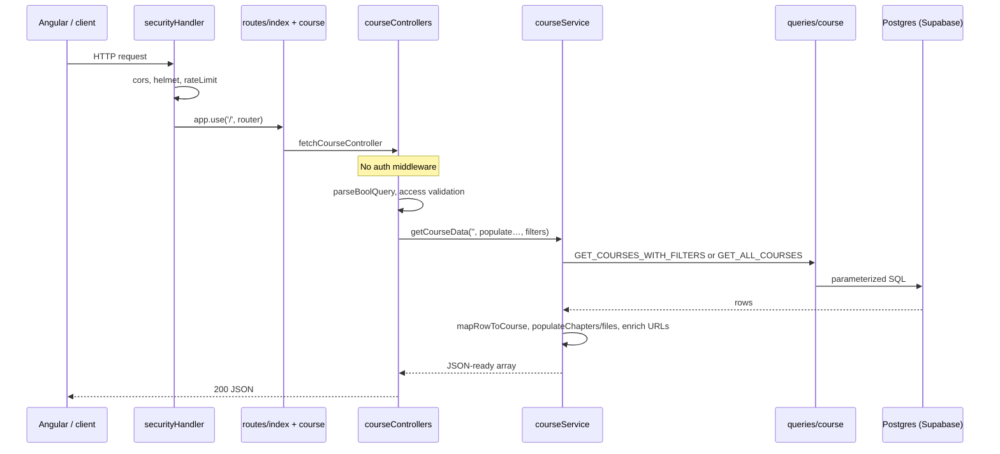
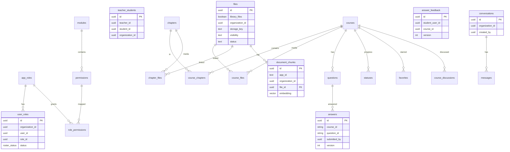
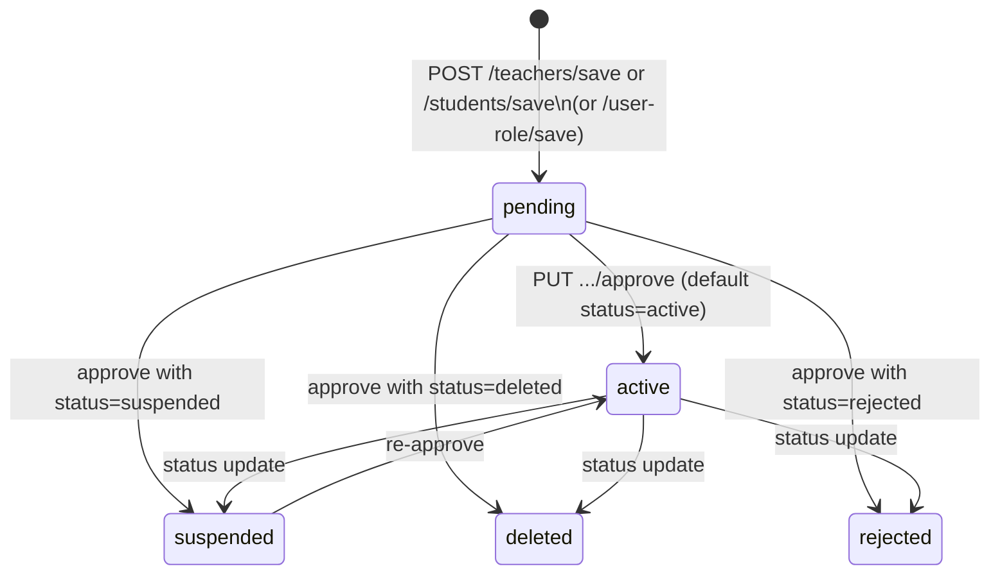
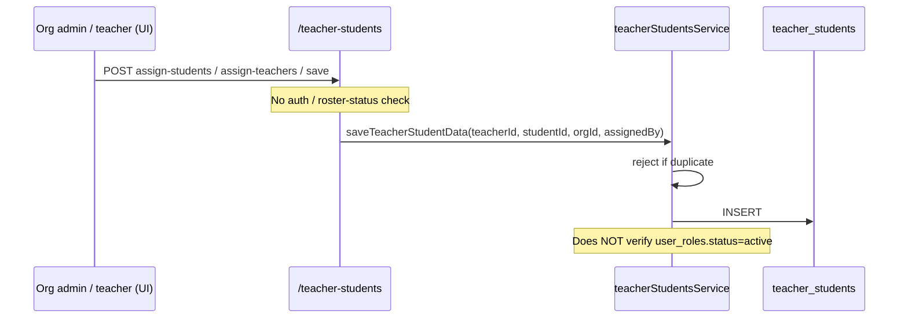

# Majestic Warhorse — Learning Architecture

**Audience:** Technical Architect joining PetaxAI  
**Repo:** `majestic-warhorse-backend` (Majestic Logic / learning domain)  
**Document date:** 2026-08-10  
**Method:** Code-first. Every claim cites a file path. Unverified items are in §20 Open Questions.  
**Docs index:** [../DOCUMENTATION-INDEX.md](../DOCUMENTATION-INDEX.md)

---

## Critical correction vs onboarding brief

| Brief said | Code shows |
|------------|------------|
| Python backend services | **Node.js / TypeScript Express** (`package.json`, `server.ts`) |
| Consumes IAM tokens for auth | **Partial:** library + chat require JWT (`middleware/auth.ts`); most course/roster routes still have auth **commented out**. Token also **forwarded to IAM** on roster sync |
| File storage Cloudflare R2 | **Confirmed** (`utils/fileStorage.ts`, `config.ts` `r2Storage`) |
| PostgreSQL on Supabase | **Confirmed** (`dbhandler/postgres.ts` uses `DATABASE_URL`; pooler hostname handling) |
| AI in this service | **Logic only** — RAG ingest/ask delegated to **Shared PetaxAI FastAPI** (`services/aiClient.ts`); see `docs/AI-MVP-SHARED-CONTRACT.md` |

This document describes the **course domain Logic Service** in this repository. It is not a Python service. Shared IAM and Shared AI are separate services.
---

## 1. Overview and service boundaries

### What this service owns

| Domain | Evidence |
|--------|----------|
| Courses, chapters, files metadata | `routes/course.ts`, `routes/chapter.ts`, `routes/file.ts` |
| Library (RAG) files + ingest-status callback | `routes/file.ts` (`/library`, `/ingest-status`); `scripts/create_files_table.sql` |
| Questions & answers (course-scoped, **versioned**) | `routes/question.ts`, `routes/answer.ts` |
| Teacher assessment feedback (**versioned**) | `routes/answers.ts` → `answerFeedbackControllers.ts` |
| Progress / ratings (`statuses`) | `routes/status.ts` |
| Favorites | `routes/favorites` via `routes/favorite.ts` |
| Course discussions | `routes/discussion.ts` |
| Org-scoped roster (teacher/student roles) | `routes/teachers`, `routes/students`, `routes/user-role` |
| Teacher ↔ student assignment | `routes/teacherStudents.ts` |
| Dashboard aggregates | `routes/dashboard.ts` |
| Org branding | `routes/branding.ts` |
| AI Mode chat (proxy + persist) | `routes/chat.ts`, `services/chatService.ts` |
| Object upload to R2 + public URL enrichment | `controllers/fileControllers.ts`, `utils/fileStorage.ts` |
| `document_chunks` **DDL** (pgvector); rows written by Shared AI | `scripts/create_document_chunks_table.sql` |

### What this service delegates

| Concern | Owner | How |
|---------|--------|-----|
| Login, JWT issuance, user profile, organizations | **Shared IAM** (Node) | `IAM_DOCUMENTATION.md`; `services/iamClient.ts`; `IAM_APP_ID` = `applications.id` |
| Embeddings, chunking, RAG ask/ingest | **Shared PetaxAI AI** (FastAPI) | `services/aiClient.ts`; contract `docs/AI-MVP-SHARED-CONTRACT.md` |
| App UI | Angular/React frontend (separate repo) | Not in this tree |
| Email (OTP / feedback notify) | Local Nodemailer `services/emailService.ts` | OTP routes not mounted; feedback may send mail |
### Believed-built checklist (verified)

| Claim | Status |
|-------|--------|
| Dashboard data | **Working** (client-supplied role flags; see §8 / §18) |
| Course listing | **Working** |
| Course upload (create + R2 file upload) | **Working** |
| Instructor questions | **Working** |
| Student answers | **Working** (version history: each save/update inserts new row) |
| Teacher feedback publish / history | **Working** (`PUT/GET /answers/:studentUserId/feedback…`) |
| Library RAG upload / list / delete | **Working** (JWT; triggers Shared AI ingest when `AI_ENABLED=true`) |
| AI chat | **Working** (JWT; stubs answer if AI disabled) |
| Approval of teachers and students | **Working** (data + IAM sync optional) |
| Teacher assignment | **Working** (no roster-status gate) |
| Certification / graduation / accreditation | **Absent** from schema and code |
| Learner profiles | **Absent** (IAM owns user profile) |
| Structured learning paths / competency mapping | **Absent** |
| White-label | **Working** (`/branding` + `organization_branding` table) |

---

## 2. Repository map

```
majestic-warhorse-backend/
├── server.ts                 # Express app entry; listens; exports serverless handler
├── env.ts / config.ts        # dotenv + typed config
├── securityHandler.ts        # cors, helmet, rate-limit, HTTP→HTTPS redirect in prod
├── routes/                   # Express routers (HTTP surface)
├── controllers/              # Request/response adapters
├── services/                 # Business logic
├── queries/                  # SQL strings
├── dbhandler/
│   ├── postgres.ts           # pg Pool, query helpers
│   ├── index.ts              # startup DB connect
│   ├── interfaces/           # TypeScript types
│   └── models/               # Legacy Mongoose schemas (unused at runtime)
├── middleware/
│   ├── auth.ts               # JWT verify (unused on routes)
│   └── schemavalidate.ts     # express-validator result check
├── utils/                    # fileStorage, authContext, extractAuthToken, queryParams
├── swagger/                  # OpenAPI annotations + UI at /api-docs
├── scripts/*.sql             # Manual Postgres migrations (source of schema truth)
├── migrations/               # migrate-mongo (legacy Mongo era)
└── docs/                     # Architecture, AI shared contract, etc.```

### How the app is served

| Aspect | Detail | Citation |
|--------|--------|----------|
| Framework | Express 4 | `package.json` L34; `server.ts` L3–14 |
| Language | TypeScript → `tsc` → `build/` | `package.json` `build` / `start` |
| Concurrency | Single Node process, sync request handlers (`async`/`await`), no worker pool in-repo | `server.ts` |
| Listen | `app.listen(port, '0.0.0.0')` after DB init attempt | `server.ts` L37–46 |
| Serverless | `module.exports.handler = serverless(app)` (Netlify-era) | `server.ts` L58 |
| Docker | `node:18.20.3`, `PORT=8080`, `npm run start` | `Dockerfile` |

There is **no** background worker process, queue consumer, or Celery/RQ equivalent in this repo.

---

## 3. Dependencies

| Item | Value | Citation |
|------|-------|----------|
| Package manager | npm (`package-lock.json` present; also listed oddly in `.gitignore`) | `package.json` |
| Runtime | Node (Docker pins **18.20.3**) | `Dockerfile` L2 |
| TypeScript | `5.4.3` (devDependency) | `package.json` L73 |
| Lint | Google TypeScript Style (`gts`) | `package.json` L13–15 |
| DB driver | `pg` ^8.18.0 | `package.json` L50 |
| Object storage | `@aws-sdk/client-s3`, `@aws-sdk/lib-storage` (R2 S3-compatible) | `package.json` L21–22 |
| HTTP client (IAM) | `axios` | `package.json` L27 |
| Legacy (still installed) | `mongoose`, `migrate-mongo`, `firebase` / `firebase-admin`, `cron`, `bcryptjs` | `package.json` |

**Python version required:** N/A — this is not a Python project.

**Pinning:** Semver ranges in `package.json` (`^`); lockfile exists as `package-lock.json`.

---

## 4. Request lifecycle

Example: `GET /course/get?organization_id={orgId}&populateChapters=true`



| Layer | File | Why it exists |
|-------|------|----------------|
| Security | `securityHandler.ts` L6–29 | CORS, Helmet (CSP off), IP rate limit 100/30s, prod HTTP redirect |
| Body parsers | `server.ts` L20–23 | Large upload limits via `FILEUPLOADLIMIT` |
| Router mount | `routes/index.ts` L28 | Mounts `/course` |
| Route | `routes/course.ts` L12 | Maps GET `/get` → controller (auth import commented L4–5) |
| Controller | `controllers/courseControllers.ts` | Parses query, validates `access`, returns HTTP status |
| Service | `services/courseService.ts` | Filtering, population of chapters/files, public URL enrichment |
| Queries | `queries/course.ts` | SQL only |
| DB | `dbhandler/postgres.ts` | Connection pool + `query()` |

**Why each layer:** Controllers stay thin HTTP adapters; services hold domain rules; queries isolate SQL; postgres module owns connectivity. There is **no** repository pattern beyond `queries/` + `query()`.

---

## 5. IAM integration

### What the code actually does

IAM is a **separate HTTP API**. This service does **not** validate IAM-issued JWTs on inbound requests in production paths.

| Mechanism | Behaviour | Citation |
|-----------|-----------|----------|
| Outbound sync | When `IAM_SYNC_ENABLED=true` and `IAM_BASE_URL` + `IAM_APP_ID` set, roster register/approve call IAM | `config.ts`; `services/iamClient.ts` |
| App id | `IAM_APP_ID` = IAM `applications.id` — also used as Shared AI `app_id` | `config.iam.appId`; `services/aiClient.ts` `resolveAppId` |
| Headers | `x-app-id`, optional `Authorization: Bearer` | `iamClient.ts` |
| Endpoints used | `POST /user/sync`, `PUT /user/update`, `GET /user/get` | `iamClient.ts` |
| Timeout | 15_000 ms per call | `iamClient.ts` |
| Failure | Logs `[IAM] …`; if `IAM_SYNC_STRICT=true` throws, else continues | `iamClient.ts` |
| Caching | **None** | No cache layer in `iamClient.ts` |
| Per-request identity | Bearer extracted to **forward** to IAM; also verified locally for library/chat | `utils/extractAuthToken.ts`, `middleware/auth.ts` |

### Local JWT middleware (used on AI/library; unused on most course routes)

`middleware/auth.ts` verifies tokens with **this service’s** `JWT_SECRET` via `jsonwebtoken.verify` — not by calling IAM JWKS.

**Mounted with `auth`:** all `/chat/*`; `GET/DELETE /file/library`; library branch of `POST /file/upload` (`requireAuthIfLibrary`).

**Still commented out / absent:** course, chapter, status, favorite, dashboard, question, answer (CRUD), roster routes — see Appendix A.

Tenant claims for library/chat are resolved from JWT only (`utils/authContext.ts`: `userId`, `organizationId`, `role`, optional `appId`).
### When IAM is slow or unreachable

- Sync calls wait up to 15s then fail the axios call.
- Default: local roster write **still succeeds**; IAM error is logged (`syncStrict` false).
- With `IAM_SYNC_STRICT=true`: error is thrown and can fail the local operation (`iamClient.ts` L45–47).
- Unreachable IAM does **not** block most course APIs — those routes do not call IAM. Library/chat still need a JWT signed with this service’s `JWT_SECRET`.

---

## 6. Authorisation

### How roles are modelled

Roles live in **this** database, not IAM:

- Catalog: `app_roles` (`org_admin`, `teacher`, `student`) — `scripts/add_rbac_tables.sql` L111–115
- Assignments: `user_roles` (org + IAM `user_id` + role + `status`) — same file L55–64
- Permissions: seeded codes e.g. `roster.approve`, `course.create` — L92–109
- Effective permissions query requires `ur.status = 'active'` — `queries/userRoles.ts` L42–47

### Where checks happen

| Check | Location | Enforced on writes? |
|-------|----------|---------------------|
| Permission middleware | **Does not exist** | No |
| JWT middleware on routes | **Partial** — chat + library only | Course/roster writes still open |
| `getPermissionsForUser` | Exposed as `GET /user-role/permissions` for **UI gating** | Read-only API; not used as a gate in services |

### Endpoints reachable without a permission check

**Most** mounted HTTP endpoints are reachable without server-side auth/RBAC (exceptions: `/chat/*`, `/file/library*`, library upload). Including:

| Risk | Path | Why it matters |
|------|------|----------------|
| Student (or anyone) can create/update/delete courses | `POST /course/save`, `PUT /course/update`, `DELETE /course/delete/:courseid` | `routes/course.ts` |
| Anyone can approve teachers/students | `PUT /teachers/approve/:id`, `PUT /students/approve/:id` | `routes/teacher.ts`; `routes/student.ts` |
| Anyone can assign teachers↔students | `POST /teacher-students/*` | `routes/teacherStudents.ts` |
| Anyone can upload/delete **non-library** files | `POST /file/upload` (non-library), `DELETE /file/delete/:fileId` | `routes/file.ts` |
| Anyone can fetch any course by id | `GET /course/get/:id` | No enrollment check |
| Dashboard role chosen by client | `GET /dashboard/…` with `isAdmin` / `isTeacher` query flags | Client-supplied |

**Library / chat exception:** JWT required; org/user from claims (`utils/authContext.ts`). Feedback publish currently accepts reviewer ids in body (JWT temporarily off on `/answers` feedback).

**Conclusion:** A student can still reach much instructor functionality at the HTTP layer for classic course APIs. Library/chat are gated. Other protection may be gateway/UI/network ACL.
---

## 7. Data model

### Where schema is defined / how migrations run

| Mechanism | Status |
|-----------|--------|
| `scripts/*.sql` | **Source of truth** for Postgres schema; applied manually (no automated migrator wired in `package.json` for SQL) |
| `migrate-mongo` + `migrations/` | Legacy Mongo; still in scripts (`migrate-up`) but Mongo connect is commented out in `dbhandler/index.ts` |
| Supabase migrations UI | Not referenced in code |

### Tables (current intended model)

After `add_organization_scoping.sql` + `add_rbac_tables.sql` (+ access/discussions scripts):

| Table | Purpose | Key columns |
|-------|---------|-------------|
| `modules` | Permission modules | `code` |
| `permissions` | Permission catalog | `code`, `module_id` |
| `app_roles` | Role catalog | `code` (`org_admin`/`teacher`/`student`) |
| `role_permissions` | Role ↔ permission | `(role_id, permission_id)` |
| `user_roles` | Org roster + approval | `organization_id`, `user_id`, `role_id`, `status` |
| `teacher_students` | Assignment junction | `teacher_id`, `student_id`, `organization_id`, `assigned_by` |
| `courses` | Course | `course_title`, `created_by`, `organization_id`, `access` |
| `chapters` | Lesson/chapter | `chapter_title`, `course_id`, `created_by`, `attachments` |
| `course_chapters` | Course↔chapter M:N | `course_id`, `chapter_id` |
| `files` | File metadata (library + media) | **No** `parent_id`/`parent_type`. `library_files`, `organization_id`, `uploaded_by`, `mime_type`, `size_bytes`, `storage_key`, `visibility`, `status` (ingest) |
| `course_files` | Course↔file junction | `course_id`, `file_id` |
| `chapter_files` | Chapter↔file junction | `chapter_id`, `file_id` |
| `document_chunks` | RAG chunks + embeddings | `app_id` (IAM applications.id), `organization_id`, `file_id` CASCADE, `embedding vector(1536)` — **AI writes** |
| `conversations` / `messages` | AI Mode chat | Org + user scoped; citations JSONB on messages |
| `questions` | Instructor questions | `course_id`, `question`, `type`, `options` |
| `answers` | Student answers (**versioned**) | `course_id`, `question_id`, `answer`, `submitted_by`, **`version`** |
| `answer_feedback` | Teacher feedback (**versioned**) | JSONB `review` / `item_feedback`; one new row per publish |
| `statuses` | Progress/rating | `parent_id`, `parent_type` (Course\|Chapter\|File) — **not** on `files` |
| `favorites` | Saved courses | `user_id`, `course_id` |
| `course_discussions` | Comments | `course_id`, `comment`, `deleted_at` |
| `organization_branding` | White-label | Branding routes |

**Legacy:** `teachers` / `students` tables are created in org-scoping script then **migrated into `user_roles` and dropped** by `add_rbac_tables.sql`. Runtime code still exposes `/teachers` and `/students` as wrappers over `user_roles` filtered by role code.

**No Postgres RLS** policies appear in any `scripts/*.sql` file.

### ER diagram (core learning + AI)



Logical (non-FK) links: `user_roles.user_id`, `courses.created_by`, `teacher_students.teacher_id`/`student_id` are **IAM user UUIDs**. `document_chunks.app_id` is **IAM `applications.id`**.
---

## 8. The learning domain model

There is **no enrolment entity**. Learning access is implied by:

1. Org membership on roster (`user_roles`)
2. Teacher–student pairing (`teacher_students`)
3. Course `access` (`public` | `private`)
4. Soft feed filters on list endpoints

### Course structure

```
Course
  ├── access: public | private (default private) — scripts/add_course_access.sql
  ├── organization_id (nullable)
  ├── created_by (teacher IAM user id)
  ├── chapters[] via course_chapters
  │     └── files[] via chapter_files → files.storage_key / file_url (R2)
  ├── course-level files via course_files (no parent columns on files)
  ├── questions (course_id)
  │     └── answers (submitted_by, version history)
  ├── answer_feedback (teacher review versions)
  ├── statuses (parent_type Course|Chapter|File) — percentage, rating, comment, reward
  ├── favorites
  └── course_discussions

Library (RAG) — files.library_files = true
  ├── visibility + status (pending|processing|ready|failed)
  ├── Shared AI ingest → document_chunks (app_id = IAM_APP_ID)
  └── AI Mode chat → conversations / messages
```
### How the pieces relate in product language

| Product idea | Implementation |
|--------------|----------------|
| Lesson | `chapters` row (naming is “chapter”, not “lesson”; swagger still has `swagger/lesson.ts` annotations historically) |
| Enrolment | **Missing** — closest is `teacher_students` + seeing that teacher’s courses |
| Grade | **Missing** as academic grade; `statuses.rating` / `reward` exist |
| Completion | Soft: `statuses.percentage` and/or presence of `answers` (dashboard treats answer count as “courseCompleted” for teachers — `queries/dashboard.ts` L44–49) |
| Programme / path | **Missing** |

### Student course discovery (intended frontend pattern)

Documented in `API_DOCUMENTATION.md` and implemented in SQL:

1. `GET /course/student/:studentId?organization_id=` → courses whose `created_by` ∈ assigned teachers (`courseService.getCoursesForStudent`, `GET_COURSES_BY_TEACHER_IDS`)
2. `GET /course/get?organization_id=&access=public` → org public catalog

Teacher feed: `organization_id` + `createdBy={me}` without `access` → public org courses **or** own courses (`queries/course.ts` L66–67).

---

## 9. Multi-tenancy

### Mechanism

**Application-level filtering** by `organization_id` (IAM org UUID). Not structural RLS.

Columns that carry org scope:

- `user_roles.organization_id` (NOT NULL)
- `courses.organization_id` (nullable)
- `teacher_students.organization_id` (nullable)
- `course_discussions.organization_id` (nullable)

### Queries / paths that omit or weaken org filter

| Location | Behaviour |
|----------|-----------|
| `GET_ALL_COURSES` | No org filter — returns all courses if list called with no filters (`queries/course.ts` L45–50; used when `hasListFilters` is false in `courseService.ts`) |
| `GET_COURSE_BY_ID` | Id only — cross-org fetch by UUID (`queries/course.ts` L92–97) |
| `GET_STUDENT_TOTAL_COURSES` | `SELECT COUNT(*) FROM courses` — **all** courses (`queries/dashboard.ts` L54–57) |
| Teacher dashboard counts | Filter by `created_by` / `teacher_id` only — no `organization_id` (`queries/dashboard.ts` L13–49) |
| File list/get (legacy R2) | No org filter on raw R2 list |
| Library list | **Org + visibility + JWT role** (`GET /file/library`) |
| Questions/answers | No `organization_id` column; scoped via `course_id` |
| `document_chunks` | Filtered by Shared AI using `app_id` + `organization_id` |
| `listTeacherStudents` without org | Lists all relationships (`teacherStudentsService.ts` L59–61) |

Nullable `organization_id` on courses/assignments means rows can exist **outside** any tenant unless writers always set it.

---

## 10. Approval and assignment workflows

### Roster approval state machine

Statuses: `pending | active | suspended | deleted | rejected` — `dbhandler/interfaces/rosterstatus.ts` L2–8.



**Who can trigger (code):** anyone who can call the HTTP API — **no server-side role check**.

**Side effect:** if IAM sync enabled, `iamClient.syncUserStatusToIam` updates IAM account status (`teacherService.ts` L152–161; same pattern in `studentService.ts`).

**Register path:** `saveTeacherData` requires `organization_id`, defaults status `pending`, may `ensureUserInIam` (`teacherService.ts` L89–126).

### Assignment workflow



Assignment is a **separate junction** with no status column. Docs say both parties should be approved in the same org; **service code does not enforce that** (`teacherStudentsService.ts` L136–163).

---

## 11. Course content storage (Cloudflare R2) + Library RAG

### Upload path (course media)

1. Client `POST /file/upload` with multipart (`routes/file.ts`)
2. Multer memory storage → AWS SDK `Upload` to R2 (`controllers/fileControllers.ts`)
3. Object key typically `{prefix}/{timestamp}_{filename}`
4. Optional `POST /file/save` persists metadata; course/chapter links via **`course_files` / `chapter_files`** (not `parent_id` on `files`)

### Library upload path (RAG)

1. `POST /file/upload` with `library_files=true` or `bucket_name=library` — **JWT required**
2. Persist `files` row (`library_files=true`, `visibility`, `storage_key`, `status=pending`)
3. If `AI_ENABLED=true`, call Shared AI `POST /ingest` with `app_id`=`IAM_APP_ID`, `callback_url`, `download_url` (`services/aiClient.ts`)
4. AI callbacks `POST /file/ingest-status` → `ready` \| `failed` (optional `X-AI-Callback-Secret`)
5. List/delete: `GET/DELETE /file/library` (JWT + visibility rules)

### Public URL enrichment

```18:26:utils/fileStorage.ts
export function getFilePublicUrl(key: string): string {
  const cleanKey = stripBucketPrefix(normalizeStoredFileKey(key));
  const base = publicBaseUrl();
  if (!base) {
    return cleanKey;
  }
  return `${base}/${cleanKey}`;
}
```

Course responses rewrite keys to `{R2_PUBLIC_URL}/{key}` (`courseService` + `enrichFileRecord`).

### Access security

| Control | Present? |
|---------|----------|
| Signed/private R2 URLs | **No** — design assumes public bucket CDN (`download_url` for AI) |
| Auth on `/file/library*` | **Yes** (JWT) |
| Auth on legacy `/file/get`, `/file/delete` | **No** |
| Enrolment check before stream/download | **No** |
| Auth on `GET /course/get/:id` (embeds chapter file URLs) | **No** |

### Can a student retrieve content for a course they are not enrolled in?

**Yes, by code path (course media):**

1. Call `GET /course/get/{anyCourseId}` → populated file URLs.
2. Or call legacy `GET /file/get/:fileId` / `POST /file/get-blob`.
3. Or fetch the public CDN URL if the key is known.

Library files are listed only via JWT + visibility; direct CDN URL access still possible if key leaks.
---

## 12. Certification readiness (exists vs missing)

Report only — no design.

| Concept | Exists? | Evidence |
|---------|---------|----------|
| Course completion record | **Partial** | `statuses.percentage` on `parent_type='Course'`; no dedicated completion table |
| Pass threshold | **Missing** | No column or constant for pass mark |
| Programme / multi-course curriculum | **Missing** | No table |
| Certification / diploma / accreditation entity | **Missing** | Grep of codebase: no domain matches |
| Graduation | **Missing** | — |
| Competency mapping | **Missing** | — |
| Learner transcript | **Missing** | Answers + statuses could be raw inputs only |
| Enrolment with start/end dates | **Missing** | — |

Closest “completion” signal used today: dashboard counts answers as `courseCompleted` for teachers (`queries/dashboard.ts` L44–49) — not a formal completion workflow.

---

## 13. Validation and error handling

| Concern | Implementation |
|---------|----------------|
| Request schema | `express-validator` schemas under `routes/schemaValidations/`; middleware `middleware/schemavalidate.ts` returns `400 { errors: [...] }` |
| Where applied | Some routes (e.g. question/answer/teacher-students import validateSchema); **course/file/teacher/student auth schemas largely commented out** |
| Domain validation | Ad-hoc throws in services (`organization_id is required`, `assertValidStatus`, `parseCourseAccess`) |
| Exception hierarchy | **None** — plain `Error` / Promise reject objects |
| Client on failure | Typically `400`/`404`/`500` JSON with `{ success, message, error }` — inconsistent shapes across controllers |
| Unhandled | `server.ts` L48–54 logs `unhandledRejection` / `uncaughtException` |

---

## 14. Background work and integrations

| Integration | Role | Credentials |
|-------------|------|-------------|
| Supabase Postgres | Primary app DB (+ pgvector chunks MVP) | `DATABASE_URL` / `POSTGRESQL_*` |
| Cloudflare R2 | Object storage | `R2_*` / `config.r2Storage` |
| Shared IAM HTTP API | User sync on roster; `applications.id` as `IAM_APP_ID` | `IAM_BASE_URL`, `IAM_APP_ID`, Bearer |
| Shared PetaxAI FastAPI | `/ingest`, `/ask`; callbacks to Logic | `AI_SERVICE_URL`, `AI_ENABLED`, `AI_CALLBACK_BASE_URL`, `AI_INGEST_CALLBACK_SECRET` |
| Gmail SMTP | OTP / feedback notify | `GMAIL_USERNAME`, `GMAIL_PASS` |
| Firebase | Dependency present; not on live course path | historically used |
| `cron` package | Installed; **no in-repo job registration** for course domain | — |
| Queues | **None** (MVP ingest is fire-and-forget HTTP) | — |

There is **no** worker process in this repo; Shared AI owns embedding/retrieval work.
---

## 15. Testing

| Item | Reality |
|------|---------|
| Test framework | **None** configured in `package.json` scripts |
| Test files | **None** found (`*test*` glob empty) |
| Fixtures / mocked DB | N/A |
| Coverage | **None** |

Honest assessment: there is no automated regression suite for this service.

---

## 16. Configuration

### Environment variables (from `config.ts` + `dbhandler/postgres.ts` + file controllers)

| Variable | Purpose |
|----------|---------|
| `PORT` | HTTP port (`config.ts` required list includes `PORT`) |
| `MONGO_URI` | **Still required at startup** by `config.ts` L9–14 even though Mongo is unused |
| `MONGO_PROD_URI`, `MONGO_DATABASE_NAME` | Legacy Mongo config |
| `DATABASE_URL` | Preferred Postgres URL (`postgres.ts` L15–18) |
| `DB_SSL`, `POSTGRESQL_SSL`, `POSTGRESQL_SSL_REJECT_UNAUTHORIZED` | SSL behaviour |
| `POSTGRESQL_DB_HOST/PORT/NAME/USER/PASSWORD` | Alternate Postgres config in `config.postgresql` |
| `JWT_SECRET`, `JWT_EXPIRY` | Local JWT middleware (unused on routes); **default secret hardcoded** |
| `IAM_BASE_URL`, `IAM_APP_ID`, `IAM_SYNC_ENABLED`, `IAM_SYNC_STRICT` | IAM client; **`IAM_APP_ID` also = Shared AI `app_id`** |
| `AI_SERVICE_URL`, `AI_ENABLED`, `AI_TIMEOUT_MS` | Shared AI HTTP client |
| `AI_CALLBACK_BASE_URL` | Public Logic base for ingest-status callbacks |
| `AI_INGEST_CALLBACK_SECRET` | Optional secret for AI → Logic callback |
| `R2_ENDPOINT`, `R2_REGION`, `R2_ACCESS_KEY_ID`, `R2_SECRET_ACCESS_KEY`, `R2_BUCKET_NAME`, `R2_PUBLIC_URL` | R2 |
| `FILEUPLOADLIMIT` | Body size GB default 5 |
| `GMAIL_USERNAME`, `GMAIL_PASS` | Email |
| `NODE_ENV` | Production redirects / SSL heuristics |
### Hardcoded / committed-secret risks

| Item | Citation |
|------|----------|
| Default JWT secret `MajesticWarhorse_JWT@2024` | `config.ts` L51 |
| Default R2 endpoint URL (account id in host) | `config.ts` L34–36 |
| `.gitignore` line is malformed: `package-lock.json".env"` | `.gitignore` L13 — **may not ignore `.env`** |
| Startup git status historically showed untracked `.env` | Operational risk: secrets in local env files |

Do not commit `.env`. Rotate any keys that were ever committed or shared in chat/logs.

---

## 17. Local setup and deployment

### From a clean clone (as coded)

```bash
git clone <repo>
cd majestic-warhorse-backend
npm install
# Create .env with at least: PORT, MONGO_URI (required by config.ts), DATABASE_URL,
# R2_*, IAM_* as needed
# Apply scripts/*.sql manually against Supabase Postgres (order matters: base tables → org scoping → RBAC → access → discussions)
npm run start:dev    # nodemon + ts-node server.ts
# or
npm run build && npm start
```

Swagger UI: `http://localhost:{PORT}/api-docs`  
README also references `https://majesticapi.rehoboth.london/` and Docker on EC2 port 3000 (`README.md`).

### Ship path

| Path | Detail |
|------|--------|
| GitHub Actions | `.github/workflows/main.yml` — on push to `main`: build Docker image `majesticwarhorse/node-app`, push Docker Hub, deploy on self-hosted `aws-ec2` runner (docker pull/run `-p 8081:8081`) |
| Dockerfile | Node 18, `PORT=8080`, `npm run start` |
| Netlify | `netlify.toml` + `deploy-netlify` script + serverless export — legacy/alternate |

**Note:** CI container maps **3000**; Dockerfile exposes **8080** — confirm which port the running image actually binds (depends on env `PORT` at runtime).

---

## 18. Current state and gaps

### Working

- Course CRUD + chapter/file nesting create/update flow
- Course list filters (org / access / teacher feed rule)
- Student assigned-teacher feed
- R2 upload + public URL enrichment
- **Library RAG** upload/list/delete + ingest-status callback
- **AI Mode chat** (proxy to Shared AI when enabled)
- Questions / **versioned answers** / favorites / discussions / statuses
- **Teacher answer feedback** (versioned publish + history)
- Roster register/approve (local DB) + optional IAM sync
- Teacher–student assign/unassign
- Dashboard aggregates (with caveats below)
- Org branding
- Swagger UI

### Partial / fragile

- **AuthZ:** JWT on library/chat only; RBAC data exists but **not enforced** on course/roster writes
- **Multi-tenancy:** filter-by-convention; many classic queries omit org
- **Dashboard:** client chooses admin/teacher/student mode; student “total courses” is global count
- **IAM:** optional soft-fail sync; JWT verified with local `JWT_SECRET` (not IAM JWKS)
- **Shared AI:** requires `IAM_APP_ID` + `AI_ENABLED`; stubs when disabled
- **`config.ts` still requires `MONGO_URI`** while runtime DB is Postgres
- Docs occasionally say roster status `approved`; code enum is **`active`**
- Feedback routes: JWT temporarily disabled (reviewer id in body)

### Scaffolded / unused / dead

| Artifact | Status |
|----------|--------|
| `middleware/auth.ts` | Used on chat + library; unused on course/roster |
| `dbhandler/models/*.ts` (Mongoose) | Legacy; Postgres path does not use them |
| `services/otpService.ts` | Exported but **no OTP routes mounted** |
| `swagger/lesson.ts` | Annotations; no `lesson` router |
| `migrate-mongo` migrations | Mongo-era |
| Commented `adminRouter` | `routes/index.ts` |
| Firebase / cron deps | Not part of live course request path |

### Tech debt (high signal)

1. No server-side auth/RBAC on most write paths (except library/chat)  
2. Public R2 content + unauthenticated course-by-id  
3. Manual SQL migrations, no ordered runner  
4. Zero automated tests  
5. Broken `.gitignore` for `.env` (verify)  
6. Dual Mongo/Postgres configuration surface  
7. Inconsistent ID types (`questions.course_id` VARCHAR vs `courses.id` UUID)
---

## 19. External contracts

### Inbound (this service exposes)

Mounted under `routes/index.ts`:

| Prefix | Consumers (assumed) |
|--------|---------------------|
| `/course`, `/chapter`, `/file` | Course UI + library UI |
| `/file/library`, `/file/ingest-status` | Library UI; Shared AI callback |
| `/chat` | AI Mode UI |
| `/question`, `/answer`, `/answers`, `/status`, `/favorites`, `/discussion` | Learning + teacher feedback UI |
| `/teachers`, `/students`, `/teacher-students`, `/user-role` | Org admin / teacher UI |
| `/branding` | White-label |
| `/dashboard` | Role home screens |
| `/api-docs`, `/health-check`, `/` | Operators / probes |

**No shared OpenAPI contract test** with the frontend or IAM was found in this repository.

### Outbound

| Target | When |
|--------|------|
| IAM `baseUrl` | Roster register/approve when sync enabled |
| Shared AI `AI_SERVICE_URL` | Library ingest + chat ask when `AI_ENABLED=true` |
| R2 S3 API | File upload / get / delete |
| Public R2 HTTP URL | Blob fetch / AI `download_url` |
| Gmail SMTP | Email service (if invoked) |

### Unenforced cross-service assumptions

1. `user_id` / `created_by` / `teacher_id` / `student_id` are valid IAM UUIDs — **not verified** on most writes.  
2. `organization_id` matches an IAM organization — **not verified**.  
3. Client will only call endpoints appropriate to role — **not enforced** except library/chat JWT.  
4. IAM JWT and this service’s `JWT_SECRET` — local auth uses local secret, not IAM JWKS.  
5. Shared AI and Logic agree on `IAM_APP_ID` and callback secret.  
6. `statuses.created_by` FK to `users(id)` in SQL script may fail if `users` table does not exist here.
---

## 20. Open questions

1. Is production traffic expected to be gated by an API gateway that validates IAM JWTs before this service? (Code does not.)  
2. Is the R2 bucket intentionally fully public, or should objects become private + signed URLs?  
3. Which migration scripts have been applied to the live Supabase project, and in what order?  
4. Should `/teachers` and `/students` be deprecated in favour of `/user-role` only?  
5. Is Netlify serverless still a supported deploy target, or only Docker/EC2?  
6. Why does `config.ts` still hard-require `MONGO_URI` if Mongo is unused?  
7. Are there other Python backends in PetaxAI for Majestic, or was the brief incorrect for this repo only?  
8. Does the Angular app rely on `GET /user-role/permissions` exclusively for gating, and is that accepted risk?  
9. Should assignment APIs refuse pairs where either party’s `user_roles.status ≠ active`? (Docs imply yes; code does not.)  
10. What is the intended meaning of dashboard `courseCompleted` (answers vs 100% status)?  
11. Is `chapter` the long-term product term for “lesson”, or will a lessons table return?  
12. Are `questions.course_id` / `answers.course_id` intentionally VARCHAR for legacy Mongo ids, or should they be UUID FKs?  
13. When will JWT auth be restored on `/answers/:id/feedback` (currently body reviewer ids)?  
14. Will Shared AI keep writing `document_chunks` into this Logic DB long-term, or move to an AI-owned vector store (still keyed by `app_id`)?  
15. Should course/roster routes adopt the same JWT + `resolveAuthContext` pattern as library/chat?

---

## Appendix A — Commented-out auth imports (inventory)

| File | Notes |
|------|-------|
| `routes/course.ts` | Auth commented |
| `routes/chapter.ts` | Auth commented |
| `routes/status.ts` | Auth commented |
| `routes/favorite.ts` | Auth commented |
| `routes/dashboard.ts` | Auth commented |
| `routes/question.ts` | Auth commented |
| `routes/answer.ts` | Auth commented |
| `routes/file.ts` | **Auth used** for library + library upload |
| `routes/chat.ts` | **Auth used** on all routes |
| `routes/answers.ts` | Feedback JWT temporarily off |

## Appendix B — TODO / FIXME / mock inventory

No `TODO`, `FIXME`, `HACK`, or `mock` markers were found in `.ts`/`.js`/`.sql` sources via repo search.

Functional equivalents of “TODO” are **commented-out auth** on course routes and **unused Mongoose/OTP** modules listed in §18.

## Appendix C — Related docs in-repo

| Doc | Use |
|-----|-----|
| [`../API_DOCUMENTATION.md`](../API_DOCUMENTATION.md) | Endpoint reference (prefer when current) |
| [`../ai-architecture/AI-MVP-SHARED-CONTRACT.md`](../ai-architecture/AI-MVP-SHARED-CONTRACT.md) | FE + Logic + **Shared AI** contract (`app_id` = `IAM_APP_ID`) |
| [`AI-ARCHITECTURE.md`](./AI-ARCHITECTURE.md) | PetaxAI platform / RAG architecture |
| [`IAM-ARCHITECTURE.md`](./IAM-ARCHITECTURE.md) | Shared IAM platform architecture |
| [`../FRONTEND-MVP.md`](../FRONTEND-MVP.md) | Frontend MVP checklist (Library + AI Mode) |
| [`../workflow/UI_WORKFLOW.md`](../workflow/UI_WORKFLOW.md) | Role flows |
| [`IAM-ARCHITECTURE.md`](./IAM-ARCHITECTURE.md) | Shared IAM platform architecture |
| `AI_IMPLEMENTATION.md` | Older notes — **may lag**; prefer shared contract |
| `POSTGRESQL_MIGRATION.md` / `FILE_POSTGRESQL_MIGRATION.md` | Migration narrative (may still mention dropped `files.parent_*`) |

Prefer **this document + SQL scripts + route files + the shared AI MVP contract** over narrative docs when they disagree (e.g. roster status `approved` vs `active`; `files.parent_id` — **removed**).